# C 语言程序设计

## 第 1 章	程序设计和 C 语言

### 1.1 什么是计算机程序

计算机的每一个操作都是根据人们事先指定的指令进行的.为了使计算机执行一系列的操作,必须事先编号一条条指令,输入到计算机.

所谓<span style='color:#DC143C'>程序</span>,就是一组计算机能识别和执行的指令.每一条指令使计算机执行特定的操作.只要让计算机执行这个程序,计算机就会“自动地”执行各条指令,有条不紊地进行工作.一个特定的指令序列,用来完成一定的功能.为了使计算机系统能实现各种功能,需要成千上万个程序.这些程序大多数是由计算机软件设计人员根据需要设计好的,作为计算机的软件系统的一部分提供给用户使用.此外,用户还可以根据自己的实际需要设计一些应用程序.

总之,计算机的一切操作都是由程序控制的,离开程序,计算机将一事无成.所以,计算机的本质就是程序的机器,程序和指令是计算机系统中最基本的概念.只有懂得程序设计,才能真正了解计算机是怎样工作的,才能更深入地使用计算机.

### 1.2 什么是计算机语言

人和计算机交流信息要解决语言问题.需要创造一种计算机和人都能识别的语言,这就是计算机语言.计算机语言经历了几个发展阶段:

<span style='color:#DC143C'>**机器语言**</span>	计算机工作基于二进制,从根本上说,计算机只能识别和接受有 0 和 1 组成的指令.在计算机发展初期,一般计算机的指令长度为 16,即以16个二进制数组成一条指令,16 个 0 和 1 可以组成各种排列组合.这种计算机能够直接识别和接受的二进制代码称为<span style='color:#DC143C'>**机器指令**</span>(machine instruction).机器指令的集合就是该计算机的<span style='color:#DC143C'>**机器语言**</span>(machine language).在语言的规则中规定各种指令的表示形式以及它的作用.

显然,机器语言与人们习惯用的语言差别太大,<span style='color:#4169E1'>**难学,难写,难检查,难修改,难以推广使用**</span>.因此初期只有极少数的计算机专业人员会编写计算机程序.

<span style='color:#DC143C'>**符号语言**</span>	为了克服机器语言的上述缺点,人们创造出符号语言(symbolic language),它用一些英文字母和数字表示一个指令,如用 ADD 代表“加”,SUB 代表“减”,LD 代表“传送”等.

显然,计算机并不能直接识别和执行符号语言的指令,需要一种称为<span style='color:#DC143C'>**汇编程序**</span>的软件,把符号语言的指令转换为机器指令.一般,一条符号语言的指令对应转换为一条机器指令.转换的过程称为“代真”或“汇编”,因此符号语言又称为<span style='color:#DC143C'>**符号汇编语言**</span>(symbolic assembler language)或<span style='color:#DC143C'>**汇编语言**</span>(assember language).

不同星号的计算机的机器语言和汇编语言是互不通用的.机器语言和汇编语言是完全依赖于具体机器特性的,是面向机器的语言.由于它“贴近”计算机,或者说离计算机“很近”,称为计算机<span style='color:#DC143C'>**低级语言**</span>(low level language).

<span style='color:#DC143C'>**高级语言**</span>	为了克服低级语言的缺点,20 世纪 50 年代创造除了第一个计算机高级语言--FORTRAN 语言.它很接近人们习惯使用的自然语言和数学语言.程序中用到的语句和指令是用英文单词表示的,程序中所用的运算符和运算表达式和人们日常所用的数学式子差不多,很容易理解.程序运行的结果用英文和数字输出,十分方便.例如在 FORTRAN 语言程序中,想计算和输出 3.5x6sin(π/3),只需写出下面这样一个语句:

```fortran
PRINT * , 3.5*6*SIN(3.1415926/3)
```

即可得到计算结果.显然这是很容易理解和使用的.

这种语言功能很强,且不依赖于具体机器,用它写出的程序对任何型号的计算机都是用(或只须作很少的修改),它与具体机器距离较远,故称为计算机<span style='color:#DC143C'>**高级语言**</span>(high level language).

当然,计算机也是不能直接识别高级语言程序的,也要进行“翻译”.用一种称为<span style='color:#DC143C'>**编译程序**</span>的软件把用高级语言写的程序(称为<span style='color:#DC143C'>**源程序**</span>,source program)转换为机器指令的程序(称为<span style='color:#DC143C'>**目标程序**</span>,object program),然后让计算机执行机器指令程序,最后得到结果.高级语言的一个语句往往对应多条机器指令.

数十年来,全世界涌现了 2500 种以上的高级语言,每种高级语言都有其特定的用途,其中应用比较广泛的有 100 多种,影响最大的有 FORTRAN 和 ALGOL(适合数值计算),BASIC 和 QBASIC (适合初学者的小型会话语言),COBOL(适合商业管理),Pascal(适合教学的结构程序设计语言),PL/l(大型通用语言),LISP 和 PROLOG(人工智能语言),C(系统描述语言),C++(支持面向对象程序设计的大型语言),Visual Basic(支持面向对象程序设计的语言)和 Java(适于网络的语言)等.

高级语言经历了不同的发展阶段:

<font color='green'>( 1 )</font> <span style='color:#DC143C'>**非结构化的语言**</span>	初期的语言属于非结构化的语言,编程风格比较随意,只要符合语法规则即可,没有严格的规范要求,程序中的流程可以随意跳转.人们往往追求程序执行的效率而采用了许多“小技巧”,使程序变得难以阅读和维护.

<font color='green'>( 2 )</font> <span style='color:#DC143C'>**结构化语言**</span>	为了解决以上问题,提出了“结构化程序设计方法”,规定程序必须由具有良好特性的基本结构(顺序结构,分支结构,循环结构)构成,程序中的流程不允许随意跳转,程序总是由上而下顺序执行各个基本结构.这种程序结构清晰,易于编写,阅读和维护,QBasic,FORTRAN 77 和 C 语言属于结构化的语言,这些语言的特点是支持结构化程序设计方法.

以上两种语言都是基于过程的语言,在编写程序时需要具体指定每一个过程的细节.在编写规模较小的程序时,还能得心应手,但在处理规模较大的程序时,就显得捉襟见肘,力不从心了.在实践发展中,人们又提出了面向对象的程序设计方法.程序面对的不是过程的细节,而是一个个对象,对象是由数据以及对数据进行的操作组成的.

<font color='green'>( 3 )</font><span style='color:#DC143C'>**面向对象的语言**</span>	近十多年来,在处理规模较大的问题时,开始使用面向对象的语言.C++,C#,Visual Basic 和 Java 等语言是支持面向对象程序设计方法的语言.有关面向对象的程序设计方法和面向对象的语言在本书中不作详细介绍,有兴趣的可参考有关专门书籍.

### 1.3 C 语言的发展及其特点

C 语言是国际上广泛流行的计算机高级语言.

C 语言的祖先是 BCPL 语言.1967 年英国剑桥大学的 Martin Richards 推出了没有类型的 BCPL(Basic Combined Programming Language)语言.1970 年美国 AT&T 贝尔实验室的 Ken Thompson 以 BCPL 语言为基础,设计出了很简单且很接近硬件的 B 语言(取 BCPL 的第一个字母).但 B 语言过于简单,功能有限.1972 - 1973 年间,美国贝尔实验室的 D.M.Ritchie 在 B 语言的基础上设计出了 C 语言. C 语言既保持了 BCPL 和 B 语言的优点(精炼,接近硬件),又克服了它们的缺点(过于简单,无数据类型等),C 语言的新特点主要表现在具有多种数据类型(如字符,数值,数组,结构体和指针等).开发 C 语言的目的在于尽可能降低用它所写的软件对硬件平台的依赖程度,使之具有可移植性.

最初的 C 语言只是为描述和实现 UNIX 操作系统提供一种工作语言而设计的. 1973 年, Ken Thompson 和 D.M.Ritchie 合作把 UNIX 的 90% 以上用 C 语言改写,即 UNIX 第 5 版(原来的 UNIX 操作系统是 1969 年由美国的贝尔实验室的 Ken Thompson 和 D.M.Ritchie 开发成功的,是用汇编语言编写的).随着 UNIX 的日益广泛使用,C 语言也迅速得到推广.1978 年以后,C 语言先后移植到大,中,小和微型计算机上.C 语言便很快风靡全世界,成为世界上应用最广泛的程序设计高级语言.

C 语言是一种用途广泛,功能强大,使用灵活的过程性(procedural)编程语言,即可用于编写应用软件,又能用于编写系统软件.因此 C 语言问世以后得到迅速推广.

C 语言有以下一些主要特点.

<span style='color:#32CD32'><font color='green'>( 1 )</font></span> 语言简洁,紧凑,使用方便,灵活.C 语言一共只有 37 个关键字(见附录 B),9 种控制语句,程序书写形式自由,主要用小写字母表示,压缩了一切不必要的成分.C 语言程序比其他许多高级语言简练,源程序短,因此输入程序时工作量少.

实际上,C 是一个很小的内核语言,只包含极少的与硬件有关的成分,C 语言不直接提供输入和输出语句,有关文件操作的语句和动态内存管理的语句等(这些操作是由编译系统所提供的库函数来实现的),C 的编译系统相当简洁.

<span style='color:#32CD32'><font color='green'>( 2 )</font></span> 运算符丰富.C 语言的运算符包含的范围很广泛,共有 34 种运算符(见附录 C).C 语言把括号,赋值和强制类型转换等都作为运算符处理,从而使 C 语言的运算类型极其丰富,表达式类型多样化.灵活使用各种运算符可以实现在其他高级语言中难以实现的运算.

<span style='color:#32CD32'><font color='green'>( 3 )</font></span> 数据类型丰富. C 语言提供的数据类型包括:整型,浮点型,字符型,数组类型,指针类型,结构体类型和共用体类型等, C 99 又扩充了复数浮点类型,超长整型(long long)和布尔类型(bool)等.尤其是指针类型数据,使用十分灵活和多样化,能用来实现各种复杂的数据结构(如链表,树,栈等)的运算.

<span style='color:#32CD32'><font color='green'>( 4 )</font></span> 具有结构化的控制语句(如 if ... else 语句,while 语句,do ... while 语句,switch 语句和 for 语句).用函数作为程序的模块单位,便于实现程序的模块化.C 语言是完全模块化和结构化的语言.

<span style='color:#32CD32'><font color='green'>( 5 )</font></span> 语法限制不太严格,程序设计自由度大.例如,对数组下标越界不进行检查,由程序编写者自己保证程序的正确.对变量的类型使用比较灵活,例如,整型量与字符型数据以及逻辑型数据可以通用.一般的高级语言语法检查比较严,能检查出几乎所有的语法错误,而 C 语言允许程序编写者有较大的自由度,因此放宽了语法检查.程序员应当仔细检查程序,保证其正确,而不要过分依赖 C 语言编译程序查错.”限制”与“灵活”是一对矛盾.限制严格,就失去了灵活性;而强调灵活,就必然放松限制.对于不熟练的人员,编一个正确的 C 语言程序可能会比编一个其他高级语言程序难一些.也就是说,对用 C 语言的人,要求更高一些.

<span style='color:#32CD32'><font color='green'>( 6 )</font></span> C 语言允许直接访问物理地址,能进行位(bit)操作,能实现汇编语言的大部分功能,可以直接对硬件进行操作.因此 C 语言既具有高级语言的功能,又具有低级语言的许多功能,可用来编写系统软件.C 语言的这种双重性,使它即使成功的系统描述语言,又是通用的程序设计语言.

<span style='color:#32CD32'><font color='green'>( 7 )</font></span> 用 C 语言编写的程序可移植性好.由于 C 的编译系统相当简洁,因此很容易移植到新的系统.而且 C 编译系统在新的系统上运行时,可以直接编译“标准链接库”中的大部分功能,不需要修改源代码,因为标准链接库是用可移植的 C 语言写的.因此,几乎在所有的计算机系统中都可以使用 C 语言.

<span style='color:#32CD32'><font color='green'>( 8 )</font></span> 生成目标代码质量高,程序执行效率高.

C 原来是专门为编写系统软件而设计的,许多大的软件都用 C 语言编写,这是因为 C 语言的可移植性好和硬件控制能力高,表达和运算能力强.许多以前只能用汇编语言处理的问题,后来可以改用 C 语言来处理了.目前 C 的主要用途之一是编写“嵌入式系统程序”.由于具有上述优点,使 C 语言应用面十分广泛,许多应用软件也用 C 语言编写.

### 1.4 最简单的 C 语言

为了使用 C 语言编写程序,必须了解 C 语言,并且能熟练地使用 C 语言.本书将由浅入深地介绍这样阅读 C 语言程序和使用 C 语言编写程序.

#### 1.4.1 最简单的 C 语言程序举例

下面介绍几个最简单的 C 语言程序.

<span style='color:#32CD32'>**例 1.1**</span>	要求在屏幕上输出以下一行信息.

This is a C program.

**解题思路:**	在主函数中用 printf 函数原样输出以上文字.

**编写程序:**

```c
#include <stdio.h>		//这是预编译处理指令
int main()				//定义主函数
{						//函数开始的标志
    printf("This is a C program.\n");	//输出指定的信息
    return 0;			//函数执行完毕时返回函数 0
}						//函数结束的标志
```

**运行结果:**


**程序分析:**	先看第 2 行,其中 main 是函数的名字,表示“主函数”,main 前面的 int 表示此函数的类型是 int 类型(整型).在执行主函数后会得到一个值(即函数值),其值为整型.程序第 5 行“return 0;”的作用是:当 main 函数执行结束前将整数 0 作为函数值,返回到调用函数处^①^.每一个 C 语言程序都必须有一个 main 函数.函数体由花括号{ }括起来.本例中主函数内有两个语句,程序第 4 行是一个输出语句,printf 是 C 编译系统提供的函数库中的输出函数(详见第 4 章).printf 函数中双撇号内的字符串“This is a C program.”按原样输出. \n 是换行符,即在输出“This is a C program.”后,显示屏上的光标位置移到下一行的开头.这个光标位置称为输出的当前位置,即下一个输出的字符出现在此位置上.每个语句最后都有一个分号,表示语句结束.

>①	C99 建议把 main 函数指定为 int 型(整型),它要求函数带回一个整数值.在 main 函数中,在执行的最后设置一个“return 0;”语句.当主函数正常结束时,得到的函数值为0,当执行 main 函数过程出现异常或错误时,函数值为一个非 0 的整数.这个函数值是返回给调用 main 函数的操作系统的,程序员可以利用操作指令检查 main 函数的返回值,从而判断 main 函数是否已正常执行,并据此决定以后的操作.如果在程序中不写“return 0;”语句,有的 C 编译系统会在目标程序中自动加上这一语句,因此,主函数正常结束时,也能使函数值为 0.为使程序规范和可移植性,希望写程序时一律将 main 函数指定为 int 型,并在 main 函数的最后加一个“return 0;”语句.

使用函数库中的输入输出函数时,编译系统要求程序提供有关此函数的信息(例如对这些输入输出函数的声明和宏的定义,全局量的定义等),程序第 1 行“#include <stdio.h>”的作用就是用来提供这些信息的.stdio.h 是系统提供的一个文件名,stdio 是“standard input & output”的缩写,文件后缀 .h 的意思是头文件(header file),因为这些文件都是放在程序各文件模块的开头的.输入输出函数的相关信息已事先放在 stdio.h 文件中.现在用 #include 指令把这些信息调入供使用.对编译预处理指令 #include,再次可先不必深究,只要记住:在程序中如要用到标准函数库中的输入输出函数,应该在本文件模块的开头写上下面一行:

include <stdio.h>

在以上程序各行的右侧,如果有 // ,则表示从到本行结束是“注释”,用来对程序有关部分进行必要的说明.在写 C 程序时应当多用注释,以方便自己和别人理解程序各部分的作用.在程序进行预编译处理时将每个注释替换为一个空格,因此在编译时注释部分不产生目标代码,注释对裕兴不起作用.注释只是给人看的,而不是让计算机执行的. 

<span style='color:#4169E1'>**说明:**</span>	C 语言允许两种注释方式:

1. 以 // 开始的单行注释.此种注释的范围从 // 开始,以换行符结束.这种注释不能跨行.
2. 以 /* 开始,以 */ 结束的块式注释.这种注释可以包含多行内容.可以单独占一行,也可以包含多行.

<span style='color:#ff6600'>但应注意的是在字符串中的 // 和 /* 都不作为注释的开始.而是作为字符串的一部分.</span>

在 C89 只允许用 /* ... */ 形式的注释,而 C++ 则允许用 // 形式的注释, // 注释被称为 “C++风格”的注释.但许多 C 编译系统在 C99 之前就已支持这种方便的注释方法, C99 正式将 // 注释纳入 C 语言新标准.

<span style='color:#32CD32'>**例 1.2**</span>	求两个整数之和.

**解题思路:**	设置 3 个变量,a 和 b 用来存放两个整数,sum 用来存放和数.用赋值运算符“=”把相加的结果传送给 sum.

**编写程序:**	

```c
#include <stdio.h>

int main()
{
    int a.b.sum;
    a = 123;
    b = 456;
    sum = a + b;
    printf("sum is %d.\n",sum);
    return 0;
}
```

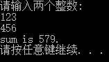

**程序分析:**	本程序的作用是求两个整数 a 和 b 之和.第 5 行是声明部分,定义 a,b 和 sum 为整型(int)便令.第 6,7行是两个赋值语句,使 a 和 b 的值分别为 123 和 456.第 8 行使 sum 的值为 a 与 b 之和.第 9 行输出结果,这个 printf 函数圆括号内有两个参数,一个是双撇号中的内容 sum is %d\n,它是输出格式字符串,作用是输出用户希望输出的字符和输出的格式.其中 sum is 是用户希望输出的字符(这和例 1.1 是一样的), %d 是指定的输出格式.在执行 printf 函数时,将 sum 变量的值(以十进制整数表示)取代双撇号中的 %d .现在 sum 的值是 579 (即 123 与 456 之和),所以在输出时,十进制整数 579 取代了 %d (见图 1.1), \n 是换行符.


<div align="center">图 1.1</div>

最后输出双撇号中的字符“sum is 579”,然后换行,程序执行结束.

<span style='color:#32CD32'>**例 1.3**</span>	求两个整数中的较大者.

**解题思路:**	用一个函数来实现求两个整数中的较大者.在主函数中调用此函数并输出结果.

**编写程序:**

```c
#include <stdio.h>
//主函数
int main()
{
    int max(int x,int y);
    int a,b,c;
    printf("Please input two numbers:\n");
    scanf("%d%d",&a,&b);
    c = max(a,b);
    printf("max = %d.\n",c);
    return 0;
}
//求两个整数中的较大者的 max 函数
int max(int x,int y)
{
    int z;
    if(x > y)z = x;
    else z = y;
    return(z);
}
```

**运行结果:**


**程序分析:**	本程序包含两个函数:①主函数 main;②被调用的函数 max.

max 函数的作用是将 x 和 y 中较大者的值赋给变量 z .第 16 行 return 语句将 z 的值作为 max 的函数值,返回给调用 max 的函数(即主函数 main).返回值是通过函数名 max 带回到 main 函数中取的(带回到程序第 7 行,main 函数调用 max 函数处).

程序第 4 行是对被调用函数 max 的声明(declaration).为什么要做这个函数声明呢?因为在主函数中要调用 max 函数(主函数中第 8 行“c = max(a,b);”),而 max 函数的定义却在 main 函数之后,对程序的编译时自上而下进行的,对程序第 7 行进行编译时,编译系统无法知道 max 是什么,因而无法把它作为函数调用处理.为了使编译系统能够识别 max 函数,就要在被调用 max 函数之前用“int max(int x,int y);”对函数 max 进行“声明”,所谓<span style='color:#dc143c'>声明</span>,通俗地说就是告诉编译系统 max 是什么,以及它的有关信息.有关函数的声明详见第 7 章.

程序第 6 行 scanf 是输入函数的名字(scanf 和 printf 都是 C 的标准输入输出函数).该 scanf 函数的作用是输入变量 a 和 b 的值.scanf 后面圆括号中包含两部分内容:一是双撇号中的内容,它指定输入的数据按什么格式输入.”%d”的含义是十进制整数形式.二是输入的数据准备放到哪里,即赋给那个变量.现在,scanf 函数中指定的是 a 和 b,在 a 和 b的前面各有一个 & ,在 C 语言中 “&”是地址符,&a 的含义是“变量 a 的地址”,&b 是“变量 b的地址”.执行 scanf 函数,从键盘读入两个整数,送到变量 a 和 b 的地址处,然后把这两个整数分别赋给变量 a 和 b.

程序第 7 行用 max(a,b)调用 max 函数.在调用时将 a 和 b 作为 max 函数的参数(称为实际参数)的值分别传送给 max 函数中的参数 x 和 y (称为形式参数),然后执行 max 函数的函数体(程序第12 ~17 行),使 max 函数中的变量 z 得到一个值(即 x 和 y 中大者的值),return(z)的作用是把 z 的值作为 max 函数值带回到程序第 7 行 = 的右侧(主函数调用 max 函数的位置),取代 max(a,b),然后把这个值赋给变量 c.

第 8行输出结果.在执行 printf 函数时,对双撇号括起来的 max = %d\n 是这样处理的:将 max = 原样输出,%d 由变量 c 的值取代之,\n 执行换行.

<span style='color:#32CD32'>注意:</span>	本例程中两个函数,都有 return 语句,请注意它们的异同,两个函数都定义为整型,都有函数值,都需要用 return 语句为函数指定返回值.但是 main 函数中的 return 语句指定的返回值一般为 0,而 max 函数的返回值是 max 函数中求出的二数中的最大值 z,只有通过 return 语句才能把求出的 z 值作为函数的值并返回调用它的位置上(即 main 函数,程序第 7 行).不要以为在 max 函数中求出最大值 z 后就会自动地作为函数值返回调用处,必须用 return 语句指定将那个值作为函数值.也不要不加分析地在所有函数的最后都写上“return 0;”.

本例用到了<span style='color:#DC143C'>**函数调用**</span>,<span style='color:#dc143c'>**实际参数**</span>和<span style='color:#dc143c'>**形式参数**</span>等概念,只作简单的解释.

#### 1.4.2 C 语言程序的结构

通过以上几个程序例子,可以看到一个 C 语言程序的结构有以下特点:

 <font color='green'>( 1 )</font>	**一个程序有一个或多个源程序文件组成.**	一个规模较小的程序,往往只包括一个源程序文件.一个源程序文件中可以包括 3 个部分:

①	**预处理指令**.	如 #include <stdio.h>(还有一些其他预处理指令,如 #define 等).C 编译系统在对源程序进行“翻译”以前,先由一个“预处理器”(也称为“预处理程序”,”预编译器”)对预处理指令进行预处理,对于 #include <stdio.h> 指令来说,就是将 stdio.h 头文件的内容读进来,放在 #include 指令行,取代了 #include <stdio.h>.由预处理得到的结果与程序其他部分一起,组成一个完整的,可以用来编译的最后的源程序,然后由编译程序对该源程序正式进行编译,才得到目标程序.

②	**全局声明.**	即在函数之外进行的数据声明.例如可以把例 1.2 程序中的“int a,b,sum;”放到 main 函数的前面,这就是全局声明,在函数外面声明的变量称为<span style='color:#dc143c'>**全局变量**</span>.如果实在程序开头(定义函数之前)声明的变量,则在整个源程序文件范围内有效.在函数中声明的变量是<span style='color:#dc143c'>**局部变量**</span>,只在函数范围内有效.

③	**函数定义.**	上面例子中的 main 函数和 max 函数,每个函数用来实现一定的功能.在调用这些函数时,会完成函数定义中指定的功能.

<font color='green'>( 2 )</font>	**函数时 C 程序的主要组成部分.**	程序的几乎全部工作都是由各个函数分别完成的,函数是 C 程序的基本单位,在设计良好的程序中,每个函数都用来实现一个或几个特定的功能.编写 C 程序的工作主要就是编写一个个函数.

一个 C 语言程序是由一个或多个函数组成的,其中必须包含一个 main 函数(且只能有一个 main 函数).例 1.1 和例 1.2 中的程序只有一个 main 函数组成,例 1.3 程序有一个 main 函数和一个 max 函数组成,它们组成一个源程序文件,在进行编译时对整个源程序文件统一进行编译.

一个小程序只包含一个源程序文件,在一个源程序文件中包含若干个函数(其中有一个 main 函数).当程序规模较大时,所包含的函数的数量较多,如果把所有的函数都放在同一个源程序文件中,则此文件显得太大,不便于编译和调试.为了便于调试和管理,可以使用一个程序包含若干个源程序文件,每个源程序文件又包含若干个函数.一个源程序文件就是一个程序模块,即将一个程序分成若干个程序模块.

在进行编译时是以源程序文件为对象进行的.在分别对各源程序文件进行编译并得到相应的目标程序后,再将这些目标程序连接成为一个统一的二进制的可执行程序.

C 语言的这种特点使得容易实现程序的模块化.

在程序中被调用的函数,可以是系统提供的库函数(例如 printf 和 scanf 函数),也可以是用户根据需要自己编制设计的函数(例如例 1.3 中的 max 函数). C 的函数库十分丰富,ANSI C 建议提供一百多个标准库函数,不同的 C 编译系统除了提供标准库函数外,还增加了其他一些专门的函数,如 Turbo C 提供三百多个库函数,不同编译系统所提供的库函数个数和功能是不完全相同的.

<font color='green'>( 3 )</font>	**一个函数包括两个部分.**

①	**函数首部.**	即函数的第 1 行,包括函数名,函数类型,函数属性,函数参数(形式参数)名,参数类型.

例如,例 1.3 中的 max 函数的首部为


一个函数名后面必须跟一对圆括号,括号内写函数的参数名及其类型.如果函数没有参数,可以在括号中写 void ,也可以是空括号.

②	**函数体.**	即函数首部下面的花括号内的部分.如果在一个函数中包括有多层花括号,则最外面的一对花括号是函数的范围.

函数体一般包括以下两部分.

- **声明部分.**	声明部分包括:定义在本函数中所用到的变量,如例 1.3 中的 main 函数中定义变量“int a,b,c;”;对于本函数所调用函数进行声明,如例 1.3 中在 main 函数中对 max 函数的声明“int max(int x,int y);”.
- **执行部分.**	由若干个语句组成,指定在函数中所进行的操作.

在某些情况下也可以没有声明部分,甚至可以即无声明部分也无执行部分.如:

```c
void dump()
{}
```

它是一个空函数,什么也不做,但这是合法的.

<font color='green'>( 4 )</font>	**程序总是从 main 函数开始执行的**,而不论 main 函数在整个程序中的位置如何(main 函数可以放在程序的最前头,也可以放在程序最后,或在一些函数之前,另一些函数之后).

<font color='green'>( 5 )</font>	**程序中对计算机的操作是由主函数中的 C 语句完成的**.如赋值,输入输出数据的操作都是由相应的 C 语句实现的. C 程序书写格式是比较自由的.一行内可以写几个语句,一个语句也可以分写在多行上.

<font color='green'>( 6 )</font>	**在每个数据声明和语句的最后必须有一个分号.**分号是 C 语句的必要组成部分.

<font color='green'>( 7 )</font>	**C 语言本身不提供输入输出的语句.**输入和输出的操作是由库函数 scanf 和 printf 等函数来完成的.C       对输入输出实行“函数化”.由于输入输出操作涉及具体的计算机设备,把输入输出操作用库函数实现,就可以使 C 语言本身的规模较小,编译程序简单,很容易在各种机器上实现,程序具有可移植性.

<font color='green'>( 8 )</font>	**程序应当包含注释.**一个好的,有使用价值的源程序都应当加上必要的注释,以增加程序的可读性.

### 1.5 运行 C 程序的步骤与方法

用 C 语言编写的程序时源程序.计算机不能直接识别和执行用高级语言写的指令,必须用编译程序(也称编译器)把 C 源程序翻译成二进制形式的目标程序,然后再将该目标程序与系统的函数库以及其他目标程序连接起来,形成可执行的目标程序.

在编好一个 C 源程序后,怎样上机进行编译和运行呢?一般要经过以下几个步骤:

<font color='green'>( 1 )</font>	上机输入和编辑源程序.

<font color='green'>( 2 )</font>	对源程序进行编译,先用 C 编译系统提供的“预处理器”(又称“预处理程序”或“与编译器”)对程序中的预处理指令进行编译预处理.由预处理得到的信息与程序其他部分一起,组成一个完整的,可以用来进行正式编译的源程序,然后由编译系统对该源程序进行编译.

编译的作用首先是对源程序进行检查,判定它有无语法方面的错误,如果有,则发出“出错信息”,告诉编程人员认真检查改正.修改程序后重新进行编译,如有错,再次发出“出错信息”.如此反复进行,直到没有语法错误为止.这时编译程序自动把源程序转换为二进制形式的目标程序(后缀为 .obj 的文件).如果不特别指定,此目标程序一般也存放在用户当前目录下,此时源文件没有消失.

在用编译系统对源程序进行编译时,自动包括了预编译和正式编译两个阶段,一气呵成.用户不必分别发出两次指令.

<font color='green'>( 3 )</font>	进行连接处理.经过编译所得到的二进制目标文件(后缀为 .obj 文件)还不能供计算机直接执行.前面已说明:一个程序可能包含若干个源程序文件,而编译是以源程序文件为对象的,一次编译只能得到与一个源程序文件相对应的目标文件(也称目标模块),它只是整个程序的一部分.必须把所有的编译后得到的目标模块连接装配起来,再与函数库连接成一个整体,生成一个可供计算机执行的目标程序,称为<span style='color:#dc143c'>**可执行程序**</span>,在Visual C++ 中其后缀为 .exe.

即使一个程序只包含一个源程序文件,编译后得到的目标程序也不能直接运行,也要经过连接阶段,因为要与函数库进行连接,才能生成可执行程序.

以上连接的工作是由一个称为“连接编辑程序(linkage editor)”的软件来实现的.

<font color='green'>( 4 )</font>	运行可执行程序,得到运行结果.


以上过程如图 1.2 所示.其中实线表示操作流程,虚线表示文件的输入输出.例如,编辑后得到一个源程序文件 f.c ,然后再进行编译时再将源程序文件 f.c 输入,经过编译得到目标程序问价 f.obj ,再将所有目标模块输入计算机,与系统提供的库函数等进行连接,得到可执行的目标程序 f.exe,最后把 f.exe 输入计算机,并使之运行,得到结果.

一个程序从编写到运行成功,并不是一次成功的,往往要经过多次反复.编写好的程序并不一定能保证正确无误,除了用人工方式检查外,还须借助编译系统来检查有无语法错误.从图 1.2 中可以看到;如果在编译过程中未发现错误,能生成可执行程序,但是运行的结果不正确.一般情况下,这不是语法方面的错误,而可能是程序逻辑方面的错误,例如计算公式不正确,赋值不正确等,应当返回价差源程序,并改正错误.

### 1.6 程序设计的任务

如果只是编写和运行一个很简单的程序,上面介绍的步骤就够了.但是实际上要处理的问题比上面见到的例子复杂得多,需要考虑和处理的问题也复杂得多.程序设计是指从确定任务得到结果,写出文档的全过程.

从确定问题到最后完成任务,一般经历以下几个工作阶段:

<font color='green'>( 1 )</font>	<span style='color:#32CD32'>**问题分析.**</span>	对于接手的任务要进行认真的分析,研究所给定的条件,分析最后应达到的目标,找出解决问题的规律,选择解题的方法.在此过程中可以忽略一些次要的因素,使问题抽象化,例如用数学式子表示问题的内在特性.这就是建立模型.

<font color='green'>( 2 )</font>	<span style='color:#32CD32'>**设计算法.**</span>	即设计出解题的方法和具体步骤,例如要解一个方程式,就要选择用什么方法求解,并且把求解的每一个步骤清晰无误地写出来.一般用流程图来表示解题的步骤.

<font color='green'>( 3 )</font>	<span style='color:#32CD32'>**编写程序.**</span>	根据得到的算法,用一种高级语言编写出源程序.

<font color='green'>( 4 )</font>	<span style='color:#32CD32'>**对源程序进行编辑,编译和连接.**</span>	得到可执行程序.

<font color='green'>( 5 )</font>	<span style='color:#32CD32'>**运行程序,分析结果.**</span>	运行可执行程序,得到运行结果.能得到运行结果并不意味着程序正确,要对结果进行分析,看它是否合理.例如把“b=a”;错写成“a=b;”,程序不存在语法错误,能通过编译,但运行结果显然与预期不符.因此要对程序进行调试(debug).<span style='color:#dc143c'>**调试**</span>的过程就是通过上机发现和排除程序中故障的过程.经过调试,得到了正确的结果,但是工作不应到此结束.不要只看到某一次结果是正确的,就认为程序没有问题.例如求 c=b/a,当 a=4,b=2 时,求出 c 的值为 0.5,是正确的的,但是当 a=0,b=2 时,就无法求出 c 的值.说明程序对某些数据能得到正确结果,对另外一些数据却得不到正确结果,程序还有漏洞,因此,还要对程序进行测试(test).所谓<span style='color:#dc143c'>**测试**</span>,就是设计多组测试数据,检查程序对不同数据的运行情况,从中尽可能发现程序中存在的漏洞,并修改程序,是指能适应与各种情况,作为商品提供使用的程序,是必须经过严格测试的.

<font color='green'>( 6 )</font>	<span style='color:#32CD32'>**编写程序文档.**</span>	许多程序是提供给别人使用的,如同正式的产品应当提供产品说明书一样,正式提供给用户使用的程序,必须向用户提供程序说明书(也称用户文档).内容一个包括:程序名称,程序功能,运行环境,程序的装入和启动,需要输入的数据,以及使用注意事项等.

程序文档是软件的一个重要组成部分,软件是计算机程序和程序文档的总称.现在的商品软件光盘中,既包括程序,也包括程序使用说明,有的则在程序中以帮助(help)或 readme 形式提供.

<div align="center"><font size="5" color="red">习题 1 </font></div>

1. 什么是程序?什么是程序设计?

   <span style='color:#dc143c'>**程序**</span>,就是一组计算机能识别和执行的指令,运行于电子计算机上,满足人们某种需求的信息化工具.

   <span style='color:#dc143c'>**程序设计**</span>,是给出解决特定问题程序的过程,是软件构造活动中的重要组成部分.程序设计往往以某种程序设计语言为工具,给出这种语言下的程序.程序设计过程应当包括分析,设计,编码,测试,排错等不同阶段.

2. 为什么需要计算机语言?高级语言的特点?

   人和计算机交流信息,也要解决语言问题.需要创造一种计算机和人都能识别的语言,这就是<span style='color:#dc143c'>**计算机语言**</span>.

   <span style='color:#dc143c'>**高级语言**</span>相对于机器语言,是一种指令集的体系.在这种语言下,其语法和结构更类似汉字或者普通英文,且由于远离对硬件的直接操作,使得一般人经过学习之后都可以编程.高级语言通常按其基本类型,代系,实现方式,应用范围等分类.高级语言程序“看不见”机器的硬件结构,不能用于编写直接访问机器硬件资源的系统软件或设备控制软件.为此,一些高级语言提供了与汇编语言之间的调用接口.用汇编编写的程序,可以作为高级语言的一个外部过程或函数,利用堆栈来传递参数或参数的地址.

3. 正确理解以下名词及其含义:

   <span style='color:#dc143c'>**源程序**</span>	用高级语言写的程序(source program)

   <span style='color:#dc143c'>**目标程序**</span>	用编译程序把源程序转换为机器指令的程序(object program)

   <span style='color:#dc143c'>**可执行程序**</span>	计算机可以直接运行的目标程序

   <span style='color:#dc143c'>**程序编辑**</span>	通过键盘向计算机输入和编辑源程序

   <span style='color:#dc143c'>**程序编译**</span>	用编译系统对源程序进行编译的过程

   <span style='color:#dc143c'>**程序连接**</span>	把编译后得到的目标模块连接装配起来,再与函数库相连接成一个整体,生成一个可供计算机执行的目标程序.

   <span style='color:#dc143c'>**程序**</span>	<span style='color:#dc143c'>**程序模块**</span>	<span style='color:#dc143c'>**程序文件**</span>	<span style='color:#dc143c'>**函数**</span>	<span style='color:#dc143c'>**主函数**</span>	<span style='color:#dc143c'>**被调用函数**</span>	<span style='color:#dc143c'>**库函数**</span>	<span style='color:#dc143c'>**程序调试**</span>	<span style='color:#dc143c'>**程序测试**</span>

4. 自学本书附录A,熟悉上机运行C程序的方法,上机运行本章3个例题.

5. 参照本章例题,编写一个 C 程序,输出以下信息:

   ```c
   *********************************
   Very	good !
   *********************************
   ```

   ```c
   #include <stdio.h>
   int main()
   {
       printf("***************\n");
       printf("Very	good !\n");
       printf("***************\n");
       return 0;
   }
   ```

   

6. 编写一个 C 程序,输入a,b,c三个值,输出其中最大者.

   ```c
   #include <stdio.h>
   int main()
   {
       int a,b,c,max;
       printf("请输入三个整数:\n");
       scanf("%d%d%d",&a,&b,&c);
       max = (a > b ? a : b) > c ? (a > b ? a : b) : c;
       printf("max of three numbers is %d\n",max);
       system("Pause");
       return 0;
   }
   ```

   

## 第 2 章 算法---程序的灵魂

一个程序主要包括以下两方面的信息:

<font color='green'>( 1 )</font>	对<span style='color:#dc143c'>**数据**</span>的描述.在程序中要指定用到那些数据以及这些数据的类型和数据的组织形式.这就是<span style='color:#dc143c'>**数据结构**</span>(data structure).

<font color='green'>( 2 )</font>	对<span style='color:#dc143c'>**操作**</span>的描述.即要求计算机进行操作的步骤,也就是算法(algorithm).

数据是操作的对象,操作的目的是对数据进行加工处理,以得到期望的结果.作为程序设计人员,必须认真考虑和设计数据结构和操作步骤(即算法).著名计算机科学家沃斯(Nikiklaus Writh)提出一个公式:

<span style='color:#dc143c'>**算法+数据结构=程序**</span>

直到今天,这个公式对于过程化程序来说依然是适用的.

实际上,一个过程化的程序除了以上两个主要要素之外,还应当采用结构化程序设计方法进行程序设计,并且yoga某一种计算机语言表示.因此,算法,数据结构,程序设计方法和语言工具 4 个方面是一个程序设计人员所应具备的知识,在设计一个程序时要综合运用这几方面的知识.在这 4 个方面中,算法是灵魂,数据结构是加工对象,语言是工具,编程需要采用合适的方法.

算法是解决“做什么”和“怎么做”的问题.程序中的操作语句,实际上就是算法的体现.显然,不了解算法就谈不上程序设计.

### 2.1 什么是算法

做任何事情都有一定的步骤.在日常生活中,由于已养成习惯,所以人们并没有意识到每件事都需要事先设计出“行动步骤”.都是按照一定的规律进行的,只是人们不必每次都重复考虑它而已.

不要认为只有“计算”的问题才有算法.广义地说,为解决一个问题而采取的方法和步骤,就称为“<span style='color:#ff1100'>算法</span>”.

对于同一个问题,可以有不同的解题方法和步骤.当然,方法有优劣之分.有的方法只须进行很少的步骤,而有些方法则需要较多的步骤.一般来说希望采用方法简单,运算步骤少的方法.因此,为了有效地进行解题,不仅需要保证算法正确,还要考虑算法的质量,选择合适的算法.

计算机算法可分为两大类:数值运算算法和非数值运算算法.数值运算的目的就是求数值解,例如求方程的根,求一个函数的定积分等,都属于数值运算范围.非数值运算包括的面十分广泛,最常见的是用于事务管理领域,例如对一批职工按姓名排序,图书检索,人事管理和行车调度管理等.目前,计算机在非数值运算方面的应用远远超过了在数值运算方面的应用.

由于数值运算往往有现成的模型,可以运用数值分析的方法,因此对数值运算的算法的研究比较深入,算法比较成熟.对各种数值运算都有比较成熟的算法可供选用.人们常常把这些算法汇编成册(写成程序形式),或者讲这些程序放在磁盘或光盘上,供用户调用.

非数值运算的种类繁多,要求各异,难以做到全部都有现成的答案,因此只有一些典型的非数值运算算法(例如排序算法,查找搜索算法等)有现成的,成熟的算法可供使用.许多问题往往需要使用者参考已有的类似算法的思路,重新设计解决特定问题的专门算法.

### 2.2 简单的算法举例

**例 2.1**	求 1x2x3x4x5.

可以用最原始的方法进行:

步骤 1:	先求 1 乘以 2,得 2.

步骤 2:	再用步骤 1 得到的 2 乘以 3,得到 6.

步骤 3:	再用 6 乘以 4,得到 24.

步骤 4:	再用 24 乘以 5,得到 120.

这样的算法虽然使正确的,但是太繁琐,显然是不可取的.而且每一次都要直接使用上一步骤的具体运算结构,也不方便.应当能找到一种通用的表示方法.

不妨这样考虑:	设置两个变量,一个变量代表被乘数,一个变量代表乘数.不另设变量存放乘积的结果,而是直接将每一步骤的乘积放在被乘数变量中.设变量 p 为被乘数,变量 i 为乘数.用循环算法求结果.可以将算法改写如下:

S1:	使 p=1,或写成 1=>p

S2:	使 i=2,或写成 2=>i

S3:	使 p 与 i 相乘,乘积仍放在变量 p 中,可表示为: p*i=>p

S4:	使 i 的值加1,即 i+1=>i

S5:	如果 i 不大于5,返回重新执行 S3 及其后的步骤 S4 和 S5;否则,算法结束.最后得到的 p 的值就是 5! 的值.


上面的 S1,S2...代表步骤 1,步骤 2... S 是 Step(步)的缩写.这是写算法的习惯用法.

**例 2.2**	有 50 个学生,要求输出成绩在 80 分以上的学生的学号和成绩.

为描述方便,可以统一用 n 表示学生学号,用下标 i 代表第几个学生;统一用 g 表示学生的成绩.

本来问题是很简单的:先检查第 1 个学生的成绩,如果大于或等于 80,就将成绩输出,否则不输出,然后检查第 2 个学生的成绩...直到检查完第 50 个学生的成绩.但是这样表示步骤太多,表示太繁琐,最好能找到简明的表示方法.

分析此过程的规律,每次检查的内容和处理方法都是相似的,只是检查的对象不同,而检查的对象都是学生的成绩 g,只是下标不同.只要有规律地改变下标 i 的值,就可以把检查的对象统一表示为 g~i~ ,这样就可以用循环的方法来处理了.算法可以表示如下:

S1:	1=>i

S2:	如果 g~i~ >=80,则输出 n~i~ 和 g~i~ ,否则不输出

S3:	i+1=>i

S4:	如果 i <= 50,返回到步骤 S2,继续执行,否则,算法结束


可以看到,这样表示的算法比最初的表示方法抽象简明,抓住了解题的规律,易于用计算机实现.通过这个例子我们要学会怎样归纳解题的规律,把具体的问题抽象化,设计出简明的算法.

**例 2.3**	判定 2000 - 2500 年中的每一年是否为闰年,并将结果输出.

先分析闰年的条件:

<font color='green'>( 1 )</font>	能被 4 整除,但不能被 100 整除的年份都是闰年;

<font color='green'>( 2 )</font>	能被 400 整除的年份是闰年.

不符合这两个条件的年份不是闰年.

设 year 为被检测的年份.算法可以表示如下:

S1:	2000=>year

S2:	若 year 能被4整除,不能被 100 整除,则输出 year 的值和“是闰年”.然后转到 S6

S3:	若 year 能被 400 整除,输出 year 的值和“是闰年”,然后转到 S6

S5:	输出 year 的值和“不是闰年”

S6:	year+1=>year

S7:	当 year<=2500时,转到 S2 继续执行,否则算法停止.


<div align="center">图 2.1</div>

在这个算法中,每做一步,都分别分离处一些范围(已能判定为闰年或非闰年),逐步缩小范围,使被判断的范围越来越小,直至执行 S5 时,只可能是非闰年,见图 2.1.我们可以看出“其他”这一部分,包括不能被 4 整除的年份,以及能被 4 整除,又能被 100 整除,但不能被 400 整除的那些年份,它们都是非闰年.

<span style='color:#ff6600'>考虑算法时,应当仔细分析所需判断的条件,如何一步步缩小检查判断的范围.对有的问题,判断的先后次序是无所谓的;而有的问题,判断条件的先后次序是不能任意颠倒的.要根据具体问题决定其逻辑.</span>

**例 2.4**	求 $1-1/2+1/3-1/4+...+1/99-1/100$

**解题思路:**	表面看,每一项都不一样,但稍加分析,就可以看到:

①	第 1 项的分子分母都是1;

②	第 2 项的分母是 2,以后每一项的分母都是前一项的分母加 1;

③	第 2 项前的运算符为 - ,后一项前面的运算符都与前一项的运算符相反.

这就找到了多项式的规律,能把多项式表示为一般形式,即把问题抽象化了.

有此基础就可以写出下面的算法,用 sign 代表当前处理的项前面的数值符号,term 代表当前项的值.sum 表示当前各项的累加和,deno 是当前项的分母(英文 denominator 的缩写).本例中用有含义的单词作为变量名,以使算法更易于理解.

S1:	sign=1

S2:	sum=1

S3:	deno=2

S4:	sign=(-1)*sign

S5:	term=sign*(1/deno)

S6:	sum=sum+term

S7:	deno=deno+1

S8:	若 deno<=100 返回 S4;否则算法结束.

在 S1 中先预设 sign 的值为 1(sign 代表多项式中当前项的符号,它的值为 1 或 -1).在 S2 中使 sum 等于 1,相当于已将多项式中的第一项加到了 sum 中了,后面应该从第二项开始累加.在 S3 中使分母的值为 2,它是第二项的分母.在 S4中使 sign 的值变为 -1,此时它代表第二项的符号.在 S5 中求出多项式中第二项的值( -1/2 ).在 S6 中将刚才求出的第二项的值( -1/2 )累加到 sum 中.至此, sum 的值是( 1-1/2 ).在 S7 中使分母 deno 的值加1(变成 3 ).执行 S8,由于 deno<=100 ,故返回 S4,sign 的值改为 1,在 S5 中求出 term 的值为 1/3,在 S6 中将 1/3 累加到 sum 中.然后 S7 再使分母变为 4.按此规律反复执行 S4 ~ S8 步骤,直到分母大于 100 为止.一共执行了 99 次循环,向 sum 累加入了 99 个分数. sum 最后的值就是多项式的值.

**例 2.5**	给出一个大于或等于 3 的正整数,判断它是不是一个素数.

**解题思路:**	所谓素数( prime ),是指除了 1 和该数本身之外,不能被其他任何整数整除的数.例如,13 是素数,因为它不能被 2,3,4,...,12整除.

判断一个数 n( n>=3 )是否为素数的方法很简单;将 n 作为被除数,将 2 ~ n-1 各个整数先后作为除数,如果都不能被整除,则 n 为素数.算法可以表示如下:

S1:	输入 n 的值

S2:	i=2	( i 作为除数 )

S3:	n 被 i 除,得余数 r

S4:	如果 r=0,表示 n 能被 i 整除,则输出 n”不是素数”,算法结束;否则执行 S5

S5:	i+1=>i

S6:	如果 i<=n-1,返回 S3 ;否则输出 n 的值以及“是素数”,然后结束.

实际上,n 不必被 2 ~ n-1 的整数除,只须被 2 ~ n/2 间整数除即可,甚至只须被 2 ~ n之间的整数除即可.例如,判断 13 是否为素数,只须将 13 被 2,3除即可,如都除不尽, n 必为素数.S6 步骤可以改为:

S6:	如果 i<=n,返回 S3;否则算法结束.

通过以上几个例子,可以初步了解怎样设计一个简单的算法.

### 2.3 算法的特性

为了能编写程序,必须学会设计算法.不要以为任意写出的一些执行步骤就构成一个算法.一个有效的算法应该具有以下特点.

<font color='green'>( 1 )</font>	<span style='color:#ff6600'>**有穷性**</span>	一个算法应包含有限的操作步骤,而不能是无限的.实际上,”有穷性”往往指“在合理的范围之内”.如果让计算机执行一个历时 1000 年才结束的算法,这虽然是有穷的,但超过了合理的限度,人们也不把它视为有效算法.究竟什么算“合理限度”,由人们的常识和需要判定.

<font color='green'>( 2 )</font>	<span style='color:#ff6600'>**确定性**</span>	算法中的每一个步骤都应当是确定的,而不应当是含糊的,模棱两可的.算法中的每一个步骤应当不至被解释成不同的含义,而应是明确无误的.算法的含义应当是唯一的,而不应当产生“歧义性”.所谓“歧义性”,是指可以被理解为两种(或多种)的可能含义.

<font color='green'>( 3 )</font>	<span style='color:#ff6600'>**有零个或多个输入**</span>	所谓输入是指在执行算法时需要从外界取得必要的信息.一个算法也可以没有输入.

<font color='green'>( 4 )</font>	<span style='color:#ff6600'>**有一个或多个输出**</span>	算法的目的是为了求解,”解”就是输出.但算法的输出并不一定就是计算机的打印输出或屏幕输出,一个算法得到的结果就是算法的输出.没有输出的算法是没有意义的.

<font color='green'>( 5 )</font>	<span style='color:#ff6600'>**有效性**</span>	算法中的每一个步骤都应当能有效地执行,并得到确定的结果.

对于一般最终用户来说,他们并不需要在处理每一个问题时都要自己设计算法和编写程序,可以使用别人已设计好的现成算法和程序,只须根据已知算法的要求给予必要的输入,就能得到输出的结果.对使用者来说,算法如同一个“黑箱子”一样,他们可以不了解“黑箱子”中的结构,只是从外部特性上了解算法的作用,即可方便地使用算法.例如,对一个“输入 3 个数,求其中最大值”的算法,可以用图 2.2 表示,只要输入 a,b,c 这 3 个数,执行算法后就能得到其中最大的数.


对于程序设计人员来说,必须学会设计常用的算法,并且根据算法编写程序.

### 2.4 怎样表示一个算法

为了表示一个算法,可以用不同的方法.常用的方法有:自然语言,传统流程图,结构化流程图和伪代码等.

#### 2.4.1 用自然语言表示算法

自然语言就是人们日常使用的语言,可以是汉语,英语或其他语言.用自然语言表示通俗易懂,但文字冗长,容易出现歧义.自然语言表示的含义往往不大严格,要根据上下文才能判断其正确含义.此外,用自然语言来描述包含分支和循环的算法不大方便.因此除了那些很简答的问题以外,一般不用自然语言表示算法.

#### 2.4.2 用流程图表示算法

流程图是用一些图框来表示各种操作.用图形表示算法,直观形象,易于理解.美国国家标准化协会 ANSI( American National Standard Institute )规定了一些常用的流程图符号( 见图 2.3 ),已为世界各国程序工作者普遍采用.


图 2.3 中菱形框的作用是对一个给定的条件进行判断,根据给定的条件是否成立决定如何执行其后的操作,它有一个入口,两个出口,见图 2.4.


**连接点**	(小圆圈)是用于将画在不同地方的流程线连接起来.如图 2.5 中有两个以 ① 为标志的连接点,它表示这两个点是互相连接在一起的,实际上它们是同一点,只是画不下了才分开来画.用连接点可以避免流程线交叉或过长,使流程图清晰.注释框不是流程图中必要的部分,不反应流程和操作,只是为了对流程图中某些框的操作作必要的补充说明,以帮助阅读流程图的人更好地理解流程图的作用.

试将 2.2 节中所举的几个算法例子,改用流程图表示.


流程图一般包括以下几部分

<font color='green'>( 1 )</font>	表示相应操作的框

<font color='green'>( 2 )</font>	带箭头的流程线

<font color='green'>( 3 )</font>	框内外必要的文字说明.

<span style='color:#ff9900'>需要提醒的是:流程线不要忘记画箭头,因为它是反映流程先后的,如不画出箭头就难以判定各框的执行次序了.</span>

用流程图表示算法直观形象,比较清楚地显示出各个框之间的逻辑关系.有一段时期国外计算机书刊都广泛使用这种流程图表示算法.但是这种流程图占用篇幅较多,尤其当算法比较复杂时,画流程图既费时又不方便,在结构化程序设计方法推广之后,许多书刊已用 N-S 结构化流程图代替这种传统的流程图( 见2.4.4节 ),但是每一个程序编制人员都应当熟练掌握传统流程图,会看会画.

#### 2.4.3 三种基本结构和改进的流程图

1. 传统流程图的弊端

   传统的流程图用流程线指出各框的执行顺序,对流程线的使用没有严格限制.因此,使用者可以不受限制地使流程随意地转来转去,使流程图变得毫无规律,阅读时要花很大精力去追踪流程,使人难以理解算法的逻辑.这种如同乱麻一样的算法称为BS型算法,意为一碗面条(a bowl of spaghetti),毫无头绪.

   为了提高算法的质量,使算法的设计和阅读方便,必须限制箭头的滥用,既不允许无规律地使流程随意转向,只能顺序地进行下去.但是,算法上难免会包含一些分支和循环,而不可能全部由一个个顺序框组成.为了解决这个问题,人们规定出几种基本结构,然后由这些基本结构按一定规律组成一个算法结构(如同用一些基本预制构件来搭成房屋一样),如果能做到这一点,算法的质量就能得到保证和提高.

2. 三种基本你结构

   <font color='green'>( 1 )</font>	**顺序结构**	如图 2.14 所示,虚线框内是一个顺序结构,其中 A 和 B 两个框是顺序执行的.即:在执行完 A 框所指定的操作后,必然接着执行 B 框所指定的操作.顺序结构是最简单的一种基本结构.

   <font color='green'>( 2 )</font>	**选择结构**	选择结构又称选取结构或分支结构,如图 2.15 所示.虚线框内是一个选择架构.此结构中必包含一个判断框.根据给定的条件 p 是否成立而选择执行 A 框或 B 框.例如 p 条件可以是 x>=0 或 x>y,a+b<c+d 等.

   > **注意**:	无论 p 条件是否成立,只能执行 A 框或 B 框之一,不可能即执行 A 框又执行 B 框.无论走那一条路径,在执行完 A 或 B 之后,都经过 b 点,然后脱离本选择架构.A 或 B 两个框中可以有一个是空的,既不执行任何操作,如图 2.16 所示.


<font color='green'>( 3 )</font>	**循环结构**	又称重复结构,即反复执行某一部分的操作.有两类循环结构.

①	**当型( while 型)循环结构.**	当型循环结构如图 2.17( a )所示.它的作用是:当给定的条件 p1 成立时,执行 A 框操作,执行完 A 后,再判断 p1 是否成立,如果仍然成立,在执行 A 框,如此反复执行 A 框,直到某一次 p1 条件不成立为止,此时不执行 A 框,而从 b 点脱离循环结构.

②	**直到型( until 型)循环结构.**	直到型循环结构如图 2.17( b )所示.它的作用是:先执行 A 框,然后判断给定的 p2 条件是否成立,如果 p2 条件不成立,则再执行 A ,然后再对 p2 条件作判断,如果 p2 条件仍然不成立,又执行 A ... 如此反复执行 A ,直到给定的 p2 条件成立为止,此时不再执行 A ,从 b 点脱离本循环结构.

图 2.18 是当型循环的应用例子,图 2.19 是直到型循环的应用例子.


图 2.18 和图 2.19 的作用都是输出 5 个数: 1,2,3,4,5. 可以看到:对同一个问题既可以当型循环来处理,也可以用直到型循环来处理.

以上 3 中基本结构,有以下共同特点:

<font color='green'>( 1 )</font>	只有一个入口.图 2.14 ~ 图 2.17 中的 a 点为入口点.

<font color='green'>( 2 )</font>	只有一个出口.图 2.14 ~ 图 2.17 中的 b 点为出口点.请注意,一个判断框有两个出口,而一个选择结构只有一个出口.不要将判断框的出口和选择结构的出口混淆.

<font color='green'>( 3 )</font>	结构内的每一部分都有机会被执行.也就是说,对每一个框来说,都应当有一条从入口到出口的路径通过它.图 2.20 中没有一条从入口到出口的路径通过 A 框.

<font color='green'>( 4 )</font>	结构内不存在“死循环”(无终止的循环).图 2.21 就是一个死循环.


由以上 3 中基本结构顺序组成的算法结构,可以解决任何复杂的问题.由基本结构所构成的算法属于“结构化”的算法,它不存在无规律的转向,只在本基本结构内才允许存在分支和向前或向后的跳转.

其实,基本结构并不一定只限于上面 3 中,只要具有上述 4 个特点的都可以作为基本结构.人们可以自己定义基本结构,并由这些基本结构组成结构化程序.例如,也可以将图 2.22 和图 2.23 这样的结构定义为基本结构.图 2.23 所示的是一个多分支选择结构,根据给定的表达式的值决定执行哪一个框.图 2.22 和图 2.23 虚线框内的结构也只有一个入口和一个出口,并且具有上述全部的 4 个特点.由它们构成的算法结构也是结构化的算法.但是,可以认为像图 2.22 和图 2.23 那样的结构是由 3 种基本结构派生出来的.因此,人们普遍认为最基本的是本节介绍的 3 种基本结构.


#### 2.4.4 用 N-S 流程图表示算法

既然用基本结构的顺序组合可以表示任何复杂的算法结构,那么,基本结构之间的流程线就属于多余的了.

1973年,美国学者 I.Nassi 和 B.Shneiderman 提出了一种新的流程图形式.在这种流程图中,完全去掉了带箭头的流程线.全部算法写在一个矩形框内,该框内还可以包含其他从属于它的框,或者说,由一些基本的框组成一个大的框.这种流程图又称为 **N - S 结构化流程图**( N 和 S 是两位美国学者的英文姓氏的首字母 ).这种流程图适于结构化程序设计,因而很受欢迎.

N-S 流程图用以下的流程图符号.

<font color='green'>( 1 )</font>	顺序结构.	顺序结构用图 2.24 形式表示. A 和 B 两个框组成一个顺序结构.

<font color='green'>( 2 )</font>	选择结构.	选择结构用图 2.25 表示.它与图 2.15 所表示的意思是相同的.当 p 条件成立时执行 A 操作,p 不成立则执行 B 操作.注意:图 2.25 是一个整体,代表一个基本结构.

<font color='green'>( 3 )</font>	循环结构.	当型循环结构用图 2.26 形式表示,当 p1 条件成立时反复执行 A 操作,直到 p1 条件不成立为止.

直到型循环结构用图 2.27 形式表示.

 

在初学时,为清楚起见,可如图 2.26 和图 2.27 那样,写明“当 p1”或“直到 p2”,带熟练之后,可以不写“当”和“直到”字样,只写“ p1 ”和“ p2 ”.从图的形状即可知道是当型还是直到型.

用以上 3 种 N-S 流程图中的基本框可以组成复杂的 N - S 流程图,以表示算法.

应当说明,在图 2.24 ~ 图 2.27 中的 A 框或 B 框,可以是一个简单的操作( 如读入数据或打印输出等 ),也可以是 3 中基本结构之一.例如,图 2.24 所示的顺序结构,其中的 A 框可以又是一个选择结构, B 框可以又是一个循环结构.如图 2.28 所示那样,由 A 和 B 这两个基本结构组成一个顺序结构.


通过下面的几个例子,读者可以了解如何用 N-S 流程图表示算法.

**例 2.11**	将例 2.1 的求 5!算法用 N-S 图表示.(图 2.29,它和图 2.7 对应.)

**例 2.12**	将例 2.2 的算法用 N-S 图表示.输出 50 名学生中成绩高于 80 分者的学号和成绩.(图 2.30 和图 2.31,它和图 2.8 和图 2.9 对应.)


**例 2.13**	将例 2.3 判定闰年的算法用 N-S 图表示.( 图 2.32,它和图 2.10 对应. )

**例 2.14**	将例 2.4 的算法用 N-S 图表示.求 $$1-\frac{1}{2}+\frac{1}{3}-\frac{1}{4}+ ... +\frac{1}{99} - \frac{1}{100}$$.( 图 2.33,它和图 2.11 对应,只是最后加了一个“输出 sum ”框. )

**例 2.15**	将例 2.5 判别素数的算法用 N-S 流程图表示.

在例 2.10 中用传统流程图( 图 2.12 ).可以看出,图 2.12 不是由 3 种基本结构组成的.图中间的循环部分有两个出口( 一个从第 1 个判断框右面出口,另一个在第 2 个判断框下面的出口 ),不符合基本结构的特点.由于不能分解为 3 种基本结构,就无法直接用 N-S 流程图的 3 种基本结构的符号来表示.因此,应当先对图 2.12 作必要的变换.要将第 1 个判断框(“$$r=0?$$”)的两个出口汇合在一点,以解决两个出口问题.当 $$r=0$$ 时意味着 n 为非素数,但此时不马上输出 n “不是素数” 的信息,而只使标志变量 w 的值由 0 改为 1 ( w的值为 $$w=0$$ ).如果 $$r\not=0$$,则保持 $$w=0$$,见图 2.34.


w 的作用如同一个开关一样,有两种工作状况: $$w=0$$ 和 $$w=1$$,可以从一种状态转换到另一状态.当 $$w=1$$ 时表示被检查的数 n 为素数.如果最终 $$w=0$$,则表示 n 为素数.将“1 => w”框的出口线改为指向第 2 个判断框,同时将第 2 个判断框中的条件改为 $$i \leq \sqrt{n}$$ 和 $$w=0$$ 两个条件都满足时才继续执行循环.如果出现 $$i>\sqrt{n}$$ 或 $$w\ne0$$ 之一,都不会继续执行循环( 见图 2.34 ).

如果在某一次 $$r=0$$,则应执行 $$1=>w$$,然后,由第 2 个判断框判断为“条件不成立”,接着执行图下部的选择结构.此时,由于 $$w\ne0$$ ( 表示 n 不是素数 ),故应输出 n 不是素数的信息.如果 $$w=0$$,则表示在上面的每次循环中,n 都不能被每一个 i 整除,所以 n 是 素数,故输出 n 是素数的信息.

图 2.34 已变成由 3 种基本结构组成的流程图.可以改用 N-S 图表示此算法,见图 2.35.注意,图 2.35 直到循环型的判断条件为直到 $$i>n$$ 或 $$w\ne0$$ ,即只要 $$i>n$$ 或 $$w\ne0$$ 之一成立,就不再执行循环.这和图 2.34 菱形框中的表示形式( $$i\le\sqrt{n}$$ 和 $$w=0$$ )正好相反,请读者考虑为什么.


通过以上几个例子,可以看出用 N-S 图表示算法的优点.它比文字描述直观,形象,易于理解;比传统流程图紧凑易画,尤其是它废除了流程线,整个算法结构是由各个基本结构顺序组成的,N-S 流程图中的上下顺序就是执行时的顺序,也就是图中位置在上面的先执行,位置在下面的后执行.写算法和看算法只须从上到下进行就可以了,十分方便.用 N-S 图表示的算法都是结构化的算法( 它不可能出现流程无规律的跳转,而只能自上而下地顺序执行 ).

归纳起来可知:一个结构化的算法是由一些基本结构顺序组成的;在基本结构之间不存在向前或向后的跳转,流程的转移只存在于一个基本结构范围之内( 如循环中流程的跳转 );一个非结构化的算法( 如图2.12 )可以用一个等价的结构化算法( 如图 2.35 )代替,其功能不变.如果一个算法不能分解为若干个基本结构,则它不然不是一个结构化的算法.

N-S 图如同一个多层的盒子,又称盒图( box diagram ).

#### 2.4.5 用伪代码表示算法

用传统的流程图和 N-S 图表示算法直观易懂,但画起来比较费事,在设计一个算法时,可能要反复修改,而修改流程图是比较麻烦的.因此,流程图适于表示一个算法,但在设计算法过程中使用不是很理想( 尤其是当算法比较复杂,需要反复修改时 ).为了设计算法时方便,常用一种称为伪代码( pseudo code )的工具.

伪代码是用介于自然语言和计算机语言之间的文字和符号来描述算法.它如同一篇文章一样,自上而下地写下来.每一行( 或几行 )表示一个基本操作.它不用图形符号,因此书写方便,格式紧凑,修改方便,容易看懂,也便于向计算机语言算法( 即程序 )过度.

用伪代码写算法并无固定的,严格的语法规则,可以用英文,也可以中英混用.只要把意思表达清楚,便于书写和阅读即可,书写的格式要写成清晰易读的形式.

**例 2.16**	求 5! ,用伪代码表示的算法如下:

begin	( 算法开始 )

1=>t

2=>i

while $$i\le5$$

{t*i=>t

i+1=>i

}

print t

end	( 算法结束 )

在本算法中采用当型循环( 第 3 行到第 6 行是一个当型循环 ).while 意思为“当”,它表示当 $$i\le5$$ 时执行循环体( 花括号中两行 )的操作.

**例 2.17**	求 $$1-\frac{1}{2}+\frac{1}{3}-\frac{1}{4}+ ... +\frac{1}{99}-\frac{1}{100}$$ .

用伪代码表示的算法如下:

begin

​	1=>sum

​	2=>deno

​	1=>sign

​	while $$deno\le100$$

​		{

​		( -1 )*sign=>sign

​		sign*1/deno=>term

​		sum+term=>sum

​		deno+1=>deno

}

print sum

end

从上面的例子可以看到:伪代码书写格式比较自由,容易表达出设计者的思想.同时,用伪代码写的算法很容易修改,例如加一行或删一行,或将后面某一部分调到前面某一位置,都是很容易做到的.而这却是用流程图表示算法时所不便处理的.用伪代码很容易写出结构化的算法.例如上面几个例子都是结构化的算法.但是用伪代码写算法不如流程图直观,可能会出现逻辑上的错误( 例如循环或选择结构的范围弄错等 ).

#### 2.4.6 用计算机语言表示算法

要完成一项工作,包括设计算法和实现算法两个部分.例如,作曲家创作一首乐谱就是设计一个算法,但它仅仅是一个乐谱,并未变成音乐,而作曲家的目的是希望使人们听到悦耳动听的音乐.演奏家按照乐谱的规定进行演奏,就是“实现算法”.在没有人实现它时,乐谱是不会自动发声的.一个菜谱是一个算法,厨师炒菜就是在实现这个算法.设计算法的目的是为了实现算法.因此,不仅要考虑如何设计一个算法,也要考虑如何实现一个算法.

到目前为止,只讲述了描述算法,即用不同的方法来表示操作的步骤.而要的到运算结果,就必须实现算法.实现算法的方式可能不止一种.例如对例 2.1 ( 求 5! )表示的算法,可以用人工心算的方式实现而得到结果.也可以用笔或算盘,计算器来求出结果,这都是实现算法.

我们考虑的用计算机解题,也就是要用计算机实现算法,而计算机是无法识别流程图和伪代码的,只有用计算机语言编写的程序才能被计算机执行,因此在用流程图或伪代码描述一个算法后,还要将它转换成计算机语言程序.用计算机语言表示的算法是计算机能够执行的算法.

用计算机语言表示算法必须严格遵循所用的语言的语法规则,这是和伪代码不同的.下面将前面介绍过的算法用 C 语言表示.

**例 2.18**	将例 2.16 表示的算法( 求 5! )用 C 语言表示.

```c
#include <stdio.h>int main(){    int i,t;    t = 1;    i = 2;    while(i <= 5)    {        t = t * i;        i = i + 1;    }    printf("%d\n",t);    return 0;}
```

**例 2.19**	将例 2.17 表示的算法( 求多项式 $$1-\frac{1}{2}+\frac{1}{3}-\frac{1}{4}+ ... +\frac{1}{99}-\frac{1}{100}$$ 的值)用 C 语言表示.

```c
#include <stdio.h>int main(){    int sign = 1;    double deno = 2.0,sum = 1.0,term;	//定义deno,sum,term为双精度型变量    while(deno <= 100)    {        sign = - sign;        term = sign / deno;        sum = sum + term;        deno = deno + 1;    }    printf("%d\n",sum);    return 0;}
```

<span style='color:#ff1100'>应当强调说明的是,写出了 C 程序,仍然只是描述了算法,并未实现算法.只有运行程序才是实现算法.</span>

### 2.5 结构化程序设计方法

前面介绍了结构化的算法和 3 种基本结构.一个结构化程序就是用计算机语言表示的结构化算法,用 3 种基本结构组成的程序必然是结构化的程序.这种程序便于编写,阅读,修改和维护,这就减少了程序出错的机会,提高了程序的可靠性,保证了程序的质量.

结构化程序设计强调程序设计风格和程序结构的规范化,提倡清晰的结构.怎样才能得到一个结构化的程序呢?如果面临一个复杂的问题,是难以一下子写出一个层次分明,结构清晰,算法正确的程序的.结构化程序设计方法的基本思路是:把一个复杂问题的求解过程分阶段进行,每个阶段处理的问题都控制在人们容易理解和处理的范围内.

具体说,采取以下方法来保证得到结构化的程序:

<font color='green'>( 1 )</font>	自顶向下;

<font color='green'>( 2 )</font>	逐步细化;

<font color='green'>( 3 )</font>	模块化设计;

<font color='green'>( 4 )</font>	结构化编码.

在接受一个任务后应怎样着手进行呢?有两种不同的方法:一种是自顶向下,逐步细化;一种是自下而上,逐步积累.以写文章为例来说明这个问题.有的人胸有全局,先设想好整个文章分成那几个部分,然后再进一步考虑每一部分分成哪几节,每一节分成那几段,每一段应包含什么内容,如图 2.36 示意.


用这种方法逐步分解,直到作者认为可以直接将各小段表达为文字语句为止.这种方法叫做“<span style='color:#ff1100'>自顶向下,逐步细化</span>”.

另有些人写文章时不拟提纲,如同写信一样提笔就写,想到哪里就写到哪里,直到他认为把想写的内容都写出来了为止.这种方法叫做自下而上,逐步积累.

<span style='color:#ff9911'>显然,用第一种方法考虑周全,结构清晰,层次分明,作者容易写,读者容易看.如果发现某一部分中有一段内容不妥,需要修改,只需找出该部分,修改有关段落即可,与其他部分无关.提倡用这种方法设计程序,这就是用工程的方法设计程序.</span>

应当掌握自顶向下,逐步细化的设计方法.这种设计方法的过程是将问题求解由抽象逐步具体化的过程.

在程序设计中常采用模块设计的方法,尤其当程序比较复杂时,更有必要.在拿到一个程序模块( 实际上是程序模块的任务书 )以后,根据程序模块的功能将它划分为若干个子模块,如果这些子模块的规模还嫌大,可以再划分为更小的模块.这个过程采用自顶向下的方法来实现.

<span style='color:#119911'>程序中的子模块一般不超过 50 行,即把它打印输出时不超过一页,这样的规模便于组织,也便于阅读.划分子模块时应注意模块的独立性,即使用一个模块完成一项功能,耦合性越小越好.模块化设计的思想实际上是一种“分而治之”的思想,把一个大任务分为若干个子任务,每一个子任务就相对简单了.</span>

在设计号一个结构化的算法之后,还要善于进行<span style='color:#ff1100'>**结构化编码**</span>( coding ).所谓编码就是将已经设计好的算法用计算机语言来表示,即根据已经细化的算法正确地写出计算机程序.结构化的语言( 如 Pascal,C,Visual Basic 等)都有与 3 种基本结构对应的语句,进行结构化编程是不困难的.

<div align="center"><font size="5" color="red">习题 2</font></div>

1. 什么是算法?试从日常生活中找 3 个例子,描述它们的算法.

   广义上说为解决一个问题,而采取的方法和步骤就是算法.

2. 什么叫结构化的算法?为什么要提倡结构化的算法?

   自顶而下逐步细化的方法为结构化算法.结构清晰,层次分明,易于读写,易于修改.

3. 试述 3 种基本结构的特点,请另外设计两种基本结构( 要符合基本结构的)

4. 用传统流程图表示求解以下问题的算法.

   <font color='green'>( 1 )</font>	有两个瓶子 A 和 B,分别盛放醋和酱油,要求将它们互换.

   

   <font color='green'>( 2 )</font>	依次将 10 个数输入,要求输出其中最大的数.

   

   <font color='green'>( 3 )</font>	求 3 个数 a,b,c,要求按大小把它们输出.


## 第 3 章 最简单的 C 程序设计 - 顺序程序设计

为了能编写出 C 语言程序,必须具备以下的知识和能力:

<font color='green'>( 1 )</font>	要有正确的解题思路,即学会设计算法,否则无从入手.

<font color='green'>( 2 )</font>	掌握 C 语言的语法,知道怎样使用 C 语言所提供的功能编写出一个完整的,正确的程序.也就是在设计好算法之后,能用 C 语言正确表示此算法.

<font color='green'>( 3 )</font>	在写算法和编写程序时,要采用结构化程序设计方法,编写出结构化的程序.

### 3.1 顺序程序设计举例

**例 3.1**	有人用温度计测量出用华氏法表示的温度( 如 69℉ ),今要求把它转换为以摄氏法表示的温度( 如 20 ℃ ).

**解题思路:** 这个问题的算法很简单,关键在于找出二者间的转换公式.根据物理学知识,知道以下转换公式: $$c=\frac{5}{9}(f-32)$$ 其中$$f$$ 代表华氏温度,$$c$$代表摄氏温度.据此可以用N-S 图表示算法,见图 3.1.算法由 3 个步骤组成,是一个简单的顺序结构.

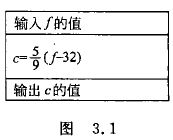

**编写程序:**	有了 N-S 图,很容易用 C 语言表示.

```c
#include <stdio.h>int main(){    float f,c;    f = 64.0;    c = (5.0 / 9) * (f - 32);    prinft("f=%f\nc=%f\n",f,c);    return 0;}
```

**运行结果:**


**例 3.2**	计算存款利息.有 1000 元,想存一年.有 3 种方法可选:<font color='green'>( 1 )</font>活期,年利率为 r1;<font color='green'>( 2 )</font>一年期定期,年利率为 r2;<font color='green'>( 3 )</font>存两次半年定期,年利率为 r3.请分别计算出一年后按 3 种方法所得到的本息和.

**解题思路:**	关键是确定计算本息和的公式,从数学知识可知,若存款额为 p0,则:

活期存款一年后本息和为 $$p1=p0\times(1+r1)$$.

一年期定期存款,一年后本息和为 $$p2=p0\times(1+r2)$$.

两次半年定期存款,一年后本息和为 $$p3=p0\times(1+\frac{r3}{2})\times(1+\frac{r3}{2})$$.

画出 N-S 流程图,见图 3.2.


**编写程序:**

```c
#include <stdio.h>int main(){    float p0,r1 = 0.0036,r2 = 0.0225,r3 = 0.0198,p1,p2,p3;    printf("Please enter the principal:");    scanf("%f",&p0);    p1 = p0 * (1 + r1);    p2 = p0 * (1 + r2);    p3 = p0 * (1 + r3/2) * (1 + r3/2);    printf("p1=%f\np2=%f\np3=%f\n",p1,p2,p3);    return 0;}
```

**运行结果:**


**程序分析:**	第 5 行定义变量同时给部分变量赋予初值;第 11 行在输出值时用 \n 使输出换行.

> **注意:**	在使用 Visual C++ 6.0 编译时,以上两个程序会显示出“警告”信息:”在初始化时把一个双精度常量赋给一个 float 型变量”.这是因为有的 C 编译系统把所有实数都作为双精度数处理.因此提醒用户:把双精度常量赋给 float 型变量会造成精度损失.对这类“警告”,用户知道是怎么回事就行了,承认此现实,让程序继续进行连接和运行,不影响运行结果.如果用 GCC 编译系统,则不会出现此类“警告”信息.

### 3.2 数据的表现形式及其运算

#### 3.2.1 常量和变量

在计算机高级语言中,数据有两种表现形式:常量和变量.

1. 常量

   在程序运行过程中,其值不能被改变的量称为<span style='color:#ff1100'>常量</span>.数值常量就是数学中的常数.

   常用的常量有以下几类:

   <font color='green'>( 1 )</font>	**整型常量**	如 1000,12345,0,-345 等都是整型常量.

   <font color='green'>( 2 )</font>	**实型常量**	有两种表示形式:

   ①	十进制小数形式,由数字和小数点组成.如:$$123.456,0.345,-56.79,0.0,12.0$$等.

   ②	指数形式,如: 

   $$12.34e3(12.34\times10^3),\\-346.87e-25(-346.87\times10^-25),\\0.145E25(0.145\times10^-25)$$ 

   等.由于在计算机输入或输出时,无法表示上标或下标,故规定以字母 e 或 E 代表以 10 为底的指数.但应注意: e 或 E 之前必须有数字,且 e 或 E 后面必须为整数.

   <font color='green'>( 3 )</font>	**字符常量**	有两种形式的字符常量:

   ①	**普通字符**	用单撇号括起来的一个字符,如: ‘a’,’Z’,’3’,’?’,’#’.不能写成 ‘ab’ 或 ‘12’. 请注意: 单撇号只是界限符,字符常量只能是一个字符,不包括单撇号. ‘a’ 和 ‘A’ 是不同的字符常量.字符常量存储在计算机存储单元中时,并不是存储字符(如 a,z,# 等)本身,而是以其代码(一般采用 ASCII 代码)存储,例如字符 ‘a’ 的 ASCII 化代码是 97,因此,在存储单元中存放的是 97 (以二进制形式存放). ASCII 字符与代码对照表见附录 B[^①].

   [^①]: C 语言并没有指定使用哪一种字符集,由各编译系统自行决定采用哪一种字符集. C 语言只是规定:基本字符集中的每一个字符必须用一个字节表示;空字符也占一个字节,它的所有二进制位都是 0;对数字 0~9 字符的代码,后面一个数字的代码应比前一个数字的代码大 1(如在 ASCII 字符集中,数字 ‘2’ 的代码是 50 ,数字 ‘3’ 的代码是 51 ,后者比前者的代码大 1,符合要求).中小型计算机系统大都采用 ASCII 字符集, ASCII 是 American Standard Code for Information Interchang(美国标准信息交换代码)的缩写.

   ②	**转义字符**	除了以上形式的字符常量外, C 还允许用一种特殊形式的字符常量,就是以字符 \ 开头的字符序列.例如,前面已经遇到过的 ‘\n’ 它代表一个‘换行’符. ‘\t’ 代表将输出的位置跳到下一个 tab 位置(制表位置),一个 tab 位置为 8 列.这是一种在屏幕上无法显示的“控制字符”,在程序中也无法用一个一般形式的字符来表示,只能采用这样的特殊形式来表示.

   常用的转义字符见表 3.1.

   

   <font color='green'>( 4 )</font>	**字符串常量**	如“boy”,”123”等,用双撇号把若干个字符括起来,字符串常量是双撇号中的全部字符(但不包括双撇号本身).注意不能错写成‘CHINA’,’boy’,’123’.单撇号内只能包含一个字符,双撇号内可以包含一个字符串.

   **说明:**	从其字面形式上即可识别的常量称为“字面常量”或“直接常量”.字面常量是没有名字的不变量.

   <font color='green'>( 5 )</font>	**符号常量**	用 #define 指令,指定用一个符号名称代表一个常量.如:

   ```c
   #define PI 3.1416	//注意行末没有分号
   ```

   经过以上的指定后,本文件中从此行开始所有的 PI 都代表 3.1416.这种用一个符号代表一个常量的,称为<span style='color:#ff1100'>符号常量</span>.在预编译后,符号常量已全部编程字面常量.使用符号常量有以下好处.

   ①	含义清楚.看程序时从 PI 就可以大致知道它代表圆周率.在定义符号常量名时应考虑“见名知意”.在一个规范的程序中国不提倡使用很多的常数,在检查程序时搞不清各个常数究竟代表什么.应尽量使用“见名知意”的变量名和符号常量.

   ②	在需要改变程序中多处用到的同一个变量时,能做到“一改全改”.

   > **注意:**	要区分符号常量和变量,不要把符号常量误认为变量.符号常量不占内存,只是一个临时符号,在预编译后符号就不存在了,故不能对符号常量赋以新值.为与变量名相区别,习惯上符号常量用大写表示.

2. 变量

   <span style='color:#ff1100'>变量</span>代表一个有名字的,具有特定属性的一个存储单元.它用来存放数据,也就是存放变量的值.在程序运行期间,变量的值是可以改变的.

   <span style='color:#229900'>变量必须先定义,后使用</span>[^②].在定义时指定该变量的名字和类型.一个变量应该有一个名字,一遍被引用.请注意区分变量名和变量值这两个不同的概念详见图 3.3

   

   [^②]: 定义变量的位置:一般在函数开头的声明部分定义变量,也可以在函数外定义变量(即外部变量,全局变量) C99 允许在函数中的复合语句(用一对花括号包起来)中定义变量.

3. 常变量

   C 99 允许使用**常变量**,如:

   ```c
   const int a = 3;
   ```

   表示 a 被定义为一个整型变量,指定其值为 3 ,而且在变量存在期间其值不能改变.

   常变量与常量的异同是:常变量具有变量的基本属性:有类型,占存储单元,只是不允许改变其值.可以说,常变量是有名字的不变量,而常量是没有名字的不变量.有名字就便于在程序中被引用.

   请思考:常变量与符号常量有什么不同?如:

   ```c
   #define Pi 3.1415926	//定义符号常量const float pi = 3.1416926;	//定义常变量
   ```

   符号常量 Pi 和常变量 pi 都代表 3.1415926,在程序中都能使用.但二者性质不同:定义符号常量用 #define 指令,它是预编译指令,它只是用符号常量代表一个字符串,在预编译时仅是进行字符替换,在预编译后,符号常量就不存在了(全置换成 3.1415926了),对符号常量的名字是不分配存储单元的.而常变量要占用存储单元,有变量值,只是该值不改变而已.从使用的角度看,常变量具有符号常量的优点,而且使用更方便.有了常变量以后,可以不必多用符号常量.

4. 标识符

   在计算机高级语言中,用来对变量,符号常量名,函数,数组,类型等命名的有效字符序列统称为<span style='color:#ff1100'>**标识符**(identifier)</span>.简单地说,标识符就是一个对象的名字.前面用到的变量名,符号常量名,函数名等都是标识符.

   C 语言规定标识符只能由字母,数字和下划线 3 种字符组成,且第 1 个字符必须为字母或下划线.

   > **注意:**	编译系统将大写字母和小写字母认为是两个不同的字符.因此,sum 和 SUM 是两个不同的变量名,同样, Class 和 class 也是两个不同的变量名.一般而言,变量名用小写字母表示,与人们日常习惯一致,以增加可读性.

#### 3.2.2 数据类型

在定义变量时需要指定变量的类型.C 语言要求在定义所有变量时都要指定变量的类型.常量也是区分类型的.

为什么要指定数据类型呢?计算机中,数据是存放在存储单元中的,它是具体存在的.而且存储单元是由有限的字节构成的,每一个存储单元中存放数据的范围是有限的,不可能存放“无穷大”的数,也不能存放循环小数.

> **注意:**	用计算机进行的计算不是抽象的理论值的计算,而是用工程的方法实现的计算,在许多情况下只能得到近似的结果.

所谓类型,就是对数据分配存储单元的安排,包括存储单元的长度(占多少字节)以及数据的存储形式.不同的类型分配不同的长度和存储形式.

C 语言允许使用的类型见图 3.4 ,图中有 * 的是 C 99 所增加的.


其中基本类型( 包括整型和浮点型 )和枚举类型变量的值都是数值,统称为算术类型( arithmetic type ).算术类型和指针类型统称为顿量类型( scalar type ),因为其变量的值是以数字来表示的.枚举类型是程序中用户定义的整数类型.数组类型和结构体类型统称为组合类型( aggregate type ),共用体类型不属于组合类型,因为在同一时间内只有一个成员具有值.函数类型用来定义函数,描述一个函数的接口,包括函数返回值的数据类型和参数的类型.

不同类型的数据在内存中占用的存储单元长度是不同的,例如,Visual C++ 6.0 为 char 型( 字符型 )数据分配 1 个字节,为 int 型( 基本整型 )数据分配 4 个字节,存储不同类型数据的方法也是不同的.

#### 3.2.3 整型数据

1. 整型数据的分类

   <font color='green'>( 1 )</font>	基本整型( int 型 )

   编译系统分配给 int 型数据 2 个字节或 4 个字节( 由具体的 C 编译系统自行决定 ).在存储单元中的存储方式是:用整型的补码( complement )形式存放.一个正数的补码是此数的二进制形式,如 5 的二进制形式是 101,如果用两个字节存放一个整数,则在存储单元中的数据形式如图 3.5 所示.如果是一个负数,则应先求出负数的补码.求负数的补码的方法是:先将此数的绝对值写成二进制形式,然后对其后面所有各二进制位按位取反,再加 1.如 -5 的补码见图 3.6.

   

   在存放整数的存储单元中,最左面一位是用来表示符号的,如果该位为 0 ,表示数值为正;如果该位为 1 ,表示数值为负.

   > **说明:**	如果给整型变量分配 2 个字节,则存储单元中能存放的最大值为 0111111111111111,第 1 位为 0 代表正数,后面 15 位为全 1,此数值是( 2^15^-1 ),即十进制数 32767.最小值为 1000000000000000,此数是 -2^15^,即 -32768.因此一个整型变量的值的范围是 -32768~32767.超过此范围,就出现数值的“溢出”,输出的结果显然不正确.如果给整型变量分配4个字节( Visual C++ ),其能容纳的数值范围为 -2^31^~(2^31^-1),即 -2147483648~2147483647.

   <font color='green'>( 2 )</font>	**短整型( short int )**

   类型名为 short int 或 short.如用 Visual C++ 6.0,编译系统分配给 int 数据 4 个字节,短整型 2 个字节.存储方式与 int 型相同.一个短整型变量的值的范围是 -32768~32767.

   <font color='green'>( 3 )</font>	**长整型( long int )**

   类型名为 long int 或 long.一个 long int 型变量的值的范围是 2^31^~( 2 ^31^-1 ),即 -2147483648~2147483647( Visual C++ 6.0 ),编译系统分配给 long 数据 4 个字节.

   <font color='green'>( 4 )</font>	**双长整型( long long int )**

   类型名为 long long int 或 long long ,一般分配 8 个字节.这是 C 99 新增的类型,但许多 C 编译系统尚未实现.

   > **说明:**	C 标准没有具体规定各种类型数据所占用存储单元的长度,这是由各编译系统自行决定的.C 标准只要求 long 型数据长度不短于 int 型,short 型不长于 int 型.

2. 整型变量的符号属性

   以上介绍的几种类型,变量值在存储单元中都是以补码形式存储的,存储单元中的第 1 个二进制代表符号.整型变量的值的范围包括负数到正数( 见表 3.2 ).

   

   在实际应用中,有的数据的范围常常只有正直( 如学号,年龄,库存量,存款额等 ).为了充分利用变量的值的范围,可以将变量定义为“无符号”类型.可以在类型符号前面加上修饰符 unsigned ,表示指定该变量是“无符号整数”类型.如果加上修饰符 signed ,则是“有符号类型”.因此,在以上 4 种整型数据的基础上可以扩展为以下 8 种 整型数据.即:

   有符号基本整型		[signed]		int;

   无符号基本整型		unsigned	int;

   有符号短整型			[signed]	short	[int];

   无符号短整型			unsigned	short	[int];

   有符号长整型			[signed]	long	[int];

   无符号长整型			unsigned	long	[int];

   有符号双长整型*		[signed]	long long	[int];

   无符号双长整型*		unsigned	long long	[int];

   以上有“*”的是 C 99 增加的,方括号表示其中的内容是可选的,既可以有,也可以没有.如果即未指定为 signed 也未指定为 unsigned 的,默认为“有符号类型”.

   有符号整型数据存储单元中最高位代表符号.如果指定 unsigned 型,存储单元中全部二进制位都用做存放数值本身,而没有符号.由于左面最高位不再用来表示符号,而用来表示数值,因此无符号整型变量中可以存放的正数的范围比一般整型变量中正数的范围扩大一倍.如果在程序中定义 a 和 b 两个短整型变量( 占 2 个字节 ),其中 b 为无符号短整型:

   ```c
   short a;	//a为有符号短整型变量unsigned short b;	//b为无符号短整型变量
   ```

   则变量 a 的数值范围为 -32768~32767,而变量 b 的数值范围为 0~65535.图 3.7( a )表示有符号整型变量 a 的最大值( 32767 ),图 3.7( b )表示无符号整型变量 b 的最大值( 65535 ).

   

   表 3.2 列出各种整型数据的存储空间和值的范围.

   > **说明:**	<font color='green'>( 1 )</font>只有整型( 包括字符型 )数据可以加 signed 或 unsigned 修饰符,实型数据不能加. <font color='green'>( 2 )</font>对无符号整型数据用 “%u” 格式输出.%u 表示用无符号十进制数的格式输出.如:
   >
   > ```c
   > unsigned short price = 50;	//定义为无符号变量printf("%u\n",price);	//指定用无符号十进制输出
   > ```
   >
   > 将一个便令定义为无符号整型后,不应向它赋予一个负值,否则会得到错误的结果.如:
   >
   > ```c
   > unsigned short price = -1;printf("%d\n",price);
   > ```
   >
   > 得到结果为 65535.显然与原意不符.
   >
   > 原因是:系统对 -1 先转换成补码形式,就是全部二进制位全都是 1 ( 见图 3.8 ),然后把它存入变量 price 中.由于 price 是无符号短整型变量,其左面第一位不代表符号,按“%d”格式输出,就是 65535.
   >
   > 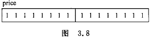

#### 3.2.4 字符型数据

由于字符是按其代码( 整数 )形式存储的,因此 C 99 把字符型数据作为整数类型的一种.但是,字符型数据在使用上有自己的特点,因此把它单独列为一节来介绍.

1. 字符与字符代码

   字符与字符代码并不是任意写一个字符,程序都能识别的.例如圆周率 π 在程序中是不能识别的,只能使用系统的字符集中的字符,目前大多数系统采用 ASCII 字符集.各种字符集( 包括 ASCII 字符集 )的基本集都包括了 127 个字符.其中包括:

   - 字母:	大写英文字母 A ~ Z ,小写英文字母 a ~ z.
   - 数字:	0 ~ 9.
   - 专门符号:	29 个:	! “ # & ‘ ( ) * + , - . / : ; < = > ? [ \ ] ^ _ { | } ~
   - 空格符:	空格,水平制表符( tab ),垂直制表符,换行,换页( form feed ).
   - 不能显示的字符:	空( null )字符( 以 ‘\0’ 表示 ),警告( 以 ‘\a’ 表示 ),退格( 以 ‘\b’ 表示),回车( 以 ‘\r’ 表示 )等.

   详见附录 B ( ASCII 字符表 ).这些字符用来写英文文章,材料或编程序基本够用了[^③].

   [^③]: C 语言本来是在英文环境下开发设计的.因此用 ASCII 基本集中的字符就可以基本满足写英文文章和材料的要求.但是一个国际化的软件应当能够表示不同国家使用的不同字符.1995 年 IOS 提出的“基准增补 1”对字符数据作了扩充,允许使用宽字符( wide character ),在该字符集中为每个字符所分配的字节数是相同的.C 99 除了允许使用 char 类型( 单字节 )外,还允许使用 wchar_t 类型( 宽字节 ),器类型定义在头文件 stddef.h 中.

   前面已经说明,字符是以整数形式( 字符的 ASCII 代码 )存放在内存单元中的.例如:

   大写字母 ‘A’ 的 ASCII 代码是十进制 65,二进制形式为 1000001

   小写字母 ‘a’ 的 ASCII 代码是十进制 97,二进制形式为 1100001

   数字字符 ‘1’ 的 ASCII 代码是十进制 49,二进制形式为 0110001

   空格字符 ‘ ’ 的 ASCII 代码是十进制 32,二进制形式为 0100000

   专用字符 ‘%’ 的 ASCII 代码是十进制 37,二进制形式为 0100101

   转义字符 ‘\n’ 的 ASCII 代码是十进制 10,二进制形式为 0001010

   可以看到,以上字符的 ASCII 代号码最多用 7 个二进制位就可以表示.所有 127 个字符都可以用 7 个二进制位表示.所以在 C 中,指定用 1 个字节( 8位 )存储一个字符( 所有系统都不例外 ).此时,字节中的第 1 位置为 0.

   如小写字母 ‘a’ 在内存中的存储情况见图 3.9

   > **注意:**	字符 ‘1’ 和整数1是不同的概念,字符 ‘1’ 只是代表一个形状为 ‘1’ 的符号,在需要时按原样输出,在内存中以 ASCII 码形式存储,占 1 个字节,见图 3.10( a ),而整数 1 是以整数存储方式( 二进制补码方式 )存储的,占 2 个或 4 个字节,见图 3.10( b ).

    

2. 字符变量

   字符变量使用类型符 char 定义字符变量.char 是英文 charater( 字符 )的缩写,见名即可知意.如:

   char c = ‘?’;

   定义 c 为字符型变量并使初值为字符 ‘?’ .’?’ 的 ASCII 代码是 63 ,系统把整数 63 赋给变量 c.

   c 是字符变量,实质上是一个字节的整型变量,由于它常用来存放字符.所以称为字符变量.可以把 0 ~ 127 之间的整数赋给一个字符变量.

   在输出字符变量的值时,可以选择以十进制整数形式输出,或以字符形式输出.如:

   printf(“%d %c”,c,c);

   输出结果是:

   63 ?

   用 “%d” 格式输出十进制整数63,用 %c 格式用字符形式输出字符 ‘?’.

   前面介绍了整型变量可以用 signed 和 unsigned 修饰符表示符号属性.那么字符类型也属于整型,是否也可以用 signed 和 unsigned 修饰符呢?请阅读附注[^④].

   [^④]: 前面已介绍:127个基本字符用 7 个二进制位存储,如果系统只提供 127 个字符,那么就将 char 型变量第 1 个二进制位设置为 0,用后面 7 位存放 0 到 127,即 127 个字符的代码.在这种情况下,系统提供的 char 类型相当于 signed char .但是在实际应用中,往往觉得 127 个字符不够用,希望能多提供一些可用的字符.根据此需要,有的系统提供了扩展的字符集.把可用的字符由 127 个扩展为 255 个,即扩大了一倍,怎么解决这个问题呢?就是把本来不用的第一位用起来.把 char 变量改为 unsigned char ,即第一位并不固定设为 0 ,而是把 8 位都用来存放字符代码.这样,可以存放( 2^8^-1 )即 255 个字符代码,附录 B 中 ASCII 代码的 128 ~ 255 部分就是某系统扩展的 ASCII 字符,它并不适用于所有的系统.读者可以用语句检查 ASCII 代码从 128 ~ 255 部分的扩展字符.unsigned char c = 128;//定义 c 为无符号字符变量  printf(“%d:%c\n”,c,c);//输出 ASCII 代码为 128 的字符   观察是否输出附录 B 中代码为 128 的字符.可以用类似方法检查其他扩展字符.在中文操作系统下,ASCII 代码为 127 以后的部分被作为中文字符处理,顾不会显示处附录 B 中的扩展字符.

   字符型数据的存储空间和值的范围见表 3.3.

   

   > **说明:**	在使用有符号字符变量时,允许村相互的值为 -128 ~ 127 ,但字符的代码不可能为负值,所以在存储字符时实际上只用到 0 ~ 127 这一部分,其第 1 位都是0.

   如果讲一个负整数赋给有符号字符型变量是合法的,但它不代表一个字符,而作为一字节整型变量存储负整数.如:

   signed char c = -6;

   如果在定义变量时既不加 signed ,又不加 unsigned ,C 标准并未规定是按 signed char 处理还是按 unsigned char 处理,由各编译系统自己决定.这是和其他整型变量处理方法不同的,如 int 默认等同于 signed int.

   可以用以下方法测定本系统的处理方式:

   char c = 255;	//把一个 128 ~ 255 之间的正数赋给 c

   printf(“%d\n”,c);	//按十进制形式输出 c 的值

   在 Visual C++ 系统上进行编译时,系统给出“警告”( warning ):”把一个整常数赋给 char 变量”.表示 255 已超过 char 变量的数值允许范围,在运行时输出 -1.说明 Visual C++ 是把 char 默认为 signed char 类型的.如果把第 1 行改为“unsigned char c = 255;”则不出现“警告”,且输出255.

#### 3.2.5 浮点型数据

浮点型数据是用来表示具有小数点的实数的.为什么在 C 中把实数称为浮点数呢?在 C 语言中,实数是以指数形式存放在存储单元中的.一个实数表示为指数可以有不止一种形式,如 3.1416 可以表示为:

$$3.14159\times10^0,0.314159\times10^1,0.0314159\times10^2,31.4159\times10^-1,314.159\times10^-2$$ 等,它们代表同一个值.可以看到:小数点的位置可以在 31416 几个数字之间和之前或之后( 加 0 )浮动的,只要在小数点位置浮动的同时改变指数的值,就可以保证它的值不会改变.由于小数点位置可以浮动,所以实数的指数形式称为<span style='color:#ff1100'>**浮点数**</span>.

在指数形式的多种表示方式中把小数部分中小数点前的数字为0,小数点后第 1 位数字不为 0 的表示形式称为<span style='color:#ff1100'>**规范化的指数形式**</span>,如 $$0.314159\times10^1$$ 就是3.14159 的规范化的指数形式.一个实数只有一个规范化的指数形式,在程序以指数形式输出一个实数时,必然以规范化的指数形式输出,如0.314159e001.

浮点数类型包括 float( 单精度浮点型 ),double( 双精度浮点型 ),long double( 长双精度浮点型 ).

<font color='green'>( 1 )</font>	**float 型( 单精度浮点型 )**	编译系统为每一个 float 型变量分配 4 个字节,数值以规范化的二进制数指数形式存放在存储单元中.在存储时,系统将实型数据分成小数部分和指数部分两个部分,分别存放.小数部分的小数点前面的数为 0 .如 3.14159 在内存中存放形式可以用图 3.11 表示.


图 3.11 使用十进制数来示意的,实际上在计算机中使用二进制数来表示小数部分以及用 2 的幂次来表示指数部分的.在 4 个字节( 32 位 )中,究竟用多杀位来表示小数部分,多少位来表示指数部分,C 标准并无具体规定,由各 C 语言编译系统自定.有的 C 语言编译系统以 24 位表示小数部分( 包括符号 ),以 8 位 表示指数部分( 包括指数的符号 ).由于用二进制形式表示一个实数以及存储单元的长度是有限的,因此不可能得到完全精确的值,只能存储成有限的精确度.小数部分占的位( bit )数愈多,输得有效数字愈多,精度也愈高.指数部分占的位数愈多,则能表示的数值范围愈大.float 型数据能得到 6位有效数字,数值范围为 -3.4×10^-38^ ~ 3.4×10^38^.

<font color='green'>( 2 )</font>	**double 型(双精度浮点型)**	为了扩大能表示的数值范围,用 8 个字节存储一个 double 型数据,可以得到 15 位有效数字,数值范围为 -1.7×10^-308^ ~ 1.7×10^308^.在 C 语言中进行浮点数的算术运算时,将 float 型数据都自动转换为 double 型,然后进行运算.

<font color='green'>( 3 )</font>	**long double 型(长双精度)**	不同的编译系统对 long double 型的处理方法不同, Turbo C 对 long double 型分配 16 个字节.而 Visual C++ 6.0 则对 long double 型和 double 型一样处理,分配 8 个字节.在使用不同的编译系统时注意其差别.

表 3.4 列出实型数据的有关情况.


> **说明:**	由于用有限的存储单元存储一个实数,不可能完全精确地存储,例如 float 型变量能存储的最小正数为 1.2×10^-38^,不能存放绝对值小于此值的数,例如 10^-40^.float 型变量能存储的范围见图 3.12.即数值可以在 3 个范围内:<font color='green'>( 1 )</font>-3.4×10^38^到-1.2×10^-38^;<font color='green'>( 2 )</font>0;<font color='green'>( 3 )</font>1.2×10^-38^到3.4×10^38^.


#### 3.2.6 怎样确定常量的类型

在 C 语言中,不仅变量有类型,常量也有类型.为什么要把常量分为不同的类型呢?在程序中出现的常量是要存放在计算机中的存储单元中的.这就必须确定分配给它多少字节,按什么方式存储.

怎样确定常量的类型呢?从常量的表示形式既可以判定其类型.对于字符常量很简单,只要看到由单撇号括起来的单个字符或转义字符就是字符常量.对于数值常量按以下规律.

<span style='color:#ff1100'>**整型常量**</span>	不带小数点的数值是整型常量,但应注意其有效范围.如在 Turbo C 中,系统为整型数据分配 2 个字节,其表值范围为 -32768~32767 ,如果在程序中出现数值常量 23456 ,系统把它作为 int 型处理,用 2 个字节存放.如果出现 49875 ,由于超过 32768 ,2 个字节放不下,系统会把它作为长整型( long int )处理,分配 4 个字节.在 Visual C++ 中,凡在 -2147483648~2147483647 之间的不带小数点的数都作为 int 型,分配 4 个字节,在此范围外的整数,而又在 long long 型数的范围内的整数,作为 long long 型处理.

在一个整数的末尾加大写字母 L 或小写字母 l,表示它是长整型( long int ).例如 123L,234l 等.但在 Visual C++ 中由于对 int 和 long int 型数据都分配 4 个字节,因此没有必要用 long int 型.

<span style='color:#ff1100'>**浮点型常量**</span>	凡以小数形式或指数形式出现的实数,是浮点型常量,在内存中都以指数形式存储.如: 10 是整型常量, 10.0 是浮点型常量.那么对浮点型常量是按单精度处理还是按双精度处理呢? C 编译系统把浮点型常量都按双精度处理,分配 8 个字节.

> **注意:**	C 程序中的实型常量都是双精度浮点型常量.

如果有:	float a = 3.14159;

在进行编译时,对 float 变量分配 4 个字节,但对于浮点型常量 3.14159,则按双精度处理,分配 8 个字节.编译系统会发出“警告”( warning: truncation from ‘const double’ to ‘float’ ).意为“把一个双精度常量转换为 float 型”,提醒用户注意这种转换可能损失精度.这样的“警告”,一般不会影响程序运行结果的正确性,但会影响程序运行结果的精确度.如果对精确度要求不是很高,可以容忍这样的“警告”,是程序接着进行连接和运行.

可以在常量的末尾加专用字符,强制指定常量的类型.如在 3.14159 后面加字母 F 或 f ,就表示是 float 型常量,分配 4 个字节.如果在实型常量后面加 L 或 l ,指定次常量为 long  double 类型.如:

float a = 3.14159f;	//把此 3.14159 按单精度浮点常数处理,编译时不出现“警告”

long double a = 1.23L;	//把此 1.23 作为 long double 处理

> **注意:**	要区分类型与变量
>
> 要分清类型和变量的关系,不要混为一谈.应当看到它们是有联系而有区别的两个概念.每一个变量都属于一个确定的类型,类型是变量的一个重要的属性.变量是占用存储单元的,是具体存在的实体,在其占用的存储单元中可以存放数据.而类型是变量的共性,是抽象的,不占用存储单元,不能用来存放数据.

可以对一个变量赋值,但是不能对一个类型赋值.如:

int a;	a = 3;	//正确,对整型变量 a 赋值

int = 3;	//错误,不能对类型赋值

#### 3.2.7 运算符和表达式

几乎每一个程序都需要进行运算,对数据进行加工处理,否则程序就没有意义了.要进行运算,就需规定可以使用的运算符. C 语言的运算符范围很宽,把除了控制语句和输入输出以外的几乎所有的基本操作都作为运算符处理,例如将赋值符 “=” 作为赋值运算符,方括号作为下标运算符等.

1. 基本的运算符

   最常用的算术运算符见表 3.5

   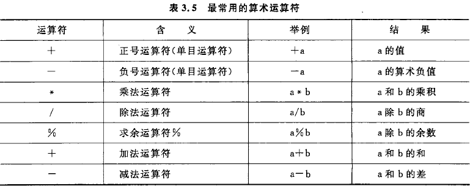

   > **说明:**	
   >
   > - 由于键盘无 × 号,运算符 × 以 * 代替.
   > - 由于键盘无 ÷ 号,运算符 ÷ 以 / 代替.两个实数相除的结果是双精度实数,两个整数相除的结果为整数,如 5/3 的结果为 1 ,舍去小数部分.但是,如果除数或被除数中有一个为负值,则舍入的方向不是固定的.例如 -5/3,有的系统中得到的结果为 -1 ,在有的系统中则得到结果为 -2.多数 C 编译系统( 如 Visual c++ )采取“向零取整”的方法,即 5/3 = 1,-5/3 = -1,取整后向零靠拢.
   > - % 运算符要求参加运算的运算对象( 即操作数 )为整数,结果也是整数.如 8%3,结果为2.
   > - 除 % 以外的运算符的操作数都可以是任何算术类型.

2. 自增,自减运算符

作用是使变量的值加 1 或减 1 ,例如:

++i,--i ( 在使用 i 之前,先使 i 的值加(减) 1 )

i++,i-- ( 在使用 i 之后, 使 i 的值加(减) 1 )

粗略地看,++i 和 i++ 的作用相当于 i=i+1.但 ++i 和 i++ 不同之处在于 ++i 是先执行 i+1 后,再使用 i 的值;而 i++ 是先使用 i 的值后,再执行 i+1.如果 i 的原值等于 3,请分析下面的赋值语句:

① j = ++i;	( i 的值先变成 4 ,再赋给 j ,j 的值为4 )

② j = i++;	( 先将 i 的值 3 赋给 j ,j 的值为 3 ,然后 i 变为 4 )

又例如:

i = 3;

printf(“%d”,++i);

输出 4.若改为

printf(“%d”,i++);

则输出 3.

> **注意:**	自增运算符( ++ )和自减运算符( -- )只能用于变量,而不能用于常量或表达式.如 5++ 或 ( a+b )++ 都是不合法的.因为 5 是常量,常量的值不能改变.( a+b )++ 也不可能实现,假如 a+b 的值为 5,那么自增后得到的 6 放在什么地方呢?无变量可供存放.

自增( 减 )运算符常用于循环语句中,使循环变量自动加 1 ;也用于指针变量,使指针指向下一个地址.使用 ++ 和 -- 运算符时,常常会出现一些人们想不到的副作用,如 i+++j ,是理解为( i++ )+j呢?还是 i+( ++j )呢?为避免二义性,应当采用不至引起歧义的写法,可以加一些“不必要”的括号,如( i++ )+j.

熟练的程序开发人员喜欢在使用 ++ 和 -- 运算符时,采取一些技巧,以体现程序的专业性,初学者慎用.

3. 算术表达式和运算符的优先级与结合性

   用算术运算符和括号将运算对象( 也称操作数 )连接起来的,符合 C 语法规则的式子,称为<span style='color:#ff1100'>**C 算术表达式**</span>.运算对象包括常量,变量,函数等.例如,下面是一个合法的 C 算术表达式:	a*b/c-1.5+‘a’

   C 语言除了规定了运算符的优先级外,还规定了运算符的<span style='color:#ff1100'>**结合性**</span>.在表达式求值时,先按运算符的优先级别顺序执行.

   如果在一个运算对象两侧的运算符的优先级别相同,则按规定的“结合方向”处理.C 语言规定了各种运算符的结合方向( 结合性 ),算术运算符的结合方向都是“自左向右”,即先左后右.关于“结合性”的概念在其他一些高级语言中是没有的,是 C 语言的特点之一.附录 D 列出了所有运算符以及它们的优先级别和结合性.

4. 不同类型数据间的混合运算

   在程序中经常会遇到不同类型的数据进行运算.如果一个运算符的两侧的数据类型不同,则先自动进行类型转换,使二者具有同一种类型,然后进行运算.因此整型,实型,字符型数据间可以进行混合运算.规律为:

   <font color='green'>( 1 )</font>	+,-,*,/运算的两个数中有一个数为 float 或 double 型,结果是 double 型,因为系统将所有 float 型数据都先转换为 double 型,然后进行运算.

   <font color='green'>( 2 )</font>	如果 int 型与 float 或 double 型数据进行运算,先把 int 型和 float 型数据转化为 double 型,然后进行运算,结果是 double 型.

   <font color='green'>( 3 )</font>	字符( char )型数据与整型数据进行运算,就是把字符的 ASCII 代码与整型数据进行运算.字符数据可以直接与整型数据进行运算.如果字符型数据与实型数据进行运算,则将字符的 ASCII 代码转换为 double 型数据,然后进行运算.

   以上的转换时编译系统自动完成,用户不必过问.

   分析下面表达式,假设已指定 i 为整型变量,值为 3,f 为 float 型变量,值为 2.5,d 为 doubule 型变量,值为 7.5.

   10+‘a’+i*f-d/3

   编译时,从左至右扫描,运算次序为:

   ① 进行 10+‘a’ 的运算,’a’的值是整数97,运算结果为 107.

   ② 由于 ‘*’ 比 ‘+’ 优先级高,先进行 i * f 的运算.先将 i 与 f 都转换成 double 型,运算结果为 7.5,double 型.

   ③ 整数 107 与 i * f 的积相加,先将整数 107 转换成双精度数,相加结果为 114.5,double 型.

   ④ 进行 d/3 的运算,先将 3 转换成 double 型,d/3 结果为 2.5,double 型.

   ⑤ 将 10+‘a’+i*f 的结果114.5 与 d/3 的商 2.5 相减,结果为 112.0,double 型.

   **例 3.3**	给定一个大写字母,要求用小写字母输出.

   **解题思路:**	字符数据以 ASCII 码存储在内存的,形式与整数的存储形式相同.所以字符型数据和其他算术型数据之间可以互相赋值和运算.

   要进行大小写字母之间的转换,就要找到一个字母的大写形式和小写形式之间有什么内在联系.从附录 B 中可以找到其内在规律:同一个字母,用小写表示的字符的 ASCII 代码比用大写表示的字符的 ASCII 代码大32.有此思路就可以编写程序了.

   **编写程序:**

   ```c
   #include <stdio.h>int main(){    char c1,c2;    printf("Please input:");    scanf("%c",&c1);    c2 = c1 + 32;    printf("%c",c2);    printf("%d",c2);    return 0;}
   ```

   **运行结果:**

   

   **程序分析:**	程序第 7 行“c2 = c1 + 32”,把字符变量 c1 的值与整数 32 相加.c1 + 32 就是 ‘A’ + 32,就是 65 + 32,其值为 97.将 97 赋给字符变量 c2,在 c2 的存储单元中存放了 97.

   一个字符数据既可以以字符形式输出,也可以以整数形式输出.字符形式输出用“%c”,十进制整数形式输出用“%d”见图 3.13.

   

5. 强制类型转换运算符

   可以利用强制类型转换运算符将一个表达式转换成所需类型.例如:

   ( double )a	( 将 a 转换成 double 类型 )

   ( int )( x+y )	( 将 x+y 的值转换成 int 型 )

   ( float )( 5%3 )	( 将 5%3 的值转换成 float 型 )

   其一般形式为

   ( **类型名** )( **表达式** )

   > **注意:**	表达式应该用括号括起来.如果写成 ( int )x+y 则只将 x 转换成整型,然后与 y 相加.

   需要说明的是,在强制类型转换时,得到一个所需类型的中间数据,而原来变量的类型未发生变化.例如:

   a = ( int )x

   如果已定义 x 为 float 型变量,a 为整型变量,进行强制类型运算 ( int )x 后得到一个 int 类型的临时值,它的值等于 x 的整数部分,把它赋给 a,注意 x 的值和类型都未变化,仍为 float 型.该临时值的赋值后就不再存在了.

   从上可知,有两种类型转换,一种是在运算时不必用户干预,系统自动进行的类型转换,一种是强制类型转换.当自动类型转换不能实现目的时,可以用强制类型转换.

6. C 运算符

   除了算术运算符外,C 还提供其他运算符,共有以下几类:

   <font color='green'>( 1 )</font>	算术运算符	( + - * / % ++ -- )

   <font color='green'>( 2 )</font>	关系运算符	( > < == >= <= !=)

   <font color='green'>( 3 )</font>	逻辑运算符	( ! && || )

   <font color='green'>( 4 )</font>	位运算符	( << >> ~ | ^ & )

   <font color='green'>( 5 )</font>	赋值运算符	( = 及其扩展赋值运算符 )

   <font color='green'>( 6 )</font>	条件运算符	( ?: )

   <font color='green'>( 7 )</font>	逗号运算符	( , )

   <font color='green'>( 8 )</font>	指针运算符	( * 和 & )

   <font color='green'>( 9 )</font>	求字节数运算符	( sizeof )

   <font color='green'>( 10 )</font>	强制类型转换运算符	( (类型) )

   <font color='green'>( 11 )</font>	成员运算符	( . - > )

   <font color='green'>( 12 )</font>	下标运算符	( [ ] )

   <font color='green'>( 13 )</font>	其他	( 如函数调用运算符 ( ) )

   运算符见本书附录 D.

### 3.3 C 语句

#### 3.3.1 C 语句的作用和分类

在前面的例子中可以看到:一个函数包含声明部分和执行部分,执行部分是由语句组成的.语句的作用是向计算机系统发出操作指令,要求执行相应的操作,一个 C 语句经过编译后产生若干条机器指令.声明部分不是语句,它不产生机器指令,只是对有关数据的声明.

C 程序结构可以用图 3.14 表示.即一个 C 程序可以由若干个源程序文件( 编译时以文件模块为单位 )组成,一个源文件可以由若干个函数和预处理指令以及全局变量声明部分组成.一个函数由数据声明部分和执行语句组成.


C 语句分为以下 5 类.

<font color='green'>( 1 )</font>	<span style='color:#ff1100'>**控制语句**</span>	控制语句用于完成一定的控制功能. C 只有 9 种控制语句,它们的形式是:

①	<span style='color:#ff1100'>**if( )...else...**</span>	( 条件语句 )

②	<span style='color:#ff1100'>**for( )...**</span>			( 循环语句 )

③	<span style='color:#ff1100'>**while( )...**</span>		( 循环语句 )

④	<span style='color:#ff1100'>**do...while( )**</span>	( 循环语句 )

⑤	<span style='color:#ff1100'>**continue**</span>		( 结束本次循环语句 )

⑥	<span style='color:#ff1100'>**break**</span>				( 中止执行 switch 或循环语句 )

⑦	<span style='color:#ff1100'>**switch**</span>				( 多分支选择语句 )

⑧	<span style='color:#ff1100'>**return**</span>				( 从函数返回语句 )

⑨	<span style='color:#ff1100'>**goto**</span>					( 转向语句,在结构化程序中基本不用 goto 语句 )

上面 9 种语句表示形式中的( )表示括号中是一个“判别条件”,”...”表示内嵌的语句.

<font color='green'>( 2 )</font>	<span style='color:#ff1100'>**函数调用语句**</span>	函数调用语句有一个函数调用加一个分号构成,例如:

printf(“This is a statement.”);

其中 printf(“This is a statement.”)是一个函数调用,加一个分号成为一个语句.

<font color='green'>( 3 )</font>	<span style='color:#ff1100'>**表达式语句**</span>	表达式语句由一个表达式加一个分号构成,最典型的是,由赋值表达式构成一个赋值语句.

可以看出,一个表达式的最后加上一个分号就成了一个语句.一个语句必须在最后有一个分号,分号是语句中不可缺少的组成部分,而不是两个语句间的分隔符号.

<font color='green'>( 4 )</font>	<span style='color:#ff1100'>**空语句**</span>	只有一个分号的语句是空语句,他什么也不做.那么它的作用是什么?可以用来作为流程的转向点( 流程从程序其他地方转到此语句处 ),也可用来作为循环语句中的循环体( 循环体是空语句,表示循环体什么也不做 ).

<font color='green'>( 5 )</font>	<span style='color:#ff1100'>**复合语句**</span>	可以用{ }把一些语句和声明括起来成为符合语句( 又称语句块 ).

可以在复合语句中包含声明部分,C 99 允许将声明部分放在复合语句中国的任何位置,但习惯上把它放在语句块开头位置.复合语句常用在 if 语句或循环中,此时程序需要连续执行一组语句.

> **注意:**	复合语句中最后一个语句中最后的分号不能忽略不写.

#### 3.3.2 最基本的语句 -- 赋值语句

在 C 程序中,最常用的语句是:赋值语句和输入输出语句.其中最基本的是赋值语句.程序中的计算功能大部分是由赋值语句实现的,几乎每一个有实用价值的程序都包括赋值语句.有的程序中大部分语句都是赋值语句.

**例 3.4**	给出三角形的三边长,求三角形面积.

**解题思路:**	假设给定的三个边符合构成三角形的条件:任意两边之和大于第三边.解此题的关键是要找到求三角形面积的公式.从数学知识已知求三角形面积的公式为

$$area=\sqrt{s(s-a)(s-b)(s-c)}$$ 其中 $$s=(a+b+c)/2$$.

**编写程序:** 根据上面公式编写程序如下:

```c
#include <stdio.h>#include <math.h>int main(){    double a,b,c,s,area;    printf("Please input a,b,c:");    scanf("%f%f%f"&a,&b,&c);    s = (a+b+c)/2;    area = sqrt(s*(s-a)*(s-b)*(s-c));    printf("area = %f\n",area);    return 0;}
```

用 double 定义变量时程序执行错误:


改用 float 定义变量时程序执行正确:


**程序分析:**	程序执行部分主要由赋值语句构成,分别实现对 a,b,c 的赋值,计算 s 和 area.为了提高精度,几个变量全部定义为双精度型. sqrt 函数时求平方根的函数.由于要调用数学函数库中的函数,必须在程序的开头加一条 #include 指令,把头文件 “math.h”包含到程序中来.

printf 函数双撇号内字符串中的 ‘\t’ 是转义字符,它的作用是“使输出位置跳到下一个 tab 位置”.在安排输出时,常用 ‘\t’ 来调整输出的位置,使输出的数据清晰,整齐,美观.

> **注意:**	凡是在程序中要用到数学函数库中的函数,都应当“包含”math.h 头文件.

下面归纳一下与赋值有关的一些问题.

1. 赋值运算符

   赋值符号 = 就是赋值运算符,它的作用是将一个数据赋给一个变量.也可以将一个表达式赋给一个变量.

2. 复合的赋值运算符

   在赋值 = 之前加上其他运算符,可以构成复合的运算符.如果在“=”前加一个“+”运算符就成了复合运算符“+=”.例如可以有以下的复合赋值运算:

   a += 3		等价于 a = a+3

   x *= y+8	等价于 x = X * (y+8)

   x %= 3		等价于 x = x%3

   凡是二元( 二目 )运算符,都可以与赋值符一起组合成复合赋值符.有关算术运算的复合赋值运算符有 +=,-=,*=,/=,%=.

   C 语言采用这种复合运算符,一是为了简化程序,使程序精炼,二是为了提高编译效率,能产生质量较高的目标代码.专业人员往往喜欢使用复合运算符,程序显得专业一点,对初学者来说,不必多用,首要的是保持程序清晰易懂.

3. 赋值表达式

   由赋值运算符将一个变量和一个表达式连接起来的式子称为“<span style='color:#ff1100'>**赋值表达式**</span>”.它的一般形式为

   <span style='color:#ff1100'>**变量**</span>	<span style='color:#ff1100'>**赋值运算符**</span>	<span style='color:#ff1100'>**表达式**</span>

   赋值表达式的作用是将一个表达式的值赋给一个变量,因此赋值表达式具有计算和赋值的双重功能.

   赋值运算符左侧应该是一个可修改的“<span style='color:#ff1100'>**左值**</span>”( left value,简写 lvalue ).左值的意思是它可以出现在赋值运算符的左侧,它的值是可以改变的.并不是任何形式的数据都可以为左值的,变量可以作为左值,而算数表达式不能作为左值,常量也不能作为左值,因为常量不能被赋值,能出现在赋值运算符右侧的表达式称为“<span style='color:#ff1100'>**右值**</span>”( right value,简写 rvalue ).显然左值也可以出现在赋值运算符右侧,凡是左值都可以作为右值.

   将赋值表达式作为表达式的一种,使赋值操作不仅可以出现在赋值语句中,而且可以以表达式的形式出现在其它语句中( 如输出语句,循环语句等 )这是 C 语言灵活性的一种标点.

4. 赋值过程中的类型转换

   如果赋值运算符两侧的类型一致,则直接进行赋值.

   如果赋值运算符两侧的类型不一致,但都是算术类型时,在赋值时要进行类型转换.类型转换是由系统自动进行的,转换的规则是:

   <font color='green'>( 1 )</font>	将浮点型数据( 包括单,双精度 )赋给整型变量时,先对浮点型数取整,即舍弃小数部分,然后赋予整型变量.

   <font color='green'>( 2 )</font>	将整型数据赋给单,双精度变量时,数值不变,但以浮点形式存储到变量中.

   <font color='green'>( 3 )</font>	将一个 double 型数据赋给 float 变量时先将双精度数转换为单精度,即只取 6 ~ 7 位有效数字,存储到 float 变量中的 4 个字节中.应注意双精度数值的大小不能超出 float 型变量的数值范围.

   将一个 float 型数据赋给 double 变量时,数值不变,在内存中以 8 个字节存储,有效位扩展到 15 位.

   <font color='green'>( 4 )</font>	字符型数据赋给整型变量时,将字符的 ASCII 代码赋给整型变量.

   <font color='green'>( 5 )</font>	将一个占字节多的整型数据赋给一个占字节少的整型变量或字符变量时,只将其低字节原封不动地送到被赋值的变量( 即发生“截断” ).

   要避免把占字节多的整型数据向占字节少的整型变量赋值,因为赋值后数值可能发生失真,如果一定要进行这种赋值,应当保证赋值后数值不会发生变化,即所赋的值在变量的允许值范围内.

   以上的赋值规则看起来比较复杂,其实,不必死记.只要知道整型数据之间的赋值,按存储单元中的存储形式直接传送.实型数据之间以及整型与实型之间的赋值,是先转换( 类型 )后赋值.

   由于 C 语言使用灵活,在不同类型数据之间赋值时,常常会出现数据的失真,而且这不属于语法错误,编译系统并不提示出错,全靠程序员的经验来找出问题.这就要求编程人员对出现问题的原因有所了解,以便迅速排除故障.

5. 赋值表达式和赋值语句

   在 C 程序中,赋值语句是用的最多的语句.在 3.3.1 节的 C 语句分类中,并没有看到赋值语句,实际上,C语言的赋值语句属于表达式语句,由一个赋值表达式加一个分号组成.其他一些高级语言有赋值语句,而无“赋值表达式”这一概念.这是 C 语言的一个特点,使之灵活方便.

   前面已经提到,在一个表达式中可以包含另一个表达式.赋值表达式既然是表达式,那么它就可以出现在其他表达式中.例如:

   if((a=b)>0)	max = a;

   按一般理解,if 后面的括号内应该是一个“条件”,例如可以是

   if(a>0)	max = a;

   现在,在 a 的位置上换上一个赋值表达式 a = b ,其作用是:先进行赋值运算( 将 b 的值赋给 a ),然后判断 a 是否大于 0,如果大于 0,执行 max = a.请注意,在 if 语句中的 a = b 不是赋值语句,而是赋值表达式.如果写成 

   if((a=b;)>0)	max=a;	//“a=b;”是赋值语句

   就错了.在 if 的条件中可以包含赋值表达式,但不能包含赋值语句.由此可以看到,C 语言把赋值语句和赋值表达式区别开来,增加了表达式的种类,使表达式的应用几乎“无孔不入”能实现其他语言中难以实现的功能.

   > **注意:**	要区分赋值表达式和赋值语句
   >
   > 赋值表达式的末尾没有分号,而赋值语句的末尾必须有分号.在一个表达式中可以包含一个或多个赋值表达式,但局不能包含赋值语句.

6. 变量赋初值

   从前面的程序中可以看到:可以用赋值语句对变量渎职,也可以在定义变量时对变量赋以初值.这样可以是程序简练.

   一般变量初始化不是在编译阶段完成的( 只有在静态存储变量和外部变量的初始化是在编译阶段完成的 ),而是在程序运行时执行本函数时赋予初值的,相当于执行一个赋值语句.

### 3.4 数据的输入输出

#### 3.4.1 输入输出举例

前面已经看到了利用 printf 函数进行数据输出的程序,现在再介绍一个包含输入和输出的程序.

**例 3.5**	求 ax^2^+bx+c=0 方程的根.a.b.c 由键盘输入,设 b^2^-4ac>0.

**解题思路:**	首先要知道求方程式的根的方法.由数学知识已知:如果 b^2^-4ac>=0,则一元二次方程有两个实根: 

$$x_1=\frac{-b+\sqrt{b^2-4ac}}{2a}$$,$$x_2=\frac{-b-\sqrt{b^2-4ac}}{2a}$$ 

可以将上面的分式分为两项:

$$p=\frac{-b}{2a}$$,$$q=\frac{\sqrt{b^2-4ac}}{2a}$$

则

$$x_1=p+q$$,$$x_2=p-q$$

有了这些式子,只要知道 a,b,c 的值,就能顺利地求出方程的两个根.

剩下的问题就是输入 a,b,c 的值和输出根的值了.需要利用 scanf 函数输入 a,b,c 的值,用 printf 函数输出两个实根的值.

**编写程序:**

```c
#include <stdio.h>#include <math.h>	//程序中要调用平方根函数sqrtint main(){    double a,b,c,disc,x1,x2,p,q;	//disc 用来存放判别式(b*b-4ac)的值    printf("Please input a,b,c:");	//输入双精度型变量的值要用格式声明"%1f"    scanf("%1f%1f%1f",&a,&b,&c);    disc = b * b - 4 * a * c;    p = -b / (2.0 * a);    q = sqrt(disc) / (2.0 * a);    x1 = p + q;    x2 = p - q;    printf("x1 = %7.2f\nx2 = %7.2f\n",x1,x2);        return 0;}
```

在 CentOS 中编译运行后显示如下:


变量定义为 float 后执行正常:


**程序分析:**

<font color='green'>( 1 )</font>	用 scanf 函数输入 a,b,c 的值,请注意在 scanf 函数中括号内变量 a,b,c 的前面,要用地址符 & ,即 &a,&b,&c 表示变量在内存中的地址.该 scanf 函数表示从终端输入的 3个数据分别到地址为 &a,&b,&c 的存储单元,也就是赋给变量 a,b,c .双撇号内用 %1f 格式声明,表示输入是双精度型实数.

<font color='green'>( 2 )</font>	在 scanf 函数中,格式声明为“%1f%1f%1f”,要求输入 3 个实数.由于指定用 %1f 格式输入,因此系统会先把这 3 个整数转换成实数 1.0, 3.0, 2.0 ,然后赋给变量 a,b,c.

<font color='green'>( 3 )</font>	在 printf 函数中,不是简单地用 %f 格式声明,而是在格式符 f 的前面加了“7.2”,表示在输出时,指定数据占 7 列,其中小数占 2 列.这样做的好处是:① 可以根据实际需要来输出小数的位数,因为并不是任何时候都需要 6 位小数.② 如果输出多个数据,各占一行,而用同一个格式声明,即使输出的数据整数部分值不同,但输出时上下行必然按小数点对齐,使输出数据整齐美观.

<font color='green'>( 4 )</font>	在本例中假定给定的 a,b,c 的值满足 b^2^-4ac>0 所以程序不对此进行判断.在实际中,用所输入的 a,b,c 并不一定能求出两个实根.因此为稳妥期间,还应在程序的开头检查 b^2^-4ac 是否大于等于 0 .只有确认它大于等于 0,才能用上述方法求方程的根.

#### 3.4.2 有关数据输入输出的概念

在讨论程序的输入输出时首先要注意以下几点.

<font color='green'>( 1 )</font>	所谓<span style='color:#ff1100'>**输入输出是以计算机主机为主体而言的**</span>.从计算机向输出设备输出数据称为<span style='color:#ff1100'>**输出**</span>,从输入设备向计算机输入数据称为<span style='color:#ff1100'>**输入**</span>.

<font color='green'>( 2 )</font>	<span style='color:#ff1100'>**C 语言本身不提供输入输出的语句**</span>,输入和输出操作是由 C 标准函数库中的函数来实现的.在 C 标准函数库中提供了一些输入输出函数,例如 printf 函数和 scanf 函数.在使用时,千万不要误认为它们是 C 语言提供的“输入输出语句”.printf 和 scanf 不是 C 语言的关键字,而只是库函数的名字.

C 语言函数库中有一批“标准输入输出函数”,它是以标准的输入输出设备( 一般为终端设备 )为输入输出对象的.其中有 putchar( 输出字符 ), getchar( 输入字符 ),printf( 格式输出 ),scanf( 格式输入 ),puts( 输出字符串 )和gets( 输入字符串 ).

<font color='green'>( 3 )</font>	在使用系统库函数时,要在程序文件的开头用预处理指令 #include 把有关头文件放在本程序中.在使用标准输入输出库函数时,要用到“ stdio.h ”头文件中提供的信息. stdio 是 standard input & output( 标准输入输出 )的缩写,文件后缀中 “ h ”是 header 的缩写.

一般调用有以下两种指令:

include <stdio.h>	或	#include “stdio.h”

区别是:用尖括号时,编译系统从存放 C 编译系统的子目录中去找所要包含的文件,这称为<span style='color:#ff1100'>**标准方式**</span>.双撇号时,编译系统会先在用户的当前目录中寻找要包含的文件,若找不到再按标准方式查找.

#### 3.4.3 用 printf 函数输出数据

在 C 程序中用来实现输出和输入的,主要是 printf 函数和 scanf 函数.这两个函数是格式输入输出函数.用这两个函数时,程序设计人员必须指定输入输出数据的格式,即根据数据的不同类型指定不同的格式.

> **说明:**	C 提供的输入输出格式比较多,也比较烦琐,初学时不易掌握,更不易记住.用的不对就得不到预期的结果,不少编程人员由于掌握不好这方面的知识而浪费了大量调式程序的时间.为了使读者便于掌握,本章主要介绍最常用的格式输入输出,有了这些基本知识,就可以顺利地进行一般的编程工作了.以后再结合应用进一步介绍格式输入输出的各种应用.
>
> 在初学时不必花许多精力深究细节,重点掌握最常用的一些规则即可.其他部分可在需要时随时查阅.学习这部分的内容时最好边看书边上机练习,通过编写和调式程序的实践逐步深入而自然地掌握输入输出的应用.

1. printf 函数的一般格式

   printf 函数的一般格式为

   printf( 格式控制,输出表列 )

   例如:

   printf(“%d,%c\n”,i,c)

   括号内包括两部分:

   <font color='green'>( 1 )</font>	<span style=color:#ff1100>**“格式控制”**</span>是使用双撇号括起来的一个字符串,称<span style=color:#ff1100>**“转换控制字符串”**</span>,简称<span style=color:#ff1100>**“格式字符串”**</span>.它包括两个信息:

   ① <span style=color:#ff1100>**格式声明**</span>	格式声明由 % 和 <span style=color:#ff1100>**格式字符**</span>组成,如 %d,%f 等.它的作用是将输出的数据转换为指定的格式然后输出.格式声明总是由 % 字符开始的.

   ② <span style=color:#ff1100>**普通字符**</span>	普通字符即需要在输出时<span style=color:#ff1100>**原样输出**</span>的字符.例如上面 printf 函数中双撇号内的逗号,空格和换行符,也可以包括其他字符.

   <font color='green'>( 2 )</font>	<span style=color:#ff1100>**“输出表列”**</span>是程序需要输出的一些数据,可以是常量,变量或表达式.

   下面是 printf 函数的具体例子:

   printf(“%d %d\n”,a,b)	printf(“a=%d b=%d\n”,a,b)

   由于 printf 是函数,因此,”格式控制字符串”和“输出表列”实际上都是函数的参数.

   printf 函数的一般形式可以表示为

   <span style=color:#ff1100>**printf( 参数 1,参数 2,参数 3,...,参数 n )**</span>

   参数 1 是格式控制字符串,参数 2 ~ 参数 n 是需要输出的数据.执行 printf 函数时,将参数 2 ~ 参数 n按参数 1所指定的格式进行输出.参数 1 是必须的,参数 2 ~ n 是可选的.

2. 格式字符

   前已介绍,在输出时,对不同类型的数据要指定不同的格式声明,而格式声明中最重要的内容是格式字符.常用的有以下几种格式字符.

   <font color='green'>( 1 )</font>	<span style=color:#ff1100>**d 格式符**</span>	用来输出一个有符号的十进制整数.

   在前面的例子中已经看到:在输出时,按十进制整型数据的实际长度输出,正数的符号不输出.

   可以在格式声明中指定输出数据的<span style=color:#ff1100>**域宽**</span>( 所占的列数 ),如用“%5d”,指定输出数据占 5 列,输出的数据显示在此 5 列区域的右侧.如:

   printf(“%5d\n%5d\n”,12,-345);

   输出结果为:

   

   12 前面有 3 个空格; -345 前面有 1 个空格

   若输出 long ( 长整型 )数据,在格式符 d 前加字母 l ( 代表 long ).即 “ %ld ”.若输出 long long ( 双长整型 )数据,在格式符 d 前面加两个 ll ( 代表 long long ).即 “ %lld ”.

   <font color='green'>( 2 )</font>	<span style=color:#ff1100>**c 格式符**</span>	用来输出一个字符.例如:

   char ch=‘a’;

   printf(“%c”,ch);

   输出结果为:

   

   也可以指定域宽,如:

   printf(“%5c”,ch);

   输出结果为:

   

   a 前面有 4 个空格

   一个整数,如果在 0 ~ 127 范围中,也可以用 “ %c ”使之按字符形式输出,在输出前,系统会将该整数作为 ASCII 码转换成相应的字符.<span style=color:#ff11ff>如果整数比较大,则把它最后一个字节的信息以字符形式输出</span>.

   <font color='green'>( 3 )</font>	<span style=color:#ff1100>**s 格式符**</span>	用来输出一个字符串.如:

   printf(“%s”,”CHINA”);

   执行输出结果为:

    CHINA

   <font color='green'>( 4 )</font>	<span style=color:#ff1100>**f 格式符**</span>	用来输出实数( 包括单,双精度,长双精度 ),以小数形式输出,有几种用法:

   ① <span style=color:#ff1100>**基本型,用%f**</span>

   不指定输出数据的长度,有系统根据数据的实际情况决定数据所占的列数.系统处理的方法一般是:实数中的整数部分全部输出,小数部分输出 6 位.

   **例 3.6**	用 %f 输出实数,只能得到 6 位小数.

   ```c
   #include <stdio.h>int main(){    double a=1.0;    printf("%f\n",a/3);        return 0;}
   ```

   **运行结果:**

   

   CentOs 7 中变量 a 定义为 float 和 double 输出结果都一样.

   虽然 a 是双精度型,a/3 的结果也是双精度型,但是用 %f 格式声明只能输出 6 位小数.

   ② <span style=color:#ff1100>**指定数据宽度和小数位数,用%m.nf**</span>

   例 3.5 已经用了 “ %7.2f ” 格式指定了输出的数据占 7 列,其中包括 2 位小数.对其后一位采取四舍五入方法处理,即向上或向下取近似值.如果把小数部分指定为 0 ,则不仅不输出小数,而且小数点也不输出.如果在例 3.6 的 printf 函数中指定 “ %7.0f ” 格式声明,由于其整数部分为 0 ,因此输出结果为0.所以不要轻易指定小数的位数为 0 .

   如果想在例 3.6 中输出双精度变量 a 的 15 位小数,可以采用例 3.5 所用的方法,用“ %20.15f ”格式声明,即占 20 位,其中小数为 15 位.

   运行后显示如下:

   

   注意在 0 前面有 3 个空格.

   > **注意:**	在用 %f 输出时要注意数据本身能提供的有效数字,如 float 型数据的存储单元只能保证 6 为有效数字.double 型数据能保证 15 位有效数字.不要以为计算机输出的所有数字都是绝对精确有效的.

   **例 3.7**	float 型数据的有效位数.

   ```c
   #include <stdio.h>int main(){    float a = 10000/3.0;    printf("%f\n",a);        return 0;}
   ```

   

   CentOS 7 下 float 结果为 7 位有效 .

   ③ <span style=color:#ff1100>**输出的数据向左对齐,用%-m.nf**</span>

   在 m.n 的前面加上一个符号,其作用与 %m.nf 形式作用基本相同,但当数据长度不超过 m 时,数据向左靠,右端不空格.如:

   printf(“%-25.15f,%25.15f\n”,a,a);

   **运行结果:**

   

   第 1 次输出 a 时结果向左端靠,右端空 5 列.第 2 次输出时结果向右端靠,左端空 5 列.

   <font color='green'>( 5 )</font>	<span style=color:#ff1100>**e 格式符**</span>	用格式声明 %e 指定以<span style=color:#ff1100>**指数形式**</span>输出实数.如果不指定输出数据所占的宽度和数字部分的小数位数,许多 C 编译系统会自动给出数字部分的小数位数为 6 位,指数部分占 5 列( 如 e+002,其中“e”占 1 列,指数占 3 列 ).数值按标准化指数形式输出( 即小数点前必须有而且只有 1 位非零数字 ).例如:

   printf(“%e”,123.456);

   输出如下:

   

   此为 CentOS 7系统下的输出,与Visual C++输出略有不同.数字部分的小数为 6 位,指数部分占 4 列.

   也可以用 “%m.ne” 形式的格式声明,格式符 e 也可以写成大写 E 形式,此时输出的数据中指数不是以小写字母 e 表示而是以大写字母 E 表示.

   以上几种输出格式是常用的,在以后各章中会结合实际问题加以具体应用.

   C 语言还提供以下几种输出格式符,由于初学时用得不多,不作详细介绍.

   <font color='green'>( 1 )</font>	<span style=color:#ff1100>**i 格式符**</span>	作用与 d 格式符相同,按十进制整型数据的实际长度输出.一般习惯用 %d 而少用 %i.

   <font color='green'>( 2 )</font>	<span style=color:#ff1100>**o 格式符**</span>	以八进制整数形式输出.将内存单元中的各位的值( 0 或 1 )按八进制形式输出,因此输出的数值不带符号,即将符号位也一起作为八进制数的一部分输出.

   例如:

   ```c
   int a=-1;printf("%d\t%o\n",a,a);
   ```

   -1 在内存单元中的存放形式( 以补码形式存放在 4 个字节 )如下:

   | 11111111 | 11111111 | 11111111 | 11111111 |
   | :------: | :------: | :------: | :------: |

   运行时输出:

   

   用 %d ( 十进制整数形式 )输出 a 时,得到 -1,按 %o 输出时,按内存单元中实际的二进制数按 3 位一组构成构成八进制数形式,如上面的 32 个二进位可以从右至左每 3 位为一组:

   

   二进制数 111 就是八进制数 7 .因此上面的数用 8 进制数表示为 37777777777.八进制整数是不会带负号的.用 %o 格式声明可以的到存储单元中实际的存储情况.

   <font color='green'>( 3 )</font>	<span style=color:#ff1100>**x 格式符**</span>	以十六进制数形式输出整数.例如:

   ```c
   int a=-1;printf("%d\t%o\t%x\n",a,a,a);x
   ```

   输出结果为:

   

   同样可以用“ %lx ”输出长整型数,也可以指定输出字段的宽度,如“ %l2x ”.

   如果读者对二进制数,八进制数,十六进制数,补码等不熟悉,可以忽略这部分内容,在需要时可参阅有关书籍,这些不属于课程范围.

   <font color='green'>( 4 )</font>	<span style=color:#ff1100>**u 格式符**</span>	用来输出无符号( unsigned )型数据,以十进制整数形式输出.

   <font color='green'>( 5 )</font>	<span style=color:#ff1100>**g 格式符**</span>	用来输出浮点数,系统自动选 f 格式或 e 格式输出,选择其中长度较短的格式,不输出无意义的 0.如:

   ```c
   double a=12345678954321;printf("%f\t%e\t%g\n",a,a,a);
   ```

   输出结果为:

   

   可以看出用 %f 格式输出占 20 列,用 %e 格式输出占 13 列,故 %g 采用 %e 格式输出.

   综合上面的介绍,格式声明的一般形式可以表示为

   <span style=color:#ff1100>**%	附加字符	格式字符**</span>

   以上介绍的加在格式字符前面的字符( 如 l,m,n,- 等 )就是“ 附加字符 ”,又称为“ 修饰符 ”,起补充声明的作用.

   为便于查阅,在表 3.6 和表 3.7 中分别列出了 printf 函数中用到的格式字符和附加字符.

   

   在格式声明中,在 % 和上述格式字符间可以插入表 3.7 中列出的几种附加符号( 又称修饰符 ).

   

   > **说明:**
   >
   > <font color='green'>( 1 )</font>	printf 函数输出时,务必注意输出对象的类型应与上述格式说明匹配,否则将会出现错误.
   >
   > <font color='green'>( 2 )</font>	除了 X,E,G 外,其他格式字符必须用小写字母,如 %d 不能写成 %D.
   >
   > <font color='green'>( 3 )</font>	可以在 printf 函数中的“ 格式控制字符串 ”内包含转义字符,如“\n”,”\t”,”\b”,”\r”,”\f”和“\377”等.
   >
   > <font color='green'>( 4 )</font>	表 3.6 中所列出的字母 ,o,x,u,c,s,f,e,g,X,E 和 G 等,如果在“ 格式声明 ”中就作为格式字符.一个格式声明以“ % ”开头,以上述 12 个格式字符之一为结束,中间可以插入附加格式字符( 也称修饰符 ).

   <font color='green'>( 6 )</font>	如果想输出字符 “ % ”,应该在“ 格式控制字符串 ”中用连续两个“ % ”表示.

   #### 3.4.4 用 scanf 函数输入数据

   1. scanf 函数的一般形式

      <span style=color:#ff1100>**scanf( 格式控制,地址表列 )**</span>

      “ 格式控制 ”的含义同 printf 函数.” 地址表列 ”是由若干个地址组成的表列,可以是变量的地址,或字符串的首地址.

   2. scanf 函数中的格式声明

      与 printf 函数中的格式声明相似,以 % 开始,以一个格式字符结束,中间可以插入附加的字符.

      表 3.8 和表 3.9 列出 scanf 函数所用的格式字符和附加字符.它们的用法和 printf 函数中的用法差不多.

   

   

   这两个表示为了备查用的,不必死记.开始时会用比较简单的形式输入数据即可.

3. 使用 scanf 函数时应注意的问题

   <font color='green'>( 1 )</font>	scanf 函数中的“ 格式控制 ”后面应当是变量地址,而不是变量名

   <font color='green'>( 2 )</font>	如果在“ 格式控制字符串 ”中除了格式声明外还有其他字符,则在输入数据时在对应的位置上应输入与这些字符相同的字符.

   <font color='green'>( 3 )</font>	在用“ %c ”格式声明输入字符时,空格字符和“ 转义字符 ”中的字符都作为有效字符输入.

   > **提示:**	输入数值时,在两个数值之间需要插入空格( 或其他分隔符 ),以使系统能区分两个数值.
   >
   > 在连续输入字符时,在两个字符之间不要插入空格或其他分隔符( 除非在 scanf 函数中的格式字符串中有普通字符,这时在输入数据时要在原位置插入这些字符 ),系统能区分两个字符.

   <font color='green'>( 4 )</font>	在输入数值数据时,如输入空格,回车,Tab键或遇非法字符( 不属于数值的字符 ),认为该数据结束.

#### 3.4.5  字符数据的输入输出

除了可以用 printf 函数和 scanf 函数输出和输入字符外,C 函数库还提供了一些专门用于输入和输出字符的函数.它们是很容易理解和使用的.

1. 用 putchar 函数输出一个字符

   想从计算机向显示器输出一个字符,可以调用系统函数库中的 putchar 函数( 字符输出函数 ).

   putchar 函数一般形式为

   <span style=color:#ff1100>**putchar(c)**</span>

   putchar 是 put character ( 给字符 )的缩写,很容易记忆.C 语言的函数名大多是可以见名知意的,不必死记.putchar(c) 的作用是输出字符变量 c 的值,显然它是一个字符.

   **例 3.8**	先后输出 BOY 三个字符.

   **解题思路:**	定义 3 个字符变量,分别赋以初值 ‘B’,’O’,’Y’,,然后用 putchar 函数输出这 3 个字符变量的值.

   **编写程序:**

   ```c
   #include <stdio.h>int main(){    char a='B',b='O',c='Y';    putchar(a);    putchar(b);    putchar(c);    putchar("\n");    return 0;}
   ```

   **运行结果:**

   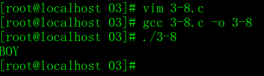

   从例子可以看出:用 putchar 函数既可以输出能在显示器上显示的字符,也可以输出控制字符.如果把常量定义为 int 对应的值为 BOY 分别对应的 ASCII的值显示结果仍不变.

   字符类型也属于整数类型,因此将一个字符赋给字符变量和将字符的 ASCII 代码赋给字符变量作用是完全相同的( 但应注意,整型数据应在 0 ~ 127 的范围内 ).putchar 函数时输出字符的函数,它输出的是字符而不能输出整数.

   > **说明:**	putchar(c) 中的 c 可以是字符常量,整型常量,字符变量或整型变量( 其值在字符的 ASCII 代码范围内 ).可以用 putchar 函数输出转移字符.

2. 用 getchar 函数输入一个字符

   为了向计算机输入一个字符,可以调用系统函数库中的 getchar 函数( 字符输入函数 ). 

   getchar 函数的一般形式为

   <span style=color:#ff1100>**getchar()**</span>

   getchar 是 get character ( 取得字符 )的缩写,getchar 函数没有参数,它的作用是从计算机终端输入一个字符,即计算机获得一个字符.getchr 函数的值就是从输入设备得到的字符.getchar 函数只能接收一个字符.如果想输入多个字符就要用多个 getchar 函数.

   **例 3.9**	从键盘输入 BOY 3 个字符,然后把它们输出到屏幕.

   **解题思路:**	用 3 个 getchar 函数先后从键盘向计算机输入 BOY 3 个字符,然后用 putchar 函数输出.

   **编写程序:**

   ```c
   #include <stdio.h>int main(){	char a,b,c;	a=getchar();	b=getchar();	c=getchar();	putchar(a);	putchar(b);	putchar(c);	putchar('\n');	return 0;}
   ```

   **运行结果:**

   

   > **注意:**	在连续输入 BOY 并按 Enter 键后,字符才送到计算机中,然后输出 BOY 3 个字符.
   >
   > **说明:**	再用键盘输入信息时,并不是在键盘上敲一个字符,该字符就立即送到计算机中去的.这些字符先暂存在键盘的缓冲器中,只有按了 Enter 键才把这些字符一起输入到计算机中,然后按先后顺序分别赋给相应的变量.

   如果在运行时,在输入一个字符后马上按 Enter 键,输入字符 B 后马上按 Enter ,再输入字符 O ,按 Enter.立即会分两行输出 B 和 O.

   

   第 1 行输入的不是一个字符 B ,而是两个字符:B 和换行符,其中字符 B 赋给了变量 a ,换行符赋给了变量 b.第 2 行接着输入两个字符: O 和 换行符,其中字符 O 赋给了变量 c,换行符没有送入任何变量.在用 putchar 函数输出变量 a,b,c 的值时,就输出了字符 B ,然后输出换行,在输出字符 O,然后执行 putchar(‘\n’),换行.

   > **注意:**	执行 getchar 函数得到的字符可以赋给一个字符变量或整型变量,也可以不付给任何变量,而作为表达式的一部分,在表达式中利用它的值.例如,例3.9可以改写如下:
   >
   > ```c
   > #include <stdio.h>int main(){putchar(getchar());putchar(getchar());putchar(getchar());putchar('\n');return 0;}
   > ```
   >
   > 也可以在 printf 函数中输出刚接收到的字符: printf(“%c”,getchar());

   **例 3.10**	改写 3.3 程序,使之可以适用于任何大写字母.从键盘输入一个大写字母,在显示屏上显示对应的小写字母.

   **解题思路:**	用 getchar 函数从键盘读入一个大写字母,把它转换为小写字母,然后用 putchar 函数输出该小写字母.

   **编写程序:**

   ```c
   #include <stdio.h>int main(){    char c1,c2;    printf("Please input:");    c1=getchar();    //scanf("%c",&c1);    c2 = c1 + 32;    putchar(c2);    putchar('\n');    //printf("%c",c2);    //printf("%d",c2);    return 0;}
   ```

   **运行结果:**

   

   > **说明:**	如果使用汉化的 C 编译系统,可以在 printf 函数的格式字符传中包含汉字,在输出时就能显示汉字,以增加可读性.
   >
   > **思考:**	可以用 printf 函数和 scanf 函数输入或输出字符,也可以用字符输入输出函数输入或输出字符,请比较两个方法的特点,在特定情况下用哪一种方法为宜.

   <div align="center"><font size="5" color="red">习题 3</font></div>


**思路:**	设置变量 i,p ,常量 r ,n,其中 r,p 为浮点数,利用循环求出p

```c
#include <stdio.h>int main(){    int n=10,i;    float r=0.09,p;    p=pow((1+r),n);    printf("与现在相比的倍数为%f",p);        return 0;}
```

**pow 函数:**	C 库函数 **double pow(double x, double y)** 返回 **x** 的 **y** 次幂，即 xy


**思路:**	设置常量 r1,r2,r3,r5,r0,设置变量p1,p2,p3,p5,p0

```c
#include <stdio.h>#include <math.h>int main(){    float r1=0.0414,r2=0.0468,r3=0.054,r5=0.0585,r0=0.0072,p1,p2,p3,p5,p0;    p5 = 1000 * pow((1 + r5)(5));    p2 = 1000 * pow((1 + r2)(2));    p3 = 1000 * pow((1 + r3)(3));    p1 = 1000 * pow((1 + r1)(5));    p0 = 1000 * pow((1 + r0 / 4)(4 * 5));    printf("一次存5年期的本息合计为%f.\n",p5);    printf("先存2年再存3年的本息合计为%f.\n",p2+p2*pow((1+r3)(3)));    printf("先存3年再存2年的本息合计为%f.\n",p3+p3*pow((1+r2)(2)));    printf("连续存5次1年本息合计为%f.\n",p1);    printf("活期5年本息合计为%f.\n",p0);        return 0;}
```

1095.79024	1283.06677941387136	1170.905464	


```c
#include <stdio.h>#include <math.h>int main(){    long d = 300000,p = 6000;    float r = 0.01,m;    m = log10(p/(p-d*r))/log10(1+r);    printf("需要%.1f个月才能还清\n",m);        return 0;}
```


```c
#include <stdio.h>int main(){    char c1 = 'C',c2 = 'h',c3 = 'i',c4 = 'n',c5 = 'a';    c1 = c1 + 4;    c2 = c2 + 4;    c3 = c3 + 4;    c4 = c4 + 4;    c5 = c5 + 4;    putchar(c1);    putchar(c2);    putchar(c3);    putchar(c4);    putchar(c5);    putchar('\n');        return 0;}
```


```c
#include <stdio.h>#include <math.h>int main(){    float r,h,C,S1,S2,V1,V2,pi=3.1415;    pritnf("请输入半径r及圆柱高h(输入格式为r=*h=*).\n");    scanf("r=%fh=%f",&r,&h);    C = 2 * pi * r;    S1 = pi * r * r;    S2 = 4 * S1;    V1 = 4 / 3 * S1 *r;    V2 = h * S1;    printf("半径为%.2f,圆柱高为%.2f,圆周长为%.2f,圆面积为%.2f,圆球体积为%.2f,圆柱体体积为%.2f",r,h,C,S1,S2,V1,V2);        return 0;}
```


<font color='green'>( 1 )</font>	定义字符型整型都可以

<font color='green'>( 2 )</font>	输出 ASCII 要用 printf 函数

<font color='green'>( 3 )</font>	并不是无条件等价.必须在 ASCII 范围内才等价. 

## 第 4 章 选择结构程序设计

第 3 章介绍了顺序结构程序设计.在顺序结构中,各语句是按自上而下的顺序执行的,执行完上一个语句就自动执行下一个语句,是无条件的,不必作任何判断.这是最简单的陈旭结构.实际上很多种情况下,需要根据某个条件是否满足来决定是否执行指定的操作任务,或者从给定的两种或多种操作选择其一.这就是选择结构要解决的问题.

### 4.1 选择结构和条件判断

C 语言有两种选择语句:

<font color='green'>( 1 )</font>	<span style=color:#ff1100>**if 语句**</span>	用来实现两个分钟的选择结构;

<font color='green'>( 2 )</font>	<span style=color:#ff1100>**switch 语句**</span>	用来实现多分支的选择结构.

**例 4.1**	在例 3.5 的基础上对程序进行改进.题目要求解得 ax^2^+bx+c=0 方程的根,由键盘输入 a,b,c . 假设 a,b,c 的值任意,并不保证 b^2^-4ac>=0 .需要在程序中进行判别,如果 b^2^-4ac>=0 ,就计算并输出方程的两个实根,否则就输出“方程无实根”的信息.

**解题思路:**	画出流程图,见图 4.3


**编写程序:**

```c
#include <stdio.h>#include <math.h>int main(){    double a,b,c,disc,x1,x2,p,q;	//disc 是判别式sqrt(b*b-4ac)    scanf("%lf%lf%lf",&a,&b,&c);	//输入双精度浮点型变量的值要用格式声明"%lf"    disc = b * b - 4 * a * c;    if(disc < 0)        printf("This equation hasn't real roots.\n");    else    {        p = -b / (2.0 * a);        q = sqrt(disc) / (2.0 * a);        x1 = p + q;        x2 = p - q;        printf("real roots:\nx1=%7.2f\nx2=$7.2f\n",x1,x2);    }    return 0;}
```

**运行结果:**


**程序分析:**

<font color='green'>( 1 )</font>	为提高精度以及避免在编译时出现“ 警告 ”,将所有变量定义为双精度浮点型.

<font color='green'>( 2 )</font>	在用 scanf 函数输入双精度实型数据时,不能用“ %f ”格式声明,而应当用“ %lf ”格式声明.即在格式符 f 的前面加修饰符 l ( 小写字母 ),表示是“ 长浮点型 ”,即双精度型. scanf 函数中附加字符的用法见第 3 章表 3.9. 在输出双精度实型数据时,可以用“ %f ”,” %lf “或“%m.nf ”,以指定输出的精度.

<font color='green'>( 3 )</font>	用 if 语句来实现选择结构.第 9 ~ 18 行是一个选择结构.if 语句对给定条件“ disc<0 ”进行判断后,形成两条路径,一条是执行第 10 行的输出语句,另一条是输出第 13 ~ 17 行的复合语句.

<font color='green'>( 4 )</font>	在输入数据时,输入了整数 2,4,1.而在 scanf 函数中用“ %lf ”格式声明,要求将数送到双精度变量中.在输入数字 2 之后,输入了一个非数字字符,系统就认为第 1 个数据到此结束,把整数 2 转换为双精度数,然后赋给变量 a,其他亦然.

<font color='green'>( 5 )</font>	输出实根时保留两位小数,用“ %7.2f ”格式声明,对小数点后第 3 位自动四舍五入.如果改用“ %10.6f ”格式声明,则输出:


可见实现了四舍五入,并且上下行小数点对齐.

### 4.2 用 if 语句实现选择结构

从例 4.1 可以看到:在 C 语言中选择结构主要是用 if 语句实现的.为了进一步了解 if 语句的应用,下面在举两个简单的例子.

**例 4.2**	输入两个实数,按代数值由小到大的顺序输出这两个数.

**解题思路:**	这个问题算法很简单,只要做一次比较,然后进行一次交换即可.用 if 语句实现条件判断.

关键是怎样实现两个变量的值的互换.不能把两个变量直接互换赋值,如为了将 a 和 b 对换,不能直接赋值互换,只能借助于第 3 个变量.

**编写程序:**

```c
#include <stdio.h>int main(){    float a,b,c;    printf("Please input two number:\n");    scanf("%f%f",&a,&b);    if(a > b)    {        c = a;        a = b;        b = c;    }    printf("%5.2f,%5.2f"a,b);        return 0;}
```

**运行结果:**


**程序分析:**	输入 3.6 和 -3.2 两个数给变量 a 和 b ,用 if 语句进行判断,如果 a > b,使 a 和 b 的值互换.否则不互换.请数量掌握交换两个变量的值的方法.经过 if 语句的处理后,变量 a 是小数, b 是大数.依次输出 a 和 b ,就实现了由小到大顺序的输出.

**例 4.3**	输入 3 个数a,b,c,要求按由小到大的顺序输出.

**解题思路:**	解此题的算法比上一题稍复杂一些.可以先用伪代码写出算法:

if a>b , 将 a 和 b 对换	( 交换后, a 是 a,b 中的小者 )

if a>c , 将 a 和 c 对换	( 交换后, a 是 a,c 中的小者,因此 a 是三者中最小者 )

if b>c , 将 b 和 c 对换	( 交换后, b 是 b,c 中的小者,也是三者中次小者 )

顺序输出 a,b,c.

**编写程序:**

```c
#include <stdio.h>int main(){    float a,b,c,t;    pritnf("Please input three numbers:\n");    scanf("%f%f%f",&a,&b,&c);    if(a > b)    {        t = a;        a = b;        b = t;    }    if(a > c)    {        t = a;        a = c;        c = t;    }    if(b > c)    {        t = b;        b = c;        c = t;    }    printf("%5.2f,%5.2f,%5.2f",a,b,c);        return 0;}
```

**运行结果:**


**程序分析:**	在经过第 1 次互换值后, a<=b,经过第 2 次互换值后 a<= c ,这样 a 已经是最小的( 或最小之一 ),但 b 和 c 还没有比较,还需要进行比较互换,经过第 3 次互换后,a<=b<=c.此时, a,b,c 3 个变量已按由小到大顺序排列.顺序输出 a,b,c 的值即实现了由小到大的输出.

#### 4.2.2 if 语句的一般形式

通过上面 3 个简单的例子,可以初步知道怎样使用 if 语句去实现选择结构.

if 语句的一般形式如下:

<span style=color:#ff1100>**if (表达式) 语句1**</span>

​		<span style=color:#ff1100>**[else 语句2]**</span>

if 语句中的“ 表达式 ”可以是关系表达式,甚至是数值表达式.其中最直观,最容易理解的是关系表达式.例 4.1 程序中 if(disc<0),其中的“ disc<0 ”就是一个关系表达式.所谓关系表达式就是两个数值进行比较的式子.下一节将对此进行详细的讨论.

在上面 if 语句的一般形式中,方括号内的部分( 即 else 子句 )为可选的,既可以有,也可以没有.

语句 1 和语句 2 可以是一个简单的语句,也可以是一个符合的语句,还可以是另一个 if 语句( 即在一个 if 语句中又包括另一个或多个内嵌的 if 语句 ).

根据 if 语句的一般形式,if 语句可以写成不同的形式,最常用的有以下3种形式:

<font color='green'>( 1 )</font>	<span style=color:#ff1100>**if (表达式) 语句 1**</span>	( 没有 else 子句部分)

<font color='green'>( 2 )</font>	<span style=color:#ff1100>**if (表达式)**</span>	( 有 else 子句部分)

​				<span style=color:#ff1100>**语句 1**</span>

​			<span style=color:#ff1100>**else**</span>

​				<span style=color:#ff1100>**语句 2**</span>

<font color='green'>( 3 )</font>	<span style=color:#ff1100>**if (表达式1)			语句 1**</span>	( 在 else 部分又嵌套了多层的 if 语句 )

​			<span style=color:#ff1100>**else if (表达式2)	语句 2**</span>

​			<span style=color:#ff1100>**else if (表达式3)	语句 3**</span>

​				<span style=color:#ff1100>**......**</span>

​			<span style=color:#ff1100>**else if (表达式m)	语句 m**</span>

​			<span style=color:#ff1100>**else						语句 m+1**</span>

例如:

```c
if 		(number>500) cost=0.15;else if (number>300) cost=0.10;else if (number>100) cost=0.075;else if (number>50) cost=0.05;else				cost=0
```

这种形式相当于:

```c
if(number>500)    cost=0.15;else    if(number>300)		//在if语句的else部分嵌套了一个if语句        cost=0.10;else    if(number>100)		//在内嵌的if语句的else部分又嵌套了一个if语句        cost=0.075;else    if(number>50)		//在第2层内嵌的if语句的else部分又内嵌了一个if语句        cost=0.05;else					//第3层内嵌的if语句中的else子句    cost=0
```

写成上面的“ if...else if...else if...else if...else ”形式更为直观和简洁.

> **说明:**
>
> <font color='green'>( 1 )</font>	整个 if 语句可以写在多行上,也可以写在一行上,如:
>
> if(x>0) y=1;else y=-1;
>
> 但是,为了程序的清晰,提倡写成锯齿形式.
>
> <font color='green'>( 2 )</font>	“ 语句1 ”,” 语句2 ”...” 语句m ”等是 if 语句中的“ 内嵌语句 ”.它们是 if 语句中的一部分.每个内嵌语句的末尾都应当有分号,因为分号是语句中的必要部成分.
>
> <font color='green'>( 3 )</font>	if 语句无论写在几行上,都是一个整体,属于同一个语句.不要误认为 if 部分是一个语句,else 部分是另一个语句.不要一看见分号,就一位是 if 语句结束了.在系统对 if 语句编译时,若发现内嵌语句结束,还要检查其后有无 else ,如果无 else ,就认为整个 if 语句结束,如果有 else ,则把 else 子句作为 if 语句的一部分.注意 else 子句不能作为语句单独使用,它必须是 if 语句的一部分,与 if 配对使用.
>
> <font color='green'>( 4 )</font>	“语句1”,” 语句2 ”...可以是一个简单的语句,也可以是一个包括多个语句的复合语句.
>
> <font color='green'>( 5 )</font>	内嵌语句也可以是一个 if 语句.如用 if 表示阶跃函数:
>
> $$ y=\left\{ \begin{aligned}1 & = & (x>0)\\ 0& = & (x=0)\\-1 & = & (x<0)\end{aligned} \right. $$
>
> 可以写成:
>
> if(x<0)
>
> ​	y=-1;
>
> else
>
> ​	if(x==0)
>
> ​	y=0;
>
> ​	else
>
> ​		y=1;
>
> 其流程图见图 4.4 
>
> 
>
> <font color='green'>( 6 )</font>	在 if 语句中要对给定的条件进行检查,判定所给定的条件是否成立.判断的结果是一个逻辑值“ 是 ”或“ 否 ”.例如,需要判断的条件是“ 考试是否合格 ”,答案只能有两个 “ **是** ”或“ **否** ”,而不是数值 100 等.在计算机语言中用“ **真** ”和“ **假** ”来表示“ 是 ”或“ 否 ”.

### 4.3 关系运算符合关系表达式

在例 3.1 程序中已看到,在 if 语句中对关系表达式 disc>0 进行判断.其中的“ > ”是一个比较符,用来对两个数值进行比较.在 C 语言中,比较符( 或称比较运算符 )称为<font color='red'>**关系运算符.**</font>所谓“ 关系运算 ”就是“ 比较运算 ”,将两个数值进行比较,判断其比较的结果是否符合给定的条件.例如,a>3 是一个关系表达式,大于号是一个关系运算符,如果 a 的值为 5,则满足给定的“ a>3 ”条件,因此关系表达式的值为“ 真 ”;如果 a 的值为 2,不满足“ a>3 ”条件,则称关系表达式的值为“ 假 ”.

#### 4.3.1 关系运算符及其优先次序

C 语言提供 6 种关系运算符,关于优先次序:

<font color='green'>( 1 )</font>	前 4 种关系运算符( <,<=,>,>= )的优先级别相同,后 2 种( ==,!= )也相同.前 4 种高于后 2 种.

<font color='green'>( 2 )</font>	关系运算符的优先级低于算术运算符.

<font color='green'>( 3 )</font>	关系运算符的优先级高于赋值运算符.


例如:

c > a + b	等效于	c > ( a + b )

a > b == c	等效于	( a > b ) ==c

a == b < c	等效于	a == ( b < c )

a = b > c	等效于	a = ( b > c )

#### 4.3.2 关系表达式

用关系运算符将两个数值或数值表达式连接起来的式子,称<font color='red'>**关系表达式**</font>.例如,下面都是合法的关系表达式:a > b ,a + b > b + c,( a = 3 )>( b = 5 ),’a’ < ‘b’,( a > b )>( b < c ).关系表达式的值是一个逻辑值,即“ 真 ”或“ 假 ”.表达式为“ 真 ”时表达式的值为 1.为“ 假 ”时表达式的值为 0.

### 4.4 逻辑运算符和逻辑表达式

有时要求判断的条件不是一个简单的条件,而是由几个给定简单条件组成的复合条件.就需要用到逻辑运算符 “与”( “AND” )和“ 或 ”( “OR” ).”与”( “AND” )表示复合条件必须都满足;“或”( “OR” )表示复合条件满足一个即可.

用逻辑运算符将关系表达式或其他逻辑量连起来的式子就是逻辑表达式.

#### 4.4.1 逻辑运算符及其优先次序

有 3 种逻辑运算符:与( AND ),或( OR ),非( NOT ).在 BASIC 和 Pascal 等语言中可以在程序中直接用 AND,OR,NOT 作为逻辑运算符.在 C 语言中不能在程序中直接用 AND,OR,NOT 作为逻辑运算符,而是用其他符号代替.见表 4.1.

| 运算符 |  含义  |   举例   |                 说明                  |
| :----: | :----: | :------: | :-----------------------------------: |
|   &&   | 逻辑与 |  a && b  |  如果a和b都为真,则结果为真,否则为假   |
|  \|\|  | 逻辑或 | a \|\| b |        除非a和b都为假,否则为真        |
|   !    | 逻辑非 |   ! a    | 如果a为假,则!a为真,如果a为真,则!a为假 |

“ && ”和“ || ”是双目( 元 )运算符,它要求有两个运算对象( 操作数 ),如( a > b )&&( x > y ),( a > b )||( x> y ). “ ! ”是一目( 元 )运算符,只要求有一个运算对象,如 !( a > b ).

表 4.2 为逻辑运算的“ 真值表 ”.用它表示当 a 和 b 的值为不同组合时,各种逻辑运算得到的值.

|  a   |  b   |  !a  |  !b  | a&&b | a\|\|b |
| :--: | :--: | :--: | :--: | :--: | :----: |
|  真  |  真  |  假  |  假  |  真  |   真   |
|  真  |  假  |  假  |  真  |  假  |   真   |
|  假  |  真  |  真  |  假  |  假  |   真   |
|  假  |  假  |  真  |  真  |  假  |   假   |

在一个逻辑表达式中如果包含多个逻辑运算符,例如: ! a && b || x > y && c. 按以下的优先次序:

<font color='green'>( 1 )</font>	! ( 非 ) -> && ( 与 ) -> || ( 或 ) ,即“ ! ”为三者中最高.

<font color='green'>( 2 )</font>	逻辑运算符中的 “ && ” 和 “ || ” 低于关系运算符, “ ! ” 高于算术运算符,见图 4.6


例如:

( a > b ) && ( x > y )		可写成	a > b && x > y

( a == b ) || ( x == y )		可写成	a == b || x == y

( ! a ) || ( a > b )				可写成	! a || a > b

#### 4.4.2 逻辑表达式

如前所述,逻辑表达式的值应该是一个逻辑量“ 真 ”或“ 假 ”.C 语言编译系统在表示逻辑运算结果时,以数值 1 表示“ 真 ”,以 0 代表“ 假 ”,但在判断一个量是否为“ 真 ”时,以 0 代表“ 假 ”,以非 0 代表“ 真 ”.即将一个非零的数值认作“ 真 ”.例如:

<font color='green'>( 1 )</font>	若 a = 4,则 !a 的值为 0.因为 a 的值为非 0 ,被认作“ 真 ”,对它进行“ 非运算 ”,得“ 假 ”.” 假 “以 0 代表. 

<font color='green'>( 2 )</font>	若 a = 4,b = 5,则 a && b 的值为 1.因为 a 和 b 均为非 0 ,被认为是“ 真 ”,因此 a && b 的值也为“ 真 ”,值为 1.

<font color='green'>( 3 )</font>	a 和 b 值分别为 4 和 5,a || b 的值为 1.

<font color='green'>( 4 )</font>	a 和 b 值分别为 4 和 5,!a || b 的值为 1.

<font color='green'>( 5 )</font>	4 && 0 || 2 的值为 1.

通过这几个例子可以看出,由系统给出的逻辑运算结果不是 0 就是 1,不可能是其他数值.而在逻辑表达式中作为参加逻辑运算对象可以是 0( “假” )或任何非 0 的数值( 按“真”对待 ).如果在一个表达式中不同位置上出现数值,应区分哪些是作为数值运算或关系运算的对象,哪些作为逻辑运算的对象.例如:

5 > 3 && 8 < 4 - !0

表达式自左至右扫描求解.首先处理“ 5 > 3 ”( 因为关系运算符优先于逻辑运算符&& ).在关系运算符 > 两侧的 5 和 3 作为数值参加关系运算,” 5 > 3 “的值为 1 ( 代表真 ).再进行“ 1 && 8 < 4 - !0 ”的运算,8 的左侧为 “&&”,右侧为“<”运算符,根据优先规则,应先进行“<”的运算,即先进行“8 < 4 - !0 ”的运算.现在 4 的左侧为“<”,右侧为“-”运算符,而“-”优先于“<”,因此应先进行“4 - !0 ”的运算,由于“!”的级别最高,因此先进行“!0”的运算,得到结果 1.然后进行“4-1”的运算,得到结果 3,再进行“8 < 3”的运算,得到 0,最后进行“1 && 0”的运算,得 0.

实际上,逻辑运算符两侧的运算对象不但可以是 0 和 1,或者是 0 和非 0 的整数,也可以是字符型,浮点型,枚举型或指针型的纯量型数据.系统最终以 0 和非 0 来判断它们属于“真”或“假”.例如:’c’ && ‘b’的值为 1( 因为‘c’和‘d’的 ASCII 值都不为 0,按“真”处理 ),所以 1 && 1的值为 1.可以将表 4.2 改写成表 4.3 形式

|  a   |  b   |  !a  |  !b  | a&&b | a\|\|b |
| :--: | :--: | :--: | :--: | :--: | :----: |
| 非0  | 非0  |  0   |  0   |  1   |   1    |
| 非0  |  0   |  0   |  1   |  0   |   1    |
|  假  | 非0  |  1   |  0   |  0   |   1    |
|  假  |  0   |  1   |  1   |  0   |   0    |

在逻辑表达式的求解中,并不是所有的逻辑运算符都被执行,只是在必须执行下一个逻辑运算符才能求出表达式的解时,才执行该运算符.举例如下.

<font color='green'>( 1 )</font>	a && b && c.只有 a 为真( 非0 )时,才需要判别 b 的值.只有当 a 和 b 都为真的情况下才需要判别 c 的值.如果 a 为假,就不必判别 b 和 c ( 此时整个表达式已确定为假 ).如果 a 为真,b 为假,不判别 c,见图 4.7.

<font color='green'>( 2 )</font>	a || b || c.只要 a 为真( 非0 ),就不必判断 b 和 c .只有 a 为假,才判别 b. a 和 b 都为假才判别 c 见图 4.8.


也就是说,在 <font color='green'>( 1 )</font>中,对 && 运算符来说,只有 a != 0 ( a为真 ),才继续进行右面的运算.在<font color='green'>( 2 )</font>中,对 || 运算符来说,只有 a = 0,才继续进行其右面的运算.因此,如果下面的逻辑表达式:

( m = a > b ) && ( n = c > d )

当 a=1,b=2,c=3,d=4,m 和 n 的原值为 1 时,由于 "a>b"的值为 0,因此 m=0,此时已能判定整个表达式不可能为真,不必再进行" n=c>d "的运算,因此 n 的值不是 0 而仍保持原值 1.这点一定要注意.

> **说明:**	既然关系表达式和逻辑表达式的值是 0 和 1,而且在判断一个量是否为 "真"时,以 0 代表 "假",以非 0 代表"真".那么就可以理解为什么在 if 语句中表达式可以是任何数值表达式.如:
>
> if(!x=0)语句1	//表达式是关系表达式,如果x不等一0,执行语句1
>
> if(x>0 && y>0)语句2	//表达式是逻辑表达式,如果x和y都大于0,执行语句2
>
> if(x)语句3	//表达式是变量,如果x不等于0,则条件判断结果为真,执行语句3
>
> if(1)语句4	//表达式是非0整数,条件判断结果为真,执行语句4
>
> if(0)语句5	//表达式是整数0,条件判断结果为假,不执行语句5,接着执行下一语句
>
> if(x+3.5)语句6	//表达式是实数表达式,若x+3.5不等于0,则判断结果为真,执行语句6

熟练掌握 C 语言的关系运算符和逻辑运算符后,可以巧妙地用一个逻辑表达式来表示一个复杂的条件.

例如,判别用 year 表示的某一年是否闰年,可以用一个逻辑表达式来表示.闰年的条件时符合下面二者之一:①能被 4 整除,打不能被 100 整除;②能被 400 整除,可写出逻辑表达式:(year%4==0 && year 100 != 0) || year%400 == 0

year 为整数( 年份 ),如果上述表达式值为真( 值为 1 ),则 year 为闰年;否则非闰年,可以加一个"!"用来判别非闰年: !((year%4==0 && year 100 != 0) || year%400 == 0 )若此表达式值为真<font color='green'>( 1 )</font>,则 year 为非闰年.也可以用下面逻辑表达式判别非闰年:(year%4 !=0)||(year%100 ==0 && year%400 != 0),若表达式值为真,则 year 为非闰年.请注意表达式中的括号内的不同运算符( %,!=,&&, ==)的运算优先次序.

#### 4.4.3 逻辑型变量

这是 C99 增加的一种数据类型.可以将关系运算和逻辑运算的结果存到一个逻辑型变量中,以便于分析和运算.定义逻辑变量用类型符 _Bool.如:

```c
float score;scanf("%f",&score);_Bool a,b;			//a和b被定义为逻辑型变量a = score >= 60;	//将关系表达式score>=60的值赋给逻辑变量ab = score <= 69;	//将关系表达式score<=69的值赋给逻辑变量bif(a && b)    printf("The grade is C\n");	//如果a和b为真,输出分数等级为C
```

在头文件 stdbool.h 中,将 bool 定义为 _Bool 的同义词,同时定义了两个符号常量 true 和 false ,true 代表 1,false 代表 0,用它们分别表示真和假.

如果在源文件中用 #include 指令包含了头文件 stdbool.h,那么上面的程序段可以写成

```c
float score;scanf("%f",&score);bool a,b;			//a和b被定义为逻辑型变量a = score >= 60;	//将关系表达式的值赋给逻辑变量ab = score <= 69;	//将关系表达式的值赋给逻辑变量bif(a == ture && b == ture)    printf("The grade is C\n");	//如果a和b都为真,输出分数等级为C
```

如果 score 的值在 60 与 69 之间,则 a 和 b 的值都是 true.在 if 语句中检查 a 和 b 的值是否等于 ture,如果是,则输出字符串"The garde is C".

实际上,思路与前面介绍的是相同的,用 true 和 false 比用 1 和 0 更直观些,易于理解,不易与其他数值混淆.

逻辑型变量 bool 和 true 和 false 原本是 C++ 中使用的,现在 C 把它们吸收进 C 新标准,以增加程序的可读性.但是目前使用的有些 C 编译系统并未实现此功能.

### 4.5 条件运算符和条件表达式

有一种 if 语句,当被判别的表达式的值为" 真 "或" 假 "时,都执行一个赋值语句且向同一个变量赋值.如:

```c
if(a>b)    max = a;else    max = b;
```

当 a>b 时将 a 的值赋给 max,当 a<= b 时将 b 的值赋给 max,可以看到无论 a>b 是否满足,都是给同一个变量赋值.C 提供条件运算符和条件表达式来处理这类问题.可以把上面的 if 语句改写为

```c
max = (a > b) ? a : b;
```

赋值号右侧的" (a>b)?a:b "是一个" 条件表达式 "." ? "是条件运算符.

如果 (a>b) 条件为真,则条件表达式的值等于 a;否则取值 b.如果 a 等于 5,b等于 3,则条件表达式的值就是 a 的值 5,把它赋给变量 max,因此 max 的值为 5.

条件运算符由两个符号 ( ? 和 : )组成,必须一起使用.要求有 3 个操作对象,称为三目( 元 )运算符,它是 C 语言中唯一的一个三目运算符.

条件表达式的一般形式为

<font color='red'>**表达式1 ? 表达式2 : 表达式3**</font>

它的执行过程见图 4.9.

可以这样形象地理解:先计算出表达式 1 的值,表达式 1 后面的问号表示" 该往哪里走啊? ",有两条路,如果表达式 1 的值为真( 非 0 ),自然直接到表达式 2,如果为假( 0 值 ),就绕过表达式 2,到表达式 3,如图 4.10 示意.


<font color='cornflowerblue'>**说明:**	<font color='green'>( 1 )</font>	条件运算符的执行顺序:先求解表达式 1,若为非 0 ( 真 )则求解表达式 2,此时表达式 2 的值就作为整个条件表达式的值.若表达式 1 的值为 0 ( 假 ),则求解表达式 3,表达式 3 的值就是整个条件表达式的值.赋值表达式的执行结果就是将条件表达式的值赋给 max ,也就是将 a 和 b 二者中大者赋给 max.</font>

<font color='cornflowerblue'><font color='green'>( 2 )</font>	条件运算符优先于赋值运算符,因此赋值表达式的求解过程是先求解条件表达式,再将它的值赋给 max.</font>

<font color='cornflowerblue'>条件运算符的优先级别比关系运算符和算术运算符都低.因此 max=(a>b)?a:b 括号可以不写 max=a>b?a:b 如果有 a>b?a:b+1 相当于 a>b?a:(b+1) ,而不相当于 (a>b?a:b)+1.</font>

<font color='cornflowerblue'><font color='green'>( 3 )</font>	上面的例子是利用了条件表达式的值,把它赋给一个变量 max .实际上也可以不把条件表达式的值赋予一个变量.表达式加一个分号,就成为一个独立的语句.如: a>b?(max=a):(max=b);	//表达式 2 和表达式 3 是赋值表达式,赋值表达式两侧有括号分析为什么?因为赋值的优先级低.	相当于:	if(a>b) max=a;	else max=b;	条件表达式还可以写成以下形式:	a>b?printfg("%d",a):printf("%d",b)	即" 表达式 2 "和“ 表达式 3 ”不仅可以是数值表达式,还可以是赋值表达式或函数表达式.上面条件表达式相当于以下 if ... else 语句:	if(a>b)printf("%d",a);else printf("%d",b);</font>

<font color='green'>**例 4.4**</font>	输入一个字符,判别它是否为大写字母,如果是,将它转换成小写字母;如果不是,不转换.然后输出最后得到的字符.

<font color='green'>**解题思路:**</font>	用条件表达式来处理,当字母是大写时,转换成小写字母,否则不转换.大写字母为 65 ~ 90.

<font color='green'>**编写程序:**</font>

```c
#include <stdio.h>int main(){    char a;    printf("Please input a char\n");    scanf("%c",&a);    a = (a >= 'A' && a <= 'Z')?(a + 32):a;    printf("%c\n",a);    return 0;}
```

<font color='green'>**运行结果:**</font>


<font color='green'>**程序分析:**</font>	条件表达式" (a>='A' && a<='Z')?(a+32):a "的作用是:如果字符变量 a 的值为大写字母,则条件表达式的值为 (a+32) ,即相应的小写字母,如果 a 的值不是大写字母,则条件表达式的值为 a,即不进行转换.

可以看到,条件表达式相当于一个不带关键字 if 的 if 语句,用它处理简单的选择结构可使程序简洁.

### 4.6 选择结构的嵌套

在 if 语句中又包含一个或多个 if 语句称为 <font color='red'>**if 语句的嵌套**</font>( nest ).其一般形式如下:


应当注意 if 与 else 的配对关系.else 总是与它上面的最近的未配对的 if 配对.假如写成:


编程序者把 else 写在与第 1 个if ( 外层 if )同一列上,意图是使 else 与第 1 个 if 对应,但实际上 else 是与第 2 个 if 配对,因为它们相距最近.为了避免二义性的混淆,最好使内嵌 if 语句也包含 else 部分( 如本节开头列出的形式 ),这样 if 的数目和 else 的数目相同,从内层到外层一一对应,不致出错.

如果 if 与 else 数目不一样,为实现程序设计者的思想,可以加花括号来确定配对关系.例如:


这时 " { } " 限定了内嵌 if 语句的范围,因此 else 与第一个 if 配对.

<font color='green'>**例 4.5**</font>	有一函数:

$$y=\begin{cases}-1&(x<0)\\[2ex]0&(x=0)\\[2ex]1&(x>0)\end{cases}$$

编一程序,输入一个 x 值,要求输出相应的 y 值.

<font color='green'>**解题思路:**</font>	用 if 语句检查 x 的值,根据 x 的值决定赋予 y 的值.由于 y 的可能值不是两个而是 3 个,因此不可能只用一个简单的 if 语句来实现.可以有两种方法,其算法如下:

<font color='green'>( 1 )</font>	先后用 3 个独立的 if 语句处理:

输入 x	若 x<0,则 y=-1	若 x=0,则 y=0	若 x>0,则 y=1	输入 y

<font color='green'>( 2 )</font>	用一个嵌套的 if 语句处理:

输入 x	若 x<0,则 y=-1	否则	若 x=0,则 y=0	否则( 即 x>0 ),则 y=1	输入 y

流程图表示,见图 4.11


<font color='green'>**编写程序:**</font>

采用嵌套的 if 语句处理.

```c
#include <stdio.h>int main(){    float x,y;    printf("Please input x");    scanf("%f",&x);    if(x<0)y=-1;        if(x=0)            y=0;        else            y=1;    printf("The 'y' is %f",y);    return 0;}
```

```c
#include <stdio.h>int main(){    int x,y;    printf("Please input x\n");    scanf("%f",&x);    if(x>=0)    {        if(x=0)            y=0;        else            y=1;    }    else        y=-1;    printf("x=%d,y=%d",x,y);    return 0;}
```

<font color='green'>**运行结果:**</font>


请分析本章习题第 7 题提出的问题,弄清楚嵌套 if 中 各个 if 的配对关系以及在程序中对嵌套 if 的书写格式.为了使逻辑关系清晰,避免出错,一般把内嵌的 if 语句放在外层的 else 子句中( 向程序 1 那样 ),这样由于有外层的 else 相隔,内嵌的 else 不会被误认为和外层的 if 配对,而只能与内嵌的 if 配对,这样就不会搞混.

<font color='cornflowerblue'>**注意:**	为了使程序清晰易读,写程序时对选择结构和循环结构应采用锯齿形的缩进形式,如本书例题所示那样.</font>

### 4.7 用 switch 语句实现多分支选择结构

if 语句只有两个分支可供选择,而实际问题中常常需要用到多分支的选择.例如,学生成绩分类( 85 分以上为 'A' 等,70 ~ 84 分为 'B' 等,60 ~ 69 分为 'C' 等 ),人口统计分类( 按年龄分为老,中,青,少,儿童 ),工资统计分类,银行存款分类等.当然这些都可以用嵌套的 if 语句来处理,但如果分支较多,则嵌套的 if 语句层数多,程序冗长而且可读性降低.C 语言提供 switch 语句直接处理多分支选择.

 <font color='red'>**switch 语句是多分支选择语句**</font>.用来实现如图 2.23 所示的多分支选择结构.

<font color='green'>**例 4.6**</font>	要求按照考试成绩的等级输出百分制分数段,A 等为 85 分以上,B 等为 70 ~ 84 分,C 等为 60 ~ 69 分,D 等为 60 分以下.成绩的等级由键盘输入.

<font color='green'>**解题思路:**</font>	这是一个多分支选择问题,根据百分制分数将学生成绩分为 4 个等级,如果用 if 语句来处理至少要用 3 层嵌套的 if ,进行 3 次检查判断.用 switch 语句,进行一次检查即可得到结果.

<font color='green'>**编写程序:**</font>

```c
#include <stdio.h>int main(){    char grade;    printf("Please input your grade");    scanf("%c",&grade);    printf("Your score:");    switch(grade)    {            case'A':printf("85~100\n");break;            case'B':pritnf("70~84\n");break;            case'C':printf("60~69\n");break;            case'D':printf("<60\n");break;        default:printf("enter data error!\n");    }    return 0;}
```

<font color='green'>**运行结果:**</font>


<font color='green'>**程序分析:**</font>	等级 grade 定义为字符变量,从键盘输入一个大写字母,赋给变量 grade,switch 得到 grade 的值并把它和个 case 中给定的值相比较,如果和其中之一相同( 称为匹配 ),则执行该 case 后面的语句.输出相应的信息.如果输入的字符都不匹配,就执行 default 后面的语句,输出相应字符.<font color='orange'>注意在每个 case 后面的语句中,最后都有一个 break 语句,它的作用是是流程转到 switch 语句的末尾.</font>流程图见图 4.12.


可以看到,switch 语句的作用是根据表达式的值,是流程跳转到不同的语句.switch 语句的一般形式如下:

```c
switch(表达式){    case 常量1:语句1;    case 常量2:语句2;        ...;    case 常量n:语句n;    default:语句n+1;}
```

<font color='cornflowerblue'>**说明:**</font>	

<font color='cornflowerblue'><font color='green'>( 1 )</font>	switch 后面括号内的" 表达式 ",其值的类型应为整数类型( 包括字符型 ).</font>

<font color='cornflowerblue'><font color='green'>( 2 )</font>	switch 下面的花括号内饰一个复合语句.这个复合语句包括若干语句,它是 switch 语句的预聚体.预聚体内包含过个以关键字 case 开头的语句行和最多一个以 default 开头的行.case 后面跟一个常量( 或常量表达式 ),它们和 default 的是起</font><font color='red'>标号</font><font color='cornflowerblue'>( label 或称标签,标记 )的作用,用来标志一个位置.执行 switch 语句时,先计算 switch 后面的" 表达式 "的值,然后将它与各 case 标号比较,如果与某一个 case 标号中的常量相同,流程就转到此 case 标号后面的语句.如果没有与 switch 表达式相匹配的 case 常量,流程转去执行 default 标号后面的语句.</font>

<font color='cornflowerblue'><font color='green'>( 3 )</font>	可以没有 default 标号,此时如果没有与 switch 表达式相匹配的 case 常量,则不执行任何语句,流程转到 switch 语句的下一个语句.</font>

<font color='cornflowerblue'><font color='green'>( 4 )</font>	各个 case 标号出现次序不影响执行结果.</font>

<font color='cornflowerblue'><font color='green'>( 5 )</font>	每一个 case 常量必须互不相同;否则就会出现互相矛盾的现象( 对 switch 表达式的同一个值,有两种或多种执行方案 ).</font>

<font color='cornflowerblue'><font color='green'>( 6 )</font>	case 标号志气标记的作用.在执行 switch 语句时,根据 switch 表达式的值找到匹配的入口标号,并不在此进行条件检查,在执行完一个 case 标号后面的语句后,就从此标号开始执行下去,不再进行判断.例如在例 4.6 中,如果在各 case 语句后没有 break 语句,将连续输出后面的语句.</font>


<font color='cyan'>**注意:**</font>	<font color='cyan'>一般情况下,在执行一个 case 子句后,应当用 break 语句使流程跳出 switch 结构,即终止 switch 语句的执行.最后一个 case 子句( 今为 default 子句 )中可不必加 break 语句,因为流程已到了 switch 结构的结束处.</font>

<font color='cornflowerblue'><font color='green'>( 7 )</font>	在 case 子句中虽然包含了一个以上执行语句,但可以不必花括号括起来,会自动顺序执行本 case 标号后面所有的语句.当然加上花括号也可以.</font>

<font color='cornflowerblue'><font color='green'>( 8 )</font>	多个 case 标号可以公用一组执行语句,例如:</font>

```c
case'A':case'B':case'C':printf(">60\n");break;
```

<font color='cornflowerblue'>当 grade 的值为 'A','B','C' 时都执行同一组语句,输出 ">60",然后换行.</font>

<font color='green'>**例 4.7**</font>	用 switch 语句处理菜单命令.在许多应用程序中,用菜单对流程进行控制,例如从键盘输入一个 'A' 或 'a' 字符,就会执行 A 操作,输入一个 'B' 或 'b' 字符,就会执行 B 操作.可以按以下思路编写程序.

```c
#include <stdio.h>int main(){    void action1(int,int),action2(int,int);    char ch;    int a=15,b=23;    ch=getchar();    switch(ch)    {            case'a':            case'A':action1(a,b);break;//调用action1函数执行A操作            case'b':            case'B':action2(a,b);break;//调用action2函数执行B操作            ...;        default:putchar("\a");	//如果输入其他字符,发出警告    }    return 0;}void action1(int x,int y)	//执行加法的函数{    printf("x+y=%d\n",x+y);}void action(int x,int y)	//执行乘法的函数{    printf("x*y=%d\n"x*y);}
```

这是一个非常简单的是以程序.

<font color='cyan'>在实际应用中所指定的操作可能比较复杂,在学习函数一章后,可以参照此思路设计一个简单实用的菜单.</font>

### 4.8 选择结构程序综合举例

前面已学习编写和分析过一些程序,下面再综合介绍几个包含选择结构的应用程序.

<font color='green'>**例 4.8**</font>	写一程序,判断某一年是否为闰年.

<font color='green'>**解题思路:**</font>	

<font color='green'>**程序 1:**</font>	先画出判别闰年算法的流程图,见图 4.13.用变量 leap 代表是否闰年的信息.若闰年,令 leap=1;非闰年,leap=0.最后判断 leap s会否为 1( 真 ),若是,则输出" 闰年 "信息.


<font color='green'>**编写程序:**</font>

```c
#include <stdio.h>int main(){    int year,leap;    printf("Please enter year:");    scanf("%d",&year);    if(year % 4 == 0)    {        if(year % 100 == 0)        {            if(year % 400 == 0)                leap = 1;            else                leap = 0;        }        else            leap = 1;    }    else        leap = 0;    if(leap == 1)        printf("%d is\n",year);    else        printf("%d is not\n",year);    return 0;}
```

<font color='green'>**运行结果:**</font>


<font color='green'>**程序分析:**</font>

<font color='green'>( 1 )</font>	变量 year 代表年份,leap 是一个“ 标志变量 ”,用来表示相应的年份是否为闰年.如果是闰年,就使 leap 等于 1,如果不是闰年,就使 leap 等于 0.最后检查 leap 的值,如果是 0 ,就不是闰年,输出" 非闰年 "的信息,如果不是 0,就是闰年,输出" 是闰年 "的信息.

<font color='green'>( 2 )</font>	请仔细分析程序中各层 if 与 else 的配对关系.写程序时采取锯齿形式,可以清楚地看明白嵌套关系.建议读者今后写程序时一定要采用锯齿形式.

<font color='green'>( 3 )</font>	第 21 行" if (leap) "中,如果 leap 的值为非 0 ( 例如 1 ),则 if 判断结果为真.写 if (leap)与写成 if(leap != 0)含义相同.

<font color='green'>**程序 2:**</font>	也可以将程序中第 7 ~ 20 行改写成以下的 if 语句:

```c
if(year % 4 != 0)    leap = 0;else if(year % 100 != 0)    leap = 1;else if(year % 400 != 0)    leap = 0;else    leap = 1;
```

<font color='green'>**运行结果:**</font>


<font color='green'>**程序 3:**</font>	可以用一个逻辑表达式包含所有的闰年条件,将上述 if 语句用下面的 if 语句代替:

```c
if((year % 4 == 0 && year % 100 != 0)||(year % 400 == 0))    leap = 1;else    leap = 0;
```

<font color='green'>**运行结果:**</font>


<font color='green'>**程序 4:**</font>	可以在程序中使用 C99 提供的逻辑变量和逻辑常量 true 和 false.把 leap 定义为逻辑变量,它的值只能是 true 或 false.把本例程序 1 中所有的 leap = 1 改为 leap = true,leap=0 改为 leap=false 程序如下:

```c
#include <stdio.h>#include <stdbool.h>int main(){    int year;    bool leap;    printf("Please enter year:");    scanf("%d",&year);    if(year % 4 == 0)    {        if(year % 100 == 0)        {            if(year % 400 == 0)                leap = true;            else                leap = false;        }        else            leap = true;    }    else        leap = false;    if(leap == true)        printf("%d is ",year);    else        printf("%d is not ",year);    printf("a leap year!\n");    return 0;}
```

<font color='green'>**运行结果:**</font>


<font color='green'>**程序分析:**</font>	本程序的思路与程序 1 相同,只是把 leap 定义为逻辑变量,用 true 和 false 代替 1 和 0.本程序可以看到,用逻辑变量使程序容易理解,提高可读性,减少出错机会.逻辑变量的值只能是 0 和 1 之一,如果把一个非 0 的数值赋给一个逻辑变量,会自动变为 1( true ).

<font color='green'>**例 4.9**</font>	求 $$ax^2+bx+c=0$$ 方程的解.

<font color='green'>**解题思路:**</font>	在例 4.1 中曾经写过程序,但实际上应该有以下几种可能.

①	a=0,不是二次方程

②	$$b^2-4ac=0$$,有两个相等实根

③	$$b^2-4ac>0$$,有两个不等实根

④	$$b^2-4ac<0$$,有两个共轭复根.应当以 $$p+qi$$ 和 $$p-qi$$ 的形式输出复根,其中,$$p=-b/2a,q=(\sqrt{b^2-4ac})/2a$$.

画出 N-S 流程图表示算法( 见图 4.14 )


<font color='green'>**编写程序:**</font>

```c
#include <stdio.h>#include <math.h>int main(){    int le = 0;    double a,b,c,disc,x1,x2,realpart,imagpart;    printf("Please input a,b,c:");    scanf("%lf,%lf,%lf",&a,&b,&c);    printf("The equation");    if(fabs(a) <= le - 6)        printf("is not a quadratic\n");    else    {        disc = b * b - 4 * a * c;        if(fabs(disc) <= le - 6)            printf("has two equal roots:%8.4f\n",-b / (2 * a));        else            if(disc > le -6)            {                x1 = (-b + sqrt(disc)) / (2 * a);                x2 = (-b - sqrt(disc)) / (2 * a);                printf("has distinct real roots:%8.4f and %8.4f\n",x1,x2);            }        else        {            realpart = -b / (2 * a);            imagpart = sqrt(disc) / (2 * a);            printf(" has complex roots:\n");            printf("%8.4f+%8.4f\n",realpart,imagpart);            printf("%8.4f-%8.4f\n",realpart,imagpart);        }    }    return 0;}
```

<font color='green'>**运行结果( 3次 ):**</font>

<font color='green'>( 1 )</font>	输入 a,b,c 的值 1,2,1,得到连个相等的实根.


<font color='green'>( 2 )</font>	输入 a,b,c 的值 1,2,2,得到两个共轭的复根.


<font color='green'>( 3 )</font>	输入 a,b,c 的值 2,6,1,得到两个不等的实根.


<font color='green'>**程序分析:**</font>	程序中用 disc 代表 $$b^2-4ac$$,先计算 disc 的值,以减少以后的重复计算.对于判断 $$b^2-4ac$$ 是否等于 0 时,要注意:由于 disc 是实数,而实数在计算和存储时会有一些微小的误差,因此不能直接进行如下判断:"if(disc == 0)...",因为这也可能会出现本来是零的量,由于上述误差而被判别为不等于零而导致结果错误.所以采取的办法是判别 disc 的绝对值(fabs(disc)) 是否小于一个很小的数(例如 10^-6^),如果小于此数,就认为 disc 等于 0.程序中以 realpart 代表实部 p,以 imagpart 代表虚部 q,以增加可读性.

在输出复根时,先分别计算出其实部与虚部,在 printf 函数的格式字符串中在输出虚部的格式声明( %8.4f )后面人为地加一个普通字符" i ",就能输出 "p + qi “这样的复数形式.

<font color='green'>**例 4.10**</font>	运输公司对用户计算运输费用.路程( skm )越远,每顿*千米费用越低.标准如下:

|    s<250     | 没有折扣 |
| :----------: | :------: |
|  250<=s<500  |  2%折扣  |
| 500<=s<1000  |  5%折扣  |
| 1000<=s<2000 |  8%折扣  |
| 2000<=s<3000 | 10%折扣  |
|   3000<=s    | 15%折扣  |

<font color='green'>**解题思路:**</font>	设每顿每千米货物的基本运费为 p(price 的缩写),货物重量为 w (weight 的缩写),距离为 s,折扣为 d(discount 的缩写),则总运费 f(freigth 的缩写)的计算公式为$$f=p*w*s*(1-d)$$.

经过仔细分析发现折扣的变化是有规律的:从图 4.15 可以看到,折扣的"变化点"都是 250 的倍数.利用这一特点,可以在横轴上加一种坐标 c,c 的值为 s/250. c 代表 250 的倍数.当 c<1 时,表示 s<250 ,无折扣;1<=c<2 时折扣为%2....


<font color='green'>**编写程序:**</font>

```c
#include <stdio.h>int main(){    int c,s;    float p,w,d,f;    printf("Please enter price,weigth,distance:");    scanf("%f%f%d",&p,&w,&s);    if(s >= 3000) c = 12;        else c = s / 250;    switch(c)    {        case 0: d = 0;            break;        case 1: d = 2;            break;        case 2:        case 3: d = 5;            break;        case 4:        case 5:        case 6:        case 7: d = 8;            break;        case 8:        case 9:        case 10:        case 11: d = 10;        case 12: d = 15;    }    f = p * w * s (1 - d / 100);    printf("freigth = %10.2f\n",f);        system("pause");}
```

<font color='green'>**运行结果:**</font>	

<font color='green'>**程序分析:**</font>	

<font color='green'>( 1 )</font>	解此题的关键是找出折扣 d 与距离 s 的关系.一般情况下,这类问题都是具有一定规律的,要细心观察分析,找出规律,问题变得简单了.如果的确没有什么规律,就不能以这种方式用 switch 语句处理,可以用嵌套的 if 语句处理.

<font color='green'>( 2 )</font>	c 和 s 是整型变量,因此 c=s/250 的结果为整数.当 s>=3000时,令 c=12,而不使 c 随 s 增大,这是为了在 switch 语句中便于处理,用一个 case 就可以处理所有 s>=3000 的情况.

<font color='green'>( 3 )</font>	变量名尽量采用"见名知意"的原则.如在本程序中用 price,weight,discount,freigth 等作为变量名,这样,习惯用英语的人在阅读程序是不必解释,就很容易理解各变量的含义.在本书的例题程序,由于是练习程序,并且考虑到多数读者的习惯和方便,尽量不采用较长的变量名,而用单词的首字母或缩写作为变量名.

<font color='green'>( 4 )</font>	第 6 行"printf("Please enter price,weight,discount:");"的作用是向用户提示应输入什么数据,以方便用户使用,避免出错,形成友好的界面.

<div align="center"><font size=5 color='red'>习题 4</font></div>


1. 算术运算即“四则运算”，是加法、减法、乘法、除法、乘方、开方等几种运算的统称;

   在C语言中，关系运算通常被认为是比较运算，将两个数值进行比较，判断比较结果是否符合给定的条件;

   而在C语言中，逻辑运算通常用于使用逻辑运算符将关系表达式或其它逻辑量连接起来组成逻辑表达式用来测试真假值.

2. C 语言中用 0 表示假,用非零表示真, 一个量如果等于 0 则这个量为假如果非 0 则为真.


3. <font color='green'>( 1 )</font>	7>5 && 4==5 -> 1 && 0 -> 0

   <font color='green'>( 2 )</font>	3 || 9 && -1 -> 1 || 1 -> 1

   <font color='green'>( 3 )</font>	!(3>4) && !5||1 -> 1 && 1 -> 1

   <font color='green'>( 4 )</font>	!(x=1) && (y=4) && 0 -> 0

   <font color='green'>( 5 )</font>	!7+5-1 && 4+5/2 -> 0+5-1 && 4+5/2 -> 1 && 1 -> 1

   ```c
   #include <stdio.h>int main(){    int a=3,b=4,c=5;    ptintf("%d",a+b>c&&b==c);    ptintf("%d",a||b+c&&b-c);    ptintf("%d",!(a>b)&&!c||1);    ptintf("%d",!(x=a)&&(y=b)&&0);    ptintf("%d",!(a+b)+c-1&&b+c/2);        system("pause");}
   ```

   

   

   

4. 程序如下:

   ```c
   #include <stdio.h>int main(){    int a,b,c;    printf("Please input a,b,c:\n");    scanf("%d%d%d",&a,&b,&c);    if(a>b&&a>c)    {        printf("Max is a:%d\n",a);    }    else if(b>a&&b>c)    {        printf("Max is b:%d\n",b);    }    else if(c>a && c>b)    {        printf("Max is c:%d\n",b);    }    else    {        printf("The three numbers you entered are equal!\n");    }    system("pause");}
   ```

5. 程序如下:

   ```c
   #include <stdio.h>#include <math.h>int main(){    int a,b;    printf("Please enter an integer less than 1000:\n");        while(1)    {        scanf("%d",&a);        if(fabs(a)>=1000)        {            printf("Error ! Please try again !\n");            continue;        }        else        {            b = sqrt(a);            printf("%d squared is %d\n",a,b);        }    }    system("pause");}
   ```

6. 程序如下:

   ```c
   #include <stdio.h>int main(){    float x,y;    printf("Please enter x:\n");    scanf("%lf",&x);    if(x<1)    {        printf("y = %lf\n",x);    }    else if(x >= 1 && x < 10)    {        printf("y = %lf\n",2*x-1);    }    else(x >= 10)    {        printf("y = %lf\n",3*x-11);    }    system("pause");}
   ```


7. 两个程序都不能达到要求


8. ```c
   #include <stdio.h>int main(){    int score;    char grade;    printf("Please enter your score:\n");    scanf("%d", &score);    if (score >= 90)        grade = 'A';    else if (score >= 80 && score < 90)        grade = 'B';    else if (score >= 70 && score < 80)        grade = 'C';    else if (score >= 60 && score < 70)        grade = 'D';    else if (score < 60)        grade = 'E';    printf("Your grade is %c!\n", grade);    system("pause");}
   ```

9. 先判断输入的是几位数

   分解每位数字存到相应位置

   按逆序输出

   ```c
   #include <stdio.h>int main(){    int a,b,c,d,e,f,num;    printf("Please enter a positive integer with no more than 5 digits:\n");    scanf("%d",&num);    //    while(1)//    {        if(num<0 || num>99999)        {            printf("Error!Please try again!");            continue;        }//    }    else if(num<=9)    {        printf("You entered one positive integer!");        a = num;        printf("%d",a);    }    else if(num>9 && num<=99)    {        printf("You entered two positive integers!");        b = int(num/10);        a = num - b*10;        printf("%d%d",a,b);    }    else if(num>99 && num<=999)    {        printf("You entered a three-digit positive integer!");        c = int(num/100);        b = int((num - c*100)/10);        a = num - c*100 - b*10;        printf("%d%d%d",a,b,c);    }    else if(num>999 && num<=9999)    {        printf("You entered a four-digit positive integer!");        d = int(num/1000);        c = int((num - d*1000))/100);        b = int((num - d*1000 - c*100)/10);        a = num - d*1000 - c*100 - b*10;        printf("%d%d%d%d",a,b,c,d);    }    else if(num>9999 && num<=99999)    {        printf("You entered a five-digit positive integer!");        e = int(num/10000);        d = int(num - e*10000);        c = int(num - e*10000 - d*1000);        b = int(num - e*10000 - d*1000 - c*100);        a = num - e*10000 - d*1000 - c*100 - b*10;        printf("%d%d%d%d%d",a,b,c,d,e);    }        system("pause");    }
   ```

   

   <font color='green'>**参考答案:**</font>

   ```c
   #include <stdio.h>int main( ){    long a,b,c,d,e,x;    printf("请输入 5 位数字：");    scanf("%ld",&x);    a=x/10000;        /*分解出万位*/    b=x%10000/1000;   /*分解出千位*/    c=x%1000/100;     /*分解出百位*/    d=x%100/10;       /*分解出十位*/    e=x%10;           /*分解出个位*/    if (a!=0){        printf("为 5 位数,逆序为： %ld %ld %ld %ld %ld\n",e,d,c,b,a);    } else if(b!=0) {         printf("为 4 位数,逆序为： %ld %ld %ld %ld\n",e,d,c,b);    } else if(c!=0) {         printf("为 3 位数,逆序为：%ld %ld %ld\n",e,d,c);    } else if(d!=0) {         printf("为 2 位数,逆序为： %ld %ld\n",e,d);    } else if(e!=0) {         printf("为 1 位数,逆序为：%ld\n",e);    }}
   ```

   ```c
   #include <stdio.h>int main(){ 	int n;	printf("请输入大于 10 的数字：");	scanf("%d",&n);	int x[1000];	int i=0;	int j=0;	while(n!=0)	{	    x[i]=n%10;	    n=n/10;	    i++;	}	int z=i;	printf("该数字为 %d 位数",z);	printf("\n逆序为：");	for(j=0;j<z;j++)	{	    printf("%d ",x[j]);	}}
   ```

10. 用 if 语句编程如下:

    i = 利润 bornus = 提成

    ```c
    #include <stdio.h>int main(){    long int i,bornus;    float bornus1=0.1,bornus2=0.075,bornus3=0.05,bornsu4=0.03,bornus5=0.015;bornus6=0.01,bornus;    printf("Please enter your profit:\n");    scanf("%d",&i);    if(i<=100000)    {        bornus = i*bornus1;        printf("Your bornus is %d\n",bornus);    }    else if(i>100000 && i<=200000)    {        bornus = i*bornus2+(bornus1-bornus2)*100000;        printf("Your bornus is %d\n",bornus);    }    else if(i>200000 && i<=400000)    {        bornus = i*(bornus2+bornus3)+(bornus1-bornus2)*100000;        printf("Your bornus is %d\n",bornus);    }    else if(i>400000 && i<=600000)    {        bornus = i*(bornus2+bornus3+bornus4)+(bornus1-bornus2-2*bornus3)*100000;        printf("Your bornus is %d\n",bornus);    }    else if(i>600000 && i<=1000000)    {        bornus = i*(bornus2+bornus3+bornus4+bornus5)+(bornus1-bornus2-2*bornus3-4*bornus4)*100000;        printf("Your bornus is %d\n",bornus);    }    else if(i>1000000)    {        bornus = i*(bornus2+bornus3+bornus4+bornus5+bornus6)+(bornus1-bornus2-2*bornus3-4*bornus4-6*bornus5)*100000;        printf("Your bornus is %d\n",bornus);    }    system("pause");}
    ```

    用 switch 语句编程如下:

    ```c
    int main(){    double i, bornus, bornus1 = 0.1, bornus2 = 0.075, bornus3 = 0.05, bornus4 = 0.03, bornus5 = 0.015, bornus6 = 0.01;    int c;    printf("Please enter your profit:\n");    scanf("%lf", &i);    if (i >= 1000000)    {        c = 10;    }    else    {        c = (int)i / 100000;    }    switch (c)    {    case 0:        bornus = i * bornus1;        break;    case 1:        bornus = i * bornus2 + (bornus1 - bornus2) * 100000;        break;    case 2:    case 3:        bornus = i * (bornus2 + bornus3) + (bornus1 - bornus2) * 100000;        break;    case 4:    case 5:        bornus = i * (bornus2 + bornus3 + bornus4) + (bornus1 - bornus2 - 2 * bornus3) * 100000;        break;    case 6:    case 7:    case 8:    case 9:        bornus = i * (bornus2 + bornus3 + bornus4 + bornus5) + (bornus1 - bornus2 - 2 * bornus3 - 4 * bornus4) * 100000;        break;    case 10:        bornus = i * (bornus2 + bornus3 + bornus4 + bornus5 + bornus6) + (bornus1 - bornus2 - 2 * bornus3 - 4 * bornus4 - 6 * bornus5) * 100000;        break;    }    printf("%d\n",c);    printf("Your bornus is %lf\n", bornus);    system("pause");}
    ```

11. 输入 4 个整数,要求按由小到大的顺序输出.

    ```c
    #include <stdio.h>int main(){    int a,b,c,d,t;    printf("Please enter four integers:\n");    scanf("%d%d%d%d",&a,&b,&c,&d);    if(a>b)    {        t = a;        a = b;        b = t;    }    if(a>c)    {        t = a;        a = c;        c = t;    }    if(a>d)    {        t = a;        a = d;        d = t;    }    if(b>c)    {        t = b;        b = c;        c = t;    }    if(b>d)    {        t = b;        b = d;        d = t;    }    if(c>d)    {        t = c;        c = d;        d = t;    }    system("pause");}
    ```

    

网友的分析：如果坐标在塔的范围内,那么高度是10m,在塔的范围外高度就是0m(塔外无建筑物).这个题主要就是判断输入的坐标在不在圆塔的范围之内(即任意点与圆心的距离)!

任意点之间的距离公式:$$d=(x-a)^2+(y-b)^2$$ (a,b)为圆心坐标,(x,y)为任意点坐标如果求出的d小于等于1则点在圆内,否则在圆外.

```c
#include <stdio.h>#include <math.h>int main(){    int h;    double x, y, p1, p2, p3, p4;    printf("Please enter coordinate:\n");    scanf("%lf%lf", &x, &y);    p1 = pow(x - 2.0, 2) + pow(y - 2.0, 2);    p2 = pow(x - 2.0, 2) + pow(y + 2.0, 2);    p3 = pow(x + 2.0, 2) + pow(y - 2.0, 2);    p4 = pow(x + 2.0, 2) + pow(x + 2.0, 2);    //(p1 > 1 || p2 > 1 || p3 > 1 || p4 > 1) ? h = 0 : h = 10;    if(p1 > 1 && p2 > 1 && p3 > 1 && p4 > 1)    {        h = 0;    }    else    {        h = 10;    }    printf("The building height on this point is %d\n", h);    system("pause");}
```

## 第 5 章 循环结构程序设计

### 5.1 为什么需要循环控制

前面介绍了程序中常用到的顺序结构和选择结构,但是只有这两种结构是不够的,还需要用到循环结构(或吃那个重复结构).因为在日常生活中或是在程序所处理的问题中常常遇到需要重复处理的问题.例如:

- 要向计算机输入全班 50 个学生的成绩;	(重复 50 次相同输入)
- 分别统计全班的平均成绩;				(重复 50 次相同计算)
- 求 30 个整数之和;						(重复 30 次相同加法)
- 检查 30 个学生的成绩是否合格;			(重复 30 次相同的判别)

要处理以上问题,最原始的方法是分别编写若干个相同或相似的语句或程序段进行处理.例如为了统计全班 50 个学生的平均成绩,可以先编写求一个学生平均成绩的程序段:

```c
scanf("%f,%f,%f,%f,%f",&score1,&score2,&score3,&score4,&score5);//输入一个学生 5 门课的成绩aver = (score1+score2+score3+score4+score5)/5;//求该学生的平均成绩printf("aver=%7.2f",aver);//输出该学生的平均成绩
```

然后再重复 49 次这样的操作.这种方法虽然可以实现要求,但是显然是不可取的,因为工作量大,程序冗长,重复,难以阅读和维护.

在C语言中可以用循环语句来处理上面的问题,就不需要重复执行多次程序段了.

```c
i = 1;	//设整型变量 i 初值为 1while(i <= 50)	//当 i 的值小于或等于 50 时执行花括号内的语句{   scanf("%f,%f,%f,%f,%f",&score1,&score2,&score3,&score4,&score5);//输入一个学生 5 门课的成绩	aver = (score1+score2+score3+score4+score5)/5;//求该学生的平均成绩	printf("aver=%7.2f",aver);//输出该学生的平均成绩    i++;	//每执行完一次循环使 i 的值增加1}
```

### 5.2 用 while 语句实现循环

在 5.1 节中已经看到了在 C 程序中可以用 while 语句用来实现循环结构.上面的 while 循环结构就是一个 while 语句,它的执行过程是:开始时变量 i 的值为 1,while 语句首先检查变量 i 的值是否小于或等于 50,如果是,则执行 while 后面的语句(称为<font color='red'>**循环体**</font>,在本例中是花括号内的复合语句).在循环体中先输入第一个学生 5 门课的成绩,然后求出该学生的平均成绩 aver,并输出此平均成绩,请思考最后一行 "i++;" 的作用.它使 i 的值加 1,i 的原值为 1,现在变成了 2.然后流程返回到 while 语句的开头,再检查 i 的值是否小于或等于 50,由于 i 的值 2 小于 50 ,因此又执行循环体,输入第二个学生的 5 门课成绩,然后求出第二个学生的平均成绩并输出,然后 i++ 使变量 i 的值变为 3,处理第三个学生的数据...直到处理完 50 个学生的数据后,此时变量 i 的值变为 51.因为大于 50 所以不再执行循环体.它的流程图见图 5.1.其中虚线框内为 while 循环结构.


while 语句的一般形式如下:	<font color='red'>**while (表达式) 语句**</font>

其中的"语句"就是循环体.循环体可以是一个简单的语句,也可以是复合语句.执行循环体的次数是由循环条件控制的,这个循环条件就是"表达式",它也称为<font color='red'>**循环条件表达式.**</font>当此表达式的值为"真"时,就执行循环体语句,为"假"时,就不执行循环体语句,其流程图见图 5.2.


<font color='green'>**例 5.1**</font>	求 1+2+3+···+100,即$$\sum \limits_{n=1} ^{100} n$$.

<font color='green'>**解题思路:**</font>	在处理这个问题时,先分析特点.

```c
#include <stdio.h>void main(){    int i = 1,sum = 0;    while(i <= 100)    {        sum = sum + i;        i++;    }    printf("sum = %d\n",sum);    system("pause");}
```

流程图见图 5.3


<font color='green'>**运行结果:**</font>


<font color='green'>**程序分析:**</font>	

<font color='green'>( 1 )</font>	循环体如果包含一个以上的语句,应该用花括号括起来,作为复合语句出现,如果不加花括号,则 while 语句只认为其后的一个语句为循环体.

<font color='green'>( 2 )</font>	不要忽略给 i 和 sum 赋初值.

<font color='green'>( 3 )</font>	在循环体中应有使循环趋向于结束的语句.如果没有就会造成死循环.

### 5.3 用 do···while 语句实现循环

除了 while 语句以外,C 语言还提供了用 do···while 语句来实现循环结构.如:

```c
int i = 1;		//设变量i的初值为1do				//循环结构开始{    printf("%d",i++);	//循环体,输出i的值,然后使i加1}while(i <= 100);		//当i小于等于100时,继续执行循环体
```

它的作用是:执行(do 表示"做") printf 语句,然后检查 i 的值,当 i 小于或等于 100 时,就返回再执行一次循环体,直到 i 大于 100 为止.执行此 do···while 语句的结果是输出 1 ~ 100,共 100 个数.

do···while 语句是先执行循环体,然后再检查条件是否成立,若成立再执行循环体.这是和 while 不同的.

do···while 语句的一般形式为

<font color='red'>**do**</font>

​	<font color='red'>**语句**</font>

<font color='red'>**while(表达式)**</font>

其中"语句"就是循环体.它的执行过程可以用图 5.4 表示.请注意 do···while 循环用 N-S 流程图的表示像是(图 5.4b).


<font color='green'>**例 5.2**</font>	用 do···while 语句求$$\sum \limits_{n=1}^{100} n$$.

<font color='green'>**编写程序:**</font>

```c
#include <stdio.h>void main(){    int i = 1,sum = 0;        do    {        sum = sum +i;        i++;    }    while(i <= 100);    printf("sum = %d\n",sum)    system("pause");}
```

<font color='green'>**运行结果:**</font>


其流程图见图 5.5.


<font color='green'>**程序分析:**</font>	

我们可以看到,对于同一个问题可以用 while 语句处理,也可以用 do···while 语句处理.结构可以互相转换.如图 5.4 可以改画成图 5.6 形式,而图 5.6 中虚线框部分就是一个 while 结构.可见 do···while 结构是由一个"语句"加一个 while 结构构成的.若图 5.2 中表达式值为真,则图 5.2 也与图 5.6 等价(因为都要先执行一次语句).

一般情况下,用 while 语句和用 do···while 语句处理统一问题时,若二者的循环体部分是一样的,那么结果也一样.但如果 while 后面的表达式一开始就为假时,两种循环的结果是不同的.


<font color='green'>**例 5.3**</font>	while 和 do···while 循环比较.

<font color='green'>( 1 )</font>	用 while 循环

```c
#include <stdio.h>int main(){    int i,sum=0;    printf("Please enter i:\n");    scanf("%d",&i);    while(i <= 10)    {        sum = sum + i;        i++;    }    printf("sum = %d\n",sum);    system("pause");}
```

<font color='green'>**运行结果(两次):**</font>


<font color='green'>( 2 )</font>	用 do···while 循环

```c
#include <stdio.h>int main(){    int i,sum = 0;    printf("Please enter i :\n");    scanf("%d",&i);    do    {        sum = sum + i;        i++;    }    while(i <= 10);    printf("sum = %d\n",sum);    system("pause");}
```

<font color='green'>**运行结果(两次):**</font>


可以看到当 i 小于等于 10 时结果相同,但是当 i 大于 10 时结果不同.因为此时 while 一次也不执行循环体,但是 do···while 至少要执行一次循环体,所以结果不同.

### 5.4 用 for 语句实现循环

除了可以用 while 语句和 do···while 语句实现循环外,C 语言还提供 for 语句实现循环,而且 for 语句更为灵活,不仅可以用于循环次数已经确定的情况,还可以用于循环次数不确定而只给出循环结束条件的情况,它完全可以代替 while 语句.例如:

```c
for(i = 1;i <= 100;i++)		//控制循环次数,i由1变到100,共循环100次{    printf("%d",i);			//执行循环体,输出i的当前值}
```

它的执行过程见图 5.7.它的作用是:输出 1 ~ 100 ,共 100 个数.


for 语句的一般形式为

<font color='red'>**for(表达式1;表达式2;表达式3)**</font>

​	<font color='red'>**语句**</font>

3 个表达式的主要作用是:

<font color='red'>**表达式1:**</font>	设置初始条件,只执行一次.可以为零个,一个或多个变量设置初值.

<font color='red'>**表达式2:**</font>	是循环条件表达式,用来判定是否继续循环.在每次执行循环体前先执行此表达式,决定是否继续执行循环.

<font color='red'>**表达式3:**</font>	作为循环的调整,例如使循环变量增值,它是在执行完循环体后才进行的.

这样,for 语句就可以理解为

<font color='red'>**for(循环变量赋初值;循环条件;循环变量增值)**</font>

​	<font color='red'>**语句**</font>

例如:

```c
for(i = 1;i <= 100;i++)    sum = sum + i;
```

其中的"i = 1"是给循环变量 i 设置初值为 1,"i <= 100"是指定循环条件:当循环变量 i 的值小于或等于 100 时,循环继续执行."i++"的作用是使循环变量 i 的值不断变化,以便最终满足终止循环的条件,使循环结束.

for 语句的执行过程如下:

<font color='green'>( 1 )</font>	先求解表达式1.本例中把整数 1 赋给变量 i.

<font color='green'>( 2 )</font>	求解表达式2,若此条件表达式的值为真(非0),则执行 for 语句中循环体,然后执行第<font color='green'>( 3 )</font>步.若为假(0),则循环结束,转到第<font color='green'>( 5 )</font>步.

<font color='green'>( 3 )</font>	求解表达式3.

<font color='green'>( 4 )</font>	转回步骤<font color='green'>( 2 )</font>继续执行.可以用图 5.8 来表示 for 语句的执行过程.


<font color='green'>( 5 )</font>	循环结束,执行 for 语句下面的一个语句.

> <font color='green'>**说明:**</font>
>
> <font color='green'>( 1 )</font>	for 语句的一般形式
>
> <font color='red'>**for(表达式1;表达式2;表达式3) 语句**</font>
>
> 可以改写为 whlie 循环的形式:
>
> <font color='red'>**表达式 1;**</font>
>
> <font color='red'>**while 表达式 2**</font>
>
> {
>
> ​	<font color='red'>**语句**</font>
>
> ​	<font color='red'>**表达式 3**</font>
>
> }
>
> 二者无条件等价.
>
> <font color='green'>( 2 )</font>	"表达式 1"可以省略,即不设置初值,但"表达式 1"后的分号不能省略.例如:
>
> ```c
> for(;i <= 100;i++) sum = sum + i;	//for语句中没有表达式1
> ```
>
> 应当注意:由于省略了"表达式 1",没有对循环变量赋初值,因此为了能正常执行循环,应在 for 语句之前给循环变量赋初值.即
>
> ```c
> i = 1;		//对循环变量i赋初值for(;i <= 100;i++) sum = sum + i;	//for语句中没有表达式1
> ```
>
> 执行 for 语句时,跳过图 5.8中的"求解表达式"这一步.由于在 for 语句前加了"i = 1"因此其作用仍然不变.
>
> <font color='green'>( 3 )</font>	"表达式 2"也可以省略,即不用"表达式 2"来作为循环条件表达式,不设置和检查循环的条件.如:
>
> ```c
> for(i = 1; ;i++) sum = sum + i;
> ```
>
> 此时循环无终止地进行下去,也就是认为表达式 2 始终为真,见图 5.9.
>
> 
>
> 它相当于
>
> ```c
> i = 1;while(1){sum = sum + i;i++}
> ```
>
> 循环无终止地进行,i 的值不断加大,sum 的值也不断累加.
>
> <font color='green'>( 4 )</font>	表达式 3 也可以省略,但此时程序设计者应另外设法保证循环能正常结束.例如:
>
> ```c
> for(i = 1;i <= 100;)	//没有表达式 3{sum = sum + i;i++;				//这时可以在循环体中使循环变量增值}
> ```
>
> 在上面的 for 语句中只有表达式 1 和 2 ,而没有表达式 3.i++ 的操作不放在表达式 3 的位置,而作为循环体的一部分,效果是一样的,都使循环正常结束.如果在循环体中无此"i++;"语句,则循环体无止境地执行下去.
>
> <font color='green'>( 5 )</font>	如果表达式 1 和表达式 2 都没有,只有表达式 2,即只给循环条件,情况会怎样?如:
>
> ```c
> for(;i <= 100;)			//没有表达式1和2{sum = sum + i;i++;				//在循环体中使循环变量增值}
> ```
>
> 当然,应当在for语句前给循环变量赋初值,否则循环无法正常执行.即:
>
> ```c
> i = 1;					//给循环变量赋初值for(;i <= 100;)			//没有表达式1和表达式3,只有表达式2{sum = sum + i;i++;				//在循环体中使循环变量增值}
> ```
>
> 相当于:
>
> ```c
> i = 1;while(i <= 100){sum = sum + i;i++;}
> ```
>
> 可见 for 语句比 while 语句功能强,除了可以给出循环条件外,还可以赋初值,式循环变量增值等.
>
> <font color='green'>( 6 )</font>	甚至可以将 3 个表达式都省略,例如:
>
> ```c
> for(; ;)printf("%d\n",i);
> ```
>
> 相当于
>
> ```c
> whlie(1) printf("%d\n",i);
> ```
>
> 既不设初值,不判断条件(认为表达式 2 为真值),循环变量不增值.无终止地执行循环体语句.显然没有实用价值.
>
> <font color='green'>( 7 )</font>	表达式 1 可以是设置循环变量初值的赋值表达式,也可以是与循环变量无关的其他表达式.例如:
>
> ```c
> for(sum = 0;i <= 100;i++) sum = sum + i;
> ```
>
> 表达式 3 也可以是与循环控制无关的任意表达式.但不论怎样写 for 语句,都必须使循环能正常执行.
>
> <font color='green'>( 8 )</font>	表达式 1 和 3 可以是一个简单的表达式,也可以是一个逗号表达式,即包含一个以上的简单表达式用逗号间隔.如:
>
> ```c
> for(sum = 0,i = 1;i <= 100;i++) sum = sum + i;
> ```
>
> 或
>
> ```c
> for(i = 0,j = 100;i <= j;i++,j--) k = i + j;
> ```
>
> 表达式 1 和 3 都是逗号表达式,各包含两个赋值表达式,即同时设两个初值(i = 0,j = 100),使两个变量增值(i++,j--),执行情况见图 5.10.
>
> 
>
> 在逗号表达式内按自左至右顺序求解,整个逗号表达式的值为最右边的表达式的值.例如:
>
> ```c
> for(i = 1;i <= 100;i++,i++) sum = sum +i;
> ```
>
> 相当于
>
> ```c
> for(i = 1;i <= 100;i + 2) sum = sum + i;
> ```
>
> <font color='green'>( 9 )</font>	表达式 2 一般是关系表达式(如i<=100)或逻辑表达式(如a<b && x<y),但也可以是数值表达式或字符表达式,只要其值为非零,就执行循环体.分析下面两个例子:
>
> ①	for(i = 0;(c = getchar()) != ‘\n’;i += c);
>
> 在表达式 2 中先从终端接收一个字符赋给 c,然后判断此赋值表达式的值是否等于'\n'(换行符),如果不等于'\n'就执行循环体.此 for 语句的执行过程见图 5.11,它的作用是不断输入字符,将它们的 ASCII 码相加,直到输入一个换行符为止.
>
> 
>
> <font color='green'>**注意**</font>:此 for 语句的循环体为空语句,把本来要在循环内处理的内容放在表达式 3 中,作用是一样的.可见 for 语句功能强,可以在表达式这种完成本来应在循环体内完成的操作.
>
> ②	for(;(c = getchar()) != ‘\n’;)
>
> ​			printf(“%c”,c);
>
> for 语句中只有表达式 2 ,没有表达式 1 和 3.其作用是每读入一个字符后立即输出该字符,直到输入一个换行符为止.
>
> 运行情况:
>
> 
>
> <font color='green'>( 10 )</font>	C 99 允许在 for 语句的"表达式 1"中定义变量并赋初值,如:
>
> ```c
> for(int i = 1;i <= 100;i++)		//定义循环变量i,同时赋初值1sum = sum + 1;
> ```
>
> 显然,这可以使程序简练,灵活方便.但应注意:所定义的变量的有效范围只限于 for 循环中,在循环外不能使用此变量.

从上面介绍可以知道,C 语言的 for 语句使用十分灵活,变化多端,通过它培养灵活使用 C 语言的能力.

C 语言的 for 语句比其他语言中的 for 语句功能强的多,可以把循环体和一些与循环控制无关的操作也作为表达式 1 和 3出现,这样程序可以短小简洁.但应注意:过分地利用这一特点会使 for 语句显得杂乱,可读性降低,最好不要把与循环控制无关的内容放到 for 语句中.

### 5.5 循环的嵌套

一个循环体内又包含另一个完整的循环结构,称为<font color='red'>循环的嵌套</font>.内嵌的循环中还可以嵌套循环,这就是多层循环.各种语言中关于循环的嵌套概念都是一样的.

3 种循环可以互相嵌套.例如,下面几种都是合法形式:


### 5.6 几种循环的比较

<font color='green'>( 1 )</font>	3 种循环都可以用来处理同一问题,一般情况下它们可以互相代替.

<font color='green'>( 2 )</font>	在 while 循环和 do···while 循环中,只在 while 后面的括号内指定循环条件,因此为了使循环能正常结束,应在循环体中包含使循环趋于结束的语句(如i++,或i=i+1等).

for 循环可以在表达式 3 中包含使循环趋于结束的操作,甚至可以将循环体中的操作全部放到表达式 3 中.因此 for 语句的功能更强,凡用 while 循环能完成的,用 for 循环都能实现.

<font color='green'>( 3 )</font>	用 while 和 do···while 循环时,循环变量的初始化操作应在 while 和 do···while 语句之前完成.而 for 语句可以在表达式 1 中实现循环变量的初始化.

<font color='green'>( 4 )</font>	while 循环,do···while 循环和 for 循环,都可以用 break 语句跳出循环,用 continue 语句结束本次循环.

### 5.7 改变循环执行的状态

以上介绍的都是根据事先指定的循环条件正常执行和终止的循环.但有时当出现某种情况,需要提早结束正在执行的循环操作.例如,征集募捐,收到 10 万元就结束.可以用循环来处理此问题,每次输入一个捐款人的捐款数,不断累加.但是,事先并不能确定循环的次数,需要每次输入捐款数后进行累加,并检查总数是否达到 10 万元,如果未能达到,就继续执行循环,输入下一个捐款数,如果达到 10 万元,就终止循环.可以用 break 语句和 continue 语句来实现提前结束循环.

#### 5.7.1 用 break 语句提前终止循环

在 4.4 节中已经介绍过用 break 语句可以使流程跳出 switch 结构,继续执行 switch 语句下面的一个语句.实际上,break 语句还可以用来从循环体内跳出循环体,即提前结束循环,接着执行循环下面的语句.

例如上面统计捐款的例子,可以用以下的程序处理.

<font color='green'>**例 5.4**</font>	在全系 1000 学生中,征集募捐,当总数达到 10 万元时,就此结束,统计此时捐款的人员,以及平均每人捐款的数目.

<font color='green'>**编程思路:**</font>	显然应该用循环来处理.实际循环的次数事先不能确定,可以设为最大值,即 1000(最多会有 1000 人捐款),在循环体中累计捐款总数,并用 if 语句检查是否达到 10 万元,如果达到就不再继续执行循环,终止累加,并计算人均捐款数.在程序中定义变量 amount ,用来存放捐款数,变量 total ,用来存放累加后的总捐款数,变量 aver ,用来存放人均捐款数,以上 3 个变量均为单精度浮点型.定义整型变量 i 作为循环变量.定义符号常量 SUM 代表 100000.

<font color='green'>**编写程序:**</font>

```c
#include <stdio.h>#define SUM 100000void main(){    float amount,aver,total;    int i;    for(i = 1,total = 0;i <= 1000;i++)    {        printf("请输入捐款金额:\n");        scanf("%f",&amount);        total = amount + total;        if(total >= SUM) break;    }    aver = total / i;    printf("捐款总额:%f\n捐款人数:%d\n平均捐款:%f\n感谢大家的付出!!!\n",total,i,aver);    system("pause");}
```

<font color='green'>**运行结果:**</font>


<font color='green'>**程序分析:**</font>	for 语句本来指定执行循环体 1000 次.在每一次循环中,输入一个捐款人的捐款数,然后把它累加到 total 中,如果没有 if 语句,则执行循环体 1000 次.现在设置一个 if 语句,在每次累加 amount 后,立即检查 total 是否超过了 SUM 如果没有就继续执行循环体,如果超过就执行 break 语句提前结束循环.

break 语句的一般形式为

<font color='red'>**break**</font>

其作用是使流程跳到循环体之外,接着执行循环体下面的语句.

> 注意:break 语句只能用于循环语句和 switch 语句之中,而不能单独使用.

#### 5.7.2 用 continue 语句提前结束本次循环

有时并不希望终止整个循环的操作,而只是希望提前结束本次循环,而接着执行下次循环.这时可以用 continue 语句.

<font color='green'>**例 5.5**</font>	要求输出 100 ~ 200 之间的不能被 3 整除的数.

<font color='green'>**编程思路:**</font>	显然需要对 100 ~ 200 之间的每一个整数进行检查,如果不能被 3 整除,就输出此数,若能被 3 整除,就不输出.无论是否输出此数,都要接着检查下一个数(直到 200 为止).可以画出流程图,见图 5.12.


从图 5.12 可以看出:不论 n 是否能被 3 整除,循环的次数总是 101 次,不会改变.

<font color='green'>**编写程序:**</font>

```c
#include <stdio.h>int main(){    int n;    for(n = 100;n <= 200;n++)    {        if(n % 3 == 0)            continue;        printf("%d",n);    }    putchar('\n');    system("pause");    return 0;}
```

<font color='green'>**运行结果:**</font>


<font color='green'>**程序分析:**</font>	当 n 能被 3 整除时,执行 continue 语句,流程跳转到表示循环体结束的右花括号的前面(注意不是花括号的后面),从图 5.12 可以看到:流程跳过 printf 函数语句,结束本次循环,然后进行循环变量的增值,只要 n <= 200,就会接着执行下一次循环,如果 n 不能被 3 整除,就不会执行 continue 语句,而执行 printf 函数语句,输出不能被 3 整除的整数.

当然,也可以不用 continue 语句,而改用一个 if 语句处理:

```c
if(n % 3 != 0) printf("%d",n);
```

效果一样,用 continue 语句无非为了说明 continue 的作用.

continue 语句的一般形式

<font color='red'>**continue;**</font>

其作用为结束本次循环,即跳过循环体中下面尚未执行的语句,转到循环体结束点之前,接着执行 for 语句中的"表达式 3",然后进行下一次是否执行循环的判定.

#### 5.7.3 break 语句和 continue 语句的区别

continue 语句只结束本次循环,而不是终止整个循环的执行.而 break 语句则是结束整个循环过程,不再判断执行循环的条件是否成立.如果有以下两个循环结构:

① while(表达式 1)			② while(表达式 1)

​	{							{

​		···						···

​	if(表达式 2) break;			if(表达式 2) continue;

​		···						···

​	}							}

程序 ① 的流程图如图 5.13 所示,而程序 ② 的流程图如图 5.14 所示.请注意两图中当表达式2为真时流程的转向.


如果是双重循环,在内循环体内有一个 break 语句,请思考:是提前终止内循环,还是提前终止整个循环?结论是前者,即只提前终止内循环.

<font color='green'>**例 5.6**</font>	输出以下 4*5 的矩阵.

​	1	2	3	4	5

​	2	4	6	8	10

​	3	6	9	12	15

​	4	8	12	16	20

<font color='green'>**解题思路:**</font>	可以用循环嵌套来处理此问题,用外循环来输出一行数据,用内循环来输出一列数据.要注意设法输出矩阵的格式.

<font color='green'>**编写程序:**</font>

```c
#include <stdio.h>void main(){    int i,j;    for(i = 1;i <= 4;i++)    {        for(j = 1;j <= 5;j++)        {            printf("%d  ",i * j);        }        printf("\n");    }    system("pause");}
```

<font color='green'>**运行结果:**</font>


### 5.8 循环程序举例

前面仔细分析了循环结构的特点和实现方法,下面通过例子进一步掌握循环程序的辨析和应用,特别是学习与循环有关的算法.

<font color='green'>**例 5.7**</font>	用$$\frac{\pi}{4}\approx1-\frac{1}{3}+\frac{1}{5}-\frac{1}{7}+···$$公式求 π 的近似值，直到发现某一项的绝对值小于 10^-6^ 为止(该项不累加).

<font color='green'>**解题思路:**</font>	这是求 π 值的近似方法的一种.求 π 值可以用不同的近似方法.如下面的表达式都可以用来求 π 的近似值:
$$
\pi\approx\frac{22}{7}\\
\frac{\pi^2}{6}\approx\frac{1}{1^2}+\frac{1}{2^2}+\frac{1}{3^2}+···+\frac{1}{n^2}\\
\frac{\pi}{2}=\frac{2\times2}{1\times3}\times\frac{4\times4}{3\times5}\times\frac{6\times6}{5\times7}\times···\times\frac{(n-1)^2}{n\times(n+2)}
$$
不同的方法求出的结果不完全相同(近似程度不同).因此用计算机解题时,首先应当确定用哪种方法来实现计算.现在,题目已确定要求用以下公式:

$$\frac{\pi}{4}\approx1-\frac{1}{3}+\frac{1}{5}-\frac{1}{7}+···$$

求 π 的近似值.也就是说,计算方法确定了,但是怎么去求出这个多项式的方法和步骤并未解决.例如,有的人按次序一项一项计算和加(减),有的人把符号为正的各项(即奇数项)相加,再把符号为负的各项(即偶数项)相加,最后再把两者相加得到结果.有的人用笨办法一项一项相加,有的人用循环来处理.计算机是不会自动选择采用哪种方法和哪些步骤的,必须由人来指定每一个执行步骤,计算机只是忠实地执行而已.这就是算法要解决的问题.

为解决一个问题,可以有多种算法,当然希望能设计出较好的算法.可以看出:$$\frac{\pi}{4}$$ 的值是由求一个多项式的值来得到的.这个多项式从理论上说包含无穷项.包含的项数越多,近似程度就越高.但是在实际运算时不可能加(减)到无穷项,只能在近似程度和效率之间找到一个平衡点.题目已明确,当多项式中的某一项的绝对值小于 10^-6^ 时,就认为足够近似了,可以据此计算出 π 的近似值了.

现在问题的关键是用什么方法能最简便地求出多项式的值.显然,谁也不会像小学生那样一项一项一次求出各项的值,然后把它们相加.应当利用计算机的特点,用一个循环来处理就能全部解决问题.经过仔细分析,发现多项式的各项是有规律的:

①	每项的分子都是1;

②	后一项的分母是前一项的分母加2;

③	第一项的符号为正,从第二项起,每一项的符号与前一项的符号相反.

规律找到后就用循环来处理.例如前一项的值是$$\frac{1}{n}$$,则可以推出下一项为$$-\frac{1}{n+2}$$,其中分母中$$n+2$$的值是上一项分母 n 再加上 2 .后一项的符号则与上一项符号相反.

在每求处一项后,检查它的绝对值是否大于或等于 10^-6^ ,如果是继续求下一项,如果不是则不必再求下一项了.认为足够近似了.

可以用 N-S 结构化流程图表示算法(见图 5.15).


<font color='green'>**编写程序:**</font>

```c
#include <stdio.h>#include <math.h>int main(){    int sign = 1;	//sign用来表示数值的符号    double pi = 0.0,n = 1.0,term = 1.0;	//pi开始代表多项式的值,最后代表π的值,n代表分母,term代表当前项的值        while(fabs(term) >= 1e-9)	//检查当前项的绝对值是否大于或等于10的-6次方    {        pi = pi +term;	//把当前项累加到pi中        n = n + 2;		//n+2是下一项的分母        sign = -sign;	//sign代表符号,下一项与上一项符号相反        term = sign / n;//求出下一项trem的值    }    pi = pi * 4;	//多项式的和pi乘以4才是π的近似值    printf("π = %10.8f\n",pi);	//输出 π 的近似值    system("pause");    return 0;}
```

<font color='green'>**运行结果:**</font>


<font color='green'>**程序分析:**</font>

<font color='green'>( 1 )</font>	fabs 是求绝对值的函数,在 C 库函数中,有两个求绝对值的函数,一个是 abs(x),求整数 x 的绝对值,结果是整型.另一个是 fabs(x),x 是双精度数,得到的结果是双精度型.

<font color='green'>( 2 )</font>	输出格式改为"%10.6f",则输出为 3.141591,对第 7 位小数四舍五入.请读者补充程序,统计出执行循环体多少次.

<font color='green'>**例 5.8**</font>	求 Fibonacci 数列的前 40 个数.这个数列有如下特点:第 1,2 两个数为 1,1.从第 3 个数开始,该数是其前面两个数之和.即:
$$
\begin{cases}
 F_1=1\ (n=1) \\[2ex] 
 F_2=1\ (n=2) \\[2ex] 
 F_n=F_{n-1}+F_{n-2}\ (n\geq3) \\[2ex] 
\end{cases}
$$
这是一个有趣的古典数学问题:有一对兔子,从出生后第3个月起每个月都生一对兔子.小兔子长到第3个月后又生一对兔子.假设所有兔子都不死,问每个月的兔子总数为多少?

可以从表 5.1 看出兔子繁殖的规律.


可以看到每个月的兔子总数一次为1,1,2,3,5,8,13···这就是Fibonacci数列( 斐波纳契).

<font color='green'>**解题思路:**</font>	最简单易懂的方法是,根据题意,从前两个月的兔子数退出第 3 个月的兔子数.设第 1 个月的兔子数 f1=1,第 2 个月的兔子数 f2=1,则第 3 个月的兔子数 f3=f1+f2=2.当然可以在程序中继续写...但这样程序烦琐冗长.应当善于利用循环来处理,这样就要重复利用变量名,一个变量名在不同时间代表不同月的兔子数.

N-S 流程图 5.16所示.


<font color='green'>**编写程序:**</font>

```c
#include <stdio.h>int main(){    int f1=1,f2=1,f3,i=1;    printf("%12d\n%12d\n",f1,f2);        for(;i <= 38;i++)    {        f3 = f1 + f2;        printf("%12d\n",f3);        f1 = f2;        f2 = f3;    }    system("pause");    return 0;}
```

<font color='green'>**运行结果:**</font>


<font color='green'>**程序改进:**</font>	可以不使用 f3 直接将结果存入 f1 中,这样就可以一次求出两个月的结果 f1=f1+f2;f2=f2+f1;

```c
#include <stdio.h>int main(){    int f1=1,f2=1,i;    for(i = 1;i <= 20;i++)    {        printf("%12d\t%12d",f1,f2);        if(i%2 == 0)	//i为双数时执行换行,即4个数字一行            printf("\n");        f1 = f1 + f2;        f2 = f2 + f1;    }    system("pause");    return 0;}
```


<font color='green'>**例 5.9**</font>	输入一个大于 3 的整数 n,判定它是否为素数(prime,又称质数)

<font color='green'>**解题思路:**</font>	采用的算法是,让 n 被 i 除(i 的值从 2 变到 n-1),如果 n 能被 2 ~ (n-1) 之中的任何一个整数整除,则表示 n 肯定不是素数,不必再继续被后面的整数除,因此可以提前结束循环.分别用传统流程图和 N-S 流程图表示算法(见图 5.18).


<font color='green'>**编写程序:**</font>

```c
#include <stdio.h>int main(){    int i,n;    printf("Please enter an integer greater than 3:\n");    scanf("%d",&n);    for(i = 2;i <= n - 1;i++)        if(n % i == 0) break;        if(i<n) printf("%d is not a prime number!\n",n);        else printf("%d is a prime number\n",n);    system("pause");    return 0;}
```

<font color='green'>**运行结果:**</font>


<font color='green'>**程序分析:**</font>	在图 5.18 中可以看到,如果 n 能被 2 ~ (n-1)之间的一个整数整除(例如, n=18,i=2时,n能被 2 整除),此时执行 break 语句,提前结束循环,流程跳转到循环体之外.那么,怎样判定 n 是否素数从而输出相应的信息呢?关键是看结束循环时 i 的值是否小于 n ,如果 n 能被 2 ~ (n-1)之间的一个整数整除,则必然是由 break 语句导致循环提前结束,即 i 并未达到 n 的值时,循环就终止了.显然此时 i<n.如果 n 不能被 2 ~ (n-1)之间的任何一个整数整除,则不会执行 break 语句,循环变量 i 一直变化到等于 n ,然后由第 1 个判断框判定"i<=n-1"条件不成立,从而结束循环.这种正常结束的循环.其循环变量的值必然大于实现指定的循环变量终值(本例中循环变量终值为 n-1).

因此只要在循环结束后检查循环变量 i 的值,就能判定循环是不是提前结束还是正常结束的.如果是正常结束(i=n),则 n 就是素数,如果是提前结束的,则表明是由于 n 被 i 整除而执行了 break 语句,显然不是素数.

<font color='green'>**程序改进:**</font>	其实 n 不必被 2 ~ (n-1) 范围内的各整数去除,只须将 n 被 2 ~ n/2 间的整数除即可,甚至只须被 2 ~ $$\sqrt{n}$$ 之间的整数除即可判定 n 是否素数.

为方便,可以定义一个整型变量 k (其值为$$\sqrt{n}$$的整数部分);如果 n 不能被 2 ~ k 之间的任意整数整除,则在完成最后一次循环后,i 还要加 1,因此 i=k+1,然后才终止循环.在循环之后判别 i 的值是否大于或等于 k+1 ,若是,则表明未曾被 2 ~ k 之间任意整数整除过,因此输出"是素数".

算法如图 5.19 所示.对比图 5.18 和图 5.19.


修改后程序如下:

```c
#include <stdio.h>#include <math.h>int main(){    int n,i,k;    printf("Please enter a integer number :n=?\n");    scanf("%d",&n);    k = sqrt(n);    for(i = 2;i <= k;i++)        if(n % i == 0)break;    if(i <= k)printf("%d is not a prime number.\n",n);    else printf("%d is a prime number.\n",n);    system("pause");    return 0;}
```

<font color='green'>**运行结果:**</font>


<font color='green'>**例 5.10**</font>	求100 ~ 200 间的全部素数.

<font color='green'>**解题思路:**</font>	有了例 5.9 的基础,解本题就不困难了,只要增加一个外循环,先后对 100 ~ 200 间的全部整数一一进行判定即可.也就是用一个嵌套的 for 循环即可处理.自己画流程图.

<font color='green'>**编写程序:**</font>

```c
#include <stdio.h>#include <math.h>int main(){    int n,i,k;    for(n = 100;n <= 200;n++)    {    	k = sqrt(n);        for(i = 2;i <= k;i++)            if(n % i == 0)break;        if(i > k) printf("%d is a prime number.\n",n);    }    system("pause");    return 0;}
```

<font color='green'>**运行结果:**</font>

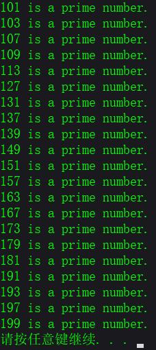

```c
#include <stdio.h>#include <math.h>int main(){    int n,k,i,m = 0;    for(n = 101;n <= 200;n = n +2) //n从100变化到200,对每个n进行判定    {        k = sqrt(n);        for(i = 2;i <= k;i++)            if(n % i == 0)break;	//如果n被i整除终止内循环,此时i<k+1        if(i >= k + 1)	//若i>=k+`,表示n未曾被整除        {            printf("%d",n);	//应确定n是素数            m = m + 1;        }        if(m % 10 == 0)prinft("\n");	//m累计到10的倍数,换行    }    printf("\n");    system("pause");    return 0;}
```

<font color='green'>**运行结果:**</font>


<font color='green'>**程序分析:**</font>

<font color='green'>( 1 )</font>	根据常识,偶数不是素数,所以不必对偶数进行判定,只对奇数进行检查.故外循环变量 n 从 101 开始,每次增值 2.

<font color='green'>( 2 )</font>	sqrt 是求平方根的函数,它要求参数为双精度,在执行时会自动将整数 n 转换为双精度数.求出的函数值也是双精度数,再把它赋给整型变量 k,系统会自动将小数部分舍弃,只保留整数部分.

<font color='green'>( 3 )</font>	执行 break 语句时提前终止内循环,流程转至"if(i>=k+1)"行的开头.

<font color='green'>( 4 )</font>	m 的作用是累计输出素数的个数,控制每行输出 10 个数据.

<font color='green'>**例 5.11**</font>	译密码:将字母 A 变成字母 E ,a 变成 e,即变成其后的第 4 个字母,W 变成 A,X 变成 B,Y 变成 C,Z 变成 D,见图 5.20.


<font color='green'>**解题思路:**</font>	问题的关键有两个:

<font color='green'>( 1 )</font>	如何决定那些字符需要改变,那些不需要改变,处理方法是判断字符的 ASCII 码范围,是否为大写字母或小写字母,如果是则改变不是则不改变.

<font color='green'>( 2 )</font>	怎样使需改变的字母变为指定的字母?办法是改变它的 ASCII 码.如果字符变量 c 的原值为 W ,按规定应变为 A.用什么方法可以得到此结果呢?可以用 c=c+4-26,即 c=c+22.先使 c+4,W 的 ASCII 值为 87,加 4 后为 91,它已超出字母 A ~ Z 的范围.从图 5.20 中可以看出,W 应该转换成 A,A 的 ASCII 值为 65,故应当使 91 减 26,变成 65.所以如果变量 c 的值在 W ~ Z 的范围内,应执行 c+4-26.算法可用 N-S 图表示,见图 5.21.


<font color='green'>**编写程序:**</font>

```c
#include <stdio.h>int main(){    char c;    c = getchar();//输入字符给字符变量c    while(c != '\n')//检查c的值是否为换行符    {    if('A' <= c && c <= 'V' || 'a' <= c && c <= 'v')//开始判断字母范围    {        c = c + 4;    }    else if('W' <= c && c <= 'Z' || 'w' <= c && c<= 'z')    {        c = c + 22    }    else    {        c = c;    }        printf("%c",c);        c = getchar();    }    system("pause");    return 0;    }
```

<font color='green'>**运行结果:**</font>


<font color='green'>**程序分析:**</font>	以上程序和运行结果都是正确的,程序也比较容易理解,关键在于对字符的 ASCII 值的运算.在有了一定的基础后,可以对程序做进一步的改进.例如可以把前后两个读入字符的"c=getchar();"合并为一个,并且放在while语句的检查条件中.对 if 语句的写法也可以改进.

```c
#include <stdio.h>int main(){    char c;    while((c=getchar())!='\n')    {        if((c >= 'A' && c <= 'Z')||(c>='a' && c <= 'z'))        {            c = c + 4;            if(c >= 'Z' && c <= 'Z'+4 || c > 'z')            c = c - 26;        }        printf("%c",c);    }    putchar('\n');    system("pause");    return 0;}
```

<div align="center"><font size='5' color='red'>习题 5</font></div>


3. <font color='green'>**程序分析**</font>

   （ 1 ）最小公倍数=输入的两个数之积除于它们的最大公约数，关键是求出最大公约数；

   （ 2 ）求最大公约数用辗转相除法（又名欧几里德算法）

   1）证明：设c是a和b的最大公约数，记为c=gcd(a,b),a>=b,
   令r=a mod b
   设a=kc，b=jc，则k，j互素，否则c不是最大公约数
   据上，r=a-mb=kc-mjc=(k-mj)c
   可知r也是c的倍数，且k-mj与j互素，否则与前述k，j互素矛盾,
   由此可知，b与r的最大公约数也是c，即gcd(a,b)=gcd(b,a mod b)，得证。

   2）算法描述：

   第一步：a ÷ b，令r为所得余数（0≤r 

   第二步：互换：置 a←b，b←r，并返回第一步。

   <font color='green'>**编写程序:**</font>

   ```c
   #include <stdio.h>int main(){    int a,b,t,r,n;    printf("请输入两个整数:\n");    scanf("%d%d",&a,&b);    if(a < b)    {t = b;b = a;a = t;}    r = a % b;    n = a * b;    while(r != 0)    {        a = b;        b = r;        r = a % b;    }    printf("这两个数的最大公约数是%d,最小公倍数是%d\n",b,n/b);    system("pause");    return 0;}
   ```

   


4. <font color='green'>**程序分析:**</font>	主要就是判断字符的 ASCII 值范围,按范围分别统计即可

5. <font color='green'>**程序分析:**</font>	设定循环变量 n 数字为 a,n 从 0 开始 变化到 n-1 为止 第一个数字为 a * 10^0^,第二个数字为a * 10^1^ + a * 10^0^.<font color='red'>**注意:**</font>循环时第一次为a * 10,第二次a已经变为a * 10,再乘以 10 即可 如果再使用pow(10,x),则会扩大10倍造成错误.

   <font color='green'>**编写程序:**</font>

   ```c
   #include <stdio.h>#include <math.h>int main(){    long int Sn=0,Sa=0;    int j,a,n;    printf("Please enter a=? , n=?\n");    scanf("%d%d",&a,&n);        for(j=1;j<=n;j++)        {            Sa = Sa * 10 + a;            Sn = Sa + Sn;            printf("a=%d\t",a);            printf("Sa=%d\t",Sa);            printf("Sn=%ld\n",Sn);        }    system("pause");    return 0;}
   ```

   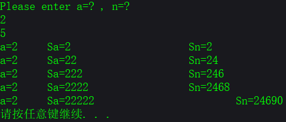

6. $$\sum \limits_{n=1}^{20}n!$$ (即求1!+2!+3!+···+20!)(n! = 1×2×3×...×(n-1)×n也就是阶乘)

   ```c
   #include <stdio.h>int main(){    long long sum=0,n=1;    int i=1;    for(;i <= 20;i++)    {        n *= i;        sum += n;    }    printf("%I64d\n",n);	//"%I64d"64位整型格式化输出    printf("%I64d\n",sum);    system("pause");    return 0;}
   ```

   

   

7. 求$$\sum \limits_{k=1}^{100}k+\sum \limits_{k=1}^{50}k^2+\sum \limits_{k=1}^{10}\frac{1}{k}$$.即(1+···+100)+(1^2^+···+50^2^)+(1/1+···+1/10).

   ```c
   #include <stdio.h>int main(){    double a, k, sum = 0;    for (k = 1; k <= 100; k++)    {        sum += k;    }    printf("sum1 = %f\n", sum);    for (k = 1; k <= 50; k++)    {        a = k * k;        sum += a;    }    printf("sum2 = %f\n", sum);    for (k = 1; k <= 10; k++)    {        a = 1 / k;        sum += a;    }    printf("sum3 = %lf\n", sum);    system("pause");    return 0;}
   ```

   


8. ```c
   #include <stdio.h>int main(){    int i,x,y,z;    for(i = 100;i < 10000;i++)    {        x = i % 10;        y = i / 10 % 10;        z = i / 100 % 10;        if(i == (x*x*x + y*y*y + z*z*z))        printf("%d\n",i);    }    system("pause");}
   ```

9. <font color='green'>**问题分析:**</font>	根据完数的定义，解决本题的关键是计算出所选取的整数i（i的取值范围不固定）的因子（因子就是所有可以整除这个数的数），将各因子累加到变量s (记录所有因子之和），若s等于i，则可确认i为完数，反之则不是完数。

   <font color='green'>**算法设计:**</font>	对于这类求某一范围（由于本题范围不固定，在编程过程中采用键盘输入的方式）内满足条件的数时，一般釆用遍历的方式，对给定范围内的数值一个一个地去判断是否满足条件，这一过程可利用循环来实现。

   本题的关键是求出选取数值i的因子，即从1到i-1范围内能整除i的数，看某一个数j是否为i的因子，可利用语句if(i%j==0)进行判断，求某一个数的所有因子，需要在1到i-1范围内进行遍历，同样釆用循环实现。因此，本题从整体上看可利用两层循环来实现。外层循环控制该数的范围2〜n；内层循环j控制除数的范围为1〜i，通过i对j取余，是否等于0，找到该数的各个因子。

   另外应注意每次判断下一个选定数之前，必须将变量s的值重新置为0，编程过程中一定要注意变量s重新置0的位置。

   程序流程图：

   

   ```c
   #include <stdio.h>int main(){    int i, j, k;    int sum = 1;    printf("完数如下:");    for (j = 6; j < 1000; j++)    {        sum = 1;                     //每次循环都要将sum赋值1        for (i = 2; i <= j / 2; i++) //这个需要小于j/2，而不是sqrt(j)        {            if (j % i == 0)                sum = sum + i;        }        if (sum == j)        {            printf("\n%d its factors are:1", sum);            for (k = 2; k <= j / 2; k++) //这个需要小于j/2，而不是sqrt(sum)            {                if (sum % k == 0)                    printf(",%d", k);            }        }    }    printf("\n");}
   ```

   <font color='green'>**知识点补充:**</font>	上述程序中求某数的因子时，釆用从1到i-1范围内进行遍历的方法，一个数一个数地去试。这种方法可以做到没有遗漏，但是效率不高。

   对于某一整数来说，其最大因子为n/2 (若n为偶数时，若为奇数最大因子小于n/2），在n/2〜n-1范围内没有数据可以整除此数。据此，我们可以把遍历范围缩小至1〜n-1，这样程序效率可以提高一倍。相应程序如下：

   ```c
   #include<stdio.h>>int main(){    //...    for( i=2; i<=1000; i++)    {        s=0;        for( j=1; j<=n/2; j++ )        {            if(i%j == 0)            s += j;        }    //...    }}
   ```

10. ```c
    #include <stdio.h>int main(){    float f,sum=0;    int f1=1,f2=2,t;    for(i=1;i<=20;i++)    {        f = f2 / f1;        t = f1;        f1 = f2;        f2 += t;        sum += f;    }    printf("sum = %f",sum);    system("pause");}
    ```

11. ```c
    #include <stdio.h>int main(){    float h,s;    int i;    h = s = 100;    h = h / 2;    for(i=2;i<=10;i++)    {        s = s + 2 * h;        h = h / 2;    }    printf("第10次落地时经过%f米,反弹高度%f米\n",s,h);    system("pause");    return 0;}
    ```

    

12. ```c
    #include <stdio.h>int main(){    int i,x=1;    for(i=1;i<=10;i++)    {        x = x * 2 + 1;    }    printf("猴子共摘了%d个桃子\n",x);    system("pause");    return 0;}
    ```

    

13. <font color='red'>**迭代法:**</font>	也称辗转法，是一种不断用变量的旧值递推新值的过程，跟迭代法相对应的是直接法(或者称为一次解法)，即一次性解决问题。迭代算法是用计算机解决问题的一种基本方法，它利用计算机运算速度快、适合做重复性操作的特点，让计算机对一组指令(或一定步骤)进行重复执行，在每次执行这组指令(或这些步骤)时，都从变量的原值推出它的一个新值，迭代法又分为精确迭代和近似迭代。比较典型的迭代法如“二分法”和"牛顿迭代法”属于近似迭代法。

    <font color='red'>**算法:**</font>	迭代是数值分析中通过从一个初始估计出发寻找一系列近似解来解决问题（一般是解方程或者方程组）的过程，为实现这一过程所使用的方法统称为迭代法（Iterative Method）。一般可以做如下定义：对于给定的线性方程组 （这里的x、B、f同为矩阵，任意线性方程组都可以变换成此形式），用公式 （ 代表迭代k次得到的x，初始时k=0)逐步带入求近似解的方法称为迭代法（或称一阶定常迭代法）。如果 存在，记为x*，称此迭代法收敛。显然x*就是此方程组的解，否则称为迭代法发散。
    跟迭代法相对应的是直接法（或者称为一次解法），即一次性的快速解决问题，例如通过开方解决方程x +3= 4。一般如果可能，直接解法总是优先考虑的。但当遇到复杂问题时，特别是在未知量很多，方程为非线性时，我们无法找到直接解法（例如五次以及更高次的代数方程没有解析解，参见阿贝耳定理），这时候或许可以通过迭代法寻求方程（组）的近似解。
    最常见的迭代法是<font color='red'>牛顿法</font>。其他还包括最速下降法、共轭迭代法、变尺度迭代法、最小二乘法、线性规划、非线性规划、单纯型法、惩罚函数法、斜率投影法、遗传算法、模拟退火等等。
    利用迭代算法解决问题，需要做好以下三个方面的工作：
    <font color='red'>确定迭代变量</font>
    在可以用迭代算法解决的问题中，至少存在一个直接或间接地不断由旧值递推出新值的变量，这个变量就是迭代变量。
    <font color='red'>建立迭代关系式</font>
    所谓迭代关系式，指如何从变量的前一个值推出其下一个值的公式（或关系）。迭代关系式的建立是解决迭代问题的关键，通常可以顺推或倒推的方法来完成。
    <font color='red'>对迭代过程进行控制</font>
    在什么时候结束迭代过程？这是编写迭代程序必须考虑的问题。不能让迭代过程无休止地重复执行下去。迭代过程的控制通常可分为两种情况：一种是所需的迭代次数是个确定的值，可以计算出来；另一种是所需的迭代次数无法确定。对于前一种情况，可以构建一个固定次数的循环来实现对迭代过程的控制；对于后一种情况，需要进一步分析出用来结束迭代过程的条件。
    <font color='green'>举例</font>
    <font color='green'>例 1</font> ：一个饲养场引进一只刚出生的新品种兔子，这种兔子从出生的下一个月开始，每月新生一只兔子，新生的兔子也如此繁殖。如果所有的兔子都不死去，问到第 12 个月时，该饲养场共有兔子多少只？
    分析：这是一个典型的递推问题。我们不妨假设第 1 个月时兔子的只数为 u 1 ，第 2 个月时兔子的只数为 u 2 ，第 3 个月时兔子的只数为 u 3 ，……根据题意，“这种兔子从出生的下一个月开始，每月新生一只兔子”，则有
    u 1 = 1 ， u 2 = u 1 + u 1 × 1 = 2 ， u 3 = u 2 + u 2 × 1 = 4 ，……
    根据这个规律，可以归纳出下面的递推公式：
    u n = u(n － 1)× 2 (n ≥ 2)
    对应 u n 和 u(n - 1)，定义两个迭代变量 y 和 x ，可将上面的递推公式转换成如下迭代关系：
    y=x * 2
    x=y
    让计算机对这个迭代关系重复执行 11 次，就可以算出第 12 个月时的兔子数。参考程序如下:

    ```basic
    clsx=1for i=2 to 12y=x*2x=ynext iprint yend
    ```

    <font color='green'>例 2</font> ：阿米巴用简单分裂的方式繁殖，它每分裂一次要用 3 分钟。将若干个阿米巴放在一个盛满营养参液的容器内， 45 分钟后容器内充满了阿米巴。已知容器最多可以装阿米巴 220,220个。试问，开始的时候往容器内放了多少个阿米巴？请编程序算出。
    分析：根据题意，阿米巴每 3 分钟分裂一次，那么从开始的时候将阿米巴放入容器里面，到 45 分钟后充满容器，需要分裂 45/3=15 次。而“容器最多可以装阿米巴2^ 20 个”，即阿米巴分裂 15 次以后得到的个数是 2^20。题目要求我们计算分裂之前的阿米巴数，不妨使用倒推的方法，从第 15 次分裂之后的 2^20 个，倒推出第 15 次分裂之前（即第 14 次分裂之后）的个数，再进一步倒推出第 13 次分裂之后、第 12 次分裂之后、……第 1 次分裂之前的个数。
    设第 1 次分裂之前的个数为 x 0 、第 1 次分裂之后的个数为 x 1 、第 2 次分裂之后的个数为 x 2 、……第 15 次分裂之后的个数为 x 15 ，则有
    x 14 =x 15 /2 、 x 13 =x 14 /2 、…… x n-1 =x n /2 (n ≥ 1）
    因为第 15 次分裂之后的个数 x 15 是已知的，如果定义迭代变量为 x ，则可以将上面的倒推公式转换成如下的迭代公式：
    x=x/2 （x 的初值为第 15 次分裂之后的个数 2^20）
    让这个迭代公式重复执行 15 次，就可以倒推出第 1 次分裂之前的阿米巴个数。因为所需的迭代次数是个确定的值，我们可以使用一个固定次数的循环来实现对迭代过程的控制。参考程序如下：

    ```basic
    clsx=2^20for i=1 to 15x=x/2next iprint xend
    ```

    ps:java中幂的算法是Math.pow（2,20）；返回double，稍微注意一下
    <font color='green'>例 3</font> ：验证谷角猜想。日本数学家谷角静夫在研究自然数时发现了一个奇怪现象：对于任意一个自然数 n ，若 n 为偶数，则将其除以 2 ；若 n 为奇数，则将其乘以 3 ，然后再加 1。如此经过有限次运算后，总可以得到自然数 1。人们把谷角静夫的这一发现叫做“谷角猜想”。
    要求：编写一个程序，由键盘输入一个自然数 n ，把 n 经过有限次运算后，最终变成自然数 1 的全过程打印出来。
    分析：定义迭代变量为 n ，按照谷角猜想的内容，可以得到两种情况下的迭代关系式：当 n 为偶数时， n=n/2 ；当 n 为奇数时， n=n * 3+1。用 QBASIC 语言把它描述出来就是：

    ```basic
    if n 为偶数 thenn=n/2elsen=n * 3+1end if
    ```


    这就是需要计算机重复执行的迭代过程。这个迭代过程需要重复执行多少次，才能使迭代变量 n 最终变成自然数 1 ，这是我们无法计算出来的。因此，还需进一步确定用来结束迭代过程的条件。仔细分析题目要求，不难看出，对任意给定的一个自然数 n ，只要经过有限次运算后，能够得到自然数 1 ，就已经完成了验证工作。因此，用来结束迭代过程的条件可以定义为：n=1。参考程序如下：```pythonclsinput "Please input n=";ndo until n=1if n mod 2=0 thenrem 如果 n 为偶数，则调用迭代公式 n=n/2n=n/2print "—";n;elsen=n*3+1print "—";n;end ifloopend```


    迭代法开平方：```c#include<stdio.h>#include<math.h>void main(){double a,x0,x1;printf("Input a:\n");scanf("%lf",&a);//因为a是double型数据，所以要用%lf，而不是%fif(a<0)printf("Error!\n");else{x0=a/2;x1=(x0+a/x0)/2;do{x0=x1;x1=(x0+a/x0)/2;}while(fabs(x0-x1）>=1e-6）；}printf("Result:\n");printf("sqrt(%g)=%g\n",a,x1）；}```求平方根的迭代公式：x~1~=1/2 * (x~0~+a/x~0~）。<font color='yellow'>**算法:**</font>1.先自定一个初值x0，作为a的平方根值，在我们的程序中取a/2作为x0的初值；利用迭代公式求出一个x1。此值与真正的a的平方根值相比，误差很大。⒉把新求得的x1代入x0中，准备用此新的x0再去求出一个新的x1.⒊利用迭代公式再求出一个新的x1的值，也就是用新的x0又求出一个新的平方根值x1，此值将更趋近于真正的平方根值。⒋比较前后两次求得的平方根值x0和x1，如果它们的差值小于我们指定的值，即达到我们要求的精度，则认为x1就是a的平方根值，去执行步骤5；否则执行步骤2，即循环进行迭代。迭代法是用于求方程或方程组近似根的一种常用的算法设计方法。设方程为f(x)=0，用某种数学方法导出等价的形式x=g(x），然后按以下步骤执行：⑴ 选一个方程的近似根，赋给变量x0；⑵ 将x0的值保存于变量x1，然后计算g(x1），并将结果存于变量x0；⑶ 当x0与x1的差的绝对值还小于指定的精度要求时，重复步骤⑵的计算。若方程有根，并且用上述方法计算出来的近似根序列收敛，则按上述方法求得的x0就认为是方程的根。上述算法用C程序的形式表示为：<font color='yellow'>**算法:**</font>迭代法求方程的根```{ x0=初始近似根；do {x1=x0；x0=g(x1）； /*按特定的方程计算新的近似根*/} while (fabs(x0-x1）>Epsilon）；printf（“方程的近似根是%f\n”，x0）；}迭代算法也常用于求方程组的根，令X=（x0，x1，…，xn-1）设方程组为：xi=gi(X) (I=0，1，…，n-1）```则求方程组根的迭代算法可描述如下：<font color='yellow'>**算法:**</font>迭代法求方程组的根```{ for (i=0;ix=初始近似根；do {for (i=0;iy=x;for (i=0;ix=gi(X);for (delta=0.0,i=0;iif (fabs(y-x)>delta) delta=fabs(y-x）；} while (delta>Epsilon）；for (i=0;iprintf（“变量x[%d]的近似根是 %f”，I，x）；printf（“\n”）；}```


​    

    具体使用迭代法求根时应注意以下两种可能发生的情况：⑴ 如果方程无解，算法求出的近似根序列就不会收敛，迭代过程会变成死循环，因此在使用迭代算法前应先考察方程是否有解，并在程序中对迭代的次数给予限制；⑵ 方程虽然有解，但迭代公式选择不当，或迭代的初始近似根选择不合理，也会导致迭代失败。递归递归是设计和描述算法的一种有力的工具，由于它在复杂算法的描述中被经常采用，为此在进一步介绍其他算法设计方法之前先讨论它。能采用递归描述的算法通常有这样的特征：为求解规模为N的问题，设法将它分解成规模较小的问题，然后从这些小问题的解方便地构造出大问题的解，并且这些规模较小的问题也能采用同样的分解和综合方法，分解成规模更小的问题，并从这些更小问题的解构造出规模较大问题的解。特别地，当规模N=1时，能直接得解。<font color='green'>问题:</font> 编写计算斐波那契（Fibonacci）数列的第n项函数fib（n）。斐波那契数列为：0、1、1、2、3、……，即：fib(0)=0;fib⑴=1;fib(n)=fib(n-1）+fib(n-2） （当n>1时）。写成递归函数有：```int fib(int n){ if (n==0) return 0;if (n==1） return 1;if (n>1） return fib(n-1）+fib(n-2）；}```


​    

    递归算法的执行过程分递推和回归两个阶段。在递推阶段，把较复杂的问题（规模为n）的求解推到比原问题简单一些的问题（规模小于n）的求解。例如上例中，求解fib(n），把它推到求解fib(n-1）和fib(n-2）。也就是说，为计算fib(n），必须先计算fib(n-1）和fib(n- 2），而计算fib(n-1）和fib(n-2），又必须先计算fib(n-3）和fib(n-4）。依次类推，直至计算fib⑴和fib(0），分别能立即得到结果1和0。在递推阶段，必须要有终止递归的情况。例如在函数fib中，当n为1和0的情况。在回归阶段，当获得最简单情况的解后，逐级返回，依次得到稍复杂问题的解，例如得到fib⑴和fib(0）后，返回得到fib⑵的结果，……，在得到了fib(n-1）和fib(n-2）的结果后，返回得到fib(n）的结果。在编写递归函数时要注意，函数中的局部变量和参数知识局限于当前调用层，当递推进入“简单问题”层时，原来层次上的参数和局部变量便被隐蔽起来。在一系列“简单问题”层，它们各有自己的参数和局部变量。由于递归引起一系列的函数调用，并且可能会有一系列的重复计算，递归算法的执行效率相对较低。当某个递归算法能较方便地转换成递推算法时，通常按递推算法编写程序。例如上例计算斐波那契数列的第n项的函数fib(n）应采用递推算法，即从斐波那契数列的前两项出发，逐次由前两项计算出下一项，直至计算出要求的第n项。<font color='green'>问题:</font> 组合问题问题描述：找出从自然数1、2、……、n中任取r个数的所有组合。例如n=5，r=3的所有组合为：⑴5、4、3 ⑵5、4、2 ⑶5、4、1⑷5、3、2 ⑸5、3、1 ⑹5、2、1⑺4、3、2 ⑻4、3、1 ⑼4、2、1⑽3、2、1分析所列的10个组合，可以采用这样的递归思想来考虑求组合函数的算法。设函数为void comb(int m,int k）为找出从自然数1、2、……、m中任取k个数的所有组合。当组合的第一个数字选定时，其后的数字是从余下的m-1个数中取k-1数的组合。这就将求m 个数中取k个数的组合问题转化成求m-1个数中取k-1个数的组合问题。设函数引入工作数组a[ ]存放求出的组合的数字，约定函数将确定的k个数字组合的第一个数字放在a[k]中，当一个组合求出后，才将a[ ]中的一个组合输出。第一个数可以是m、m-1、……、k，函数将确定组合的第一个数字放入数组后，有两种可能的选择，因还未去顶组合的其余元素，继续递归去确定；或因已确定了组合的全部元素，输出这个组合。细节见以下程序中的函数comb。<font color='green'>程序:</font>```c## include# define MAXN 100int a[MAXN];void comb(int m,int k){ int i,j;for (i=m;i>=k;i--){ a[k]=i;if (k>1）comb(i-1,k-1）；else{ for (j=a[0];j>0;j--)printf（“%4d”，a[j]);printf（“\n”）；}}}void main(){ a[0]=3;comb（5,3）；}```


​    

    <font color='green'>问题:</font> 背包问题问题描述：有不同价值、不同重量的物品n件，求从这n件物品中选取一部分物品的选择方案，使选中物品的总重量不超过指定的限制重量，但选中物品的价值之和最大。设n 件物品的重量分别为w0、w1、…、wn-1，物品的价值分别为v0、v1、…、vn-1。采用递归寻找物品的选择方案。设前面已有了多种选择的方案，并保留了其中总价值最大的方案于数组option[ ]，该方案的总价值存于变量maxv。当前正在考察新方案，其物品选择情况保存于数组cop[ ]。假定当前方案已考虑了前i-1件物品，现在要考虑第i件物品；当前方案已包含的物品的重量之和为tw；至此，若其余物品都选择是可能的话，本方案能达到的总价值的期望值为tv。算法引入tv是当一旦当前方案的总价值的期望值也小于前面方案的总价值maxv时，继续考察当前方案变成无意义的工作，应终止当前方案，立即去考察下一个方案。因为当方案的总价值不比maxv大时，该方案不会被再考察，这同时保证函数后找到的方案一定会比前面的方案更好。对于第i件物品的选择考虑有两种可能：⑴ 考虑物品i被选择，这种可能性仅当包含它不会超过方案总重量限制时才是可行的。选中后，继续递归去考虑其余物品的选择。⑵ 考虑物品i不被选择，这种可能性仅当不包含物品i也有可能会找到价值更大的方案的情况。按以上思想写出递归<font color='yellow'>算法</font>如下：```try（物品i，当前选择已达到的重量和，本方案可能达到的总价值tv){ /*考虑物品i包含在当前方案中的可能性*/if（包含物品i是可以接受的）{ 将物品i包含在当前方案中；if (itry(i+1,tw+物品i的重量，tv);else/*又一个完整方案，因为它比前面的方案好，以它作为最佳方案*/以当前方案作为临时最佳方案保存；恢复物品i不包含状态；}/*考虑物品i不包含在当前方案中的可能性*/if （不包含物品i仅是可男考虑的）if (itry(i+1,tw,tv-物品i的价值）；else/*又一个完整方案，因它比前面的方案好，以它作为最佳方案*/以当前方案作为临时最佳方案保存；}```


​    

    为了理解上述算法，特举以下实例。设有4件物品，它们的重量和价值见表：物品 0 1 2 3重量 5 3 2 1价值 4 4 3 1并设限制重量为7。则按以上算法，一旦找到一个解，算法就进一步找更好的佳。如能判定某个查找分支不会找到更好的解，算法不会在该分支继续查找，而是立即终止该分支，并去考察下一个分支。按上述算法编写函数和程序如下：<font color='green'>程序:</font>```c## include# define N 100double limitW,totV,maxV;int option[N],cop[N];struct { double weight;double value;}a[N];int n;void find(int i,double tw,double tv){ int k;/*考虑物品i包含在当前方案中的可能性*/if (tw+a.weight<=limitW){ cop=1;if (ielse{ for (k=0;koption[k]=cop[k];maxv=tv;}cop=0;}/*考虑物品i不包含在当前方案中的可能性*/if (tv-a.value>maxV)if (ielse{ for (k=0;koption[k]=cop[k];maxv=tv-a.value;}}void main(){ int k;double w,v;printf（“输入物品种数\n”）；scanf（（“%d”，&n);printf（“输入各物品的重量和价值\n”）；for (totv=0.0,k=0;k{ scanf（“%1f%1f”，&w,&v);a[k].weight=w;a[k].value=v;totV+=V;}printf（“输入限制重量\n”）；scanf（“%1f”，&limitV);maxv=0.0;for (k=0;k find(0,0.0,totV);for (k=0;kif (option[k]) printf（“%4d”，k+1）；printf（“\n总价值为%.2f\n”，maxv);}```


    作为对比，下面以同样的解题思想，考虑非递归的程序解。为了提高找解速度，程序不是简单地逐一生成所有候选解，而是从每个物品对候选解的影响来形成值得进一步考虑的候选解，一个候选解是通过依次考察每个物品形成的。对物品i的考察有这样几种情况：当该物品被包含在候选解中依旧满足解的总重量的限制，该物品被包含在候选解中是应该继续考虑的；反之，该物品不应该包括在当前正在形成的候选解中。同样地，仅当物品不被包括在候选解中，还是有可能找到比目前临时最佳解更好的候选解时，才去考虑该物品不被包括在候选解中；反之，该物品不包括在当前候选解中的方案也不应继续考虑。对于任一值得继续考虑的方案，程序就去进一步考虑下一个物品。<font color='green'>程序:</font>```c## include# define N 100double limitW;int cop[N];struct ele { double weight;double value;} a[N];int k,n;struct { int ;double tw;double tv;}twv[N];void next(int i,double tw,double tv){ twv.=1;twv tw=tw;twv tv=tv;}double find(struct ele *a,int n){ int i,k,f;double maxv,tw,tv,totv;maxv=0;for (totv=0.0,k=0;ktotv+=a[k].value;next(0,0.0,totv);i=0;While (i>=0){ f=twv.;tw=twv tw;tv=twv tv;switch(f){ case 1: twv.++;if (tw+a.weight<=limitW)if (i{ next(i+1,tw+a.weight,tv);i++;}else{ maxv=tv;for (k=0;kcop[k]=twv[k].!=0;}break;case 0: i--;break;default: twv.=0;if (tv-a.value>maxv)if (i{ next(i+1,tw,tv-a.value);i++;}else{ maxv=tv-a.value;for (k=0;kcop[k]=twv[k].!=0;}break;}}return maxv;}void main(){ double maxv;printf（“输入物品种数\n”）；scanf（（“%d”，&n);printf（“输入限制重量\n”）；scanf（“%1f”，&limitW);printf（“输入各物品的重量和价值\n”）；for (k=0;kscanf（“%1f%1f”，&a[k].weight,&a[k].value);maxv=find(a,n);printf（“\n选中的物品为\n”）；for (k=0;kif (option[k]) printf（“%4d”，k+1）；printf（“\n总价值为%.2f\n”，maxv);}```

16. ```c
    #include <stdio.h>int main(){    int i,j;    for(i = 1;i<=4;i++)    {        for(j = 1;j <= 4 - i;j++)        {            printf(" ");        }        for(j = 1;j < 2 * i;j++)        {            printf("*");        }        printf("\n");    }        for(i = 1;i <= 5;i++)    {        for(j = 1;j <= i;j++)        {            printf(" ");        }        for(j = 1;j < 8 - 2 * i;j++)        {            printf("*");        }        printf("\n");    }    printf("\n");    system("pause");    return 0;}
    ```

    

17. ```c
    #include <stdio.h>int main(){    int i,j;    for(i=65;i<=67;i++)    {        for(j=88;j<=90;j++)        {            if((i==65 && j==88)||(i==67 && j==88) || (i==67 && j== 90))            continue;            printf("%c & %c\n",i,j);                    }    }    printf("\n");    system("pause");    return 0;}
    ```

## 第 6 章 利用数组处理批量数据

之前的程序中使用的变量都属于基本类型,这些都是简单的数据类型.对于简单问题,使用这些简单的数据类型就可以了.但是对于有些需要处理的数据,只用以上简单的数据类型是不够的,难以反映出数据的特点,也难以有效地进行处理.例如,一个班有 30 个学生,每个学生有一个成绩,要求这 30 名学生的平均成绩.从理论上,这是很简单的:把成绩加起来除以 30 就行了.问题是怎样表示 30 个学生成绩?当然可以用 30 个 float 型变量,但是这里存在两个问题,一是烦琐,要定义 30 个简单变量,如果有 1000 名学生怎么办?二是没有反映出这些数据间的内在联系,实际上这些数据是同一个班级,同一门课程的成绩,它们具有相同的属性.

人们想出这样的办法:既然它们都是同一类性质的数据,就可以用同一个名字(如 S)来代表它们,而在名字的右下角加一个数字来表示这是第几名学生的成绩,这个右下角的数字称为下标(subscript).一批具有同名的同属性的数据就组成一个数组(array),S 就是数组名.

由此可知:

<font color='green'>( 1 )</font>	数组是<font color='red'>**一组有序数据的集合.**</font>数组中各数据的排列是有一定规律的,下标代表数据在数组中的序号.

<font color='green'>( 2 )</font>	用一个数组名(如 S)和下标(如 15)来唯一地确定数组中的元素.

<font color='green'>( 3 )</font>	数组中的每一个元素都<font color='red'>**属于同一个数据类型**</font>.不能把不同类型的数据放在同一个数组中.

由于计算机键盘只能输入优先的单个字符而无法表示上下标,C 语言就规定用方括号中的数字来表示下标.

将数组与循环结合起来,可以有效地处理大批量的数据.

### 6.1 怎样定义和引用一维数组

一维数组是数组中最简单的,它的元素只需用数组名加一个下标,就能唯一确定.数量掌握一维数组后,对二维或多维数组,很容易举一反三,迎刃而解.

#### 6.1.1 怎样定义一维数组

要使用数组,必须在程序中先定义数组,即通知计算机:由哪些数据组成数组,数组中有多少元素,属于哪个数据类型.否则计算机不会自动地把一批数据作为数组处理.例如,下面是对数组的定义:

```c
int a[10];
```

它表示定义了一个整型数组,数组名为 a,此数组有 10 个整型元素.

定义一维数组的一般形式为:

<font color='red'>**类型符 数组名[常量表达式];**</font>

<font color='red'>**说明:**</font>

<font color='green'>( 1 )</font>	数组名的命名规则和变量名相同,遵循标识符命名规则.

<font color='green'>( 2 )</font>	在定义数组时,需要指定数组中元素的个数,方括号内的常量表达式用来表示元素的个数,即数组长度.<font color='orange'>**注意:**</font>数组的下标是从 0 开始的,按照上面的定义是不存在 a[10] 这个元素的.

<font color='green'>( 3 )</font>	常量表达式中可以包括常量和符号常量,不能包含变量,也就是说 C 语言不允许对数字的大小作动态定义,即数组的大小不依赖于程序运行过程中变量的值.

经过上面的定义,在内存中划出一片存储空间(见图 6.1),存放了一个有 10 个整型元素的数组.可以看到,用一个"int a[10];"就相当于定义了 10 个简单的整型变量,显然简捷方便.


<font color='red'>**说明:**</font>	如果在被调用的函数(不包括主函数)中定义数组,其长度可以是变量或非常量表达式.如:

```c
void func(int n){    int a[2 * n];	//合法,n的值从实参传来    ...}
```

在调佣 func 函数时,形参 n 从实参得到值.这种情况称为"可变长数组",允许在每次调用 func 函数时,n 有不同的值.但是在执行函数时,n 的值是不变的,数组长度时固定的.

如果指定数组为静态(static)存储方式,则不能用"可变长数组".如:

```c
static in a[2 * n];		//不合法,a数组指定为 static 存储方式
```

关于函数和 static 存储方式在第 7 章中介绍.

#### 6.1.2 怎样引用一维数组元素

在定义数组并对其中各元素赋值后,就可以引用数组中的元素.应注意:只能引用数组元素而不能一次整体调用整个数组全部元素的值.

引用数组元素的表示形式为

<font color='red'>**数组名[下标]**</font>

例如,a[0]就是数组 a 中序号为0的元素,它和一个简单变量的地位和作用相似."下标"可以是整型常量或整型表达式.例如下面的赋值表达式包含了对数组元素的引用:

```c
a[0]=a[5]+a[7]-a[2*3]
```

每一个数组元素都带比偶一个整数值.

<font color='red'>**注意:**</font>	定义数组时用到的"数组名[常量表达式]"和引用数组元素时用的"数组名[下标]"形式相同,但含义不同.

```c
int a[10];	//这里表示a数组内包含10个整型元素t=a[6];		//这里表示t的值为a数组内序号为6的元素
```

<font color='green'>**例 6.1**</font>	对 10 个数组元素依次赋值为 0,1,2,3,4,5,6,7,8,9,要求按逆序输出.

<font color='green'>**解题思路:**</font>	显然首先要定义一个长度为 10 的数组,由于赋给的值都是整数,因此数组可定义为整型,要赋的值是 0 ~ 9,有一定规律,可用循环赋值.同样循环来输出这 10 个值.

<font color='green'>**编写程序:**</font>

```c
#include <stdio.h>int main(){	int i, a[10];	for (i = 1;i <= 10;i++)	{		a[i-1] = (i - 1);	}	for (i = 1;i <= 10;i++)	{		printf("%d ", a[10 - i]);	}	putchar('\n');	system("pause");	return 0;}
```


<font color='green'>**程序分析:**</font>	应当特别注意的是:数组元素的下标从 0 开始,如果用"int a[10]"定义数组,则最大下标值为9,不存在数组元素a[10].

#### 6.1.3 一维数组的初始化

为了使程序简洁,常在定义数组的同时,给各数组元素赋值,这称为数组的<font color='red'>**初始化**</font>.可以用"初始化列表"方法实现数组的初始化.

<font color='green'>( 1 )</font>	在定义数组时对全部数组元素赋予初值.例如:

```c
int a[10]={0,1,2,3,4,5,6,7,8,9};
```

<font color='green'>( 2 )</font>	可以只给数组中的一部分元素赋值,系统会给其余元素赋初值 0:

```c
int a[10]={0,1,2,3,4};
```

<font color='green'>( 3 )</font>	如果要全部赋值为 0 ,可以写成

```c
int a[10]={0,0,0,0,0,0,0,0,0,0};
```

或

```c
int a[10]={0};
```

<font color='green'>( 4 )</font>	在对全部数组元素赋值时,由于数据的个数已经确定,因此可以不指定数组长度:

```c
int a[5]={1,2,3,4,5};	可以写成	int a[]={1,2,3,4,5};
```

但是如果数组长度与提供初值的个数不相同,则方括号的数组长度不能省略.

<font color='red'>**说明:**</font>	如果在定义数值型数组时,指定了数组的长度并对之初始化,凡未被"初始化列表"指定初始化的数组元素,系统会自动把它们初始化为 0(如果是字符型数组,则初始化为'\0',如果是指针型数组,则初始化为NULL,即空指针).

#### 6.1.4 一维数组程序举例

<font color='green'>**例 6.2**</font>	用数组来处理求 Fibonacci 数列问题.

<font color='green'>**解题思路:**</font>	在第 5 章例 5.8 中使用简单变量处理的,只定义了两个或3个变量,程序可以顺序计算并输出各数,但不能在内存中保存这些数.假如想直接输出数列中第 25 个数,是很困难的.如果用数组来处理,在概念上反而简单了:每一个数组元素代表数列中的一个数,一次求出各数并存放在相应的数组元素中即可.

<font color='green'>**编写程序:**</font>

```c
#include <stdio.h>int main(){    int i;    int f[20]={1,1};	//对最前面两个元素赋初值1    for(i=2;i<20;i++)    {        f[i]=f[i-2]+f[i-1];	//先后求出各元素的值    }    for(i=0;i<20;i++)    {        if(i%5==0)printf("\n");	//每5个元素输出一个换行        printf("%12d",f[i]);	//输出一个数    }    printf("\n");    system("pause");    return 0;}
```

<font color='green'>**运行结果:**</font>


<font color='green'>**例 6.3**</font>	有 10 个地区的面积,要求对它们按由小到大的顺序排列.

<font color='green'>**解题思路:**</font>	这种问题称为数的排序(sort).排序的规律有两种:一种是"升序";一种是"降序".<font color='red'>**排序方法是一种重要的,基本的算法.**</font>排序的方法很多,本例用"起泡法排序".<font color='green'>基本思路是:每次将相邻两个数比较,将小的调到前头.</font>若有 6 个数:9,8,5,4,2,0.第 1 次先将最前面两个数 8,9对调(见图 6.3).第二次将第 2 和第 3 个数对调···如此共进行 5 次,得到8-5-4-2-0-9 的顺序,可以看到:最大的数 9 已"沉底",成为最下面一个数,而小的数"上升".最小的数 0 已向上"浮起"一个位置.然后再经过第 2 趟比较,见图 6.4.按此规律比较5趟,就能使这 6 个数按大小顺序排列.<font color='red'>如果有 n 个数,则要进行 n-1 趟比较.</font>


<font color='green'>**编写程序:**</font>

```c
#include <stdio.h>int main(){    int i,j,t,a[10];    printf("Please enter ten numbers:\n");    for(i=0;i<10;i++)    {        scanf("%d",&a[i]);    }    for(j=0;j<9;j++)    {        for(i=0;i<9-j;i++)        {            if(a[i]>a[i+1])	//比较大小进行交换            {                t=a[i];                a[i]=a[i+1];                a[i+1]=t;            }        }    }    printf("The sorted numbers:");    for(i=0;i<10;i++)    {        printf("%d ",a[i]);    }    printf("\n");    system("pause");    return 0;}
```

<font color='green'>**运行结果:**</font>


<font color='green'>**程序分析:**</font>	程序中实现起泡法排序算法的主要是 14 ~ 19 行.请仔细分析嵌套的 for 语句.当执行外循环第 1 次循环时,j=0,然后执行第 1 次内循环,此时i=0,在 if 语句中将a[i]和a[i+1]比较,就是将a[0]和a[1]比较.执行第 2 次内循环时,i=1,a[i]和a[i+1]比较,就是将a[1]和a[2]比较···执行最后一次内循环时,i=8,a[i]和a[i+1]比较,就是将a[8]和a[9]比较,这时第 1 趟过程完成了.

当执行第 2 次外循环时,j=1,开始第 2 趟过程.内循环继续的条件时i<9-j,由于j=1,相当于i<8,即i从0变到7,要执行内循环 8 次.其余类推.

<font color='yellow'>通过此例,着重要学习有关排序的算法,理解遇到问题后怎样构思解题的思路.</font>

### 6.2 怎样定义和应用二维数组

前面已提到,有的问题需要用二维数组来处理.例如:有 3 个小分队,每队有 6 名队员,要把这些队员的工资用数组保存起来以备查.这就需要用到二维数组,见图 6.6.如果建立一个数组 pay,它应当是二维的,第一维用来表示第几分队,第二维用来表示第几个队员,例如用pay~2,3~ 表示 2 分队第 3 名队员的工资,它的值是 1725.


二维数组常称为<font color='red'>**矩阵(matrix).**</font>把二维数组写成行(column)和列(row)的排列形式,可以有助于形象化地理解二维数组的逻辑结构.

#### 6.2.1 怎样定义二维数组

基本概念与方法和一维数组相似.如:

```c
float pay[3][6];
```

以上定义了一个 float 型的二维数组,第 1 维有 3 个元素,第 2 维有 6 个元素.每一维的长度分别用一对方括号包起来.

二维数组定义的一般形式为

<font color='red'>**类型说明符 数组名[常量表达式] [常量表达式];**</font>

<font color='red'>**注意:不能在一对方括号内写两个下标,错误.**</font>

C 语言对二维数组采用这样的定义方式,使得二维数组可被看作一种特殊的一维数组:它的元素又是一个一维数组.例如,可以把 a 看作是一个一维数组,它有 3 个元素:

a[0],a[1],a[2]

每一个元素又是一个包含 4 个元素的一维数组,见图 6.7.


可以把 a[0],a[1],a[2] 看作是 3 个一维数组的名字.上面定义的二维数组可以理解为定义了 3 个一维数组,即相当于

```c
float a[0][4],a[1][4],a[2][4];
```

此处把 a[0],a[1],a[2] 看作一维数组名.

C 语言的这种处理方法在数组初始化和用指针表示时显得很方便.二维数组中元素排列的顺序是按行存放的,即在内存中先顺序存放第 1 行的元素,接着再存放第 2 行的元素.图 6.8 表示对 a[3] [4] 数组存放的顺序.

假设数组 a 存放在 2000 字节开始的一段内存单元中,一个元素占 4 个字节,前 16 个字节(2000 ~ 2015)存放序号为 0 的行中的 4 个元素,接着的 16 个字节(2016 ~ 2031)存放序号为 1 的行中的 4 个元素,其余类推,如图 6.9 所示.


<font color='red'>**注意:**</font>	用矩阵形式(如 3 行 4 列形式)表示二维数组,是逻辑上的概念,能形象地表示处行列关系,而在内存中,各元素是连续存放的,不是二维的,是线性的.这点务请明确.

C 语言还允许使用多维数组.有了二维数组的基础,再掌握多维数组不是困难的.例如,定义三维数组的方法如下:

```c
float a[2][3][4];	//定义三维数组a,它有2页,3行,4列
```

多维数组元素在内存中的排列顺序为:第 1 维的下标变化最慢,最右边的下标变化最快.

#### 6.2.2 怎样引用二维数组的元素

二维数组元素的表示形式为

<font color='red'>**数组名[下标] [下标]**</font>

<font color='orange'>数组元素可以出现在表达式中,也可以被赋值.</font>

<font color='red'>**注意:**</font>	在引用数组元素时,下标值应在已定义的数组大小的范围内.<font color='red'>下标是从 0 开始的.</font>

#### 6.2.3 二维数组的初始化

可以用"初始化列表"对二维数组初始化.

<font color='green'>( 1 )</font>	分行给二维数组赋初值.

```c
int a[3][4]={{1,2,3,4},{5,6,7,8},{9,10,11,12}};
```

这种赋初值方法比较直观,把第 1 个花括号内的数据赋给第 1 行的元素,第 2 个花括号内的数据赋给第 2 行的元素···即按行赋初值.

<font color='green'>( 2 )</font>	可以将所有数据写在一个花括号内,安数组元素在内存中的排列顺序对各元素赋初值.

```c
int a[3][4]={1,2,3,4,5,6,7,8,9,10,11,12};
```

效果与前面的相同,但以第 ( 1 ) 种方法为好,一行对一行,界限清楚.用第( 2 )种 方法如果数据多,则会写成一大片,容易遗漏,也不易检查.

<font color='green'>( 3 )</font>	可以对部分元素赋初值.

```c
int a[3][4]={{1},{5},{9}};
```

它的作用只是对各行第 1 列的元素赋初值,其余元素自动为 0.也可以对各行中某一元素赋初值.

```c
int a[3][4]={{1},{0,6}.{0,0,11}};
```

其余未赋值各项,系统自动初始化为 0.这种方法对非 0 元素少时比较方便,不必将所有的 0  都写出来,只须输入少量数据.也可以对某几行元素赋初值.

```c
int a[3][4]={{1},{5,6}};int a[3][4]={{1},{},{9}};
```

<font color='green'>( 4 )</font>	如果对全部元素都赋初值,则定义数组时对第 1 维的长度可以不指定,但第 2 维的长度不能省.

```c
int a[3][4]={1,2,3,4,5,6,7,8,9,10,11,12};int a[][4]={1,2,3,4,5,6,7,8,9,10,11,12};
```

这两个定义是等价的,系统会根据总个数和第 2 维的长度算出第 1 维的长度.

在定义时也可以只对部分元素赋初值而省略第 1 维的长度,但应分行赋初值.

```c
int a[][4]={{0,0,3},{},{0,10}};
```

这样的写法,能通知编译系统;数组共有 3 行.数组各元素为

0	0	3	0

0	0	0	0

0	10	0	0

C 语言在定义数组和数组元素时采用 a[] []这种两个方括号的方式,对数组初始化时十分有用,它使概念清楚,使用方便,不易出错.

#### 6.2.4 二维数组程序举例

<font color='green'>**例 6.4**</font>	将一个二维数组行和列的元素互换,存到另一个二维数组中.例如:

$$a=\begin{bmatrix}1&2&3\\4&5&6\\\end{bmatrix}  \ b=\begin{bmatrix}1&2\\3&4\\5&6\\\end{bmatrix}$$

<font color='green'>**解题思路:**</font>	可以定义两个数组:数组 a 为 2 行 3 列,存放指定的 6 个数.数组 b 为 3 行 2 列,开始时未赋值.只要将 a 数组中的元素a[i] [j]存放到 b 数组中的 b[j] [i]元素中即可.用嵌套的 for 循环即可完成此任务.

<font color='green'>**编写程序:**</font>

```c
#include <stdio.h>int main(){    int i,j,a[2][3]={{1,2,3},{4,5,6}},b[3][2]={{0},{0}};    //int i,j,a[3][2]={{1,2,3},{4,5,6}},b[2][3]={{0},{0}}; 定义错误行列未分清第一个方括号代表列第二个方括号代表行!!!    for(i=0;i<3;i++)    {        for(j=0;j<2;j++)        {            b[i][j]=a[j][i];            //b[j][i]=a[i][j];            printf("a[%d][%d]=%d\tb[%d][%d]=%d\n",j,i,a[j][i],i,j,b[i][j]);        }        printf("a[%d][%d]=%d\tb[%d][%d]=%d\n",i,j,a[i][j],j,i,b[j][i]);//位置错误只能输出部分元素!!    }    system("pause");    return 0;}
```

<font color='green'>**运行结果:**</font>


```c
#include <stdio.h>int main(){    int a[2][3]={{1,2,3},{4,5,6}};    int b[3][2],i,j;    printf("array a:\n");    for(i=0;i<=1;i++)    {        for(j=0;j<=2;j++)        {            printf("%5d",a[i][j]);            b[j][i]=a[i][j];        }        printf("\n");    }    printf("array b:\n");    for(i=0;i<=1;i++)    {        for(j=0;j<=2;j++)        {            printf("%5d",b[j][i]);        }        printf("\n");    }    system("pause");    return 0;}
```

<font color='green'>**运行结果:**</font>


<font color='green'>**例 6.5**</font>	有一个 3×4 的矩阵,要求编程求出其中值最大的那个元素的值,以及其所在的行号和列号.

<font color='green'>**解题思路:**</font>	<font color='orange'>先思考一下在打擂台时怎样确定最后的优胜者.先找出任一人站在台上,第 2 人上去与之比武,胜者留在台上,再上去第 3 人,与台上的人比武,胜者留台上,败者下台.直到所有人都上台比过为止,最后留在台上的就是冠军.这就是"<font color='red'>打擂台算法</font>".</font>

解本题也是用"打擂台算法".先让a[0] [0]作为"擂主",把它的值赋给变量 max,max 用来存放当前已知的最大值,在开始时还未进行比较,把最前面的元素认为是当前值最大的.然后用下一个元素与之比较,将较大值存入 max,以后依次处理,直到全部比较完毕.max中就是最大的值.按此思路画出 N-S 图,见图 6.10.


<font color='green'>**编写程序:**</font>

```c
#include <stdio.h>int main(){    int a[3][4]={{1,2,3,4},{9,8,7,6},{-10,10,-5,2}};    int i,j,max,row=0,colum=0;    max = a[0][0];    for(i=0;i<3;i++)    {        for(j=0;j<4;j++)        {            if(a[i][j+1]>max)            {                max = a[i][j+1];                row = i;                colum = j+1;            }        }    }    printf("max = %d,it's a[%d][%d]\n",max,row,colum);    system("pause");    return 0;}
```

<font color='green'>**运行结果:**</font>


### 6.3 字符数组

<font color='orange'>字符型数据是以字符的 ASCII 代码存储在单元中的,一般占一个字节.由于 ASCII 代码也属于整数形式,因此在 C99 标准中,把字符类型归纳为整型类型中的一种.</font>

<font color='orange'>C 语言中没有字符串类型,字符串时存放在字符型数组中的.</font>

#### 6.3.1 怎样定义字符数组

用来存放字符数据的数组时字符数组.字符数组中的一个元素存放一个字符.

定义字符数组的方法与定义数值型数组的方法类似.

```c
char c[10];c[0]='I';c[1]=' ';c[2]='a';c[3]='m';c[4]=' ';c[5]='h';c[6]='a';c[7]='p';c[8]='p';c[9]='y';
```

以上定义了 c 为字符数组,包含 10 个元素.赋值以后数组的状态如图 6.11 所示.

由于字符型数据是以整数形式(ASCII 代码)存放的,因此也可以用整型数组存放字符数据,例如:

```c
int c[10];c[0]='a';	//合法,但浪费存储空间整型一个元素占4个字节,字符型一个元素一般占一个字节
```

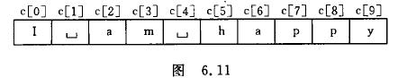

#### 6.3.2 字符数组的初始化

对字符数组初始化,最容易理解的方式使用"初始化列表",把各个字符一次赋给数组中各元素.

```c
char c[10]={'I',' ','a','m',' ','h','a','p','p','y'};
```

如果定义字符数组时不进行初始化,则数组中各元素的值是不可预料的.如果花括号中提供的初值个数大于数组长度,则出现语法错误.如果初值个数小于数组长度,则只将这些字符赋给数组中前面的元素,其余的元素自动定位空字符(即‘\0’).

```c
char c[10]={'c',' ','p','r','o','g','r','a','m'}
```

数组状态见图 6.12


在定义时可以省略数组长度,系统会自动根据初值个数确定数组长度.

```c
char c[]={'I',' ','a','m',' ','h','a','p','p','y'};
```

数组 c 的长度自动定为 10.在字符较多时,比较方便.

也可以定义和初始化一个二维字符数组,例如:

```c
char diamond[5][5]={{' ',' ','*'},{' ','*',' ','*'},{'*',' ',' ',' ','*'},{' ','*',' ','*'},{' ',' ','*'}};
```

它代表一个菱形的平面图形,见图 6.13.完整的程序见例 6.7.


#### 6.3.3 怎样引用字符数组中的元素

可以引用字符数组中的一个元素,得到一个字符.

<font color='green'>**例 6.6**</font>	输出一个已知的字符串.

<font color='green'>**解题思路:**</font>	先定义一个字符数组,并用"初始化列表"对其赋初值.然后用循环逐个输出此字符数组中的字符.

<font color='green'>**编写程序:**</font>

```c
#include <stdio.h>int main(){    char c[15]={'I',' ','a','m',' ','a',' ','s','t','u','d','e','n','t','.'};//注意空格要输入!!!    for(i=0;i<15;i++)    {        printf("%c",c[i]);    }    printf("\n");    system("pause");    return 0;}
```

<font color='green'>**运行结果:**</font>


<font color='green'>**例 6.7**</font>	输出一个菱形图.

<font color='green'>**解题思路:**</font>	先画出如图 6.12 所示的图案,记下'*'字符出现的位置.定义一个字符型二维数组,用"初始化列表"进行初始化.然后用for循环输出数组中所有元素.

<font color='green'>**编写程序:**</font>

```c
#include <stdio.h>int main(){    int i,j;    char c[5][5]={{' ',' ','*'},{' ','*',' ','*'},{'*',' ',' ',' ','*'},{' ','*',' ','*'},{' ',' ','*'}};    for(i=0;i<5;i++)    {        for(j=0;j<5;j++)        {            printf("%c",c[i][j]);        }        printf("\n");    }    printf("\n");    system("pause");    return 0;}
```

<font color='green'>**运行结果:**</font>


#### 6.3.4 字符串和字符串结束标志

在 C 语言中,是将字符串作为字符数组来处理的.例 6.6 就是用一个一维的字符数组来存放字符串"I am a student."的,字符串中的字符是逐个存放到数组元素中的.在该例中,字符串的实际商都与数组长度相等.

在实际工作中,人们关心的往往是字符串的有效长度而不是字符数组的长度.例如,定义一个字符数组长度为 100 ,而实际有效字符只有 40 个.为了测定字符串的实际长度, C 语言规定了一个"字符串结束标志",以字符' \0 '作为结束标志.如果字符数组中存有若干字符,前面 9 个字符否不是空字符(' \0 '),而第 10 个字符是' \0 '.则认为数组中有一个字符串,其有效字符为 9 个.也就是说,在遇到字符' \0 '时,表示字符串结束,把它前面的字符组成一个字符串.

C 系统在用字符数组存储字符串常量时会自动加一个' \0 '作为结束符.例如"C program"共 9 个字符.字符串是存放在一维数组中的,在数组中它占 10 个字节,最后一个字节' \0 '是由系统自动加上的.

有了结束标志' \0 '后,字符数组的长度就显得不那么重要了.在程序中往往依靠检测' \0 '的位置来判定字符串是否结束,而不是根据数组的长度来决定字符串长度.当然在定义字符数组时应估计实际字符串长度,保证数组长度始终大于字符串实际长度.如果在一个字符数组中先后存放多个不同长度的字符串,则应使数组长度大于最长的字符串的长度.

<font color='orange'>**说明:**</font>	' \0 '代表 ASCII 码为 0 的字符,从 ASCII 码表中可以查到,ASCII 码为 0 的字符不是一个可以显示的字符,而是一个"空操作符",即它什么也不做.用来作为字符串结束标志不会产生附加的操作或增加有效字符,只起一个供辨别的标志.

前面曾用过以下语句输出一个字符串.

```c
printf("How do you do?\n");
```

在执行此语句时系统怎么知道应该输出到哪里为止呢?实际上,在向内存中存储时,系统自动在最后一个字符' \n '的后面加了一个' \0 ',作为字符串结束标志.在执行 printf 函数时,每输出一个字符检查一次,看下一个字符是否' \0 ',遇' \0 '就停止输出.

对 C 语言处理字符串的方法有以上的了解后,再对字符数组初始化的方法补充一种方法,即用字符串常量来使字符数组初始化.例如:

```c
char c[]=("I am happy");
```

也可以省略花括号,直接写成

```c
char c[]="I am happy";
```

这里不像例 6.6 那样用单个字符作为字符数组的初值,而是用一个字符串(注意字符串的两段是用双撇号而不是单撇号括起来的)作为初值.显然,这种方法直观,方便,符合人们的习惯.请注意.此时数组 c 的长度不是 10 ,而是 11 .因为字符串常量的最后由系统加上一个' \0 '.上面的初始化与下面的初始化等价.

```c
char c[]={'I',' ','a','m',' ','h','a','p','p','y','\0'};
```

而不与下面的等价:

```c
char c[]={'I',' ','a','m',' ','h','a','p','p','y'};
```

前者长度为 11 ,后者长度为 10.如果有:

```c
char c[10]={"China"};
```

数组 c 的前 5 个元素为:'C','h','i','n','a',第 6 个元素为' \0 ',后 4 各元素也设定为空字符,见图 6.14.

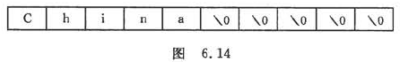

<font color='orange'>**说明:**</font>	字符数组并不要求它的最后一个字符为' \0 ',设置可以不包含' \0 '.像以下这样写完全是合法的:

```c
char c[5]={'C','h','i','n','a'};
```

是否需要加' \0 ',完全根据需要决定.由于系统在处理字符串常量存储时会自动加上一个' \0 ',因此,为了使处理方法一致,便于测定字符串的实际长度,以及在程序中作相应的处理,在字符数组中也常常人为地加上一个' \0 '.例如:

```c
char c[5]={'C','h','i','n','a','\0'};
```

这样做,便于引用字符数组中的字符串.

如定义了以下的字符数组:

```c
char c[]={"C program."};
```

由于系统自动在最后一个字符后面加了一个' \0 ',因此 c 数组的存储情况如下:


若想用一个新的字符串代替原有的字符串"C program.",从键盘输入"Hello"分别赋给 c 数组中前面 5 个元素.如果不加' \0 '的话,字符数组中的字符如下:


新字符串和老字符串练成一片,无法区分开.如果想输出字符数组中的字符串,则会连续输出:

Hellogram.

如果在"Hello"后面加一个' \0 ',它取代了第 6 个字符"g".在数组中的存储情况为


' \0 '是字符串结束标志,如果用以下语句输出数组 c 中的字符串:

```c
printf("%s\n",c);		//输出数组 c 中的字符串
```

在输出字符数组中的字符串时,遇' \0 '就停止输出,因此只输出了字符串"Hello".而不会输出"Hellogram.".

从这里可以看到在字符串末尾加' \0 '的作用.

#### 6.3.5 字符数组的输入输出

字符数组的输入输出可以由两种方法.

<font color='green'>( 1 )</font>	逐个字符输入输出.用格式符"%c"输入或输出一个字符.

<font color='green'>( 2 )</font>	将整个字符串一次输入或输出.用"%s"格式符,意思是对字符串(string)的输入输出.例如:

```c
char c[]={"China"};printf("%s\n",c);
```

在内存中数组 c 的存储情况为


输出时,遇结束符' \0 '就停止输出.输出结果为

China

<font color='orange'>**说明:**</font>

<font color='green'>( 1 )</font>	输出的字符中不包括结束符' \0 '.

<font color='green'>( 2 )</font>	用"%s"格式符输出字符串时,printf 函数中的输出项是字符数组名,而不是数组元素名.写成下面这样是不对的:

```c
printf("%s",c[0]);
```

<font color='green'>( 3 )</font>	如果数组长度大于字符串的实际长度,也只输出到遇‘ \0 ’结束.例如:

```c
char c[10]={"China"};	//字符串长度为5,连'\0'共占 6 个字符printf("%s",c);
```

只输出字符串的有效字符"China",而不是输出 10 个字符,这就是用字符串结束标志的好处.

<font color='green'>( 4 )</font>	如果一个字符数组中包含一个以上' \0 ',则遇第一个' \0 '时输出就结束.

<font color='green'>( 5 )</font>	可以用 scanf 函数输入一个字符串.例如:

```c
scanf("%s",c);
```

scanf 函数中的输入项 c 是已定义的字符数组名,输入的字符串应短于已定义的字符数组的长度.例如,已定义:

```c
char c[6];
```

从键盘输入:

China$$\swarrow$$

系统会自动在 China 后面加上一个' \0 '结束符.如果利用一个 scanf 函数输入多个字符串,则应在输入时以空格分隔.例如:

```c
char str1[5],str2[5],str3[5];scanf("%s%s%s",str1,str2,str3);
```

输入数据:

How are you?$$\swarrow$$

由于有空格字符分隔,作为 3 个字符串输入.在输入完后,str1,str2,str3数组的状态如下:


数组中未被赋值的元素的值自动置' \0 '.若改为

```c
char str[13];scanf("%s",str);
```

如果输入以下 12 个字符:

How are you?$$\swarrow$$

由于系统把空格字符作为输入的字符串之间的分隔符,因此只将空格符前的字符"How"送到 str 中.由于把"How"作为一个字符串处理,故在其后加' \0 '.str 数组的状态为


<font color='orange'>**注意:**</font>	scanf 函数中的输入项如果是字符数组名,不要再加地址符 & ,因为在 C 语言中 数组名代表该数组的起始地址.分析图 6.15 所示的字符数组,若数组名为 c ,占 6 个字节.数组名 c 代表地址 2000.可以用下面的输出语句得到数组的起始地址.

```c
printf("%o",c);		//用八进制形式输出数组c 的起始地址
```

可以得到数组 c 的起始地址(例如 2000).可知数组名 c 代表数组起始地址.

<font color='green'>( 6 )</font>	前面介绍的输出字符串的方法:

```c
printf("%s",c);
```

实际上是这样执行的:按字符数组名 c 找到其数组起始地址,然后逐个数出其中的字符,直到遇' \0 '为止.

#### 6.3.6 使用字符串处理函数

在 C 函数库中提供了一些用来专门处理字符串的函数,使用方便.几乎所有版本的 C 语言编译系统都提供这些函数.下面介绍接种常用的函数.

<font color='red'>**1. puts 函数--输出字符串的函数**</font>

其一般形式为

<font color='red'>**puts(字符数组)**</font>

其作用是将一个字符串(以' \0 '结束的字符序列)输出到终端.假如已定义 str 是一个字符数组名,且该数组已被初始化为"China".则执行:

```c
puts(str);
```

其结果是在终端上输出"China".由于可以用 printf 函数输出字符串,因此 puts 函数用得不多.用 puts 函数输出的字符串中可以包含转义字符.

```c
char str[]={"China\nBeijing"};puts(str);
```

输出:

China

Beijing

在输出时将字符串结束标志' \0 '转换成' \n ',即输出完字符串后换行.

<font color='red'>**2. gets 函数--输入字符串的函数**</font>

其一般形式为

<font color='red'>**gets(字符数组)**</font>

其作用是从中断输入一个字符串到字符数组,并且得到一个函数值.该函数值是字符数组的起始地址.如执行下面的函数:

```c
gets(str);		//str是已定义的字符数组
```

从键盘输入:

Computer$$\swarrow$$

将输入的字符串"Computer"送给字符数组 str(<font color='red'>**送给字符数组的共有 9 个字符,而不是 8 个字符**</font>),返回的函数值是字符数组 str 的起始地址.一般利用 gets 函数的目的是向字符数组输入一个字符串,而不大关心其函数值.

<font color='orange'>**注意:**</font>	用 puts 和 gets 函数只能输出或输入一个字符串,不能写成

```c
puts(str1,str2);gsts(str1,str2);
```

<font color='red'>**3. strcat 函数--字符串连接函数**</font>

其一般形式为

<font color='red'>**strcat(字符数组1,字符数组2)**</font>

strcat 是 STRing CATenate(字符串连接)的缩写.其作用是把两个字符数组中的字符串连接起来,把字符串 2 接到字符串 1 的后面,结果放在字符数组 1 中,函数调用后得到一个函数值--字符数组 1 的地址.例如:

```c
char str1[30]={"People's Republic of"};char str2[]={"China"};printf("%s",strcat(str1,str2));
```

输出:

People's republic of China

连接前后的状况见图 6.16所示.


<font color='orange'>**说明:**</font>

<font color='green'>( 1 )</font>	字符数组 1 必须足够大,可以容纳连接后的新字符串.

<font color='green'>( 2 )</font>	连接前两个字符串后都有' \0 ',连接时第一个字符串后的' \0 '取消,只保留第二个的.

<font color='red'>**4. strcpy 和 strncpy 函数--字符串复制函数**</font>

其一般形式为

<font color='red'>**strcpy(字符数组1,字符串2)**</font>

strcpy 是 STRingCoPY(字符串复制)的简写.它表示"字符串复制函数",作用是将字符串 2 复制到字符串 1 中去.例如:

```c
char str[10],str2[]={"China"};strcpy(str1,str2);
```

执行后,str1 的状态如下:


<font color='orange'>**说明:**</font>

<font color='green'>( 1 )</font>	字符数组 1 必须足够大容纳字符串 2.

<font color='green'>( 2 )</font>	"字符数组 1"必须写成数组名形式,"字符串 2"可以是数组名,也可以是字符串常量.例如:

```c
strcpy(str1,"China");
```

<font color='green'>( 3 )</font>	如果在复制前 str1 未初始化,则 str1 中个字节的内容未知,复制时将 str2 中的字符串和其后的' \0 '一起复制到字符数组 1 中的前 6 个字符中,最后 4 个字符不一定是' \0 '.

<font color='green'>( 4 )</font>	不能用赋值语句将一个字符串常量或字符数组直接给一个字符数组.下面两行都是不合法的.

```c
str1="China";	//企图用赋值语句将一个字符常量直接赋给一个字符数组str1=str2;		//企图用赋值语句将一个字符数组直接赋给另一个字符数组
```

只能用 strcpy 函数将一个字符串复制到另一个字符数组中去,用赋值语句只能将一个字符赋给一个字符型变量或字符数组元素.如下面的语句是合法的.

```c
char a[5],c1,c2;c1='A';c2='B';a[0]='C';a[1]='h';a[2]='i';a[3]='n';a[4]='a';
```

<font color='green'>( 5 )</font>	可以用 strncpy 函数将字符串 2 中前面 n 个字符复制到字符数组 1 中去.

```c
strncpy(str1,str2,2);
```

作用是将 str2 中最前面 2 个字符复制到 str1 中,取代 str1 中原有的最前面 2 个字符.<font color='red'>但复制的字符个数 n 不应多于 str1 中原有的字符(不包括' \0 ').</font>

<font color='red'>**5. strcmp 函数--字符串比较函数**</font>

其一般形式为

<font color='red'>**strcmp(字符串1,字符串2)**</font>

strcmp 是 STRing CoMPare(字符串比较)的缩写.它的作用是比较字符串 1 和字符串 2.

```c
strcmp(str1,str2);strcmp("China","Korea");strcmp(str1,"Beijing");
```

<font color='red'>**说明:**</font>	<font color='orange'>字符串比较的规则是:将两个字符串自左至右逐个字符相比(按 ASCII 码值大小比较),直到出现不同的字符或遇到' \0 '为止.</font>

<font color='green'>( 1 )</font>	若全部字符相同,则认为两个字符串相等;

<font color='green'>( 2 )</font>	若出现不相同的字符,<font color='red'>则以第 1 对不相同的字符的比较结果为准.</font>

<font color='red'>如果参加比较的两个字符串都由英文字母组成,则有一个简单的规律:**在英文字典中为止在后面的为"大"**</font>

比较的结果由函数值带回.

①	如果字符串 1==字符串 2,则函数值为0.

②	如果字符串 1>字符串 2,则函数值为一个正整数.

③	如果字符串 1<字符串 2,则函数值为一个负整数.

<font color='red'>**注意:**对两个字符串比较,不能用以下形式:</font>

```c
if(str1>str2)    printf("yes");
```

只能用

```c
if(strcmp(str1,str2)>0)    printf("yes");
```

<font color='red'>**6. strlen 函数--测字符串长度的函数**</font>

其一般形式为

<font color='red'>**strlen(字符数组)**</font>

strlen 是 STRing LENgth(字符串长度)的缩写.它是测试字符串长度的函数.函数的值为字符串中的实际长度(不包括' \0 ').

```c
char str[10]={"China"};printf("%d\n",strlen(str));
```

输出的结果不是 10 ,也不是 6 ,而是 5.也可以直接测试字符串常数的长度.

```c
strlen("China");
```

<font color='red'>**7. strlwr 函数--转换为小写的函数**</font>

其一般形式为

<font color='red'>**strlwr(字符串)**</font>

strlwr 是 STRing LoWeRcase(字符串小写)的缩写.函数作用是将字符串中大写字母换成小写字母.

<font color='red'>**8. strupr 函数--转换为大写的函数**</font>

其一般形式为

<font color='red'>**strupr(字符串)**</font>

strupr 是 STRing UPpeRcase(字符串大写)的缩写.函数作用是将字符串中小写字母换成大写字母.

以上介绍了常用的 8 种字符串处理函数,在使用字符串处理函数时,应当把"string.h"文件包含进去.

#### 6.3.7 字符数组应用举例

<font color='green'>**例 6.8**</font>	输入一行字符,统计其中有多少个单词,单词之间用空格分隔开.

<font color='green'>**解题思路:**</font>	问题的关键是怎样确定"出现一个新单词了".可以采取这样的方法:从第 1 个字符开始逐个字符进行检查,判断此字符是否是新单词的开头,如果是,就是变量 num 的值加 1 ,最后得到的 num 的值就是单词总数.

判断是否出现新单词,可以由是否有空格出现来决定(连续的空格作为出现一次空格;一行开头的空格不统计在内).如果测出某一个字符为非空格,而它前面的字符是空格,则表示"新的单词开始了",此时使 num 累加 1.如果当前字符为非空格而其前面的字符也是非空格,则意味着仍然是原来那个单词的继续,num 不再累加 1.用变量 word 作为判别当前是否开始了一个新单词的标志,若 word=0 表示未出现新单词,如出现了新单词,就把 word 置成 1.

前面一个字符是否是空格可以从 word 的值看出来,若 word=0,则表示前面一个字符是空格;如果 word=1,意味着前面一个字符为非空格,可以用图 6.17 表示.


以输入"I am a boy."为例,说明在对每个字符做检查时的有关参数状态,见表 6.1 所示.


画出 N-S 流程图,见图 6.18.


```c
#include <stdio.h>int main(){    char string[81];    int i, num = 0, word = 0;    char c;    gets(string);                             //输入一个字符串给字符数组string    for (i = 0; (c = string[i]) != '\0'; i++) //只要字符不是'\0'就继续执行循环    {        if (c == ' ')            word = 0; //如果是空格字符,使word置0        else if (word == 0) //如果不是空格字符且word原值为0        {            word = 1; //使word置1            num++;    //num累加1,表示新增一个单词        }    }    printf("There are %d word in this line.\n", num); //输出单词数    system("pause");    return 0;}
```

<font color='green'>**运行结果:**</font>


<font color='green'>**程序分析:**</font>	循环的条件表达式为"(c=string[i])!=' \0 '",包含了一个赋值操作和一个关系运算,在此表达式中又包括可一个赋值表达式和关系表达式.<font color='orange'>通过此例看一看到:C 语言把赋值运算作为表达式,它可以出现在另一个表达式中,使程序灵活,精炼.</font>

<font color='green'>**例 6.9**</font>	有 3 个字符串,要求找出其中最大者.

<font color='green'>**解题思路:**</font>	可以设一个二维的字符数组 str ,大小为 3×20 ,即有 3 行 20 列.每一行存放一个字符串.此二维数组的存储情况见图 6.19.


如前所述,可以把 str[0],str[1],srt[2]看做 3 个一维字符数组,可以把它们如同一维数组那样处理,用 gets 函数分别读入 3 个字符串,赋给 3 个一维字符数组.然后经过 3 次两两比较,就可以得到值最大者,把它放在一维字符数组 string 中.画出 N-S 流程图,见图 6.20.


<font color='green'>**编写程序:**</font>

```c
#include <stdio.h>#include <string.h>int main(){    char str[3][20];		//定义二维字符数组    char string[20];		//定义一维字符数组,作为交换字符串时临时字符数组    int i;    for(i=0;i<3;i++)    {        gets(str[i]);	//读入3个字符串,分别给str[0],str[1],str[2]    }    if(strcmp(str[0],str[1])>0)	//若str[0]>str[1]    {        strcpy(string,str[0]);	//把str[0]拷贝到string    }    else	//若str[0]<str[1]    {        strcpy(string,str[1]);	//拷贝str[1]到string    }    if(strcmp(str[2],string)>0)	//若str[2]>string    {        strcpy(string,str[2]);	//把str[2]拷贝到string    }    printf("\nThe largest string is: %s\n",string);	//输出string    system("pause");    return 0;}
```

<font color='green'>**运行结果:**</font>


<font color='green'>**程序分析:**</font>

<font color='green'>( 1 )</font>	流程图和程序注释中的"大于"是指两个字符串的比较中的"大于".

<font color='green'>( 2 )</font>	str[0],str[1],str[2]和string是一维字符数组,其中可以存放一个字符串.

<font color='green'>( 3 )</font>	strcpy 函数将 str[i] 复制到 string 时,最后都有一个' \0 '.因此,输出时遇到 string 中第一个' \0 '即结束输出,并不全部输出.

<div align="center"><font color='red' size=5>习 题 6</font></div>


1. <font color='green'>筛选法又称筛法，具体做法是：先把N个自然数按次序排列起来。1不是质数，也不是合数，要划去。第二个数2是质数留下来，而把2后面所有能被2整除的数都划去。2后面第一个没划去的数是3，把3留下，再把3后面所有能被3整除的数都划去。3后面第一个没划去的数是5，把5留下，再把5后面所有能被5整除的数都划去。这样一直做下去，就会把不超过N的全部合数都筛掉，留下的就是不超过N的全部质数。因为希腊人是把数写在涂腊的板上，每要划去一个数，就在上面记以小点，寻求质数的工作完毕后，这许多小点就像一个筛子，所以就把埃拉托斯特尼的方法叫做“埃拉托斯特尼筛”，简称“筛法”。（另一种解释是当时的数写在纸草上，每要划去一个数，就把这个数挖去，寻求质数的工作完毕后，这许多小洞就像一个筛子。）</font>

   <font color='green'>**构思:**</font>	建立 1 ~ 100 的数组,分几次将不是质数的元素置 0 ,最后将非 0 的元素输出.

   <font color='green'>**编写程序:**</font>

   ```c
   #include <stdio.h>int main(){    int i,j=0,num[100];    for(i=0;i<100;i++)    {        num[i]=i+1;	//数组初始化        num[0]=0;        if(i>2 && num[i]%2==0)        {            num[i]=0;        }        if(i>3 && num[i]!=0 && num[i]%3==0)        {            num[i]=0;        }        if(i>5 && num[i]!=0 && num[i]%5==0)        {            num[i]=0;        }        if(i>7 && num[i]!=0 && num[i]%7==0)        {            num[i]=0;        }    }    for(i=0;i<100;i++)    {        if(num[i]!=0)        {            printf("%d ",num[i]);            j++;            if(j%5==0)            {                printf("\n");            }        }    }    putchar('\n');    system("pause");    return 0;}
   ```

   

2. <font color='green'>选择排序法是一种不稳定的排序算法。它的工作原理是每一次从待排序的数据元素中选出最小（或最大）的一个元素，存放在序列的起始位置，然后，再从剩余未排序元素中继续寻找最小（大）元素，然后放到已排序序列的末尾。以此类推，直到全部待排序的数据元素排完。</font>

   <font color='green'>常见的选择排序可以分为[直接选择排序]（Straight selection sort）、[树形选择排序]（Tree-type selection sort）以及[堆排序]（Heap sort）。</font>

   <font color='green'>（1）[直接选择排序]。①基本思想。实现思想是每步从排序记录中选出排序码最小（最大）的记录，放在已排序记录序列的最后（前）；②算法特点。直接选择排序算法n个记录的文件的直接选择排序可经过n-1趟直接选择排序得到有序结果。</font>

   <font color='green'>（2）[树形选择排序]。①基本思想。其实现思想是保存先前比较的结果以减少比较次数，是一种不稳定的排序方法。首先对n个记录的关键字进行两两比较，然后在n/2个较小者之间再进行两两比较，如此重复，直至选出最小的记录为止。</font>

   <font color='green'>（3）[堆排序]。①基本思想。堆排序是一种树形选择排序，是对直接选择排序的有效改进；②算法描述。从算法描述来看，堆排序需要两个过程，即建立堆和堆顶与堆的最后一个元素交换位置。所以堆排序有两个函数组成，一是建堆的渗透函数，二是反复调用渗透函数实现排序的函数；③算法特点。堆排序可通过树形结构保存部分比较结果，可减少比较次数。但由于建初始堆所需的比较次数较多，所以堆排序不适宜于记录数较少的文件。</font>

   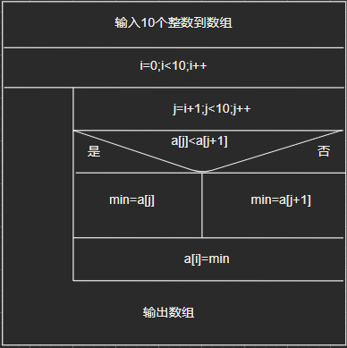

   

   ```c
   #include <stdio.h>int main(){    int i,j,t,min;    int a[10];    for(i=0;i<10;i++)    {        scanf("%d",&a[i]);    }    for(i=0;i<10;i++)    {        for(j=i+1;j<10;j++)        {            if(a[i]<a[j])            {                min=a[i];                            }            else            {                min=a[j];                a[j]=a[i];                a[i]=min;            }        }    }    for(i=0;i<10;i++)    {        printf("%d ",a[i]);    }    system("pause");    return 0;}
   ```

   

3. ```c
   #include <stdio.h>int main(){    int a[3][3];    int n1,n2,i,j;    printf("Please enter an array in a 3 by 3 matrix:\n");    for(i=0;i<3;i++)    {        for(j=0;j<3;j++)        {            scanf("%d",&a[i][j]);        }    }    n1=a[0][0]+a[1][1]+a[2][2];    n2=a[0][2]+a[1][1]+a[2][0];    printf("两对角线之和分别为:%d,%d\n",n1,n2);    system("pause");    return 0;}
   ```

   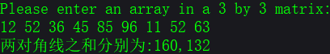

4. <font color='green'>**构思:**</font>	先判断数组的排列是升序还是降序,再分别分3种情况处理,①在第一个元素之前,所有元素向后移,放在第一个元素位置即可②在最后一个元素之后,直接放在最后一个元素之后即可③在数组中间,找出介于a[i]与a[i+1]的位置,将a[i+1]后面的数全部向数组后移一位,将这个数赋给a[i+1].

   ```c
   #include <stdio.h>int main(){    //int b[15] = {2,4,6,8,10,12,14,16,18,20};    int a[15] = {20,18,16,14,12,10,8,6,4,2};    int i = 0,j, k;    printf("Please enter a integer:\n");    scanf("%d", &j);    if(a[0]<a[1])   //判断数组排列是否为升序    {        if(j<a[0])  //小于第一个元素时        {                for(k=0;k<10;k++)   //所有元素向后移                {                    a[10-k]=a[9-k];                }                a[0]=j;     //令第一个元素等于j        }        else if(a[9]<j)     //大于最后一个元素时        {            a[10]=j;        //令第11个元素等于j        }        else        //介于元素中间时        {            for(i=1;i<9;i++)            {                if(a[i]<j && a[i+1]>j)                {                    for(k=0;k<=9-i;k++)     //将大于j的元素开始后面的都向后移                    {                        a[10-k]=a[9-k];                    }                    a[i+1]=j;                    break;                }            }        }    }    else    //如果为降序排列    {        if(a[0]<j)        {                for(k=0;k<10;k++)                {                    a[10-k]=a[9-k];                }                a[0]=j;                    }        else if(a[9]>j)        {            a[10]=j;        }        else        {            for(i=1;i<9;i++)            {                if(a[i]>j && a[i+1]<j)                {                    for(k=0;k<=9-i;k++)                    {                        a[10-k]=a[9-k];                    }                    a[i+1]=j;                    break;                }            }        }    }    for (i = 0; i < 11; i++)    //数组输出    {        printf("%d ", a[i]);    }    printf("\n");    system("pause");    return 0;}
   ```

   

5. 看数组有多少个元素,单数个中间不动,两边对称交换,双数两边对称交换

   ```c
   #include <stdio.h>int main(){    int a[5]={8,6,5,4,1};    int i,t;    for(i=0;i<5;i++)    {        printf("%d ",a[i]);    }    for(i=0;i<5/2;i++)    {        t=a[i];        a[i]=a[4-i];        a[4-i]=t;    }    printf("\n");    for(i=0;i<5;i++)    {        printf("%d ",a[i]);    }    printf("\n");    system("pause");    return 0;}
   ```

   <font color='green'>**运行结果:**</font>

   

6. <font color='green'>**构思:**</font>	建立10×10数组定义好前两组,及每组第一个元素

   ```c
   #include <stdio.h>int main(){    int a[10][10]={{1},{1,1},{1},{1},{1},{1},{1},{1},{1},{1}};    int i,j;    for(i=2;i<10;i++)    {        for(j=1;j<=i;j++)        {            a[i][j]=a[i-1][j]+a[i-1][j-1];        }    }    for(i=0;i<10;i++)    {        for(j=0;j<=i;j++)        {            printf("%-3d ",a[i][j]);        }        printf("\n");    }    printf("\n");    system("pause");    return 0;}
   ```

   <font color='green'>**运行结果:**</font>

   

7. 没有思绪

8. <font color='green'>**构思:**</font>	先找出第一行最大的元素,看该元素是否为该列最小.

   ```c
   #include <stdio.h>int main(){    int a[2][6]={{2,3,4,5,6,7},{6,7,4,3,2,8}};    int i,j,max,k;    max=a[0][0];    for(i=0;i<6;i++)    {        if(a[0][i]>max)        {            max=a[0][i];            k=i;        }    }    if(a[0][k]<a[1][k])    {        printf("鞍点为%d\n",k);    }    else    {        printf("这个数组没有鞍点\n");    }    system("pause");    return 0;}
   ```

   <font color='green'>**运行结果:**</font>

   

9. <font color='green'>在计算机科学中，**折半搜索**（英语：half-interval search），也称**二分搜索**（英语：binary search）、**对数搜索**（英语：logarithmic search），是一种在有序数组中查找某一特定元素的搜索算法。</font>

   <font color='green'>搜索过程从数组的中间元素开始，如果中间元素正好是要查找的元素，则搜索过程结束；如果某一特定元素大于或者小于中间元素，则在数组大于或小于中间元素的那一半中查找，而且跟开始一样从中间元素开始比较。如果在某一步骤数组为空，则代表找不到。这种搜索算法每一次比较都使搜索范围缩小一半。</font>

   <font color='green'>折半查找法是效率较高的一种查找方法。假设有已经按照从小到大的顺序排列好的五个整数a0~a4，要查找的数是X，其基本思想是： 设查找数据的范围下限为l=0，上限为h=4，求中点m=（l+h）/2，用X与中点元素am比较，若X等于am，即找到，停止查找；否则，若X大于am，替换下限l=m+1，到下半段继续查找；若X小于am，换上限h=m-1，到上半段继续查找；如此重复前面的过程直到找到或者l>h为止。如果l>h，说明没有此数，打印找不到信息，程序结束。</font>

   ```c
   #include <stdio.h>int main(){    int a[15]={15,14,13,12,11,10,9,8,7,6,5,4,3,2,1};    int h=14,i=0,s=0,j,k,d,m; //h为比较上限,i为下限,s控制循环,k保存上限,d保存下限.    printf("Please enter n=?\n");    scanf("%d",&m);    k=h;d=i;    while(1)    {        s++;        h=(h+i)/2;        if(a[h]==m)        {            printf("%d\n",h);            break;        }        else if(a[h]>m){i=h;h=k;}	//m小于a[h]时改变下限,重置上限        else {i=d;k=h;};	//大于时改变上限,重置下限        if(s==5)        {            printf("Not exist!\n");            break;        }    }    system("pause");    return 0;}
   ```

   <font color='green'>**运行结果:**</font>

   

10. 看做a[3] [80]的字符数组根据 ASCII 码分别统计.

    ```c
    #include <stdio.h>int main(){    char a[3][80]={{"I am a student!"},{"I'm 18 years old."},{"One Two Three 1 2 3 !@#"}};    int up_c=0,low_c=0,num_c=0,sp_c=0,ot_c=0,i,j;/*    for(i=0;i<3;i++)    {        gets(a[i][80]);    }*/    for(i=0;i<3;i++)    {        for(j=0;j<80;j++)        {            if(a[i][j]>='A' && a[i][j]<='Z')            {                up_c++;            }            else if(a[i][j]>='a' && a[i][j]<='z')            {                low_c++;            }            else if(a[i][j]==' ')            {                sp_c++;            }            else if(a[i][j]>='0' && a[i][j]<='9')            {                num_c++;            }            else if(a[i][j]!='\0')            {                ot_c++;            }        }        puts(a[i]);    }    printf("大写字母:%d,小写字母:%d,数字:%d,空格:%d,其他:%d\n",up_c,low_c,num_c,sp_c,ot_c);    system("pause");    return 0;}
    ```

    <font color='green'>**运行结果:**</font>

    


11. 定义字符数组a[5] [9],初始化并输出

    ```c
    #include <stdio.h>int main(){    char str[5][20]={{' '},{' '},{' '},{' '},{' '}};    int i,j,k,l;    for(i=0;i<5;i++)    {        j=i;        for(l=0;l<j;l++)        {            str[i][l]=' ';        }        for(k=0;k<5;k++)        {            str[i][j]='*';            str[i][j+1]=' ';            j=j+2;        }        puts(str[i]);    }        printf("\n");    system("pause");    return 0;}
    ```

    <font color='green'>**运行结果:**</font>

    

    未完成,待改进.

12. 大写字母小写字母两个数组两头交换

    ```c
    #include <stdio.h>int main(){    int a[2][26];    int i,j,k,m,n;    char l,str[50];    m=65;n=97;    for(j=0;j<26;j++)    {        a[0][j]=m;        m++;        a[1][j]=n;        n++;    }    printf("Please enter the message:\n");    gets(str);    for(i=0;i<50;i++)    {        l=str[i];    if('A'<=l && l<='Z')    {        k='Z'-l;        str[i]=a[0][k];    }    else if('a'<=l && l<='z')    {        k='z'-l;        str[i]=a[1][k];    }    else    {        l=='\0';        break;    }    }    puts(str);    system("pause");    return 0;}
    ```

    **<font color='green'>运行结果:</font>**

    

13. 将str2复制到str1后面.

    ```c
    #include <stdio.h>int main(){    char str1[50]={"I am"},str2[20]={"student"};    int i=0,j=0,k;    puts(str1);    puts(str2);    for(i=0;i<50;i++)    {        if(str1[i]!='\0')   //检测是否到了str1末尾        {            continue;        }        else    //开始准备复制str2到str1末尾        {            k=i;            str1[k]=' ';      //添加一个空格符              for(j=0;j<20;j++)	//开始复制            {                k++;                str1[k]=str2[j];                if(str2[j]=='\0')   //如果检测到str2末尾结束循环                {                    break;                }            }            break;  //复制结束结束循环        }    }    puts(str1);     //输出新的str1    system("pause");    return 0;}
    ```

    <font color='green'>**运行结果:**</font>

    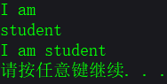

14. ```c
    #include <stdio.h>int main(){    char str1[20],str2[10];    int i,j,k;    printf("Please enten two strings:\n");    gets(str1);    gets(str2);    for(i=0;i<10;i++)    {        if(str1[i]==str2[i])        {            continue;        }        else        {            k=str1[i]-str2[i];            break;        }    }    printf("%d\n",k);    system("pause");    return 0;}
    ```

15. ```c
    #include <stdio.h>int main(){    char str1[50]={"I am"},str2[20]={"student"};    int i=0,j=0,k;    puts(str1);    puts(str2);    for(i=0;i<50;i++)    {        if(str1[i]!='\0')   //检测是否到了str1末尾        {            continue;        }        else    //开始准备复制str2到str1末尾        {            k=i;            str1[k]=' ';      //添加一个空格符              for(j=0;j<20;j++)	//开始复制            {                k++;                str1[k]=str2[j];                if(str2[j]=='\0')   //如果检测到str2末尾结束循环                {                    k++;                    str1[k]=str[j];                    break;                }            }            break;  //复制结束结束循环        }    }    puts(str1);     //输出新的str1    system("pause");    return 0;}
    ```

## 第 7 章 用函数实现模块化程序设计

### 7.1 为什么要用函数

如果程序的功能比较多,规模比较大,把所有的程序代码都写在一个主函数(main函数)中,就会使主函数变得庞杂,头绪不清,使阅读和维护变得困难.此外,有时程序中多次实现同一功能时,就需要重复编写实现此功能的代码.因此想到了用<font color='red'>**模块化程序设计**</font>的思路.

可以事先编好一批常用的函数来实现各种不同的功能,把它们保存在函数库中,需要时,直接在程序中调用,就可以实现相应的功能,达到预期效果.

函数一词是从英文"function"翻译过来的,其实,function 在英文中的意思即是"函数",也是"功能".从本质意义上来说,函数就是用来完成一定的功能的.这样,对函数的概念就很好理解了,所谓<font color='red'>**函数名**</font>就是给该功能起一个名字,如果该功能是用来实现数学运算的,就是数学函数.

<font color='red'>**注意:**</font>	函数就是功能.每一个函数用来实现一个特定的功能.函数的名字应反映其代表的功能.

设计一个较大的程序时,往往把它分为若干个程序模块,每个模块包括一个或多个函数,每个函数实现一个特定的功能.一个 C 程序可由一个主函数和若干个其他函数构成.有主函数调用其他函数,其他函数也可以互相调用.同一个函数可以被一个或多个函数调用任意多次.图 7.1 是一个程序中函数调用的示意图.


<font color='green'>**例 7.1**</font>	想输出以下的记过,用函数调用实现.


<font color='green'>**解题思路:**</font>	在输出的文字上下分别有一行" * "号,显然不必重复写这段代码,用一个函数 print_star 来实现输出一行" * "的功能,再写一个 printf_message 函数来输出中间一行文字,用主函数调用这两个函数即可.

<font color='green'>**编写程序:**</font>

```c
#include <stdio.h>int main(){    int print_star(void);	//void print_star()    int print_message(void);	//void print_message()        print_star();    print_message();    print_star();        putchar('\n');    system("pause");    return 0;}int print_star(void){    int i;    for(i=1;i<=20;i++)    {        printf("%c",'*');    }    putchar('\n');}int print_message(void){    printf("  How do you do!\n");}
```

<font color='green'>**运行结果:**</font>


<font color='green'>**程序分析:**</font>	print_star 和 print_message 都是用户定义的函数名,分别用来输出一行" * "和一行文字.在定义这两个函数时指定函数的类型为 void,意为函数无类型,即无函数值,也就是说执行这两个函数后不会吧任何值带回 main 函数.<font color='red'>**程序中定义函数在主函数之后,应当在 main 函数之前或 main 函数中的开头部分对以上的两个函数进行声明.函数声明的作用是把有关函数的信息提前通知编译系统,以便在编译系统对程序进行编译时知道调用的是函数而不是变量或其他对象.此外,还对调用函数的正确性进行检查.**</font>

<font color='red'>**说明:**</font>

<font color='green'>( 1 )</font>	一个 C 程序由一个或多个程序模块组成,每一个程序模块作为一个源程序文件.对较大的程序,一般不希望把所有内容全部放在一个文件中,而是将它们分别放在若干个源文件中,有若干个源程序组成一个 C 程序.这样便于分别编写和编译,提高调式效率.一个源程序文件可以为多个 C 程序共用.

<font color='green'>( 2 )</font>	一个源程序文件由一个或多个函数以及其他有关内容组成.一个源程序文件是一个编译单位,在程序编译时是以源程序文件为单位进行编译的,而不是以函数为单位进行编译的.

<font color='green'>( 3 )</font>	C 程序的执行是从 main 函数开始的,如果在 main 函数中调用其他函数,在调用后流程返回到 main 函数,在 main 函数中结束整个程序的运行.

<font color='green'>( 4 )</font>	所有函数都是平行的,即在定义函数时是分别进行的,是互相独立的.一个函数并不丛属于另一个函数,即函数不能嵌套定义.函数间可以互相调用,但不能调用 main 函数.main 函数时被操作系统调用的.

<font color='green'>( 5 )</font>	从用户使用的角度看,函数由两种.

<font color='green'>①</font>	库函数,它是由系统提供的,用户不必自己定义,可以直接使用,应该说明,不同的 C 语言编译系统提供的库函数的数量和功能会有些不同,基本的函数是共同的.

<font color='green'>②</font>	用户自己定义的函数,它是用以解决用户专门需要的函数.

<font color='green'>( 6 )</font>	从函数的形式看,函数分为两类.

<font color='green'>①</font>	无参函数.在调用无参函数时,主调函数不向被调函数传递数据.无参函数一般用来执行指定的一组操作.无参函数可以带回或不带回函数值,但一般以不带回函数值的居多.

<font color='green'>②</font>	有参函数.在调用函数时,主调函数在调用被调用函数时,通过参数向被调用函数传递数据,一般情况下,执行被调用函数时会得到一个函数值,共主调函数使用.

### 7.2 怎样定义函数

#### 7.2.1 为什么要定义函数

C 语言要求,在程序中用到的所有函数,必须"<font color='red'>先定义,后使用</font>".如果事先不定义,编译系统不会知道该函数是什么,要实现什么功能.

定义函数应包括以下几个内容:

<font color='green'>( 1 )</font>	指定函数的名字,以便以后调用.

<font color='green'>( 2 )</font>	指定函数的类型,即函数返回值的类型.

<font color='green'>( 3 )</font>	指定函数的参数的名字和类型,以便在调用函数时向它们传递数据.无参函数不需要这项.

<font color='green'>( 4 )</font>	指定函数应当完成什么操作,也就是函数是做什么的,即函数的功能.这是最重要的,是在函数体中解决的.

使用库函数时须用 #include 指令把有关的头文件包含到本文件模块中即可.

#### 7.2.2 定义函数的方法

<font color='red'>**1. 定义无参函数**</font>

<font color='red'>**类型名 函数名()**</font>

<font color='red'>**{**</font>

  <font color='red'>**函数体**</font>

<font color='red'>**}**</font>

或

<font color='red'>**类型名 函数名(viod)**</font>

<font color='red'>**{**</font>

  <font color='red'>**函数体**</font>

<font color='red'>**}**</font>

函数体包括<font color='red'>**声明部分**</font>和<font color='red'>**语句部分**</font>

<font color='red'>**2. 定义有参函数**</font>

定义有参函数的一般形式为

<font color='red'>**类型名 函数名(形式参数表列)**</font>

<font color='red'>**{**</font>

  <font color='red'>**函数体**</font>

<font color='red'>**}**</font>

<font color='red'>**3. 定义空函数**</font>

<font color='red'>**类型名 函数名()**</font>

<font color='red'>**{}**</font>

在程序设计初期阶段可以在将来准备扩充功能的地方写上一个空函数(函数名取将来采用的实际函数名),只是这些函数暂时还未编写好,先用空函数占一个位置,等以后扩充程序功能时用一个编好的函数代替它.这样做程序的结构清楚,可读性好,以后扩充新功能方便,对程序结构影响不大.

### 7.3 调用函数

#### 7.3.1 函数调用的形式

一般形式

<font color='red'>**函数名(实参表列)**</font>

按函数调用在程序中出现的形式和位置来分,可以有以下 3 中函数调用方式.

<font color='red'>**1. 函数调用语句**</font>

把函数调用单独作为一个语句.要求函数完成一定的操作.

<font color='red'>**2. 函数表达式**</font>

它是赋值表达式中的一部分.这是要求函数带回一个确定的值以参加表达式的运算.

<font color='red'>**3. 函数参数**</font>

函数调用作为另外一个函数调用时的实参.

<font color='red'>**说明:**</font>	调用函数并不一定要求包括分号,只有作为函数调用语句才需要有分号.如果作为函数表达式或函数参数,函数本身是不必有分号的.

#### 7.3.2 函数调用时的数据传递

<font color='red'>**1. 形式参数和实际参数**</font>

在调用<font color='red'>**有参函数**</font>时,主调函数和被调用函数之间有数据传递关系.从前面已知:在定义函数时函数名后面括号中的变量名称为"<font color='red'>**形式参数**</font>"(简称"形参")或"<font color='red'>**虚拟参数**</font>".在主调函数中调用一个函数时,函数名后面括号中的参数称为"<font color='red'>**实际参数**</font>"(简称"实参").实际参数可以是常量,变量或表达式.

<font color='red'>**2. 实参和形参见的数据传递**</font>

在函数调用过程中,系统会把实参的值传递给被调用函数的形参.或者说,形参从实参得到一个值.该值在函数调用期间有效,可以参加该函数中的运算.

在调用函数过程中发生的实参与形参间的数据传递,常称为"<font color='red'>虚实结合</font>".

<font color='green'>**例 7.2**</font>	输入两个整数,要求输出其中总值较大者.要求用函数来找到大数.

```c
#include <stdio.h>int main(){    int max(int x,int y);        int i,j;    printf("Please enter two integer numbers:\n");    scanf("%d%d",&i,&j);    printf("max is %d\n",max(i,j));        system("pause");}int max(int x,int y){    return(x>y?x:y);}
```

<font color='green'>**运行结果:**</font>


<font color='green'>**程序分析:**</font>	先定义 max 函数(注意第 1 行的末尾没有分号).第 1 行定义了一个函数名 max,函数类型为 int.指定两个形参 x 和 y,形参的类型为 int.

主函数中包含了一个函数调用 max(a,b).max 后面括号内的 a 和 b 是实参.a 和 b 是在 main 函数中定义的变量,x 和 y 是函数 max 的形式参数.通过函数调用,在两个函数之间发生数据传递,实参 a 和 b 的值传递给形参 x 和 y,在 max 函数中把 x 和 y 中的大者赋给变量 z,z 的值作为函数返回值返回 main 函数,赋给变量 c.见图 7.2.

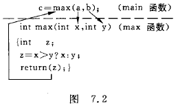

#### 7.3.3 函数调用的过程

<font color='green'>( 1 )</font>	在定义函数中指定的形参,在未出现函数调用时,它们并不占内存中的存储单元.在发生函数调用时,函数 max 的形参被临时分配内存单元.

<font color='green'>( 2 )</font>	将实参对应的值传递给形参.如图 7.3 所示,实参的值为 2,把 2 传递给相应的形参 x,这是形参 x 就得到值 2,同理,形参 y 得到值 3.


<font color='green'>( 3 )</font>	在执行 max 函数期间,犹豫形参已经有值,就可以了利用形参进行有关的运算(例如把 x 和 y 比较,把 x 或 y 的值赋给 z 等).

<font color='green'>( 4 )</font>	通过 return 语句将函数值带回到主调函数.例 7.2 中在 return 语句中指定的返回值是 z,这个 z 就是函数 max 的值(又称返回值).执行 return 语句就把这个函数返回值带回主调函数 main.应当注意返回值的类型与函数类型一致.如 max 函数为 int 型,返回值是变量 z,也是 int 型.二者一致.如果函数不需要返回值,则不需要 return 语句.这时函数的类型应定义为 void 类型.

<font color='green'>( 5 )</font>	调用结束,形参单元被释放.<font color='yellow'>注意:</font>实参单元仍保留并维持原值,没有改变.如果在执行一个被调用函数时,形参的值发生改变,不会改变主调函数的实参的值.例如,若在执行 max 函数过程中 x 和 y 的值变为 10 和 15,但 a 和 b 仍为 2 和 3,见图 7.4.这是因为实参与形参是两个不同的存储单元.


<font color='green'>**注意:**</font>	实参向形参的数据传递是"值传递",单向传递,只能由实参传给形参,而不能由形参传给实参.实参和形参在内存中占有不同的存储单元,实参无法得到形参的值.

#### 7.3.4 函数的返回值

通常,希望通过函数调用使主调函数能得到一个确定的值,这就是函数值(函数的返回值).例如,在例 7.2 的主函数中有 c=max(2,3); 从 max 函数的定义中可以知道:函数调用 max(2,3) 的值是 3,max(5,3) 的值是 5.3 和 5 就是函数的返回值.赋值语句把这个函数值赋给变量 c.

下面对函数值做一些说明.

<font color='green'>( 1 )</font>	<font color='green'>**函数的返回值是通过函数中的 return 语句获得的.**</font>return 语句将被调用函数中的一个确定值带回到主调函数中去(见图 7.2 中从 return 语句返回的箭头).如果需要从被调用函数带回一个函数值(供主调函数使用),被调用函数中必须包含 return 语句.如果不需要从被调用函数带回函数值可以不要 return 语句.

一个函数中可以有一个以上的 return 语句,执行到那一个 return 语句,那一个 return 语句就起作用.return 语句后面的括号可以不要,如"return z;"与"return(z);"等价. return 后面的值可以是一个表达式.例如,例 7.2 中的函数 max 可以改写如下:

```c
max(int x,int y){    return(x>y?x:y);}
```

这样的函数体更为简短,只用一个 return 语句就把求值和返回都解决了.

<font color='green'>( 2 )</font>	<font color='green'>**函数指的类型**</font>	既然函数有返回值,这个值当然应术语某一个确定的类型,应当在定义函数时指定函数的类型.例如下面是 3 个函数的首行:

```c
int max(float x,float y)	//函数值为整型**主要看前面的定义类型,也就是返回值的类型**char letter(char c1,char c2)	//函数值为字符型double min(int x,int y)		//函数值为双精度型
```

<font color='green'>**注意:**</font>	在定义函数要指定函数的类型.

<font color='green'>( 3 )</font>	<font color='green'>**在定义函数时指定的函数类型一般应该和 return 语句中的表达式类型一致.**</font>例如,例 7.2 中指定的 max 函数值为整型,而变量 z 也被指定为整型,通过 return 语句把 z 的值作为 max 的函数值,由 max 带回主调函数.z 的类型与 max 函数的类型是一致的,是正确的.如果函数值的类型和 return 语句中表达式的值不一致,则以函数类型为准.对数值型数据,可以自动进行类型转换.即<font color='green'>**函数类型决定返回值的类型.**</font>	

<font color='green'>**例 7.3**</font>	将例 7.2 稍作改动,将 max 函数中定义的变量 z 改为 float 型.函数返回值的类型与指定的函数类型不同,分析其处理方法.

<font color='green'>**解题思路:**</font>	如果函数返回值的类型与指定的函数类型不同,按照赋值规则处理.

<font color='green'>**编写程序:**</font>

```c
#include <stdio.h>int main(){    int max(int x,int y);    int i,j;    printf("Please enter two integer numbers:\n");    scanf("%d%d",&i,&j);    printf("Max is %d",max(i,j));        system("pause");}int max(int x,int y){    float z;    z=(x>y?x:y);    return z;}
```

<font color='green'>**运行结果:**</font>

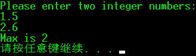

<font color='green'>**程序分析:**</font>	这里系统进行了自动的类型转换.有事可以利用这点进行类型转换.但这种做法往往使程序不清晰,可读性降低,容易弄错,而且并不是所有的类型都能互相转换的.

<font color='green'>( 4 )</font>	<font color='green'>**对于不带返回值的函数,应当定义函数为"void 类型"**</font>(或称"空类型").这样,系统就保证不使函数带回任何值,即禁止在调用函数中使用被调用函数的返回值.此时在函数体中不得出现 return 语句.

### 7.4 对被调用函数的声明和函数原型

在一个函数中调用另一个函数(即被调用函数)需具备如下条件:

<font color='green'>( 1 )</font>	首先被调用的函数必须是已经定义的函数(是库函数或用户自己定义的函数).但仅有这一条件还不够.

<font color='green'>( 2 )</font>	如果使用库函数,应该在本文件开头用 #include 指令将调用有关库函数时所需用到的信息"包含"到本文件中来.头文件后缀名 h,表示是头文件(header file).

<font color='green'>( 3 )</font>	如果使用用户自己定义的函数,而该函数的位置在调用它的函数(即主调函数)的后面(在同一个文件中),应该在主调函数中对被调用的函数作<font color='red'>**声明(declaration).**</font>声明的作用是把函数名,函数参数的个数和参数类型等信息通知编译系统,以便在遇到函数调用时,编译系统能正确识别函数并检查调用是否合法.在前面的例子中已经出现过对被调用函数的声明,下面再作进一步的说明.

<font color='green'>**例 7.4**</font>	输入两个实数,用一个函数求出它们之和.

<font color='green'>**解题思路:**</font>	两个数相加的算法很简单.现在用 add 函数实现,先定义函数,再使用.

<font color='green'>**编写程序:**</font>

```c
#include <stdio.h>int main(){    float addf(float x,float y);    float i,j,c;    printf("Please enter two floating point numbers:\n");    scanf("%f%f",&i,&j);    c=addf(i,j);    printf("sum is %f",c);        system("pause");}float addf(float x,float y){    float z;    z = x + y;    return(z);}
```

<font color='green'>**运行结果:**</font>


程序第 5 行是对被调用函数 addf 的声明,可以看到 main 函数的位置在 addf 函数的前面,而程序的编译是从上到下逐行进行的,如果没有对函数 addf 的声明,当编译到第 9 行时,编译系统无法确定 addf 是不是函数名,也无法判断实参(i 和 j)的类型和个数是否正确,无法进行正确性的检查.如果到运行时才发现错误,再重新调试程序是比较麻烦的,工作量也较大.应当在编译阶段尽可能地发现错误,随之纠正错误.

函数声明可以照已<font color='red'>**定义**</font>的函数的首行,再加一个分号,就是函数的<font color='red'>**声明**</font>.函数的首行(即函数首部)称为<font color='red'>**函数原型(function prototype).**</font>用函数的首部作为函数的声明是为了便于对函数调用的合法性进行检查.因为在函数的首部包含了检查调用函数是否合法的基本信息.

使用函数原型作声明是 C 的一个重要特点.用函数原型赖声明函数,能减少编写程序时可能出现的错误.由于函数声明的位置与函数调用语句的位置比较近,因此在写程序时便于就近参照函数原型来书写函数调用,不易出错.

<font color='yellow'>实际上,在函数声明中的形参名可以省写,而只写形参的类型,如上面的声明可以写为</font>

```c
float addf(float,float);	//不写参数名,只写参数类型
```

根据以上介绍,函数原型的一般形式有两种,分别为

<font color='green'>( 1 )</font>	<font color='red'>**函数类型 函数名(参数类型1 参数名1,参数类型2 参数名2,...参数类型n 参数名n);**</font>

<font color='green'>( 2 )</font>	<font color='red'>**函数类型 函数名(参数类型1,参数类型2,...,参数类型n);**</font>

第( 1 )种形式只须照抄函数首部就可以了了,不易出错,而且用了有意义的参数名有利于理解程序.第( 2 )中无从知道形参的含义.

<font color='red'>**注意:**</font>	对函数的"定义"和"声明"不是同一回事.函数的定义是指对函数功能的确立,包括指定函数名,函数值类型,形参及其类型以及函数体等,它是一个完整的,独立的函数单位.而函数声明的作用就是把函数的名字,函数类型以及形参的类型,个数和顺序通知编译系统,以便在调用该函数时系统按此进行对照检查,它不包含函数体.

如果已在文件的开头(在所有函数之前),已对文件中所调用的函数进行了声明,则在各函数中不必对其所调用的函数再作声明.

```c
char letter(char,char);	//以下3行在所有函数之前,且在函数外部float f(float,float);int i(float,float);int main()				//在main函数中要调用letter,f和i函数{						//不必再对所调用的这3个函数进行声明    ...}//下面定义被调用的3个函数char letter(char c1,char c2)	//定义letter函数{    ...}float f(float x,float y)		//定义f函数{    ...}int i(float j,float k)			//定义i函数{    ...}
```

<font color='red'>**这样写在所有函数前面的外部声明在整个文件范围中有效.**</font>

### 7.5 函数的嵌套调用

C 语言的函数定义是互相平行,独立的,也就是说,在定义函数时,一个函数内不能再定义另一函数,也就是不能嵌套定义,但可以嵌套调用,也就是说,在调用一个函数的过程中,又调用另一个函数,见图 7.5.


图 7.5 表示的是两层嵌套(连 main 函数共三层函数),其执行过程是:

<font color='green'>( 1 )</font>	执行 main 函数的开头部分;

<font color='green'>( 2 )</font>	遇函数调用语句,调用函数 a,流程转去 a 函数;

<font color='green'>( 3 )</font>	执行 a 函数的开头部分;

<font color='green'>( 4 )</font>	遇函数调用语句,调用函数 b,流程转去函数 b;

<font color='green'>( 5 )</font>	执行 b 函数,如果再无其他嵌套的函数,则完成 b 函数的全部操作;

<font color='green'>( 6 )</font>	返回到 a 函数中调用 b 函数的位置;

<font color='green'>( 7 )</font>	继续执行 a 函数中尚未执行的部分,直到 a 函数结束;

<font color='green'>( 8 )</font>	返回 main 函数中调用 a 函数的位置;

<font color='green'>( 9 )</font>	继续执行 main 函数的剩余部分直到结束.

<font color='green'>**例 7.5**</font>	输入 4 个整数,找出其中最大的数.用函数的嵌套调用来处理.

<font color='green'>**编写程序:**</font>

```c
#include <stdio.h>int main(){    int max4(int a,int b,int c,int d);    int a,b,c,d,max;    printf("Please enter four integer numbers:\n");    scanf("%d%d%d%d",&a,&b,&c,&d);    max=max4(a,b,c,d);    printf("Max is %d\n",max);}int max4(int a,int b,int c,int d){    int max2(int a,int b);    int m;    m = max2(a,b);    m = max2(m,c);    m = max2(m,d);    return(m);}int max2(int a,int b){    return(a>b?a:b);}
```

<font color='green'>**运行结果:**</font>


<font color='green'>**程序改进:**</font>

<font color='green'>( 1 )</font>	在 max4 函数中,3 个调用 max2 的语句可以用以下一行代替:

```c
m=max2(max2(max2(a,b),c),d);	//把函数调用作为函数参数
```

设置可以取消变量 m,max4 可以写成

```c
int max4(int a,int b,int c,int d){    int max2(int a,int b);    return max2(max2(max2(a,b),c),d);}
```

### 7.6 函数的递归调用

在调用一个函数的过程中又出现<font color='red'>直接或间接地调用该函数本身,称为函数的递归调用.</font>C 语言的特点之一就在于允许函数的递归调用.例如:

```c
int f(int x){    int y,z;    z=f(y);			//在执行f函数的过程中又要调用f函数    return (2*z);}
```

在调用函数 f 的过程中,又调用 f 函数,这是直接调用本函数,见图 7.6.


如果在调用 f1 函数过程中又要调用 f2 函数,而在调用 f2 函数过程中又调用 f1 函数,就是间接调用本函数,见图 7.7.


可以看到,这两种递归调用都是无终止的自身调用.显然,程序中不应出现这种无终止的递归调用,而只应出现有限次数的,有终止的递归调用,这可以用 if 语句来控制,只有在某一条件成立时才继续执行递归调用;否则就不再继续.

<font color='green'>**例 7.6**</font>	有 5 个学生坐在一起,问第 5 个学生多少岁,他说比第 4 个学生大 2 岁.问第 4 个学生多少岁,他说比第 3 个学生大 2 岁.问第 3 个学生多少岁,他说比第 2 个学生大 2 岁.问第 2 个学生多少岁,他说比第 1 个学生大 2 岁.问第 1 个学生多少岁,他说比第 4 个学生大 2 是 10 岁.请问第 5 个学生多大.

<font color='green'>**解题思路:**</font>

age(5)=age(4)+2	age(4)=age(3)+2	age(3)=age(2)+2	age(2)=age(1)+2	age(1)=10

可用数学公式表述如下:

age(n)=10			(n=1)

age(n)=age(n-1)+2	(n>1)

可以看到,当 n>1 时,求第 n 个学生的年龄的公式时相同的.因此可以用一个函数表示上述关系.图 7.8 表示求第 5 个学生年龄的过程.


显然,这是一个递归问题.由图 7.8 可知,求解可分成两个阶段:第 1 阶段是"回溯",即将第 n 个学生的年龄表示为第(n-1)个学生年龄的函数,而第(n-1)个学生的年龄仍然不知道,还要"回溯"到第(n-2)个学生的年龄···直到第 1 个学的年龄.此时 age(1) 已知,不必再向前推了.然后开始第 2 阶段,采用递推方法,从第 1 个学生的年龄推算出第 2 个学生的年龄···一直到推算出第 5 个学生的年龄为止.也就是说,<font color='green'>**一个递归的问题可以分为"回溯"和"递推"两个阶段.**</font>要经历若干步才能求出最后的值.显而易见,如果要求递归过程不是无限制进行下去,必须具有一个结束递归过程的条件.例如,age(1)=10,就是使这个递归结束的条件.

<font color='green'>**编写程序:**</font>	可以用一个函数来描述上述递归过程:

```c
int age(int n)		//求年龄的递归函数{    int c;    if(n==1)        c=10;    else        c=age(n-1)+2;    return(c);}
```

用一个主函数调用 age 函数,求得第 5 个学生的年龄.整个程序如下:

```c
#include <stdio.h>int main(){    int age(int n);    printf("NO.5 age is %d",age(5));    system("pause");    return 0;}int age(int n){    int c;    if(n==1)        c=10;    else        c=age(n-1)+2;    return(c);}
```

<font color='green'>**运行结果:**</font>


<font color='green'>**程序分析:**</font>	main 函数中实际只有一个语句.整个问题的求解全靠一个 age(5) 函数调用来解决.函数调用过程如图 7.9 所示.


从图 7.9 可以看到:age 函数共被调用 5 次,即 age(5),age(4),age(3),age(2),age(1).其中 age(5)是 main 函数调用的,其余 4 次是在 gae 函数中调用的,即递归调用 4 次.请仔细分析调用的过程.应当强调说明的是在某一次调用 age 函数时并不是立即得到 age(n) 的值,而是一次又一次地进行递归调用,到 age(1) 时才有确定的值,然后再递推出其他 age 的值.请将程序和图 7.8 7.9 结合起来认真分析.

注意分析递归的终止条件.当 n 等于 2 时,应执行"c=age(n-1)+2;",由于 n=2,它相当于"c=age(1)+2;".注意 age(1) 的值是什么?此时 n=1,应执行"c=10",即不在递归调用 age 函数了,递归调用结束.将 10 作为 age(1) 的值返回 age 函数中的"c=age(n-1)+2;"处(此时 n==2),得到 c=10+2,即 12.再以此类推得到 age(5) 的值为 18.

<font color='green'>**例 7.7**</font>	用递归方法求$$n!$$.(阶乘 factorial  /fækˈtɔːriəl/)

<font color='green'>**解题思路:**</font>	求 $$n!$$ 可以用递推方法,即从 1 开始,乘 2,再乘 3···一直乘到 n.这种方法容易理解,也容易实现.递推法的特点是从一个已知的事实除法,按一定规律推出下一个事实,再从这个新的已知的事实出发,再向下推出衣蛾新的事实.

求 $$n!$$ 也可以用递归方法,即 5! 等于 4!×5,而 4! 等于 3!乘 4 ,···, 1! 等于 1.可用下面的递归公式表示:
$$
n!=\begin{cases} n!=1,(n=0,1)\\n*(n-1)!,(n>1)\end{cases}
$$
有了例 7.6 的基础,可以很容易写出本题的程序.

<font color='green'>**编写程序:**</font>

```c
#include <stdio.h>int main(){    int fac(int n);    int i;    long int y;    printf("Please enter n:\n");    scanf("%d",&i);    y=fac(i);    printf("%d! is %d\n",i,y);        system("pause");}int fac(int n){    int c;    if(n<0)    printf("n<0,data error!");    else if(n==0 || n==1)        c=1;    else        c=fac(n-1)*n;    return (c);}
```

<font color='green'>**运行结果:**</font>


<font color='green'>**程序分析:**</font>	调用递归函数 fac(n) 的过程见图 7.10.请注意每次调用 fac 函数后,其返回值 f 返回到哪里,应返回到调用 fac 函数处,递归终止条件为 n=0 或 n=1.


<font color='green'>**注意:**</font>	程序中的变量时 int 型,如果用 Visual C++,GCC 以及多数 C 编译系统为 int 型数据分配 4 个字节,能表示的最大数为 2147483647 当 n=31 时,运行正常,大于 31 时,是得不到逾期结果的,因为求出的结果超过了 int 型数据的最大值,可将 c,y 和 fac 函数定义为 float 或 double 型.

<font color='yellow'>**例 7.8**</font>	Hanoi(汉诺)塔问题.这是一个古典的数学问题,是一个用递归方法解题的典型例子.问题是这样的:古代有一个梵塔,塔内有 3 个座 A,B,C,开始时 A 座上有 64 个盘子,盘子大小不等,大的在下,小的在上(见图 7.11).要把这 64 个盘子从 A 移到 C,但规定每次只允许移动一个盘,且在移动过程中在 3 个座上都始终保持大盘在下,小盘在上.在移动过程中可以利用 B 座.要求编程输出移动盘子的步骤.


<font color='yellow'>**解题思路:**</font>	要把 64 个盘子从 A 座移到 C 座,需要移动大约 2^64^ 次盘子.可以实验以下,按上面的规定将 5 个盘子移动.

需要找到一个解决问题的思路,把看似复杂的问题简单化,使问题得以迎刃而解.假如有另外一人能有办法将上面 63 个盘子从一个座移到另一座.那么问题就解决了.

<font color='green'>( 1 )</font>	另一个将 63 个盘子从 A 移到 B;

<font color='green'>( 2 )</font>	自己将 1 个盘子(最底下,最大的盘子)从 A 移到 C;

<font color='green'>( 3 )</font>	另一个将 63 个盘子从 B 移到 C.

见图 7.12.


至此,全部任务完成了.这就是递归方法.但是,有一个问题实际上未解决:另一个人怎样才能将 63 个盘子从 A 移到 B?为了解决 63 个盘子的移动问题另一人与第一人的想法一致,借助第三个人移动 62 个盘子,以此类推,需要 64 个人才能完成此任务.这是一个典型的递归问题.

为了方便理解,先分析将 A 上 3 个盘子移到 C 上的过程,移前情况见图 7.13(a).

<font color='green'>( 1 )</font>	将 A 上 2 个盘子移到 B 上(借助C),见图 7.13(b).

<font color='green'>( 2 )</font>	将 A 上 1 个盘子移到 C 上,见图 7.13(c).

<font color='green'>( 3 )</font>	将 B 上 2 个盘子移到 C 上(借助A),见图 7.13(d).


其中第<font color='green'>( 2 )</font>步可以直接实现.第<font color='green'>( 1 )</font>步有可用递归方法分解为:

- 将 A 上 1 个盘子从 A 移到 C;
- 将 A 上 1 个盘子从 A 移到 B;
- 将 C 上 1 个盘子从 C 移到 B.

第<font color='green'>( 3 )</font>步可以分解为:

- 将 B 上 1 个盘子从 B 移到 A;
- 将 B 上 1 个盘子从 B 移到 C;
- 将 A 上 1 个盘子从 A 移到 C;

将以上综合起来,可以得到移动 3 个盘子的步骤为:

A$$\rightarrow$$C,A$$\rightarrow$$B,C$$\rightarrow$$B,A$$\rightarrow$$C,B$$\rightarrow$$A,B$$\rightarrow$$C,A$$\rightarrow$$C.

共经历 7 步.由此可推出:移动 n 个盘子要经历(2^n^-1)步.

由上面的分析可知:将 n 个盘子从 A 移动到 C 可以分解为以下 3 个步骤:

<font color='green'>( 1 )</font>	将 A 上 n-1 个盘子借助 C 移到 B;

<font color='green'>( 2 )</font>	将 A 上剩下的一个移到 C;

<font color='green'>( 3 )</font>	将 n-1 个从 B 借助 A 移到 C 上.

上面第<font color='green'>( 1 )</font>步和第<font color='green'>( 3 )</font>步,都是把 n-1 个盘从一个座移到另一个座上,采取的办法是一样的,只是座的名字不同而已.为使之一般化,可以将第<font color='green'>( 1 )</font>步和第<font color='green'>( 3 )</font>步表示为:

将"one"座上 n-1 个盘移到 "two" 座(借助"three"座).只是在第<font color='green'>( 1 )</font>步和第<font color='green'>( 3 )</font>步中,one,two,three 和 A,B,C 对应关系不同.对第<font color='green'>( 1 )</font>步,对应关系是 one 对应 A,two 对应 B,three 对应 C.对第<font color='green'>( 3 )</font>步,是 one 对应 B,two 对应 B,three 对应 A.

因此,可以把上面 3 个步骤分成两类操作:

<font color='red'>( 1 )</font>	将 n-1 个盘子从一个座移到另一个座(n>1).这就是第一人让第二人做的工作,它是一个递归过程,即每个人将任务层层下放,直到第 64 人为止.

<font color='red'>( 2 )</font>	将 1 个盘子从一个座上移到两一个座上.这是第一个人做的工作.

<font color='yellow'>**编写程序:**</font>	分别用两个函数实现以上的两类操作,用 hanoi 函数实现上面第 1 类操作(即模拟第二人的任务),用 move 函数实现上面第 2 类操作(模拟第一人自已移盘),函数调用 hanoi(n,one,two,three)表示将 n 个盘子从"one"座移到"three"座的过程(借助"two"座).函数调用 move(x,y)表示将一个盘子从 x 座移到 y 座的过程.x 和 y 是代表 A,B,C 座之一,根据每次不同情况分别取 A,B,C 代人.

```c
#include <stdio.h>int main(){    void hanoi(int n,char one,char two,char three);	//对hanoi函数声明    int m;    printf("Please enter the number of diskes:\n");    scanf("%d",&m);    printf("The step to move %d diskes:\n",m);    hanoi(m,'A','B','C');}void hanoi(int n,char one,char two,char three)//定义hanoi函数    //将n个盘从one座借助two座,移到three座{    void move(char x,char y);	//对move函数声明    if(n==1)	//如果只剩一个盘子直接从one移动到three        move(one,three);    else    {        hanoi(n-1,one,three,two);	//将n-1个盘子借助three从one移动到two        move(one,three);	//将一个盘子从one移动到three        hanoi(n-1,two,one,three);	//再将n-1个盘子借助one从two移动到three    }}void move(char x,char y)	//定义move函数{    printf("%c → %c\n",x,y);}
```

<font color='green'>**运行结果:**</font>


<font color='green'>**程序分析:**</font>	在本程序中,调用递归函数 hanoi,其终止条件为 hanoi 函数的参数 n 的值等于 1.显然,此时不必再调用 hanoi 函数了,直接执行 move 函数即可.

在本程序中 move 函数并未真正移动盘子,而只是输出移动盘子的方案(从那一个座移到那一个座).

可以看到,将 3 个盘子从 A 座移动到 C 座需要移盘 7 次,如果将 64 个盘子从 A 座移到 C 座需要移(2^64^-1)次,假设每移动一次盘子用时 1 秒钟,则需要(2^64^-1)秒,大约相当于 6×10^11^ 年,即大约 600 亿年.

以上对递归函数作了比较详细和通俗易懂的说明,要弄清楚递归的概念,区分嵌套与递归,能编写简单的递归程序.

### 7.7 数组作为函数参数

调用有参函数时,需要提供实参.实参可以使常量,变量或表达式.数组元素的作用与变量相当,一般来说,凡是变量可以出现的地方,都可以用数组元素代替.因此,数组元素也可以用作函数实参,其用法与变量相同,向形参传递数组元素的值.此外数组名也可以作实参和形参,传递的是数组第一个元素的地址.

#### 7.7.1 数组元素作函数实参

数组元素可以用作函数实参,不能用作形参.因为形参是在函数被调用时临时分配存储单元的,不可能为一个数组元素单独分配存储单元(数组是一个整体,在内存中占连续的一段存储单元).在用数组元素作函数实参时,把实参的值传递给形参,时"**值传递**"方式.数据传递的方向是**从实参传到形参,单向传递.**

<font color='green'>**例 7.9**</font>	输入 10 个数,要求输出其中值最大的元素和该数是第几个数.

<font color='green'>**解题思路:**</font>	可以定义一个数组 a,长度为 10,用来存放 10 个数.设计一个函数 max,用来求两个数中的大者.在主函数中定义一个变量 m,m 的初值为 a[0],每次调用 max 函数后的返回值存放在 m 中.用"打擂台"算法,依次将数组元素 a[1] 到 a[9] 与 m 比较,最后得到的 m 值就是 10 个数中的最大者.

<font color='green'>**编写程序:**</font>

```c
#include <stdio.h>int main(){    int max(int x,int y);    int a[10],m,n,i;    printf("Please enter ten integer numbers:\n");    for(i=0;i<10;i++)    {        scanf("%d",&a[i]);    }    printf("\n");    for(i=1,m=a[0],n=0;i<10;i++)    {        if(max(m,a[i])>m)        {            m=max(m,a[i]);            n=i;        }    }    printf("The largest number is %d\nit is %dth number.\n",m.n+1);}int max(int x,int y){    return(x>y?x:y);}
```

<font color='green'>**运行结果:**</font>


<font color='green'>**程序分析:**</font>	程序中将 a[i] 作为函数 max 的实参传递给形参进行比较然后将较大者返回.

#### 7.7.2 数组名作函数参数

除了可以用数组元素作函数参数外,还可以用数组名作函数参数(包括实参和形参).应当注意的是:<font color='red'>**用数组元素作实参时,向形参变量传递的是数组元素的值,而用数组名作函数实参时,向形参(数组名或指针变量)传递的是数组首元素的地址.**</font>

<font color='green'>**例 7.10**</font>	有一个一维数组 score,内放 10 个学生成绩,求平均成绩.

<font color='green'>**解题思路:**</font>	用一个函数 average 来求平均成绩,不用数组元素作为函数实参,而是用数组名作为函数实参,形参也用数组名,在 average 函数中引用个数组元素,求平均成绩并返回 main 函数.

<font color='green'>**编写程序:**</font>

```c
#include <stdio.h>int main(){    float average(float array[10]);    float score[10],aver;    int i;    printf("Please input ten scores:\n");    for(i=0;i<10;i++)    {        scanf("%f",&score[i]);    }    printf("\n");    aver=average(score);    printf("average score is %5.2f\n",aver);    system("pause");}float average(float array[10]){    int i;    float aver,sum=array[0];    for(i=1;i<10;i++)    {        sum=sum+array[i];    }    aver=sum/10;    return aver;}
```

<font color='green'>**运行结果:**</font>


<font color='green'>**程序分析:**</font>

<font color='green'>( 1 )</font>	<font color='red'>用数组名作函数参数,应该在主调函数和被调函数分别定义数组</font>,例中 array 是形参数组名,score 是实参数组名,分别在其所在函数中定义,不能只在一方定义.

<font color='green'>( 2 )</font>	实参数组与形参数组类型应一致(例中都为 float 型),如不一致结果将出错.

<font color='green'>( 3 )</font>	在定义 average 函数时,声明数组的大小为 10,但在实际上,指定其大小是不起任何作用的,因为 <font color='red'>C 语言编译系统并不检查形参数组大小,只是将实参数组的首元素的地址传给形参数组名.</font>因此形参数组名获得了实参数组的首元素地址,前已说明,数组名代表数组的首元素的地址,因此,形参数组首元素(array[0])和实参数组首元素(score[0])具有同一地址,它们共占同一存储单元,score[n] 和 array[n] 指的是同一单元.score[n] 和 array[n] 具有相同的值.

<font color='green'>( 4 )</font>	<font color='red'>形参数组可以不指定大小,在定义数组时在数组名后面跟一个空的方括号</font>,如:

```c
float average(float array[])	//定义average函数,形参数组不指定大小
```

效果时相同的.在编译时把形参数组名处理为一个指针变量,用来接收一个地址.

<font color='green'>**例 7.11**</font>	有两个班级,分别有 35 名和 30 名学生,调用一个 average 函数,分别求这两个班的学生的平均成绩.

<font color='green'>**解题思路:**</font>	不执行形参数组长度,形参表中增加整型变量 i,由主函数传给被调函数以确定形参数组的长度.

<font color='green'>**编写程序:**</font>

```c
#include <stdio.h>int main(){    float average(int i,float array[]);    float score1[10],score2[5],aver1,aver2;    int i;    printf("Please input class one scores:\n");    for(i=0;i<10;i++)    {        scanf("%f",&score1[i]);    }    printf("Please input class two scores:\n");    for(i=0;i<5;i++)    {        scanf("%f",&score2[i]);    }    printf("\n");    aver1=average(10,score1);    aver2=average(5,score2);    printf("average score for class one is %5.2f\naverage score fo class two is %5.2f\n",aver1,aver2);    system("pause");    return 0;}float average(int i,float array[]){    int j;    float aver,sum=array[0];    for(j=1;j<i;j++)    {        sum=sum+array[j];    }    aver=sum/i;    return aver;}
```

为了方便简化为 10 人及 5 人.

<font color='green'>**运行结果:**</font>


<font color='green'>**书中程序:**</font>

```c
#include <stdio.h>int main(){    float average(float array[],int n);    float score1[5]={98.5,97,91.5,60,55};    float score2[10]={67.5,89.5,99,69.5,77,89.5,76.5,54,60,99.5};    printf("The average of class A is %6.2f\n",average(score1,5));    //用数组名 score1 和 5 作实参    printf("The average of class B is %6.2f\n",average(score2,10));    //用数组名 score2 和 10 作实参    return 0;}float average(float array[],int n){    int i;    float aver,sum=array[0];    for(i=1;i<n;i++)    {        sum=sum+array[i];    }    aver=sum/n;    return(aver);}
```

<font color='red'>**注意:**</font>	用数组名作函数实参时,不是把数组元素的值传递给形参,而是把是参数组的首元素的地址传递给形参数组,这样两个数组就共占同一段内存单元.如果形参数组为 a,形参数组为 b(见图 7.14)若 a 的首元素的地址为 1000,则 b 数组首元素的地址也是 1000,显然,a[0] 与 b[0] 同占一个单元···假如改变了 b[0] 的值,也就意味着 a[0] 的值也改变了.也就是说,形参数组中各元素的值如果发生变化会使实参数组元素的值同时发生变化,从图 7.14 看是很容易理解的.这一点是与变量座函数参数的情况不同的,在程序中常有意识地利用这一特点改变实参数组元素的值(如排序).

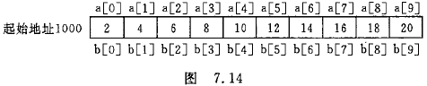

<font color='green'>**例 7.12**</font>	用选择发对数组中 10 个整数按由小到大排序.

<font color='green'>**解题思路:**</font>	所谓选择法就是将 10 个数中最小的数与 a[0] 对换;再将 a[1] ~ a[9] 中最小的数与 a[1] 对换···每次比较一轮,找出一个未经排序的数中最小的一个.共比较 9 轮.下面以 5 个数为例说明选择法的步骤.


<font color='green'>**编写程序:**</font>

```c
#include <stdio.h>int main(){    void sort(int array[], int n);    int a[10], i;    printf("Please enter array:\n");    for (i = 0; i < 10; i++)    {        scanf("%d", &a[i]);    }    sort(a, 10); //调用sort函数,a为数组名,大小为10    printf("The sorted array:\n");    for (i = 0; i < 10; i++)    {        printf("%d ", a[i]);    }    printf("\n");    system("pause");}void sort(int array[], int n){    int i, j, k, t;    for (i = 0; i < n - 1; i++)    {        k = i;        for (j = i + 1; j < n; j++)        {            if (array[j] < array[k])            {                t = array[k];                array[k] = array[j];                array[j] = t;            }        }    }}
```

<font color='green'>**运行结果:**</font>


<font color='green'>**程序分析**</font>	这个例子通过形参数组排序,改变了实参数组的顺序.

#### 7.7.3 多维数组名作函数参数

多维数组元素可以作函数参数,这点与前述的情况类似.

可以用多维数组名作为函数的实参和形参,在被调用函数中对形参数组定义时可以指定每一维的大小,也可以省略第一维的大小说明.例如:

```c
int array[3][10];	或	int array[][10];
```

<font color='red'>二者都合法而且等价.但是不能把第二维以及其他高维的大小说明省略</font>.

二维数组是由若干个一维数组组成的,在内存中,数组是按行存放的,因此,在定义二维数组时,必须指定列数(即一行中包含几个元素),由于形参数组与实参数组类型相同,所以它们是由具有相同长度的一维数组所组成的.不能只指定第一维(行数)而省略第二维(列数),在第二维大小相同的前提下,形参数组的第一维可以与实参数组不同.形参数组和实参数组都是由形同类型和大小的一维数组组成的.C 语言编译系统不检查第一维的大小.

<font color='green'>**例 7.13**</font>	有一个 3×4 的矩阵,求所有元素中的最大值.

<font color='green'>**解题思路:**</font>	用"打擂台"法

<font color='green'>**编写程序:**</font>

```c
#include <stdio.h>int main(){	int max_value(int array[][4]);	int a[3][4] = { { 1,3,5,7 },{ 2,4,6,8 },{ 15,17,35,12 } };	printf("Max value is %d\n", max_value(a));	system("pause");}int max_value(int array[][4]){	int i, j, t;	t = array[0][0];	for (i = 0; i<3; i++)	{		for (j = 0; j<4; j++)		{			if (t<array[i][j])			{				t = array[i][j];			}		}	}	return t;}
```

<font color='green'>**运行结果:**</font>


<font color='green'>**程序分析:**</font>	形参数组 array 的第一维大小省略,第二维大小不能省略,而且要和实参数组的第二维大小相同.在主函数调用 max_value 函数时,把实参数组的第一行的起始地址传递给形参数组 array,因此 array数组第一行的起始地址与数组 a 的第一行的起始地址相同.实际上 array[i] [j] 就是 a[i] [j],在函数中对 array元素的操作就是对 a元素的操作.

### 7.8 局部变量和全局变量

之前见到的程序大部分时一个程序只包含一个 main 函数,变量实在函数的开头处定义的.这些变量在本函数范围内有效,即在本函数开头定义的变量,在本函数中可以被引用.在本章中的一些程序,包含两个或多个函数,分别在各函数中定义变量.在一个函数中定义的变量,在其他函数中能否被引用?在不同位置定义的变量,在什么范围内有效?

这就是变量的<font color='red'>**作用域**</font>问题.每一个变量都有一个作用域,即它们在什么范围内有效.

#### 7.8.1 局部变量

定义变量可能有 3 种情况:

- 在函数的开头定义
- 在函数内的复合语句内定义
- 在函数的外部定义

在一个函数内部定义的变量只在本函数范围内有效,也就是说只有在本函数内才能引用它们,在此函数以外是不能使用这些变量的.在复合语句内定义的变量只在本复合语句范围内有效,只有在本复合语句内才能引用它们.在该复合语句以外是不能使用这些变量的,以上这些称为<font color='red'>**"局部变量"**</font>.

例如,在 fun1 函数中定义了变量 a,b,在 fun2 函数中定义了变量 a,c.fun1函数中的变量 a 和 fun2 函数中的变量 a 不是同一个对象.它们分别有自己的有效范围.

<font color='yellow'>**说明:**</font>

- <font color='yellow'>主函数中定义的变量也只在主函数中有效</font>,并不因为在主函数中定义而在整个文件或程序中有效.主函数不能使用其他函数中定义的变量.
- <font color='yellow'>不同函数可以使用同名的变量,它们代表不同的对象;互不干扰.</font>
- <font color='yellow'>形式参数也是局部变量.</font>
- <font color='yellow'>在一个函数内部,可以在复合语句中定义变量,这些变量只在本复合语句中有效,这种符合语句也称为</font><font color='red'>**"分程序"**</font>或<font color='red'>**"程序块"**</font>.

#### 7.8.2 全局变量

程序的编译单位是源程序文件,一个源文件可以包含一个或若干个函数.在函数内定义的变量时局部变量,而在函数之外定义的变量称为<font color='red'>**外部变量**</font>,外部变量是<font color='red'>**全局变量**</font>(也称全程变量).全局变量可以为本文件中其他函数所共用.它的有效范围从定义变量的位置开始到本源文件结束.

<font color='yellow'>**注意:**</font>	在函数内定义的变量是局部变量,在函数外定义的变量时全局变量.

<font color='yellow'>**说明:**</font>	设置全局变量的作用是增加了函数键数据联系的渠道.由于同一文件中的所有函数都能引用全局变量的值因此如果一个函数中改变了全局变量的值,就能影响到其他函数中全局变量的值.相当于各个函数间有直接的传递通道.由于函数的调用只能带回一个函数返回值,因此有时可以利用全局变量来对增加函数间的联系渠道,用过函数调用能得到一个以上的值.

<font color='cyan'>为了便于区别全局变量和局部变量,在 C 程序设计人员中有一个习惯(但非规定),将全局变量名的第一个字母用大写表示.</font>

<font color='green'>**例 7.14**</font>	有一个一维数组,内放 10 个学生成绩,写一个函数,当主函数调用此函数后,能求出平均分,最高分和最低分.

<font color='green'>**解题思路:**</font>	调用一个函数可以得到一个函数返回值,现在希望通过函数调用能得到 3 个结果,可以利用全局变量来达到此目的.

<font color='green'>**编写程序:**</font>

```c
#include <stdio.h>float Max,Min;int main(){    float average(float array[],int n);    float ave,score[10];    int i;    printf("Please enter 10 score:");    for(i=0;i<10;i++)    {        scanf("%f",&score[i]);    }    ave=average(score,10);    printf("Max=%6.2f\nMin=%6.2f\naverage=%6.2f\n",Max,Min,ave);    system("pause");}float average(float array[],int n){    int i;    float aver,sum=array[0];    Max=Min=array[0];    for(i=1;i<n;i++)    {        if(array[i]>Max)Max=array[i];        else if(array[i]<Min)Min=array[i];        sum += array[i];    }    aver=sum/n;    return aver;}
```

<font color='green'>**运行结果:**</font>


<font color='green'>**程序分析:**</font>	函数 average 中和外界有联系的变量与外界的联系如图 7.15 所示.可以看出:main 函数在调用 average 函数时,把实参数组 score 的首元素地址和整数 10 传递给形参数组 array 和形参变量 n,函数 average 的值是 return 语句带回的 aver 的值(在主函数中赋给了变量 ave).这样,在 main 函数中就得到了平均分.而最高分和最低分是通过全局变量 Max 和 Min 获得的.由于 Max 和 Min 是全局变量,是公用的,各函数都可以直接引用它们,也可以向它们赋值.现在在 average 函数中,改变了它们的值,最后把最高分和最低分存放在 Max 和 Min 中.在主函数可以使用这两个变量的值.因此在 main 函数中输出的 Max 和 Min 就是希望得到的最高分和最低分.


但是,建议在不必要的时候不要使用全局变量

① 全局变量在程序的全部执行过程中都占用存储单元,而不是仅在需要时才开辟单元.

② 它使函数的通用性降低了,因为如果在函数中引用了全局变量,那么执行情况会受到有关的外部变量的影响,如果将一个函数移到另一个文件中,还要考虑把有关的外部变量及其值一起移过去.但是若该外部变量与其他文件中的变量同名,就会出现问题.这就降低了程序的可靠性和通用性.在程序设计中,在划分模块时要求模块的"内聚性"强,与其他模块的"耦合性"弱.即模块的功能要单一(不要把许多互不相干的功能放到一个模块中),与其他模块的相互影响要尽量少,而用全局变量时不符合这个原则的.一般要求把 C 程序中的函数做成一个相对的封闭体,除了可以通过"实参--形参"的渠道与外界发生联系外,没有其他渠道.这样的程序移植性好,可读性强.

③ 使用全局变量过多,会降低程序的清晰性,人们往往难以清楚地判断出每个瞬时各个外部变量的值.由于在各个函数执行时都可能改变外部变量的值,程序容易出错.因此,要限制使用全局变量.

<font color='red'>**注意:**</font>	如果在同一个源文件中,全局变量与局部变量同名,这时会出现什么情况呢?请考虑是按哪一种情况处理:( 1 )出错;( 2 )局部变量无效,全局变量有效;( 3 )在局部变量的作用范围内,局部变量有效,全局变量被"屏蔽",即它不起作用.请分析下面的程序.

<font color='green'>**例 7.15**</font>	若外部变量与局部变量同名,分析结果.

<font color='green'>**编写程序:**</font>

```c
#include <stdio.h>int a=3,b=5;	//全局变量int main(){    int max(int a,int b);	//函数声明    int a = 8;    printf("max=%d\n",max(a,b));    system("pause");}int max(int a,int b){    int c;    c=a>b?a:b;    return(c);}
```

<font color='green'>**运行结果:**</font>


<font color='green'>**程序分析:**</font>	程序运行属于第( 3 )种情况.

### 7.9 变量的存储方式和生存期

#### 7.9.1 动态存储方式与静态存储方式

从变量的作用域(即从空间)的角度来观察,变量可以分为全局变量和局部变量.

从变量值存在的时间(即<font color='red'>**生存期**</font>)来观察.有的变量在程序的运行的整个过程都存在,而有的变量则是在调用其所在的函数时才临时分配存储单元,而在函数调用结束后该存储单元就马上释放了,变量不存在了.也就是说,变量的存储有两种不同的方式:<font color='red'>**静态存储方式**</font>和<font color='red'>**动态存储方式**</font>.静态存储方式是指在程序运行期间由系统分配固定的存储空间的方式,而动态存储方式则是在程序运行期间根据需要进行动态的分配存储空间的方式.

先看一下内存中的供用户使用的存储空间的情况.这个存储空间可以分为 3 部分:

<font color='green'>( 1 )</font>	程序区;

<font color='green'>( 2 )</font>	静态存储区;

<font color='green'>( 3 )</font>	动态存储区.

见图 7.16


在动态存储区中存放以下数据:

① 函数形式参数.在调用函数时给形参分配的存储空间.

② 函数中定义的没有用关键字 static 声明的变量,即自动变量.

③ 函数调用时的现场保护和返回地址等.

对以上这些数据,在函数调用开始时分配动态存储空间,函数结束时释放这些空间.在程序执行过程中,这种分配和释放是动态的,如果在一个程序中两次调用同一函数,而在此函数中定义了局部变量,在两次调用时分配给这些局部变量的存储空间的地址可能是不相同的.

如果一个程序中包含若干个函数,每个函数中的局部变量生存期并不等于整个程序的执行周期,它只是程序执行周期的一部分.在程序执行过程中,先后调用各个函数,此时会动态的分配和释放存储空间.

在 C 语言中,每一个变量和函数都有两个属性:<font color='red'>**数据类型**</font>和<font color='red'>**数据的存储类别**</font>.对数据类型,就是常用的整型,浮点型等.存储类别是指的数据在内存中存储的方式如静态存储和动态存储.

在定义和声明变量和函数时,一般应同事指定其数据类型和存储类别,也可以采用默认方式指定.

C 的存储类别包括 4 种:<font color='red'>**自动的(auto),静态的(statis),寄存器的(register),外部的(extern).**</font>根据变量的存储类别,可以知道变量的作用域和生存期.

#### 7.9.2 局部变量的存储类别

<font color='red'>**1. 自动变量(auto变量)**</font>

函数中的局部变量,如果不专门声明为 static (静态)存储类别,都是动态的分配存储空间的,数据存储在动态存储区中.函数中的形参和函数中定义的局部变量(包括在复合语句中定义的局部变量),都属于此类.在调用该函数时,系统会给这些变量分配存储空间,在函数调用结束时就自动释放这些存储空间.因此这类局部变量称为<font color='red'>**自动变量**</font>.自动变量用关键字 auto 作存储类别的声明.例如:

```c
int f(int a)			//定义f函数,a为形参{    auto int b,c=3;		//定义b,c为自动变量}
```

执行完函数 f 后,自动释放 a,b,c 所占的存储单元.

实际上,关键字"auto"可以省略,<font color='red'>**不写 auto 则隐含指定为"自动存储类别"**</font>,它属于动态存储方式.程序中大多数变量属于自动变量.

<font color='red'>**2. 静态局部变量(static局部变量)**</font>

有时希望函数中的局部变量的值在函数调用结束后不消失而继续保留原值,即其占用的存储单元不释放,在下一次调用该函数时,该变量已有值(就是上一次函数调用结束时的值).这时就应该指定该局部变量为"静态局部变量",用关键字 static 进行声明.通过下面简单的例子可以了解它的特点.

<font color='green'>**例 7.16**</font>	考察静态局部变量的值.

<font color='green'>**编写程序:**</font>

```c
#include <stdio.h>int main(){    int f(int);    int a=2,i;    for(i=0;i<3;i++)    {        printf("%d\n",f(a));    }    system("pause");    return 0;}int f(int a){    auto int b=0;    static c=3;    b=b+1;    c=c+1;    return(a+b+c);}
```

<font color='green'>**运行结果:**</font>


<font color='green'>**程序分析:**</font>	main 函数第一次调用 f 函数时,实参 a 的值为 2,它传递给形参 a.f 函数中的局部变量 b 的初值为 0,c 的初值为 3,第一次调用结束时,b=1,出,a+b+c=7.由于 c 被定义为静态局部变量,在函数调用结束后,它并不释放,仍保留 c 的值为 4.在第二次调用函数 f 时,b 的初值为 0,而 c 的初值为 4 (上次调用结束时的值),见图 7.17.先后 3 次调用 f 函数时,b 和 c 的值如表 7.1 所示.


<font color='green'>**说明:**</font>

<font color='green'>( 1 )</font>	静态局部变量属于静态存储类别,在静态存储区内分配存储单元.在程序整个运行期间都不释放.而自动变量(即动态局部变量)属于动态存储类别,分配在动态存储区空间而不在静态存储区空间,函数调用计数后即释放.

<font color='green'>( 2 )</font>	对静态局部变量是在编译时赋初值的,即只赋初值一次,在程序运行时它已有初值.以后每次调用函数时不再重新赋初值而只是保留上次函数调用结束时的值.而对自动变量赋初值,不是在编译时进行的,而是在函数调用时进行的,每调用一次函数重新给一次初值,相当于执行一次赋值语句.

<font color='green'>( 3 )</font>	<font color='yellow'>如果在定义局部变量时不赋初值的话,则对静态局部变量来说,编译时自动赋初值 0 或空字符 '\0'.而对自动变量来说,它的值是一个不确定的值.这是由于每次函数调用结束后存储单元已释放,下次调用时又重新另分配存储单元,而所分配的单元中的内容是不可知的.</font>

<font color='green'>( 4 )</font>	虽然静态局部变量在函数调用结束后仍然存在,但其他函数是不能引用它的.因为它是局部变量,只能被本函数引用,而不能被其他函数引用.

什么情况下需要用局部变量呢?需要保留函数上一次调用结束时的值时,例如可以用下面方法求 n!.

<font color='green'>**例 7.17**</font>	输出 1 到 5 的阶乘值.

<font color='green'>**解题思路:**</font>	可以编写一个函数用来进行连乘,如第一次调用时进行1乘1,第二次调用时再乘以2,第三次调用时再乘以3,依此规律进行下去.

<font color='green'>**编写程序:**</font>

```c
#include <stdio.h>int main(){    int fac(int n);    int i,n;    printf("Please enter n:\n");    scanf("%d",&n);    for(i=1;i<=n;i++)	//调用 n 次 fac 函数        printf("%d! = %d\n",i,fac(i));	//每次计算并输出 i! 的值    system("pause");    return 0;}int fac(int n){    static int f=1;    f=f*n;    return (f);}
```

<font color='green'>**运行结果:**</font>


但是应该看到,用静态存储要多占内存(长期占用不释放,而不能向动态存储那样一个存储单元可以先后为多个变量使用,节约内存),而且降低了程序的可读性,当调用次数多时往往弄不清静态局部变量的当前值是什么.因此,若非必要,不要多用静态局部变量.

<font color='red'>**3. 寄存器变量(register)**</font>

一般情况下,变量的值是存放在内存中的,当程序中用到那一个变量的值时,由控制器发出指令将内存中该变量的值送到运算器中.经过运算器进行晕眩,如果需要存数,再从运算器将数据送到内存存放,见图 7.18.


如果有一些变量使用频繁,则为存取变量的值要花费不少时间.为了提高执行效率,允许将局部变量的值放在 CPU 的寄存器中,需要时直接从寄存器取出参加运算,这样做可以提高执行效率.这种变量叫做<font color='red'>**寄存器变量**</font>用关键字 register 作声明.这种变量通常由编译系统自动将这些变量放在寄存器中,不需要程序设计者指定.

<font color='cornflowerblue'>由上可知,3 种局部变量的存储位置是不同的:自动变量存储在动态存储区;静态局部变量存储在静态存储区;寄存器存储在 CPU 中的寄存器中.</font>	

#### 7.9.3 全局变量的存储类别

<font color='Magenta'>全局变量都是存放在静态存储区中的.因此它们的生存期是固定的,存在于程序的整个运行过程.但是,对全局变量来说,还有一个问题尚待解决,就是它们的作用域究竟从什么位置起,到什么位置止.作用域是包括整个文件范围,还是文件中的一部分范围?是在一个文件中有效,还是在程序的所有文件中都有效?这就需要指定不同的存储类别.</font>

<font color='cyan'>一般来说,外部变量是在函数的外部定义的全局变量,它的作用与是从变量的定义储开始,到本程序文件的末尾.在此作用域内,全局变量可以为程序中各个函数所引用.但有时程序设计人员希望能扩展外部变量的作用域.有以下几种情况:</font>

<font color='DodgerBlue'>**1 . 在一个文件内扩展外部变量的作用域**</font>

如果外部变量不在文件的开头定义,其有效的作用范围只限于定义处到文件结束.在定义点之前的函数不能引用该外部变量.如果由于某种考虑,在定义点之前的函数需要引用该外部变量,则应该在引用之前用关键字 <font color='Coral'>**extern**</font> 对该变量作<font color='Coral'>**"外部变量声明"**</font>,表示把该外部变量的作用域扩展到此位置.有了此声明,就可以了从"声明"处起,合法地使用该外部变量.例如:

<font color='SlateBlue'>**例 7.18**</font>	调用函数,求 3 个整数中的大者.

<font color='SlateBlue'>**解题思路:**</font>	用 extern 声明外部变量,扩展外部变量在程序文件中的作用域.

<font color='SlateBlue'>**编写程序:**</font>

```c
#include <stdio.h>int main(){    int max();    extern int A,B,C;	//把外部变量 A,B,C 的作用域扩展到此处    printf("Please enter three integer numbers:");    scanf("%d%d%d",&A,&B,&C);	//输入3个整数给A,B,C    printf("Max is %d\n",max());        system("pause");}int A,B,C;	//定义外部变量int max(){    int m;    m=A>B?A:B;    if(C>m)m=C;    return(m);}
```

<font color='SlateBlue'>**运行结果:**</font>


<font color='Crimson'>**注意:**</font>	提倡外部变量的定义放在引用它的所有函数之前,这样可以避免在函数中多加一个 extern 声明.

<font color='Chartreuse'>用 extern 声明外部变量时,类型名可以写也可以不写.因为她不是定义变量,可以不指定类型,只须写出外部变量名即可.</font>

<font color='DodgerBlue'>**2. 将外部变量的作用与扩展到其他文件**</font>

一个 C 程序可以由一个或多个源程序文件组成.如果程序只由一个源文件组成,使用外部变量的方法前面已经介绍.如果程序由多个源程序文件组成,那么在一个文件中向引用另一个文件中已定义的外部变量,有什么办法呢?

如果一个程序包含两个文件,在两个文件中都要用到同一个外部变量 Num,不能分别在两个文件中各自定义衣蛾外部变量 Num,否则进行程序的连接时会出现"重复定义"的错误.<font color='Chartreuse'>正确的做法是:在任一个文件中定义外部变量 Num,而在另一个文件中用 extern 对 Num 作"外部变量声明",即"extern Num;".</font><font color='Coral'>在编译和连接时,系统会由此知道 Num 有"外部链接",可以从别处找到已定义的外部变量 Num,并将在另一文件中定义的外部变量 Num 的作用域扩展到本文件,在本文件中可以合法地引用外部变量 Num.</font>

<font color='SlateBlue'>**例 7.19**</font>	给定 b 的值,输入 a 和 m,求 a*b 和 a^m^ 的值.

<font color='SlateBlue'>**解题思路:**</font>	编写两个文件模块,一个包含主函数,另一个包含求 a^m^ 的函数,在一中定义外部变量 A,在二中用 extern 声明外部变量 A,把 A 的作用域扩展到文件二.

<font color='SlateBlue'>**编写程序:**</font>

file1.c

```c
#include <stdio.h>int A;	//定于外部变量int main(){    int power(int);	//函数声明    int b=3,c,d,m;    printf("enter the number a and its power m:\n");    scanf("%d%d",&A,&m);    c=A*b;    printf("%d * %d = %d\n",A,b,c);    d=power(m);    printf("%d * * %d = %d\n",A,m,d);        system("pause");    return 0;}
```

file2.c

```c
extern A;	//把在file1文件中已定义的外部变量的作用域扩展到本文件int power(int n){    int i,y=1;    for(i=1;i<=n.i++)        y *= A;    return(y);}
```


<font color='SlateBlue'>**程序分析:**</font>	file2.c 文件的开头有一个 extern 声明,它声明在本文件中出现的变量 A 是一个"其他文件中定义过得外部变量".本来外部变量 A 的作用域是 file1.c,但现在用 extern 声明将其作用域扩大到 file2.c 文件.假如某一程序包括了 5 个源文件模块,在一个文件中定义外部整型变量 A ,其他 4 个文件都可以引用 A,但必须在每一个文件中都加上一个"extern A;"声明.在各文件经过编译后,将各目标文件连接成一个可执行的目标文件.

<font color='Coral'>**说明:**</font>	用这样的方法扩展全局变量的作用域应十分慎重,因为在执行一个文件中的操作时,可能会改变该全局边浪的值,会影响到另一文件中全局变量的值,从而影响该文件中函数的执行结果.

<font color='RoyalBlue'>系统处理 extern 时,先在本文件中找外部变量的定义,如果找到,就在本文件中扩展作用域,如果找不到,就在连接时从其他文件中找外部变量的定义.如果从其他文件中找到了,就将作用域扩展到本文件;如果再找不到,就按出错处理.</font>

<font color='DodgerBlue'>**3. 将外部变量的作用域限制在本文件中**</font>

有时在程序设计中希望某些外部变量只限于被本文件引用,而不能被其他文件引用.这是可以在定义外部变量时加一个 static 声明.

例如:

file1.c				   file2.c

static int A;			 extern A;

int main()				void fun(int n)

{						  {

...						...

}							A=A*n;	//出错

​						   ...

​						    }

在 file1.c 中定义了一个全局变量 A,但它用了 static 声明,因此只能用于本文件.由于在 file1.c 文件中对 变量作了 static 声明,把变量 A 的作用域限制在本文件范围内,虽然在 file2.c 中用了"extern A;",但仍然不能使用 file1.c 中的全局变量 A.

这种加上 static 声明,只能用于本文件的外部变量称为<font color='Crimson'>**静态外部变量**</font>.在程序设计中,常由若干人完成各个模块,各人可以独立的在其设计的文件中使用相同的外部变量名而互不相干.只须在每个文件中定义外部变量时加上 static 即可.

<font color='Chartreuse'>**说明:**</font>	<font color='RoyalBlue'>不要误认为对外部变量加 static 声明后才采取静态存储方式(存放在静态存储区中),而不加 static 的是采取动态存储(存放在动态存储区).声明局部变量的存储类型和声明全局变量的存储类型的含义是不同的.**对于局部变量来说,声明存储类型的作用是指定变量存储的区域(静态存储区或动态存储区)以及由此产生的生存期问题,而对于全局变量来说,由于都是在编译时分配内存的,都存放在静态存储区,声明存储类型的作用是变量作用域的扩展问题.**</font>

用 static 声明一个变量的作用是:

<font color='DarkOrchid'>( 1 )</font>	对局部变量用 static 声明,把它分配在静态存储区,该变量在整个程序执行期间不释放,其所分配的空间始终存在.

<font color='DarkOrchid'>( 2 )</font>	对全局变量用 static 声明,则该变量的作用域只限于本文件模块(即被声明的文件中).

<font color='Chartreuse'>**注意:**</font>	用 auto,register 和 static 声明变量时,是在定义变量的基础上加上这些关键字,而不能单独使用.<font color='Crimson'>下面用法不对:</font>

```c
int a;		//先定义整型变量astatic a;	//企图再对变量 a 声明为静态变量
```

<font color='Chartreuse'>编译时会被认为"重新定义".</font>

#### 7.9.4 存储类别小结

从以上可知,对一个数据的定义,需要指定两种属性:<font color='Crimson'>**数据类型和存储类别,**</font>分别使用两个关键字.例如:

```c
static int a;			//静态局部整型变量或静态外部整型变量auto char c;			//自动变量,在函数内定义register int d;			//寄存器变量,在函数内定义
```

此外,可以用 extern 声明已定义的外部变量

```c
extern b;				//将已定义的外部变量b的作用域扩展至此
```

下面从不同角度做些归纳:

<font color='DarkOrchid'>( 1 )</font>	从作用域角度分,有局部变量和全局变量,它们采用的存储类别如下:
$$
按作用域角度分\begin{cases}
局部变量\begin{cases}
自动变量,即动态局部变量(离开函数就消失)\\[2ex]
静态局部变量(离开函数,值仍保留)\\[2ex]
寄存器变量(离开函数,值就消失)\\[2ex]
(形式参数可以定义为自动变量或寄存器变量)\\[2ex]
\end{cases}\\[2ex]
全局变量\begin{cases}
静态外部变量(只限本文件引用)\\[2ex]
外部变量(即非静态的外部变量,允许其他文件引用)\\[2ex]
\end{cases}
\end{cases}
$$
<font color='DarkOrchid'>( 2 )</font>	从变量存在的时间(生存期)来区分,有动态存储和静态存储两种类型.静态存储是程序整个运行时间都存在,而动态存储则是在调用函数时临时分配单元.
$$
按变量的生存期分
\begin{cases}
动态存储
\begin{cases}
自动变量(本函数内有效)\\[2ex]
寄存器变量(本函数内有效)\\[2ex]
形式参数(本函数内有效)\\[2ex]
\end{cases}\\[2ex]
静态存储
\begin{cases}
静态局部变量(函数内有效)\\[2ex]
静态外部变量(本文件内有效)\\[2ex]
外部变量(用extern声明后,其他文件可引用)
\end{cases}
\end{cases}
$$
<font color='DarkOrchid'>( 3 )</font>	从变量值存放的位置来区分,可分为:
$$
按变量值存放的位置分
\begin{cases}
内存中静态存储区
\begin{cases}
静态局部变量\\[2ex]
静态外部变量(函数外部静态变量)\\[2ex]
外部变量(可为其他文件引用)\\[2ex]
\end{cases}\\[2ex]
内存中动态存储区:自动变量和形式参数\\[2ex]
CPU中的寄存器:寄存器变量\\[2ex]
\end{cases}
$$
<font color='DarkOrchid'>( 4 )</font>	关于作用域和生存期的概念.从前面叙述可知,对一个变量的属性可以从两个方面分析,一是变量的作用域,一是变量值存在时间的长短,即生存期.前者时从空间的角度,后者是从时间的角度.二者有联系但不是同一回事.图 7.19 是作用域的示意图,图 7.20 是生存期的示意图.


如果一个变量在某个文件或函数范围内是有效的,就称该范围为该变量的<font color='Crimson'>**作用域**</font>,在此作用域内可以引用该变量,在专业书中称变量在此作用域内<font color='Crimson'>**"可见"**</font>如果一个变量值在某一时刻是存在的,则认为这一时刻属于该变量的<font color='Crimson'>**生存期**</font>,或称该变量在此时刻<font color='Crimson'>**"存在"**</font>.表 7.2 表示各种类型变量的作用域和存在性的情况.

<div align="center"><font color='Crimson'>表 7.2 各种类型变量的作用域和存在性的情况</font></font></div>


<font color='DarkOrchid'>( 5 )</font>	static 对局部变量和全局变量的作用不同.对局部变量来说,它使变量由动态存储方式改变为静态存储方式.而对全局变量来说,它使变量局部化(局部于本文件),但仍为静态存储方式.从作用域角度看,凡有 static 声明的,其作用域都是局限的,或者是局限于本函数内(静态局部变量),或者局限于本文件内(静态外部变量).

### 7.10 关于变量的声明和定义

一个函数一般由两部分组成:<font color='Crimson'>**声明部分**</font>和<font color='Crimson'>**执行语句**</font>.声明部分的作用是对有关的标识符(如变量,函数,结构体,共用体)的属性进行声明.对于函数而言,声明和定义的区别是明显的函数的声明是函数的原型,而函数的定义是对函数功能的定义.对被调用函数的声明是放在主调函数的声明部分中的,而函数的定义显然不在声明部分的范围内,它是一个独立的模块.

对变量而言,声明与定义的关系稍微复杂一些.在声明部分出现的变量有两种情况:一种是需要建立存储空间的(如"int a;"),另一种是不需要建立存储空间的(如"extern a;").前者称为<font color='Crimson'>**定义性声明(defining declaration)**</font>,或简称<font color='Crimson'>**定义(definition)**</font>;后者称为<font color='Crimson'>**引用性声明(referencing declaration)**</font>.广义地说,声明包括定义,但并非所有的声明都是定义.对"int a;"而言,它既是声明,有时定义;而对"extern a;"而言,它是声明而不是定义.一般为了叙述方便,把<font color='Crimson'>**建立存储空间的声明称定义,**</font>而把<font color='Crimson'>**不需要建立存储空间的声明称为声明.**</font>显然这里指的声明是狭义的,即非定义性声明.例如:

```c
int main(){    extern A;	//是声明,不是定义.声明将已定义的外部变量A的作用域扩展到此    ...;    return 0;}int A;			//是定义,定义A为整型外部变量
```

外部变量定义和外部变量声明的含义是不同的.外部变量的定义只能有一次,它的位置在所有函数之外.在同一文件中,可以有多次对同一外部变量的声明,它的位置可以在函数之内(那个函数要用就在那个函数中声明),也可以在函数之外(在外部变量的定义点前).系统根据外部变量的定义(而不是根据外部变量的声明)分配存储单元.对外部变量的初始化只能在"定义"时进行,而不能在"声明"中进行.所谓"声明",其作用是声明该变量是一个已在其他地方已定义的外部变量,仅仅是为了扩展该变量的作用范围而作的"声明".

<font color='Coral'>**注意:**</font>	有一个简单的结论,在函数中出现的对变量的声明(除了用 extern 声明的以外)都是定义.在函数中对其他函数的声明不是函数定义.

### 7.11 内部函数和外部函数

变量有作用域,有局部变量和外部变量之分,那么函数有没有类似的问题呢?有的,有的函数可以被本文件中的其他函数调用,也可以被其他文件中的函数调用,而有的函数只能被本文件中的其他函数调用,不能被其他文件中的函数调用.

函数本质上是全局的,因为定义一个函数的目的就是要被另外的函数调用.如果不加声明的话,一个文件中的函数既可以被本文件中其他函数调用,也可以被其他文件中的函数调用.但是,也可以指定某些函数不能被其他文件调用.根据函数能否被其他源文件调用,将函数区分为内部函数和外部函数.

#### 7.11.1 内部函数

如果一个函数只能被本文件中的其他函数所调用,它称为<font color='Crimson'>**内部函数**</font>.在定义内部函数时,在函数名和函数类型前面加 static,即:

<font color='Crimson'>**static 类型名 函数名(形参表);**</font>

内部函数又称为<font color='Crimson'>**静态函数,**</font>因为它是用 static 声明的.使用内部函数,可以使函数的作用域 只限于所在文件.这样在不同的文件中即使有同名的内部函数,也互不干扰爱.这就使它对外界"屏蔽"了.通常把只能由本文件使用的函数和外部变量放在文件的开头,前面都冠以 static 是指局部化,其他文件不能引用.这就提高了程序的可靠性.

#### 7.11.2 外部函数

如果在定义函数时,在函数首部的最左端加上关键字 extern,则此函数是<font color='Crimson'>**外部函数**</font>,可供其他文件调用.

如函数首部可以为

<font color='Crimson'>**extern int fun(int a,int b)**</font>

这样,函数 fun 就可以为其他文件调用.C 语言规定,如果在定义函数时省略 extern ,则默认为外部函数.

<font color='SlateBlue'>在需要调用此函数的其他文件中,需要对此函数作声明(即使在本文件中调用一个函数,也要用函数原型进行声明).在对此函数作声明时,要加关键字 extern ,表示该函数"是在其他文件中定义的外部函数".</font>

<font color='DarkOrchid'>**例 7.20**</font>	有一个字符串,内有若干字符,现输入一个字符,要求程序将字符串中该字符删去.用外部函数实现.

<font color='DarkOrchid'>**解题思路:**</font>	算法是这样的:用一个字符数组 str 存放一个字符串,然后对 str 数组中的字符逐个检查,如果不是指定要删除的字符就仍将它放在数组中,见图 7.21(设删除空格).


从 str[0] 开始逐个检查数组元素值是否等于指定要删除的字符,若不是就依次留在数组中;若是就不保留.从图 7.21 中可以看到,应将 str[4]删除,然后str[5]=>str[4]...

可分别定义 3 个函数用来输入字符串,删除字符,输出字符串.分别放在 3 个文件中.

<font color='DarkOrchid'>**编写程序:**</font>

先完成单个文件调试

```c
#include <stdio.h>int main(){    char str[50],delc;    int i,j=0,k;    gets(str);        printf("请输入要删除的字符:\n");    scanf("%c",&delc);        for(i=0;i<50;i++)    {        if(str[i]=='\0')        {            str[i-j]=str[i];            break;        }        else if(str[i]==delc)        {            str[i-j]=str[i+1];            j++;        }        else        {            str[i-j]=str[i];        }    }        puts(str);    putchar('\n');    system("pause");}
```

main.c

```c
#include <stdio.h>#include <string.h>int main(){    extern void Enter_str(char str[]);    extern void Del_str(char str[],char delc);    //extern void Put_str();        char delc,str[50];        Enter_str(str);    Del_str(str,delc);    //void Put_str();        puts(str);    putchar('\n');    system("pause");}
```

enter.c

```c
void Enter_str(char str[50]){    printf("请输入字符串:");    gets(str);    putchar('\n');}
```

del.c

```c
void Del_str(char str[],char delc){    int i,j=0;        printf("请输入要删除的字符:\n");    scanf("%c",&delc);        for(i=0;i<100;i++)    {        if(str[i]=='\0')        {            str[i-j]='\0';            break;        }        else if(str[i]==delc)        {            str[i-j]=str[i+1];            j++;        }        else        {            str[i-j]=str[i];        }    }}
```

<font color='DarkOrchid'>**运行结果:**</font>


<font color='DarkOrchid'>**书本程序:**</font>

file1.c

```c
#include <stdio.h>int main(){    extern void enter_string(char str[]);    extern void delete_string(char str[,char ch]);    extern void print_string(char str[]);	//对函数的声明    //以上3行声明在本函数中将要调用的已在其他文件中定义的3个函数    char c,str[80];    enter_string(str);	//调用在其他文件中定义的enter_string函数    scanf("%c",&c);		//输入要求删去的字符    delete_string(str,c);	//调用在其他文件中定义的delete_string函数    print_string(str);		//调用在其他文件中定义的print_string函数    return 0;}
```

file2.c

```c
void enter_string(char str[80])	//定义外部函数enter_string{    gets(str);					//向字符数组输入字符串}
```

file3.c

```c
void delete_string(char str[],char ch)		//定义外部函数delete_string{    int i,j;    for(i=j=0;str[i]!='\0';i++)    {        if(str[i]=ch)            str[j++]=str[i];        str[j]='\0';    }}
```

file4.c

```c
void print_string(char str[])	//定义外部函数print_string{    printf("%s\n",str);}
```

<font color='DarkOrchid'>**程序分析:**</font>	整个程序由 4 个文件组成.每个文件包含一个函数.主函数是主控函数,在主函数中除了声明部分外,只由 4 个函数调用语句组成.其中 scanf 是库函数,另外 3 个是用户自己定义的函数.函数 delete_string 的作用是根据给定的字符串和要删除的字符 ch,对字符串作删除处理.

程序中 3 个函数都是外部函数.在 main 函数中用 extern 声明在 main 函数中用到的 enter_string,delete_string 和 print_string 是在其他文件中定义的外部函数.

<font color='Chartreuse'>要注意分析如何控制循环变量 i 和 j 的变化,以便使被删除的字符,不保留在原数组中.</font>

这个题目当然可以设两个数组,把不删除的字符一一赋给新数组.但我们只用一个数组,只把不被删除的字符保留下来.由于 i 总是大于或等于 j,因此最后保留下来的字符不会覆盖未被检测处理的字符.<font color='Coral'>注意:最后要将结束符'\0'也复制到被保留的字符后面.</font>

通过这个例子可知:用 extern 声明就能够在本文件中调用其他文件中定义的函数,或者说把该函数的作用域扩展到本文件.extern 声明的形式就是在函数原型基础上加关键字 extern,但作用相同.一般都省写 extern.

由此可以进一步理解函数原型的作用.用函数原型能够把函数的作用域扩展到定义该函数的文件之外(不必使用 extern).只要在使用该函数的每一个文件中包含该函数的函数原型即可.函数原型通知编译系统:该函数在本文件中稍后定义,或在另一文件中定义.

利用函数原型扩展函数作用域最常见的例子是 #include 指令的应用.用户只须用 #include 指令就可以了将所需要的库文件包含到文件中,使用其中的相关函数.

### 习题

<div align="center"><font size='5' color='Crimson'>习 题 7</font></div>


<font color='Crimson'>**1. 如果数a能被数b整除，a就叫做b的倍数，b就叫做a的约数。约数和倍数都表示一个整数与另一个整数的关系，不能单独存在。**</font>

<font color='DarkOrchid'>算法:</font>	

<font color='Crimson'>①辗转相除法。</font>
      辗转相除法又称为欧几里德算法。这个方法大家已经都已经在数学上学过了。具体的步骤就是：用较小数除较大数，再用出现的余数（第一余数）去除除数，再用出现的余数（第二余数）去除第一余数，如此反复，直到最后余数是0为止。最后的除数就是这两个数的最大公约数。举个例子就是：比如两个数字，x=453，y=36；

453%36=21；	A/B

36%21=15；	B/A

21%15=6；	A/B

15%6=3；	B/A

6%3=0；	A/

%是取余符号，大家应该都知道吧。所以用这个算法可以求出453和36的最大公约数是3；

```c
Div_num(int,int){    int max_n,min_n,t;    max_n=a>b?a:b;    min_n=a<b?a:b;    while(max_n%min_n!=0)    {        t=max_n%min_n;        max_n=min_n;        min_n=t;    }        return min_n;}
```

<font color='Crimson'>②更相减损法</font>
       更相减损法是出自《九章算术》的一种求最大公约数的算法，它原本是为约分而设计的，但它适用于任何需要求最大公约数的场合。又名“更相减损术”，辗转相减法，等值算法，尼考曼彻斯法。

比如说还是453和36；

453-36=417；

417-36=381；

381-363=345

。。。。。。

9-6=3

6-3=3

3-3=0

然后3就是这两个数的最大公约数。

```c
Div_num(int,int){    int max_n,min_n,t;    max_n=a>b?a:b;    min_n=a<b?a:b;    while(max_n!=min_n)    {        t=max_n-min_n;        max_n=min_n;        min_n=t;    }        return min_n;}
```

<font color='Crimson'>③穷举法</font>
从1开始循环，一直循环到两个数中小的那个数。

```c
Div_num(int,int){    int max_n,min_n,i;    max_n=a>b?a:b;    min_n=a<b?a:b;    for(i=1;i<=min_n;i++)    {        if(max_n%i==0 && min_n%i==0)            break;    }    return i;}
```

<font color='Crimson'>最小公倍数</font>
求最小公倍数相对来说就比较简单了。只需要先求出最大公约数。用两个数的乘积除以最大公约数即可。

例如x和y的最小公倍数为x*y/gcd（x，y）。（gcd（x，y）表示为两个数的最大公约数）

```c
Mul_num(int,int){    extern Div_num(int,int);    int mul;    mul=a*b/Div_num(a,b);    return mul;}
```

<font color='Crimson'>**2. ax^2^+bx+c=0 用三个函数分别求 b^2^-4ac>0 ,=0 ,<0 时的根,并输出结果, a,b,c 从主函数输入.**</font>
$$
\textcolor{Yellow}{ax^2+bx+c=0} \Longrightarrow \textcolor{Yellow}{x^2+\frac{b}{a}x+\frac{c}{a}=0}\\
\textcolor{Yellow}{x^2+2\frac{b}{2a}x+\frac{c}{a}=0}  \Longrightarrow \textcolor{Yellow}{x^2+2\frac{b}{2a}x+\frac{c}{a}}\textcolor{WildStrawberry}{+(\frac{b}{2a})^2}=\textcolor{WildStrawberry}{(\frac{b}{2a})^2}\\
\textcolor{Yellow}{x^2+2\frac{b}{2a}x+(\frac{b}{2a})^2=(\frac{b}{2a})^2-\frac{c}{a}} \Longrightarrow \textcolor{Yellow}{(x+\frac{b}{2a})^2=\frac{b^2-4ac}{4a^2}}\\
\textcolor{Yellow}{x+\frac{b}{2a}=\frac{\pm\sqrt{b^2-4ac}}{2a}} \Longrightarrow \textcolor{Yellow}{x=\frac{-b\pm\sqrt{b^2-4ac}}{2a}}
$$

```c
#include <stdio.h>#include <math.h>int main(){    float eq_z(float,float,float);    float up_z(float,float,float);    float a,b,c,x1,x2,d;    printf("Please enter a b c:\n");    scanf("%f%f%f",&a,&b,&c);    if(b*b-4*a*c==0)    {        x1=eq_z(float a,float b,float c);        printf("因为 b²-4ac 等于零所以方程有且只有一个根为 %f.\n",x1);    }    else if(b*b-4*a*c<0)    {        printf("因为 b²-4ac 小于零所以方程在实数范围内无解.\n")    }    else(b*b-4*a*c>0)    {        d=up_z(float a,float b,float c);        x1=(-b+d)/2a;        x2=(-b-d)/2a;        printf("因为 b²-4ac 小于零所以方程有两个实数根:\nx1 = %f\nx2 = %f\n",x1,x2);    }        system("pause");}float eq_z(float a,float b, float c){    return(-b/2a);}float up_z(float a, float b, float c){    return(sqrt(pow(b)-4*a*c));}
```

```c
#include <stdio.h>#include <math.h>double a, b, c, p, q;int main(){    scanf("%lf %lf %lf", &a, &b, &c);    if ((b * b - 4 * a * c) > 0)    {        fun3(a, b, c);    }    else if ((b * b - 4 * a * c) == 0)    {        fun2(a, b, c);    }    else    {        fun1(a, b, c);    }    return 0;}int fun1(double a, double b, double c) //小于0{    double m;    m = -(b * b - 4 * a * c);    p = -b / (2 * a);    q = sqrt(m) / (2 * a);    printf("x1=%.3lf+%.3lfi x2=%.3lf-%.3lfi\n", p, q, p, q);    return 0;}int fun2(double a, double b, double c) //等于0{    p = -b / (2 * a);    printf("x1=%.3lf x2=%.3lf\n", p, p);    return 0;}int fun3(double a, double b, double c) //大于0{    p = -b / (2 * a);    q = (sqrt(b * b - 4 * a * c)) / (2 * a);    printf("x1=%.3lf x2=%.3lf\n", p + q, p - q);    return 0;}
```

<font color='Crimson'>**3. 判断素数**</font>

```c
#include <stdio.h>int main(){    int a;    int fun1(int);    printf("Please enter a integer number:\n");    scanf("%d",&a);    fun1(a);    system("pause");}int fun1(int a){    int i,n=0;    for(i=1;i<=a;i++)    {        if(a%i==0)        {            n++;        }    }    if(n==2)    {        printf("%d 是素数.\n",a);    }    else    {        printf("%d 不是素数.\n",a);    }}
```

<font color='Crimson'>**4. 置换 3×3 的二维整型数组**</font>

```c
#include <stdio.h>int main(){    void exc_n(int a[][3]);    int a[3][3] = {{0, 1, 2}, {3, 4, 5}, {6, 7, 8}};    int i, j;    for (i = 0; i < 3; i++)    {        for (j = 0; j < 3; j++)        {            printf("%d ", a[i][j]);        }        printf("\n");    }    exc_n(a);	//只用数组名即可!!!    printf("\n");    for (i = 0; i < 3; i++)    {        for (j = 0; j < 3; j++)        {            printf("%d ", a[i][j]);        }        printf("\n");    }    system("pause");}void exc_n(int a[][3]){    int i, j, t;    for (i = 0; i < 3; i++)    {        for (j = i + 1; j < 3; j++)        {            t = a[i][j];            a[i][j] = a[j][i];            a[j][i] = t;        }    }}
```

<font color='DarkOrchid'>**运行结果:**</font>

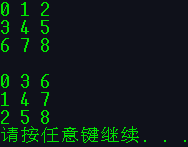

<font color='Crimson'>**5. 输入字符串反序存放**</font>

```c
#include <stdio.h>int main(){    void exc_c(str[]);    char str[80];    printf("Please enter a string:\n");    gets(str);    exc_c(str);    puts(str);        system("pause");}void exc_c(str[]){    int i=0,j=0;    char t;    for(i=0;;i++)    {        if(str[i]=='\0')        {            break;        }    }    while(j==i || j>i)    {        t=str[j];        str[j]=str[i];        str[i]=t;        j++;        i--;    }}
```

<font color='DarkOrchid'>**运行结果:**</font>


<font color='Crimson'>**6. 连接字符串**</font>

```c
#include <stdio.h>int main(){    void link_c(char [],char []);    char str1[50],str2[10];    printf("Please enter A string:\n");    gets(str1);    printf("Please enter B string:\n");    gets(str2);    link_c(str1,str2);    puts(str1);        system("pause");}void link_c(char ch1[],char ch2[]){    int i,j;    for(i=0;;i++)    {        if(ch1[i]=='\0')            break;    }    ch1[i]=' ';    i++;    for(j=0;;j++)    {        ch1[i]=ch2[j];        i++;        if(ch2[j]=='\0')            break;    }}
```

<font color='DarkOrchid'>**运行结果:**</font>


<font color='Crimson'>**7. 复制并输出元音字母**</font>

```c
#include <stdio.h>int main(){    void cop_c(char ch1[],char ch2[]);    char str1[50],str2[20];    printf("Please enter A string:\n");    gets(str1);    cop_c(str1,str2);    puts(str2);        system("pause");}void cop_c(char ch1[],char ch2[]){    int i,j=0;    for(i=0;;i++)    {        if(ch1[i]=='a' || ch1[i]=='A' || ch1[i]=='e' || ch1[i]=='E' || ch1[i]=='i' || ch1[i]=='I' || ch1[i]=='o' || ch1[i]=='O' || ch1[i]=='u' || ch1[i]=='U')        {            ch2[j]=ch1[i];            j++;        }        else if(ch1[i]=='\0')        {            break;        }    }}
```

<font color='Crimson'>**8. 输入数字,输出时加两个空格**</font>

```c
#include <stdio.h>int main(){    void out_i(char a[]);    char a[4],i;    printf("Please enter four integer numbers:\n");    gets(a);    out_i(a);        system("pause");}void out_i(char a[]){    char i;    for(i=0;i<4;i++)    {        printf("%c",a[i]);        printf(" ");    }}
```

<font color='DarkOrchid'>**运行结果:**</font>


<font color='Crimson'>**9. 统计字符**</font>

```c
#include <stdio.h>int main(){    void sta_c(char []);        char str[80];    printf("Please enter a string:\n");    gets(str);    sta_c(str);        system("pause");}void sta_c(char str[]){    int i,letter_c=0,number_c=0,blank_c=0,other_c=0;    for(i=0;;i++)    {        if(str[i]=='\0')        {            break;        }        else if((str[i]>='A' && str[i]<='Z') || (str[i]>='a' && str[i]<='z'))            //&&为与运算(表示且两个条件同时成立)||为或运算(表示两个条件成立一个即可)        {            letter_c++;        }        else if(str[i]>='0' && str[i]<='9')        {            number_c++;        }        else if(str[i]==' ')        {            blank_c++;        }        else        {            other_c++;        }    }    printf("字母字符:%d\n数字字符:%d\n空格字符:%d\n其他字符:%d\n",letter_c,number_c,blank_c,other_c);}
```

<font color='DarkOrchid'>**运行结果:**</font>


<font color='Crimson'>**10. 输出最长的单词(以空格作为分界,计算单词长度,以'\0'作为结束点)**</font>

```c
#include <stdio.h>#include <string.h>int main(){    void sta_c(char []);        char str[80];    printf("Please enter a string:\n");    gets(str);    sta_c(str);        system("pause");}void sta_c(char str[]){    int i,j,k=0;    char str1[20]={' '},str2[20]={' '};    for(i=0;;i++)    {        if((str[i]>='A' && str[i]<='Z') || (str[i]>='a' && str[i]<='z'))        {            str1[j]=str[i];            j++;        }        else if(str[i]==' ')        {            if(j>k)            {                strcpy(str2,str1);                k=j;                j=0;                continue;            }            else            {                j=0;            }        }        else if(str[i]=='\0')        {            if(j>k)            {                strcpy(str2,str1);                k=j;                break;            }        }    }    puts(str2);}
```

<font color='DarkOrchid'>**运行结果**</font>


<font color='Crimson'>**11. "起泡法"由小到大输出10个字符**</font>

```c
#include <stdio.h>int main(){    void put_c(char ch[]);        char str[10];    gets(str);    put_c(str);        system("pause");}void put_c(char ch[]){    int i,j,max;    char t;    j=0;    t=ch[0];    for(j=0;j<10;j++)    {        for(i=j+1;i<10;i++)        {            if(ch[j]>ch[i])            {                t=ch[i];                ch[i]=ch[j];                ch[j]=t;            }        }    }    puts(ch);}
```

<font color='DarkOrchid'>**运行结果:**</font>


<font color='Crimson'>**12. 牛顿迭代法求根.**</font>
$$
ax^3+bx^2+cx+d=0
$$
系数 a,b,c,d 依次为1,2,3,4由主函数输入.求 x 在 1 附近的一个实根.

<font color='Crimson'>产生背景</font>

多数方程不存在求根公式，因此求精确根非常困难，甚至不可解，从而寻找方程的近似根就显得特别重要。方法使用函数


 的[泰勒级数](https://baike.baidu.com/item/泰勒级数)的前面几项来寻找方程


 的根。牛顿迭代法是求方程根的重要方法之一，其最大优点是在方程


 的单根附近具有平方收敛，而且该法还可以用来求方程的重根、复根，此时线性收敛，但是可通过一些方法变成[超线性收敛](https://baike.baidu.com/item/超线性收敛/1445540)。另外该方法广泛用于计算机编程中。

<font color='Crimson'>牛顿迭代公式</font>

设


 是


 的根，选取


 作为


 的初始近似值，过点


 做曲线


 的切线


 ，


 ，则


 与


 轴交点的横坐标


 ，称


 为


 的一次近似值。过点


 做曲线


 的切线，并求该切线与x轴交点的横坐标


 ，称


 为r的二次近似值。重复以上过程，得


 的近似值序列，其中，


 称为


 的


 次近似值，上式称为牛顿[迭代](https://baike.baidu.com/item/迭代) **公式**。

用牛顿迭代法解[非线性方程](https://baike.baidu.com/item/非线性方程/4778289)，是把非线性方程


 线性化的一种近似方法。把


 在点


 的某邻域内展开成泰勒级数


 ，取其线性部分（即泰勒展开的前两项），并令其等于0，即


 ，以此作为非线性方程


 的近似方程，若


 ，则其解为


 ， 这样，得到牛顿迭代法的一个迭代关系式：


 。

已经证明，如果是连续的，并且待求的零点是孤立的，那么在零点周围存在一个区域，只要初始值位于这个邻近区域内，那么牛顿法必定收敛。 并且，如果不为0, 那么牛顿法将具有平方收敛的性能. 粗略的说，这意味着每迭代一次，牛顿法结果的有效数字将增加一倍。

迭代法也称辗转法，是一种不断用变量的旧值递推新值的过程，跟迭代法相对应的是直接法（或者称为一次解法），即一次性解决问题。迭代算法是用计算机解决问题的一种基本方法。它利用计算机运算速度快、适合做重复性操作的特点，让计算机对一组指令（或一定步骤）重复执行，在每次执行这组指令（或这些步骤）时，都从变量的原值推出它的一个新值。

利用迭代算法解决问题，需要做好以下三个方面的工作：

一、确定迭代变量

在可以用迭代算法解决的问题中，至少存在一个可直接或间接地不断由旧值递推出新值的变量，这个变量就是迭代变量。

二、建立迭代关系式

所谓迭代关系式，指如何从变量的前一个值推出其下一个值的公式（或关系）。迭代关系式的建立是解决迭代问题的关键，通常可以使用递推或倒推的方法来完成。

三、对迭代过程进行控制

在什么时候结束迭代过程？这是编写迭代程序必须考虑的问题。不能让迭代过程无休止地执行下去。迭代过程的控制通常可分为两种情况：一种是所需的迭代次数是个确定的值，可以计算出来；另一种是所需的迭代次数无法确定。对于前一种情况，可以构建一个固定次数的循环来实现对迭代过程的控制；对于后一种情况，需要进一步分析得出可用来结束迭代过程的条件。

<font color='Crimson'>C语言代码</font>

```c
#include<stdio.h>#include<math.h>double func(double x) //举例函数{    return x*x*x*x-3*x*x*x+1.5*x*x-4.0;}double func1(double x) //导函数{    return 4*x*x*x-9*x*x+3*x;}int Newton(double *x,double precision,int maxcyc)      //maxcyc  迭代次数{    double x1,x0;    int k;    x0=*x;    for(k=0;k<maxcyc;k++)    {        if(func1(x0)==0.0)//若通过初值，函数返回值为0        {            printf("迭代过程中导数为0!\n");            return 0;        }        x1=x0-func(x0)/func1(x0);//进行牛顿迭代计算        if(fabs(x1-x0)<precision || fabs(func(x1))<precision)//达到结束条件        {            *x=x1; //返回结果                        printf("该值附近的根为：%lf\n",*x);             return 1;        }        else //未达到结束条件        {            x0=x1; //准备下一次迭代        }    }    printf("迭代次数超过预期！\n"); //迭代次数达到，仍没有达到精度    return 0;} int main(){    double x,precision;    int maxcyc;    printf("输入初始迭代值x0:");    scanf("%lf",&x);    printf("输入最大迭代次数：");    scanf("%d",&maxcyc);    printf("迭代要求的精度：");    scanf("%lf",&precision);    if(Newton(&x,precision,maxcyc)==1) //若函数返回值为1    {     }    else //若函数返回值为0    {        printf("迭代失败！\n");    }    return 0;}
```

<font color='Crimson'>**13. 递归求 n 阶勒让德多项式的值**</font>

```c
#include <stdio.h>int main(){    int P(int n,int x);    int x,n,t;    printf("Please input n & x:\n");    scanf("%d%d",&n,&x);    printf("n 阶勒让德多项式的值是: %d.\n",p(n,x));}int P(int n,int x){    int t;    if(n==0)        t=1;    if(n==1)        t=x;    if(n>1)        t=((2*n-1)*x-P(n-1,x)-(n-1)*P(n-2,x))/n;    return t;}
```

<font color='DarkOrchid'>**运行情况:**</font>


<font color='Crimson'>**14. 统计成绩(aver_stu,aver_sub,max,i,j,l,m)**</font>

```c
#include <stdio.h>int l=0,m=0,max=0;float aver_stu[10],aver_sub[5];int main(){    float fun(float a[][5]);    float a[10][5];    for(i=0,i<10,i++)    {        printf("Please enter the score of the NO.%d:\n",i+1);        for(j=0,j<5,j++)        {            printf("Score%d:",j+1);            scanf("%f",&a[i][j]);        }        putchar('\n');    }        fun(a);        for(i=0,i<10,i++)    {        float aver;        aver=aver_stu[i];        printf("NO.%d Average Score:%f\n",i+1,aver);    }    for(i=0,i<5,i++)    {        float aver;        aver=aver_sub[i];        printf("Average Score%d:%f\n",i+1,aver);    }    printf("The max is No.%d Score%d:%f\n",l,m,max);    var=Msv;    printf("The mean score variance is:%f",var);        system("pause");}float fun(float [][5]){    float sum_stu=0,sum_sub=0,Msv=0,z=0;    for(i=0;i<10;i++)    {        for(j=0;j<5;j++)        {            if(a[i][j]>max);            {l=i;m=j;            max=a[i][j];}        }    }    for(i=0,i<10,i++)    {        for(j=0,j<5,j++)        {            sum_stu+=a[i][j];        }        aver_str[i]=(sum_stu/5);    }    for(j=0;j<5;j++)    {        for(i=0,i<10,i++)        {            sum_sub+=a[i][j];        }        aver_sub[j]=(sum_sub/10);    }    for(i=0,i<10,i++)    {        z+=aver_stu[i];    }    Msv=z*z/10-(z/10)(z/10);        return Msv;}
```

<font color='Crimson'>**15. 输入姓名工号,工号排序查询功能(主界面,输入界面,自动排序,查询界面)**</font>

```c
#undef UNICODE#undef _UNICODE //取消 Unicode 编码的宏定义,让后续编码都以 MBCS 编码编译#include <stdio.h>#include <stdlib.h>//定义全局变量char show_n[8] = {" "}, query_n[8] = {" "}, name[10][8] = {{" "}}; //两个字符为一个汉字按四个汉字一个姓名,8个为个人名char show_jn[13] = {" "}, query_jn[13] = {" "}, job_number[10][13] = {{" "}};void print_star(){    int i;    for (i = 0; i < 80; i++)    {        printf("*");    }    printf("\n");}void show_main(){    system("cls");    print_star();    printf("%52s\n", "欢迎使用本员工管理系统\n");    print_star();    printf("%48s\n", "1. 输入员工信息\n");    printf("%48s\n", "2. 查询员工信息\n");    printf("%44s\n", "3. 退出系统\n");    print_star();    int c1;    scanf("%d", &c1);    switch (c1)    {    case 1:        clear_show();        input_mes();        break;    case 2:        clear_show();        show_query();        break;    case 3:        return 0;    }}void rank(){    int i;    for(i=0;i<10;i++)    {        if(job_number[i]>job_number[i+1])        {            strcpy(query_jn,job_number[i]);            strcpy(job)number[i],job_number[i+1]);            strcpy(job_number[i+1],query_jn);            strcpy(query_n,name[i]);            strcpy(name[i],name[i+1]);            strcpy(name[i+1],query_n);        }    }}void input_mes(){    int i;    for (i = 0; i < 2; i++)    {        printf("请输入No.%d的姓名:\n", i + 1);        scanf("%s", &show_n);        strcpy(name[i], show_n);        printf("请输入No.%d工号:\n", i + 1);        scanf("%s", &show_jn);        strcpy(job_number[i], show_jn);    }    rank();    show_main();}void clear_show(){    system("cls");}void show_query(){    system("cls");    print_star();    printf("%52s\n", "欢迎使用本员工管理系统\n");    print_star();    printf("%48s\n", "1. 按姓名查询\n");    printf("%48s\n", "2. 按工号查询\n");    print_star();    int c1;    scanf("%d", &c1);    switch (c1)    {    case 1:        clear_show();        query_name();        break;    case 2:        clear_show();        query_job();    }}void query_name(){    clear_show();    printf("请输入姓名:\n");    scanf("%s", &query_n);    int i, n;    for (i = 0; i < 10; i++)    {        if (strcmp(query_n, name[i]) == 0)        {            break;        }    }    strcpy(show_jn, job_number[1]);    printf("%s 的工号为: %s\n", name[i], job_number[i]);    system("pause");    show_main();}void query_job(){    clear_show();    printf("请输入工号:\n");    scanf("%s", &query_jn);    int i, n;    for (i = 0; i < 10; i++)    {        if (strcmp(query_jn, job_number[i]) == 0)        {            break;        }    }    printf("工号:%s 的姓名为: %s\n", job_number[i], name[i]);    system("pause");    show_main();}int main(){    int a;    show_main();}
```

<font color='Crimson'>**16. 进制转换函数**</font>

```c
#include <stdio.h>#include <stdlib.h>int main(){    void sextoten();    sextoten();    system('pause');}void sextoten(){    int a=0;    printf("请输入一个十六进制数:\n");    scanf("%x",&a);    printf("%x 的十进制为 %d\n",a,a);}
```

<font color='Crimson'>**17.递归转换整数为字符串.**</font>

```c
#include <stdio.h>#include <stdlib.h>void convert(long int n){    int i;    if((i = n / 10) != 0)	//如果i不等于0时继续调用自己本身    {        convert(i);    }    putchar(n % 10 + '0');	//直到i等于0时即n为个位数}int main(){    long int num;    printf("请输入一个整数:\n");    scanf("%ld",&num);    if(num < 0)    {        printf("-");        num = -num;    }    convert(num);    printf("\n");        system("pause");}
```

<font color='Crimson'>**18.给出年月日计算该日是该年的第几天**</font>

```c
#include <stdio.h>#include <stdlib.h>int main(){    int year, month, day, count;    int leap(int year);    printf("请输入年月日(以回车间隔):\n");    scanf("%d%d%d", &year, &month, &day);    switch (month)    {    case 1:        count = 0;        break;    case 2:        count = 31;        break;    case 3:        count = 59;        break;    case 4:        count = 90;        break;    case 5:        count = 120;        break;    case 6:        count = 151;        break;    case 7:        count = 181;        break;    case 8:        count = 212;        break;    case 9:        count = 242;        break;    case 10:        count = 273;        break;    case 11:        count = 303;        break;    case 12:        count = 334;        break;    }        if (leap(year) == 0)    {        printf("%d年不是闰年.\n", year);    }    else    {        printf("%d年是闰年.\n", year);    }    printf("%d年%d月%d日为%d年的第%d天.\n", year, month, day, year, (count + day + leap(year)));    system("pause");}int leap(int year){    int i = 0;    if (year % 100 == 0)    {        if (year % 400 == 0)        {            i = 1;        }        else        {            i = 0;        }    }    else if (year % 100 != 0)    {        if (year % 4 == 0)        {            i = 1;        }        else        {            i = 0;        }    }    return (i);}
```

2021年10月30日20:37:08

## 第 8 章 善于利用指针

### 8.1 指针是什么

<font color='Crimson'>指向变量存储单元的地址,将地址形象地称为"指针".</font>意思是通过它可以找到以它为地址的内存单元.

直接按变量名进行的访问,称为"<font color='Crimson'>**直接访问**</font>"方式.

将目标变量的地址存放在另一变量中,然后通过该变量来找到目标变量的地址,从而访问目标变量的方式称为<font color='Crimson'>**间接访问.**</font>

在 C 语言程序中,可以定义整型变量,浮点型(实型)变量,字符型变量等,也可以定义指针变量,用来存放地址.假设定义一个变量 i_pointer,用来存放整型变量的地址.可以通过下面的语句将 i 的地址存放到 i_pointer 中.

```c
i_pointer = &i;	//将 i 的地址存放到 i_pointer 中
```

这时 i_pointer 的值为 2000 (变量 i 所占用单元的起始地址).

要存取变量 i 的值,既可以用直接访问的方式,也可以采用间接访问的方式:先找到存储变量 i 的地址的变量 i_pointer ,从中取出 i 的地址,然后到 2000 字节处取出 i 的值.(见图 8.1)


图 8.2(a) 表示直接访问;(b) 表示间接访问.


将数值送到变量中,也可以用直接间接两种方法.

直接: i = 3;

间接: *i_pointer = 3; *i_pointer 表示 i_pointer 指向的对象.

<font color='Crimson'>**指向**</font>就是通过<font color='Crimson'>**地址**</font>来体现的.图 8.2 中以单箭头表示这种"指向"关系.

由于通过地址能找到所需的变量单元,因此说,地址<font color='Crimson'>**指向**</font>该变量单元.将地址形象化地称为"指针".意思值通过它能找到以它为地址的内存单元.

<font color='Crimson'>**一个变量的地址称为该变量的"指针"**</font>.如果有一个变量专门用来存放另一个变量的地址(即指针),则称它为"<font color='Crimson'>**指针变量**</font>".<font color='Crimson'>**指针变量的值是地址(即指针).**</font>

<font color='Crimson'>指针是一个地址,而指针变量是存放地址的变量.</font>

### 8.2 指针变量

#### 8.2.1 使用指针变量的例子

<font color='DarkOrchid'>**例 8.1**</font>	通过指针变量访问整型变量.

<font color='DarkOrchid'>**解题思路:**</font>	先定义两个整型变量,在定义两个指针变量,分别指向这两个整型变量,通过访问指针变量,可以找到它们所指向的变量,从而得到这些变量的值.

<font color='DarkOrchid'>**编写程序:**</font>

```c
#include <stdio.h>#include <stdlib.h>int main(){    int a = 100,b = 10;	//定义整型变量    int *pointer_1,*pointer_2;//定义指针变量    pointer_1 = &a;//把a的地址赋给指针变量pointer_1    pointer_2 = &b;//把b的地址赋给指针变量pointer_2    printf("a = %d,b = %d\n",a,b);//输出变量a,b    printf("*pointer_1 = %d,*pointer_2 = %d\n",*pointer_1,*pointer_2);//输出变量a,b    printf("pointer_1 = %d,pointer_2 = %d\n",pointer_1,pointer_2);//输出指针变量pointer_1和pointer_2        system("pause");    return 0;}
```

<font color='DarkOrchid'>**运行结果:**</font>


<font color='DarkOrchid'>**程序分析:**</font>

<font color='Crimson'>开始定义了两个指针变量,**但此时它们并未指向任何一个变量,只是提供两个指针变量,规定它们可以指向整型变量,至于指向哪一个整型变量要在程序语句中指定.**</font>*pointer_1,其中" * "表示"指向".程序中出现两次 *pointer 含义不同,第一次出现表示定义两个指针变量,printf 函数中出现表示指针变量指向的变量.

#### 8.2.2 怎样定义指针变量

一般形式为:

<font color='Crimson'>**类型名 *指针变量名;**</font>

左端的类型名是定义指针变量时必须指定的"基类型",<font color='Crimson'>因为不同类型的数据在内存中所占用的字节数和存放方式不同,**所以必须要指定基类型,**否则无法判定如何取出数据.</font>

<font color='Crimson'>**一个变量的指针的含义包括两个方面,一是以存储单元编号表示的地址,一是它指向的存储单元的数据类型.**</font>

<font color='Crimson'>**指向整型数据的指针类型表示为"int *",读作"指向 int 的指针"或简称"int 指针".**</font>

<font color='Chartreuse'>指针变量中只能存放地址(指针),不要将一个整数赋给一个指针变量.是不合法的.</font>

#### 8.2.3 怎样引用指针变量

在引用指针变量时,可能有 3 种情况:

<font color='DarkOrchid'>( 1 )</font>	给指针变量赋值.如:

```c
p = &a;	//把 a 的地址赋给指针变量 p
```

指针变量 p 的值是变量 a 的地址,p 指向 a.

<font color='DarkOrchid'>( 2 )</font>	引用指针变量指向的变量.

如果已执行"p = &a;",即指针变量 p 指向了整型变量 a,则

```c
printf("%d",*p);
```

其作用是以整数形式输出指针变量 p 所指向的变量的值,即变量 a 的值.

如果有以下赋值语句:

```c
*p = 1;
```

表示将整数 1 赋给 p 当前指向的变量,如果 p 指向变量 a ,则相当于把 1 赋给 a,即"a = 1;".

<font color='DarkOrchid'>( 3 )</font>	引用指针变量的值.如:

```c
printf("%o",p);
```

作用是以八进制数形式输出指针变量 p 的值,如果 p 指向了 a,就是输出了 a 的地址,即 &a.

<font color='Coral'>**注意:**</font>	要熟练掌握两个有关的运算符:

<font color='Coral'>( 1 )</font>	<font color='Coral'>& 取地址运算符.</font>&a 是变量 a 的地址.

<font color='Coral'>( 2 )</font>	<font color='Coral'>* 指针运算符(或称"间接访问"运算符)</font>,*p代表指针变量 p 指向的对象.

<font color='DarkOrchid'>**例 8.2**</font>	输入 a 和 b 两个整数,按先大后小的顺序输出 a 和 b.

<font color='DarkOrchid'>**解题思路:**</font>	用指针处理,不交换整型变量的值,而是交换连个指针变量的值.

<font color='DarkOrchid'>**编写程序:**</font>

```c
#include <stdio.h>#include <stdlib.h>int main(){    int a,b,*p_1,*p_2,*p;    printf("Please enter two integer numbers:\n");    scanf("%d%d",&a,&b);    p_1 = &a;    p_2 = &b;    if(a < b)    {        p = p_1;        p_1 = p_2;        p_2 = p;    }    printf("a = %d,b = %d",a,b);    printf("Max = %d,Min = %d",*p_1,*p_2);        system("pause");    return 0;}
```

<font color='DarkOrchid'>**运行结果:**</font>


<font color='DarkOrchid'>**程序分析:**</font>交换前情况见图 8.4(a),交换后情况见图 8.4(b).

<font color='DarkOrchid'>**注意:**</font> a 和 b 的值并未交换,保持原值,但 p_1 和 p_2 的值改变了.实际上可以直接对 p_1 和 p_2 赋新值,可以不用借助中间变量 p,使程序更加简练.

```c
{p_1 = &b;p_2 = &a;}
```

这个问题的算法不是交换整型变量的值,而是交换两个指针变量的值(即 a 和 b 的地址).

#### 8.2.4 指针变量作为函数参数

函数的参数不仅可以是整型,浮点型,字符型等数据,还可以是指针类型.它的作用是将一个变量的地址传送到另一个函数中.

<font color='DarkOrchid'>**例 8.3**</font>	题目要求同例 8.2,即对输入的两个整数按大小顺序输出.现用函数处理,而且用指针类型的数据作函数参数.

<font color='DarkOrchid'>**解题思路:**</font>	本题定义一个函数 swap,将指向两个整型变量的指针变量(内放两个变量的地址)作为实参传递给 swap 函数的形参指针变量,在函数中通过指针实现交换两个变量的值.

<font color='DarkOrchid'>**编写程序:**</font>

```c
#include <stdio.h>#include <stdlib.h>int main(){    void swap(int *p1,int *p2);    int a,b;    int *p_1,*p_2;    printf("please enter two integer numbers:\n");    scanf("%d%d",&a,&b);    p_1 = &a;    p_2 = &b;    if(a < b) void swap(p_1,p_2);    printf("Max = %d,Min = %d",a,b);        system("pause");    return 0;}void swap(int *p1,int *p2){    /*int *p;	运行情况如下图1,指针函数的指向没有发生改变    p = p1;		指针形参的改变不会影响指针实参的值    p1 = p2;    p2 = p;*/    int p;	//指针的指向还是没有改变,但是函数内直接通过指针改变了指向    p = *p1;	//变量的值,所以交换成功    *p1 = *p2;    *p2 = p;}
```

<font color='DarkOrchid'>**运行结果:**</font>


<font color='DarkOrchid'>**程序分析:**</font>	交换情况见图 8.5


考虑能否通过下面的函数实现 a 和 b 互换.

```c
void swap(int x,int y){    int temp;    temp = x;    x = y;    y = temp;}
```

调用函数后如图 8.6 所示,x 和 y 的值是互换了,但并未影响到 a 和 b 的值.函数结束时,x 和 y 释放了,main 函数中的 a 和 b 并未互换.也就是说由于"<font color='Crimson'>**单向传送**</font>"的"<font color='Crimson'>**值传递**</font>"方式,形参值的改变不能使实参的值随之改变.


为了使在函数中改变了的变量值能被主调函数 main 所用,不能采取上述把要改变值得变量作为参数的办法,而应该用指针变量作为函数参数,在函数执行过程中使指针变量所指向的变量值发生变换,函数调用结束后,这些变量值得变化依然保留下来,这样就实现了"通过调用函数使变量的值发生变化,在主调函数(如 main 函数)中可以使用这些改变了的值"的目的.

如果想通过函数调用得到 n 个想要改变的值,可以这样做:

① 在主调函数中设 n 个变量,用 n 个指针变量指向它们;

② 设计一个函数,有 n 个指针形参.在这个函数中改变这 n 个形参的值;

③ 在主调函数中调用这个函数,在调用时将这 n 个指针变量作实参,将它们的地址传给该函数的形参;

④ 在执行该函数的过程中,通过形参指针变量,改变它们所指向的 n 个变量的值;

⑤ 主调函数中就可以使用这些改变了值得变量.

按此思路理解例 8.3 程序.

<font color='Coral'>**注意:**</font>	不能企图改变指针形参的值而使指针实参的值改变.请看下面的程序.

<font color='DarkOrchid'>**例 8.4**</font>	对输入的两个整数按大小顺序输出.

<font color='DarkOrchid'>**解题思路:**</font>	常识调用 swap 函数来实现题目要求,在函数中改变形参(指针变量)的值,希望能由此改变实参(指针变量)的值.

<font color='DarkOrchid'>**编写程序:**</font>

```c
#include <stdio.h>#include <stdlib.h>int main(){    void swap(int *p1,int *p2);    int a,b;    int *p_1,*p_2;    printf("please enter two integer numbers:");    scanf("%d%d",&a,&b);    p_1 = &a;    p_2 = &b;    if(a < b)    {        swap(p_1,p_2);    }    printf("Max = %d,Min = %d",a,b);    return 0;}void swap(int *p1,int *p2){    int *p;    p = p1;    p1 = p2;    p2 = p;}
```

<font color='DarkOrchid'>**运行结果:**</font>


<font color='DarkOrchid'>**程序分析:**</font>	结果显然与原意不符.其设想见图 8.7.


问题出在(d),C 语言中实参变量和形参变量之间的数据传递是单向的"值传递"方式.用指针变量作函数参数时同样要遵循这一规则.不可能通过执行调用函数来改变实参指针变量的值,但是可以改变实参指针变量所指变量的值.

<font color='Coral'>**注意:**</font>	函数的调用可以用(而且只可以)得到一个返回值(即函数值),而使用指针变量作参数,可以的到多个变化了的值.如果不用指针变量是难以做到这一点的.要善于利用指针法.

<font color='DarkOrchid'>**例 8.5**</font>	输入 3 个整数 a,b,c,要求按由大到小的顺序将它们输出.用函数实现.

<font color='DarkOrchid'>**解题思路:**</font>	采用例 8.3 的方法在函数中改变这 3 个变量的值.用 swap 函数交换两个变量的值,用 exchange 函数改变这 3 个变量的值.

<font color='DarkOrchid'>**编写程序:**</font>

```c
#include <stdio.h>#include <stdlib.h>int main(){    void exchange(int *q1,int *q2,int *q3);    int a,b,c,*p1,*p2,*p3;    printf("please enter three numbers:");    scanf("%d%d%d",&a,&b,&c);    p1 = &a;p2 = &b;p3 =&c;    exchange(p1,p2,p3);    printf("The order is: %d %d %d\n",a,b,c);        system("pause");    return 0;}void exchange(int *q1,int *q2,int *q3){    void swap(int *pt1,int *pt2);    if(*q1 < *q2){swap(q1,q2);}    if(*q1 < *q3){swap(q1,q3);}    fi(*q2 < *q3){swap(q2,q3);}}void swap(int *pt1,int *pt2){    int temp;    temp = *pt1;    *pt1 = *pt2;    *pt2 = temp;}
```

<font color='DarkOrchid'>**运行结果:**</font>


<font color='DarkOrchid'>**程序分析:**</font>	exchange 函数的作用是对 3 个数排序,在执行 exchange 函数中,要嵌套调用 swap 函数, swap 函数是对两个数排序,通过调用 swap 函数实现 3 个数的排序.

<font color='Crimson'>**思考:**</font>	main 函数中的 3 个指针变量的值改变了没有.

没有改变还是各自指向 a,b,c.

### 8.3 通过指针引用数组

#### 8.3.1 数组元素的指针

一个变量有地址,一个数组包含若干个元素,每个数组元素都在内存中占用存储单元,它们都有响应的地址.指针变量既然可以指向变量,当然也可以指向数组元素(把某一蒜素的地址放到一个指针变量中).<font color='Crimson'>**所谓数组元素的指针就是数组元素的地址.**</font>

可以用一个指针变量指向一个数组元素,例如:

```c
int a[10] = {1,3,5,7,9,11,13,15,17,19};	//定义一个整型数组int *p;		//定义一个指向整型变量的指针变量p = &a[0];	//把a[0]元素的地址赋给指针变量p
```

以上是使指针变量 p 指向 a 数组的第 0 号元素,见图 8.8.


引用数组元素可以用<font color='Crimson'>**下标法**</font>(如 a[3]),也可以用<font color='Crimson'>**指针法,**</font>即通过指向数组元素的指针找到所需的元素.使用指针法能使目标程序质量高(占内存少,运行速度快).

在 C 语言中,数组名(不包括形参数组,形参数组并不占实际的内存单元)代表数组中首元素(即序号为 0 的元素)的地址.因此,下面两个语句等价:

```c
p = &a[0];	//p 的值是 a[0] 的地址p = a;		//p 的值是数组 a 首元素(即 a[0])的地址
```

<font color='Coral'>**注意:**</font>	数组名不代表整个数组,只代表数组首元素的地址.上述"p = a;"的作用是"把 a 数组的首元素的地址赋给指针变量 p",而不是"把数组 a 各元素的值赋给 p".

在定义指针变量时可以对它初始化,如:

```c
int *p = &a[0];
```

它等效与下面两行:

```c
int *p;p = &a[0];	//不应写成 *p = &a[0];
```

它的作用是将 a 数组首元素(即 a[0])的地址赋给指针变量 p(而不是赋给 *p).

#### 8.3.2 在引用数组元素时指针的运算

在引用数组元素时常常会遇到指针的算术运算.有人会提出问题:对数值型数据进行算术运算(加减乘除)的目的和含义都是清楚的,而在什么情况下需要用到对指针型数据的算术运算呢?其含义是什么?

前已反复说明指针就是地址.对地址进行赋值运算是没有问题的,但是对地址进行算术运算是什么意思呢?显然对地址进行乘和除的运算是没有意义的,实际上也无此必要.那么,能否进行加和减得运算?答案是:在一定条件下允许对指针进行加和减得运算.

那么,在什么情况下需要而且可以对指针进行加和减的运算呢?回答是:当指针指向数组元素的时候.譬如,指针变量 p 指向数组元素 a[0],我们希望用 p+1 表示指向下一个元素 a[1].如果能实现这样的运算,就会对引用数组元素提供很大的方便.

在<font color='Crimson'>**指针指向数组元素时,**</font>可以对指针进行以下运算:

加一个整数(用+或+=),如 p+1;减一个整数(用-或-=),如 p-1;

自加运算,如 p++,++p;自减运算,如 p--,--p;

两个指针相减,如 p1-p2(只有 p1 和 p2 都指向同一数组中的元素时才有意义).

分别说明如下:

<font color='DarkOrchid'>( 1 )</font>	如果指针变量 p 已指向数组中的一个元素,则 <font color='Crimson'>**p+1 指向同一数组中的下一个元素,p-1 指向同一数组中的上一元素**</font>.注意:执行 p+1 时并不是将 p的值(地址)简单地加 1,而是加上一个数组元素所占用的字节数.例如,数组元素是 float 型,每个元素占 4 个字节,则 p+1 意味着使 p 的值(是地址)加 4 个字节,以使它指向下一元素.p+1 所代表的地址实际上是(p+1)×d,d 是一个数组元素所占的字节数.d 的值根据定义时指定的基类型变化.

<font color='DarkOrchid'>( 2 )</font>	如果 p 的初值为 &a[0],则 p+i 和 a+i 就是数组元素 a[i] 的地址,或者说,它们指向 a 数组序号为 i 的元素,见图 8.9.这里要注意的是 a 代表数组首元素的地址,a+1 也是地址,它的计算方法同 p+1,即它的实际地址为 (a+1)×d.


<font color='DarkOrchid'>( 3 )</font>	*(p+i) 或 *(a+i) 是 p+i 或 a+i 所指向的数组元素,即 a[i].[ ]实际上是<font color='Crimson'>**变址运算符**</font>,即将 a[i] 按 a+i 计算地址,然后找出此地址单元中的值.

<font color='DarkOrchid'>( 4 )</font>	如果指针变量 p1 和 p2 都指向同一数组,如执行 p2-p1,结果是 p2-p1 的值(两个地址之差)除以数组元素的长度.这个结果是有意义的,表示 p2 所指的元素与 p1 所指的元素之间差几个元素,这样,就不需要具体知道 p1 和 p2 的值,然后去计算它们的相对位置,而是直接用 p2-p1 就可知道它们所指元素的相对距离.<font color='Coral'>两个地址不能相加,是无实际意义的.</font>

#### 8.3.3 通过指针引用数组元素

根据以上叙述,引用一个数组元素,可以用下面两种方法:

<font color='DarkOrchid'>( 1 )</font>	<font color='Crimson'>**下标法**</font>,如 a[i] 形式;

<font color='DarkOrchid'>( 2 )</font>	<font color='Crimson'>**指针法**</font>,如 *(a+i) 或 *(p+i).其中 a 是数组名,p 是指向数组元素的指针变量,其初值 p=a.

<font color='DarkOrchid'>**例 8.6**</font>	有一个整型数组 a,有 10 个元素,要求输出数组中的全部元素.

<font color='DarkOrchid'>**解题思路:**</font>	引用数组中各元素的值有 3 种方法:①下标法②通过数组名计算数组元素地址,找出元素的值;③用指针变量指向数组元素.分别写出程序,以资比较分析.

<font color='DarkOrchid'>**编写程序:**</font>

① 下标法

```c
#include <stdio.h>#include <stdlib.h>int main(){    int a[10];    int i;    printf("Please enter ten integer numbers:\n");    for(i=0;i<10;i++)    {        scanf("%d",&a[i]);    }    for(i=0;i<10;i++)    {        printf("%d ",a[i]);    }    printf("\n");        system("pause");    return 0;}
```

<font color='DarkOrchid'>**运行结果:**</font>


② 通过计算数组元素地址找出数组的值

```c
#include <stdio.h>#include <stdlib.h>int main(){    int a[10];    int i;    printf("Please enter ten integer numbers:\n");    for(i=0;i<10;i++)    {        scanf("%d",&a[i]);    }    for(i=0;i<10;i++)    {        printf("%d",*(a+i));    }    printf("\n");        system("pause");    return 0;}
```

<font color='DarkOrchid'>**运行结果:**</font>


<font color='DarkOrchid'>**程序分析:**</font>	程序中 (a+i) 是 a 数组中序号为 i 的元素的地址, *(a+i) 是该元素的值. scanf 语句中的 a[i] 也可以改为 scanf("%d",a+i);

③ 用指针变量指向数组元素.

```c
#include <stdio.h>#include <stdlib.h>int main(){    int a[10];    int i,*p;    //p = &a;对不兼容指针类型'int(*)[10]'赋值给'int *' [- 兼容性 -指针-类型]    p = a;    printf("Please enter ten integer numbers:\n");    for(i=0;i<10;i++)    {        scanf("%d",p+i);    }    for(i=0;i<10;i++)    {        printf("%d ",*(p+i));    }    printf("\n");        system("pause");    return 0;}
```


```c
#include <stdio.h>#include <stdlib.h>int main(){    int a[10];    int *p,i;    printf("Please enter ten integer numbers:");    for(i=0;i<10;i++)    {        scanf("%d",&a[i]);    }    for(p=a;p<(a+10);p++)    {        pritnf("%d",*p);    }    printf("\n");        system("pause");    return 0;}
```

3 种方法比较:

① 和 ② 执行效率相同. C 编译系统是将 a[i] 转换为 *a[i] 处理的,即先计算元素地址.因此用前两种方法找数组元素费时较多.

③ 比另外两种快.用指针变量直接指向元素,不必每次都重新计算地址,像 p++ 这样的自加操作是比较快的.这种有规律地改变地址值(p++)能大大提高执行效率.

用下标法比较直观,能直接知道是第几个元素;用地址法或指针变量的方法不直观,难以很快判断出当前处理的是那一个元素.有经验的人喜欢用 ③ 的形式,用 p++ 进行控制,程序简洁高效.初学者在开始时可用 ① 直观不易出错.

<font color='Coral'>**注意:**</font>	在使用指针变量指向数组元素时,有以下几个问题要注意:

<font color='Coral'>**①**</font>	可以通过改变指针变量的值指向不同的元素.用 p++ 使 p 的值不断改变从而指向不同的元素,如果不用 p 变化的方法而用数组名 a 变化的方法行不行呢?程序中如下改动:

```c
for(p=a;a<(p+10);a++){    printf("%d",*a);}
```

这样是不行的,因为数组名 a 代表数组首元素的地址,它是一个指针型常量,它的值在程序运行期间是固定不变的,既然 a 是常量,所以 a++ 是无法实现的.

<font color='Coral'>②</font>	要注意指针变量的当前值.

<font color='DarkOrchid'>**例 8.7**</font>	通过指针变量输出整型数组 a 的 10 个元素.

<font color='DarkOrchid'>**解题思路:**</font>	用指针变量 p 指向数组元素,通过改变指针变量的值,使 p 先后指向 a[0] ~ a[9] 各元素.

<font color='DarkOrchid'>**编写程序:**</font>

```c
#include <stdio.h>#include <stdlib.h>int main(){    int a[10];    int *p,i;    p = a;    printf("Please enter ten integer numbers:");    for(i = 0;i <10;i++)    {        scanf("%d",p++);    }    for(i = 0;i < 10;i++,p++)    {        printf("%d",*p);    }    printf("\n");        system("pause");    return 0;}
```

<font color='DarkOrchid'>**运行结果:**</font>


<font color='DarkOrchid'>**程序分析:**</font>	程序错误在于第一个 for 循环后 p 已经指向数组 a 的末尾,第二个 for 循环开始时,没有将 p 初始化.

可以看出

<font color='DarkOrchid'>( 1 )</font>指针变量可以指向数组以后的存储单元.C 编译程序并不认为非法.编译时不会出错,但运行结果不是预期的,应避免出现这样的情况.这是程序逻辑上的错误,这种错误比较隐蔽,初学者往往难以发现.在使用指针变量指向数组元素时,应切实保证指向数组中的有效的元素.

<font color='DarkOrchid'>( 2 )</font><font color='Coral'>指向数组的指针变量也可以带下标,如 p[i].当指针变量指向数组元素时,指针变量可以带下标.因为在程序编译时,对下标的处理方法时转换为地址的,对 p[i] 处理成 *(p+i),如果 p 是指向一个整型数组元素 a[0],则 p[i] 代表 a[i].但必须弄清楚 p 的当前值是什么?如果当前 p 指向 a[3],则p[2] 并不代表 a[2],而是 a[3+2],即 a[5].建议少用这种容易出错的用法.</font>

<font color='DarkOrchid'>( 3 )</font>利用指针引用数组元素,比较方便灵活,有不少技巧.在专业人员中常喜欢用一些技巧,以使程序简洁.看到别人写的程序时可能会遇到一些容易使人混淆的情况,要仔细分析.

① 分析:

p++;	*p;

p++ 使 p 指向下一元素 a[1].然后若在执行 *p,则得到下一个元素 a[1] 的值.

② *p++;

由于 ++ 和 * 同优先级,结合方向为自右而左,因此它等价于 *(p++).先引用 p 的值,实现 *p 的运算,然后再使 p 自增 1.

例 8.7 的第二个程序中最后一个 for 语句

```c
for(i=0;i<10;i++,p++)    printf("%d",*p);
```

 可改写为

```c
for(i=0;i<10;i++)    printf("%d",*p++);
```

作用完全一样.

③ *(p++) 与 *(++p) 作用是否相同?<font color='Coral'>不相同</font>.前者是先取 *p 值,然后使 p 加 1.后者是先使 p 加 1,再取 *p.若 p 初值为 a(即&a[0]),若输出 *(p++),得到 a[0] 的值,而输出 *(++p),得到 a[1] 的值.

④ ++( *p ).表示 p 所指向的元素值加 1,如果 p=a,则 ++( *p ) 相当于 ++a[0],若 a[0] 的值为 3,则在执行 ++( *p )(即 ++a[0])后 a[0] 的值为 4.注意:<font color='Coral'>是元素 a[0] 的值加 1,而不是指针 p 的值加 1.</font>

⑤ 如果 p 当前指向 a 数组中第 i 个元素 a[i],则:

*(p--) 相当于 a[i--],先对 p 进行" * "运算(求 p 所指向的元素的值),再使 p 自减.

*(++p) 相当于 a[++i],先使 p 自加,再进行" * "运算.

*(--p) 相当于 a[++i],先使 p 自减,在进行" * "运算.

将 ++ 和 -- 运算符用于指针变量十分有效,可以使指针变量自动向前或向后移动,指向下一个或上一个数组元素.

```c
p = a;while(p < (a + 100))    printf("%d",*p++);或p = a;while(p < a + 100){printf("%d",*p);p++;}
```

但如果不小心,很容易弄错.因此在用 *p++ 形式运算时,一定要十分小心,弄清楚先取 p 值还是先使 p 加 1.对初学者不建议多用,但应当知道有关的知识.

#### 8.3.4 用数组名作函数参数

在第 7 章中介绍过可以用数组名作函数的参数.例如:

```c
int main(){    void fun(int arr[],int n);	//对fun函数声明    int array[10];	//定义array数组    ...;    fun(array,10);	//用数组名作函数的参数    return 0;}void fun(int arr[],int n){    ...}
```

array 是实参数组名,arr 为形参数组名.由 7.7 节已知,当用数组名作参数时,如果形参数组中各元素的值发生变化,实参数组元素的值随之变化.这究竟是什么原因呢?在学习指针以后,对此问题就容易理解了.

先看数组元素作实参时的情况.如果已定义一个函数,其原型为

```c
void swap(int x,int y);
```

假设函数的作用是将两个形参(x,y)的值交换,现有以下的函数调用:

```c
swap (a[1],a[2]);
```

用数组元素 a[1] 和 a[2] 作实参的情况,与用变量作实参时一样,是"值传递"方式,将 a[1] 和 a[2] 的值单向传递给 x 和 y.当 x 和 y 值改变时 a[1] 和 a[2] 的值并不改变.

再看数组名作函数参数的情况.实参数组名代表该数组首元素的地址,而形参是用来接收从实参传递过来的数组首元素地址的.因此,形参应该是一个指针变量(只有指针变量才能存放地址).实际上,C 编译都是将形参数组名作为指针变量来处理的.例如本小节开头给出的函数 fun 的形参是写成数组形式的:

```c
fun(int arr[],int n)
```

但在程序编译时是将 arr 按指针变量处理的,相当于将函数 fun 的首部写成

```c
fun(int *arr,int n)
```

以上两种写法是等价的.在该函数被调用时,系统会在 fun 函数中建立一个指针变量 arr,用来存放从主函数传递过来的实参数组首元素的地址.如果在 fun 函数中用运算符 sizeof 测定 arr 所占的字节数,可以发现 sizeof(arr) 的值为 4 或 2.这就证明了系统是把 arr 作为指针变量来处理的.

当 arr 接收了实参数组的首元素地址后,arr 就指向实参数组首元素,也就是指向 array[0].因此 *arr 就是 array[0].arr+1 指向 array[1],arr+2 指向 array[2],arr+3 指向 array[3].根据前面介绍过得知识, *(arr+i) 和 arr[i] 是无条件等价的.因此,在调用函数期间,arr[0] 和 *arr 以及 array[0] 都代表数组 array 序号为 0 的元素,见图 8.11.


<font color='Coral'>常用这种方法通过调用一个函数来改变实参数组的值.</font>

下面把用哪个变量名作为函数参数和用数组名作为函数参数作比较,见表 8.1.


需要说明的是:C 语言调用函数时虚实结合的方法都是采用"值传递"方式,当用变量名作为函数参数时传递的是变量的值,当用数组名作为函数参数时,由于数组名代表的是数组首元素地址,因此传递的值是地址,所以要求形参为指针变量.

在用数组名作为函数实参时,既然实际上相应的形参是指针变量,为什么还允许使用形参数组的形式呢?这是因为在 C 语言中用下标法和指针法都可以访问一个数组(如果有一个数组 a,则 a[i] 和 *(a+i) 无条件等价),用下标法表示比较直观,便于理解.因此许多人愿意用数组名作形参,以便与实参数组对应.从应用的角度看,用户可以认为有一个形参数组,它从实参数组哪里得到起始地址,因此形参数组与实参数组共同占同一段内存单元,在调用函数期间,如果改变了形参数组的值,也就是改变了实参数组的值.在主调函数中就可以利用这些已改变的值.对 C 语言比较熟练的专业人员往往喜欢用指针变量作形参.

<font color='Coral'>**注意:**</font>	实参数组名代表一个固定的地址,或者说是指针常量,但形参数组并不是一个固定的地址,而是按指针变量处理.

在函数调用进行虚实结合后,它的值就是实参数组首元素的地址.在函数执行期间,它可以再被赋值.例如:

```c
void fun(arr[],int n){    printf("%d\n",*arr);	//输出array[0]的值    arr = arr + 3;	//形参数组名可以被赋值    printf("%d\n",*arr);	//输出array[3]的值}
```

<font color='DarkOrchid'>**例 8.8**</font>	将数组 a 中 n 个整数按相反顺序存放,见图 8.12 示意.


<font color='DarkOrchid'>**解题思路:**</font>	将 a[0] 与 a[n-1] 对换,再将 a[1] 与 a[n-2] 对换···直到将 a[int[n-1]/2] 与 a[n-int((n-1)/2)-1] 对换.现用循环处理此问题,设两个"位置指示变量" i 和 j,i 的初值为 0,j 的初值为 n-1.将 a[i] 与 a[j] 交换,然后使 i 的值加 1,j 的值减 1,再将 a[i] 与 a[j] 对换,直到 i=(n-1)/2 为止.

用一个函数 inv 来实现交换.实参用<font color='DarkOrchid'>**数组名 a,形参可用数组名,也可用指针变量名.**</font>

<font color='DarkOrchid'>**编写程序:**</font>

```c
#include <stdio.h>int main(){    void inv(int x[],int n);    int i,a[10]={3,7,9,11,0,6,7,5,4,2};    printf("The original array:\n");    for(i=0;i<10;i++)    {        printf("%d ",a[i]);    }    printf("\n");    inv(a,10);    printf("The array has been inverted:\n");    for(i=0;i<10;i++)    {        printf("%d",a[i]);    }    printf("\n");        system("pause");    return 0;}void inv(int x[],int n){    int temp,i,j,m=(n-1)/2;    for(i=0;i<=m;i++)    {        j=n-1-i;        temp=x[i];        x[i]=x[j];        x[j]=temp;    }    return;}
```

<font color='DarkOrchid'>**运行结果:**</font>


<font color='DarkOrchid'>**程序分析:**</font>	在 mian 函数中定义整型数组 a,并赋予初值.函数 inv 的形参数组名为 x.在定义 inv 函数时,可以不指定形参数组 x 的大小(元素个数).因为形参数组名实际上是一个指针变量,并不是真正地开辟一个数组空间(定义实参数组时必须指定数组大小,因为要开辟相应的存储空间).inv 函数的形参用 n 来接收需要处理的元素的个数.在 main 函数中有函数调用语句 "inv(a,10);",表示要求对 a 数组的 10 个元素实行题目要求的颠倒排列.如果改为"inv(a,5);"则表示将 a 数组的钱 5 个元素实行颠倒排列,此时,函数 inv 只处理 5 个数组元素.函数 inv 中的 m 是 i 值得上限,当 i<=m 时,循环继续执行;当 i>m 时,则结束循环过程.例如,若 n=10,则 m=4,最后一次 a[i] 与 a[j] 的交换是 a[4] 与 a[5] 交换.

运行结果表明程序时正确的.

对这个程序可以作一些改动.将 inv 中的形参 x 改成指针变量.响应的实参仍为数组名 a,即数组首元素的地址,将它传给形参指针变量 x,这时 x 就指向 a[0].x+m 是 a[m] 元素的地址.设 i 和 j 以及 p 都是指针变量,用它们指向有关元素.i 的初值为 x,j 的初值为 x+n-1,见图 8.13.使 *i 与 *j交换就是使 a[i] 与 a[j] 交换.


<font color='DarkOrchid'>**修改程序:**</font>

```c
#include <stdio.h>int main(){    void inv(int *x,int n);    int i,a[10]={3,7,9,11,0,6,7,5,4,2};    printf("The original array:\n");    for(i=0;i<10;i++)    {        printf("%d ",a[i]);    }    printf("\n");    inv(a,10);    printf("The array has been inverted:\n");    for(i=0;i<10;i++)    {        printf("%d ",a[i]);    }    printf("\n");        system("pause");    return 0;}void inv(int *x,int n){    int *p,temp,*i,*j,m=(n-1)/2;    i=x;j=x+n-1;p=x+m;    for(;i<=p;i++,j--)    {        temp = *i;*i=*j;*j=temp;    }    return;}
```

运行结果一致.

<font color='DarkOrchid'>**归纳分析:**</font>如果有一个实参数组,要想在函数中改变次数组中的元素的值,实参与形参的对应关系有以下 4 种情况.

<font color='DarkOrchid'>( 1 )</font>	形参和实参都用数组名,例如:

```c
int main()					int f(intx[],int n){int a[10];					{    ...							...f(a,10);					}}
```

由于形参数组名 x 接收了实参数组首元素 a[0] 的地址,因此可以认为在函数调用期间,形参数组与实参数组共用一段内存单元,这种形式比较好理解,见图 8.14.例 8.8 第一个程序即属此情况.


<font color='DarkOrchid'>( 2 )</font>	实参用数组名,形参用指针变量.例如:

```c
int main()					void f(int *x,int n){    int a[10];				{    ...							...    f(a,10);				}}
```

实参 a 为数组名,形参 x 为 int *型的指针变量,调用函数开始后,形参 x 指向 a[0],即 x=&a[0],见图 8.15.通过 x 值得改变,可以指向 a 数组的任一元素.例 8.8 的第 2 个程序就属此类.

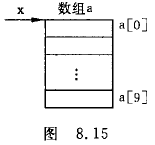

<font color='DarkOrchid'>( 3 )</font>	实参形参都用指针变量.例如:

```c
int main()					void f(int *x,int n){    int a[10],*p=a;			{    ...							...    f(p,10);				}    ...}
```

实参 p 和形参 x 都是 int *型的指针变量.先使实参指针变量 p 指向数组 a[0],p 的值是 &a[0].然后将 p 的值传给形参指针变量 x,x 的初始值也是 &a[0],见图 8.16.通过 x 值得改变可以使 x 指向数组 a 的任一元素.


<font color='DarkOrchid'>( 4 )</font>	实参为指针变量,形参为数组名.例如:

```c
int main()					void f(int x[],int n){    int a[10],*p=a;			{    ...							...        f(p,10);				}    ...}
```

实参 p 为指针变量,它指向 a[0].形参为数组名 x,编译系统把 x 作为指针变量处理,今将 a[0] 的地址传给形参 x,使 x 也指向 a[0].也可以理解为形参数组 x 和 a 数组共用同一段内存单元,见图 8.17.在函数执行过程中可以使 x[i] 的值发生变化,而 x[i] 就是 a[i].这样,main 函数可以使用变化了的数组元素值.例 8.8 的程序可以改写为例 8.9.


<font color='DarkOrchid'>**例 8.9**</font>	改写例 8.8 ,用指针变量作实参.

<font color='DarkOrchid'>**编写程序:**</font>

```c
#include <stdio.h>int main(){    void inv(int *x,int n);		//inv函数声明    int i,arr[10],*p=arr;		//指针变量p指向arr[0]    printf("The original array:\n");    for(i=0;i<10;i++,p++)    {        scnaf("%d",p);			//输入数组arr的元素    }    printf("\n");    p=arr;						//指针变量p重新指向arr[0]    inv(p,10);					//调用 inv 函数,实参p是指针变量    printf("The array has been inverted:\n");    for(p=arr;p<arr+10;p++)    {        printf("%d ",*p);    }printf("\n");        system("pause");    return 0;}void inv(int *x,int n){    int *p,m,temp,*i,*j;    m=(n-1)/2;    i=x;j=x+n-1;p=x+m;    for(;i<=p;i++,j--)    {        temp=*i;*i=*j;*j=temp;    }    return;}
```

<font color='DarkOrchid'>**运行结果:**</font>


<font color='Coral'>**注意:**</font>上面的 main 函数中的指针变量 p 是有确定的值的.如果在 main 函数中不设数组,只设指针变量,就会出错,假如把主函数修改如下:

```c
#include <stdio.h>int main(){    void inv(int *x,int n);		//inv函数声明    int i,*arr;					//指针变量arr未指向数组元素    printf("The original array:\n");    for(i=0;i<10;i++)    {        scanf("%d",arr+i);    }printf("\n");    inv(arr,10);			//调用inv函数,实参arr是指针形变量,但无指向    printf("The array has been inverted:\n");    for(i=0;i<10;i++)    {        printf("%d ",&(arr+i));    }printf("\n");        system("pause");    return 0;}
```

编译时出租哦,原因时指针变量 arr 没有确定的值,谈不上指向那个变量.

下面的使用是不正确的:

```c
int main()					f(x[],n){    int *p;					{    ...							...        f(p,10);				}    ...}
```

<font color='orange'>**注意:**</font>	如果用指针变量作实参,必须先使指针变量有确定值,指向一个已定义的对象.

<font color='Chartreuse'>以上 4 种方法,实质上都是地址的传递.其中(3)和(4)两种只是形式上不同,实际上形参都是使用指针变量.</font>

<font color='DarkOrchid'>**例 8.10**</font>	用指针方法对 10 个整数按由大到小顺序排序.

<font color='DarkOrchid'>**解题思路:**</font>	在主函数中定义数组 a 存放 10 个整数,定义 int *型指针变量 p 指向 a[0].定义函数 sort 使数组 a 中的元素按由大到小的顺序排列.在主函数中调用 sort 函数,用指针变量 p 作实参.sort 函数的形参用数组名.用选择法进行排序,选择排序法的算法前已介绍.

<font color='DarkOrchid'>**编写程序:**</font>

```c
#include <stdio.h>#include <stdlib.h>int main(){    void sort(int arr[]);    int i, a[10] = {58, 25, 66, 77, 59, 14, 33, 52, 25, 16};    int *p;    //p = a;    printf("数组排序前为:");    for (p = a,i = 0; i < 10; i++)    {        printf("%d ", *p++);    }    printf("\n");    p = a;    sort(p);    //p = a;    printf("数组排序后为:");    for (p = a,i = 0; i < 10; i++)    {        printf("%d ", *p++);    }    printf("\n");    system("pause");    return 0;}void sort(int arr[]){    int i, j, k, temp;    for (i = 0; i < 9; i++)    {        k = i;        for (j = i + 1; j < 10; j++)        {            if (arr[j] > arr[k])            {                k = j;                if (k != i)                {                    temp = arr[i];                    arr[i] = arr[k];                    arr[k] = temp;                }            }        }    }}
```

<font color='DarkOrchid'>**运行结果:**</font>


<font color='DarkOrchid'>**书中程序:**</font>

```c
#include <stdio.h>int main(){    void sort(int x[],int n);	//sort函数声明    int i,*p,a[10];    p=a;	//指针变量p指向a[0]    printf("Please enter 10 integer numbers:");    for(i=0;i<10;i++)    {scanf("%d",p++);}	//输入10个整数;这里p是地址    p=a;	//指针变量p重新指向a[0]    sort(p,10);	//调用sort函数    for(p=a,i=0;i<10;i++)    {        printf("%d ",*p++);	//输出排序后的数组    }    printf("\n");        system("pause");    return 0;}void sort(int x[],int n)	//定义sort函数,x是形参数组名{    int i,j,k,t;    for(i=0;i<n-1;i++)    {        k=j;        for(j=i+1;j<10;j++)        {            if(x[j]>x[k])k=j;            if(k!=i)            {t=x[i];x[i]=x[k];x[k]=t;}        }    }}
```

<font color='DarkOrchid'>**程序分析:**</font>	为了便于理解,函数 sort 中用数组名作为形参,用下标法引用形参数组元素,这样的程序很容易看懂.当然也可以改用指针变量,这时 sort 函数的首部可以改为

```c
sort(int *x,int n)
```

其他不改变,程勋运行结果不变.

可以看到,即使在函数 sort 中将 x 定义为指针变量,在函数中仍可用 x[i] 和 x[j] 这样的形式表示数组元素,它就是 x+i 和 x+j 所指的数组元素.

上面的 sort 函数等价于:

```c
void sort(int *x,int n)		//形参x是指针变量{    int i,j,k,t;    for(i=0;i<n-1;i++)    {        k=i;        for(j=i+1;j<n;j++)        {            if(*(x+j)>*(x+k))k=j;	//*(x+j)就是x[j],其他亦然            if(k!=i)            {t=*(x+i);*(x+i)=*(x+k);*(x+k)=t;}        }    }}
```

#### 8.3.5 通过指针引用多维数组

指针变量以指向一维数组中的元素,也可以指向多维数组中的元素.但在概念上和使用方法上,多维数组的指针比一维数组的指针要复杂一些.

<font color='Crimson'>**1. 多维数组元素的地址**</font>

为了说清楚指向多维数组元素的指针,先回顾一下多维数组的性质,以二维数组为例.设有一个二维数组 a,它有 3 行 4 列.

它的定义为

```c
int a[3][4]={{1,3,5,7},{9,11,13,15},{17,19,21,23}};
```

a 是二维数组名.a 数组包含 3 行,即 3 个行元素:a[0],a[1],a[2].而每一个行元素又是一个一维数组,它包含 4 个元素:a[0] [0],a[0] [1],a[0] [2],a[0] [3],见图 8.18.可以认为二维数组是"数组的数组",即二维数组 a 是由 3 个一维数组所组成的.


从二维数组的角度来看,a 代表二维数组的首元素的地址,现在的首元素不是一个简单的整型元素,而是由 4 个整型元素所组成的一维数组,因此 a 代表的是首行(即序号为 0 的行)的首地址.a+1 代表序号为 1 的行的首地址.如果二维数组的首行的首地址为 2000,一个整形数据占 4 个字节,则 a+1 的值应该是 2000+4×4=2016(因为第 0 行有 4 个整型数据).a+1 指向 a[1],或者说,a+1 的值是 a[1] 的首地址.a+2 代表 a[2]的首地址,它的值是 2032,见图 8.19.

a[0],a[1],a[2]既然是一维数组名,而 C 语言有规定了数组名代表数组首元素地址,因此 a[0] 代表一维数组 a[0] 中第 0 列元素的地址,即 &a[0] [0].也就是说,a[1] 的值是 &a[1] [0],a[2] 的值是 &a[2] [0].

请考虑 a 数组 0 行 1 列元素的地址怎么表示?a[0] 是一维数组名,该一维数组中序号为 1 的元素的地址显然应该用 a[0]+1 来表示,见图 8.20.此时"a[0]+1"中的 1 代表 1 个列元素的字节数,即 4 个字节.a[0] 的值是 2000,a[0]+1 的值是 2004(而不是2016).这是因为现在是在一维数组范围内讨论问题的,正如有一个一维数组 x,x+1 是其第 1 个元素 x[1] 的地址一样.


前已述及,a[0] 和 *(a+0) 等价,a[1] 和 *(a+1) 等价,a[i] 和 *(a+i) 等价.因此,a[0]+1 和 *(a+0)+1 的值都是 &a[0] [1] (即图 8.20 中的 2004).a[1]+2 和 *(a+1)+2 的值都是 &a[1] [2] (即图 8.20 中的 2024).请注意不要将 *(a+1)+2 错写成 *(a+1+2),后者变成了 *(a+3),相当于 a[3].

进一步分析,欲得到 a[0] [1] 的值,用地址法怎么表示呢?既然 a[0]+1 和 *(a+0)+1 是 a[0] [1] 的地址,那么, *(a[0]+1) 就是 a[0] [1] 的值.同理, *( *(a+0)+1) 或 *( *a+1 ) 也是 a[0] [1] 的值. *(a[i]+j) 或 *( *(a+i)+j) 是 a[i] [j] 的值.务请记住 *(a+i) 和 a[i] 是等价的.

有必要对 a[i] 的性质作进一步说明.a[i] 从形式上看是 a 数组中序号为 i 的元素.如果 a 是一维数组名,则 a[i] 代表 a 数组序号为 i 的元素的存储单元.a[i] 是有物理地址的,是占存储单元的.但如果 a 是二维数组,则 a[i] 是一维数组名,它只是一个地址,并不代表某一元素的值(如同一维数组名只是一个指针常量一样),a,a+i,a[i],*(a+i), *(a+i)+j,a[i]+j 都是地址.而 *(a[i]+j) 和 *( *(a+i)+j ) 是二维数组元素 a[i] [j] 的值,见表 8.2.

有些读者可能不理解,为什么 a+1 和 *(a+1) 都是 2016 呢? 他们想,a+1(是地址)和 *(a+1)(是内容)怎么都是同一个值呢?的确,二维数组中有些概念比较复杂难懂,要仔细消化,反复思考.


首先说明,a+1 是二维数组 a 中序号为 1 的行的首地址(序号从 0 起算),而 *(a+1) 并不是 a+1 单元的内容(值),因为 a+1 并不是一个变量的存储单元,也就谈不上它的内容了. *(a+1) 就是 a[1],而 a[1] 是一维数组名,所以也就是地址,它指向 a[1] [0].a[1] 和 *(a+1) 都是二维数组中地址的不同表示形式.

为了说明这个容易搞混的问题,可以举一个日常生活中的例子来说明.在军训中,一个排分 3 个班,每个班站成一行,3 个班为 3 行,相当于一个二维数组.为方便比较,班和展示的序号也从 0 开始.请思考:班长点名和排长点名的方法有什么不同.班长从第 0 个战士开始逐个检查本班战士是否在队列中,班长每移动一步,走过一个战士.而排长点名则是以班为单位,排长先站在第 0 班的起始位置,检查该班是否到齐,然后走到第 1 班的起始位置,检查该班是否到齐.班长移动的方向是横向的,而排长移动的方向是纵向的.排长看来只走了一步,但实际上它跳过了一个班的 10 个战士.这相当于从 a 移到 a+1(见图 8.21).班长"指向"的是战士,排长"指向"的是班,班长相当于列指针,排长相当于行指针.


为了找到某一班内某一个战士,必须给两个参数,即第 i 班第 j 个战士,先找到第 i 班,然后由该班班长在本班范围内找第 j 个战士.这个战士的位置就是 a[i]+j(这是一个地址).开始时班长面对第 0 个战士.注意,排长和班长的初始位置是相同的(如图 8.21 中的 a 和 a[0] 都是2000),但它们的性质是不同的.排长"指向"班,在图上是纵向管理,他纵向走一步就跳过 1 个班,而班长"指向"战士,在图上是横向管理,横向走一步只是指向下一个战士.

二维数组 a 相当于排长,而每一行(即一维数组 a[0],a[1],a[2])相当于班长,每一行中的元素(如 a[1] [2])相当于战士.

a+1 与 a[0]+1 是不同的,a+1 是序号为 1 的行的首地址,a+1 指向序号为 1 的行(相当于排长走到第 1 班的开头),而 *(a+1) 或 a[1] 或 a[1]+0 都指向 1 行 0 列元素(相当于第 1 班第 0 个战士),二者地址虽相同,但含义不同.a 和 a[0] 的值虽然相同(等于 2000),但是由于指针的类型不同(相当于排长和班长面对的对象一样,a 指向一维数组 a[0],而[0]指向列元素 a[0] [0]).因此,对不同的指针进行加 1 的运算,得到的结果是不同的.

<font color='Coral'>**再次强调:**</font>	二维数组名(如 a)是指向行的.因此 a+1 中的"1"代表一行中全部元素所占的字节数(图 8.20 表示为 16 个字节).一维数组名(如 a[0],a[1])是指向列元素的.a[0]+1 中的 1 代表一个 a 元素所占的字节数(图 8.20 表示为 4 个字节).在指向行的指针前面加一个 * ,就转换为指向列的指针.例如,a 和 a+1 是指向行的指针,在它们前面加一个 * 就是 *a 和 *(a+1) ,它们就成为指向列的指针,分别指向 a 数组 0 行 0 列的元素和 1 行 0 列的元素.反之,在指向列的指针前面加 & ,就成为指向行的指针. 例如 a[0] 是指向 0 行 0 列元素的指针,在它前面加一个 &,得 &a[0],由于a[0] 与 *(a+0) 等价,因此 &a[0] 与 & *a 等价,也就是与 a 等价,它指向二维数组的 0 行.

<font color='Coral'>**注意:**</font>	不要把 <font color='Chartreuse'>&a[i]</font> 简单地理解为 <font color='DarkOrchid'>a[i]</font> 元素的物理地址,因为并不存在 <font color='DarkOrchid'>a[i]</font> 这样一个实际的数据存储单元.它只是一种地址的计算方法,能得到第 i 行的首地址,<font color='Chartreuse'>&a[i]</font> 和 <font color='DarkOrchid'>a[i]</font> 的值是一样的,但它们的含义是不同的.<font color='Chartreuse'>&a[i]</font> 或 <font color='Chartreuse'>a+i</font> 指向行,而 <font color='DarkOrchid'>a[i]</font> 或 <font color='DarkOrchid'>*(a+i)</font> 指向列.当列下标 j 为 0 时,<font color='Chartreuse'>&a[i]</font> 和 <font color='DarkOrchid'>a[i]</font> (即 <font color='DarkOrchid'>a[i]+j</font>)值相等,<font color='Coral'>即它们代表同一地址,但应注意它们所指向的对象不是不同的,即指针的</font><font color='SlateBlue'>**基类型**</font><font color='Coral'>是不同的</font>. *(a+i) 只是 a[i] 的另一种表示形式,不要简单地认为 *(a+i) 是 "a+i 所指向单元中的内容".<font color='Chartreuse'>在一维数组中</font> a+i 所指的是一个数组元素的存储单元,在该单元中有具体值,上述说法是正确的.<font color='DarkOrchid'>而对于二维数组</font>,a+i 不是指向具体存储单元而指向行.在二维数组中,a+i,a[i], *(a+i),&a[i] [0]的值相等,即它们都代表同一地址.请读者仔细琢磨其概念.

为了加深印象,更好地理解以上的概念,请分析和消化下面的例子.

<font color='DarkOrchid'>**例 8.11**</font>	输出二维数组的有关数据(地址和值).

```c
#include <stdio.h>int main(){    int a[3][4]={        {1,3,5,7},        {9,11,13,15},        {17,19,21,23}    };    printf("%d %d\n",a,*a);//二维数组首地址,第0列首地址    printf("%d %d\n",a[0],*(a+0));//代表第0列一维数组,第0列第1元素    printf("%d %d\n",&a[0],&a[0][0]);//一维数组首地址,一维数组第1元素地址    printf("%d %d\n",a[1],a+1);//第2列一维数组,第0列第1元素地址    printf("%d %d\n",&a[1][0],*(a+1)+0);//第2列第1元素地址,第2列第1元素值    printf("%d %d\n",a[2],*(a+2));//第3列,第3列首地址    printf("%d %d\n",&a[2],*(a+2));//第3列首地址,第3列第1元素地址    printf("%d %d\n",a[1][0],*(*(a+1)+0));//第2列第1元素值    printf("%d %d\n",*a[2],*(*(a+2)+0));//第3列第1元素值        system("pause");    return 0;}
```

<font color='DarkOrchid'>**运行结果:**</font>


<font color='DarkOrchid'>**程序分析:**</font>	**由于分配内存情况不同,所显示的地址可能是不同的.但是上面显示的地址是有共同规律的.**

<font color='Crimson'>**2. 指向多维数组元素的指针变量**</font>

在了解了以上的概念后,可以用指针变量指向多维数组的元素.

<font color='Crimson'>**( 1 ) 指向数组元素的指针变量**</font>

<font color='DarkOrchid'>**例 8.12**</font>	有一个 3×4 的二维数组,要求用指向元素的指针变量输出二维数组各元素的值.

<font color='DarkOrchid'>**解题思路:**</font>	二维数组的元素是整型的,它相当于整型变量,可以用 int *型指针变量指向它.二维数组的元素在内存中是按行顺序存放的,即存放完序号 0 的行中的全部元素后,接着存放序号为 1 的行中的全部元素,以此类推.因此可以用一个指向整型元素的指针变量,一次指向各个元素.

<font color='DarkOrchid'>**编写程序:**</font>

```c
#include <stdio.h>int main(){    int a[3][4]={1,3,5,7,9,11,13,15,17,19,21,23};    int *p;    for(p=a[0];p<a[0]+12;p++)    {        if((p-a[0])%4==0) printf("\n");        printf("%d ",*p);    }    printf("n");        system("pause");    return 0;}
```

<font color='DarkOrchid'>**运行结果:**</font>


<font color='DarkOrchid'>**程序分析:**</font>	p 是一个 int *型(指向整型数据)的指针变量,它可以指向一般的整型变量,也可以指向整型的数组元素.每次使 p 值加 1,使 p 指向下一元素.用 if 语句控制输出 4 个元素后换行.

本例是顺序输出数组中各元素之值,比较简单.如果要输出某个指定的数组元素(例 a[1] [2]),则应实现计算该元素在数组中的相对位置(即相对于数组起始位置的相对位移量).计算 a[i] [j] 在数组中的相对位置的计算公式为 i*m+j

其中 m 为二维数组的列数(二维数组大小为 n×m).例如,对上述 3×4 的二维数组,它的 2 行 3 列元素 a[2] [3] 对 a[0] [0] 的相对位移量为 2×4+3=11 元素.如果一个元素占 4 个字节,则 a[2] [3] 对 a[0] [0] 的地址差为 11×4=44 字节.若开始时指针变量 p 指向 a[0] [0],a[i] [j] 的地址为"&a[0] [0]+(i * m+j)"或"p+(i * m+j)".a[2] [3] 的地址是 (p+2*4+3),即(p+11).a[2] [3] 的值为 *(p+11).


下面来说明上述"&a[0] [0]+(i*m+j)"中的 i * m+j 的含义.从图 8.22 可以看到在 a[i] [j] 元素之前有 i 行元素(每行有 m 个元素),在 a[i] [j] 所在行, a[i] [j] 前还有 j 的元素,因此 a[i] [j] 之前共有 i×m+j 个元素.可用 p+i×m+j 表示其相对位置.

<font color='Chartreuse'>可以看到,C 语言规定数组下标从 0 开始,对计算上述相对位置比较方便,只要知道 i 和 j 的值,就可以直接用 i×m+j 公式计算出 a[i] [j]相对于数组开头的相对位置.</font>

<font color='Crimson'>**( 2 ) 指向由 m 个元素组成的一维数组的指针变量**</font>

上例的指针变量 p 是用"int *p;"定义的,它是指向整型数据的,p+1 所指向的元素是 p 所指向的列元素的下一元素(按在内存中存储的下一个整型元素).

可以改用另一方法,使 p 不是指向整型变量,而是指向一个包含 m 个元素的一维数组.这时,如果 p 先指向 a[0] (即 p=&a[0]),则 p+1 不是指向 a[0] [1],而是指向 a[1],p的增值以一维数组的长度为单位,见图 8.23.


<font color='DarkOrchid'>**例 8.13**</font>	输出二维数组任一行任一列元素的值.

<font color='DarkOrchid'>**解题思路:**</font>	假设仍然用例 8.12 中的二维数组,例 8.12 中定义的指针变量时指向变量或数组元素的,现在改用指向一维数组的指针变量.

<font color='DarkOrchid'>**编写程序:**</font>

```c
#include <stdio.h>int main(){    int a[3][4]={1,3,5,7,9,11,13,15,17,19,21,23};    int (*p)[4],i,j;//指针变量p指向包含4个整型元素的一维数组    p=a;    printf("Please enter row and colum:");    scanf("%d%d",&i,&j);    printf("a[%d][%d] = %d\n",i,j,*(*(p+i)+j));        system("pause");    return 0;}
```

<font color='DarkOrchid'>**运行结果:**</font>


<font color='DarkOrchid'>**程序分析:**</font>	程序中"int (*p)[40]"表示定义 p 为一个指针变量,它指向包含 4 个整型元素的一维数组.注意 *p 两侧的括号不可缺少,如果写成 *p[40],由于方括号[]运算级别高,因此 p 先与 [4] 结合,p[4] 是定义数组的形式,然后再与前面的 * 结合,*p[4] 就是指针数组(见 8.7节).如果感到不好理解,可以对下面二者做比较:

① int a[4];(a有4个元素,每个元素为整型)

② int (*p)[4];

第②表示(*p)有 4 个元素,每个元素为整型,也就是 p 所指的对象是有 4 个整型元素的数组,即 p 是指向一维数组的指针,见图 8.24.应该记住,此时 p 只能指向一个包含 4 个元素的一维数组,不能指向一维数组中的某一元素.p 的值就应该是一维数组的起始地址.


2021年11月6日15:23:38

请分析以下一个小程序:

```c
#include <stdio.h>int main(){    int a[4]={1,3,5,7};	//定义一维数组a,包含个4元素    int (*p)[4];	//定义指向包含4个元素的一维数组的指针变量    p=&a;	//p指向一维数组    printf("%d\n",(*p)[3]);	//输出a[3],输出整数7    return 0;}
```

注意第 5 行不应写成"p=a;",因为这样写表示 p 的值是 &a[0],指向 a[0]."p=&a;"表示 p 指向一维数组(行),(*p)[3]是 p 所指向的行中序号为 3 的元素.

由于例 8.13 中的指针变量 p 指向二维数组的 0 行,因此 p+i 是二维数组 a 的 i 行的起始地址(由于 p 是指向一维数组的指针变量,因此 p 加 1,就指向下一行),见图 8.25.请分析 *(p+2)+3 是什么?由于 p=a,因此 *(p+2) 就是 a[2], *(p+2)+3 就是 a[2]+3,而 a[2] 的值是 a 数组中 2 行 0 列元素 a[2] [0] 的地址(即&a[2] [0]),因此 *(p+2)+3 就是 a 数组 2 行 3 列元素的地址,这就是指向列元素的指针,由此不难理解: *( *(p+2)+3 )就是 a[2] [3] 的值.


*(p+2) 是 a 数组 2 行 0 列元素的地址,而 p+2 是 a 数组 2 行起始地址,二者的值相同, *(p+2)+3 能否写成 (p+2)+3 呢?显然不行.不能作简单的数值替换.(p+2)+3 就成了(p+5) 了,是 a 数组 5 行的起始地址了.

要注意指针变量的类型,从"int (*p)[4];"可以看到, p 类型不是 int * 型,而是 int (*)[4] 型, p 被定义为指向一维<font color='Crimson'>**整型数组**</font>的指针变量,一维<font color='Crimson'>**数组有 4 个元素,因此 p 的基类型是一维数组,其长度是 16 字节.**</font>" *(p+2)+3 "括号中的 2 是以 p 的基类型(一维<font color='Crimson'>**整型**</font>数组)的长度为单位的,即 p 每加 1,地址就增加 16 个字节(4 个元素,每个元素 4 个字节),而" *(p+2)+3 "括号歪的数字 3,不是以 p 的基类型的长度为单位的.由于经过 *(p+2) 的运算,的到 a[2] ,即 &a[2] [0],它已经转化为指向列元素的指针了,因此加 3 是以元素的长度为单位的,加 3 就是加 (3×4) 个字节.虽然 p+2 和 *(p+2) 具有相同的值,但由于它们所指向的对象的长度不同,因此 (p+2)+3 和 *(p+2)+3 的值就不相同了.这和上一节所叙述的概念是一致的.

<font color='Crimson'>**3. 用指向数组的指针作函数参数**</font>

一维数组名可以作为函数参数,多维数组名也可作函数参数.用指针变量作形参,以接受实参数组名传递来的地址.可以有两种方法:① 用指向变量的指针变量;② 用指向一维数组的指针变量.

<font color='DarkOrchid'>**例 8.14**</font>	有一个班,3 个学生,各学 4 门课,计算总平均分数以及第 n 个学生的成绩.

<font color='DarkOrchid'>**解题思路:**</font>	本例用指向数组的指针作函数参数.用函数 average 求总平均成绩,用函数 search 找出并输出第 i 个学生的成绩.

<font color='DarkOrchid'>**编写程序:**</font>

```c
#include <stdio.h>int main(){    float score[3][4]={{65,67,70,60},{80,87,90,81},{90,99,100,98}};    average(score,12);	//求12个分数的平均分    search(score,2);	//求序号为2的学生的成绩}void average(float *p,int n)	//定义求平均成绩的函数{    float *p_end;    float sum = 0,aver;    p_end = p + n - 1;	//n为12时,p_end的值是p+11,指向最后一个元素    for(;p <= p_end;p++)    {        sum = sum + (*p);    }    aver = sum / n;    printf("average = %5.2f\n",aver);}void search(float (*p)[4],int n)	//p是指向具有4个元素的一维数组的指针{    int i;    prinf("The score of No.%d are:",n);    for(i=0;i<4;i++)    {        printf("%5.2f ",*(*(p+n)+i));    }    printf("\n");}
```

<font color='DarkOrchid'>**运行结果:**</font>


<font color='DarkOrchid'>**程序分析:**</font>	在 main 函数中,先调用 average 函数以求总平均值.在函数 average 中形参 p 被声明为 float * 类型(指向 float 型变量)的指针变量.它的基类型为 float 型,实参用 *score,即 score[0],也就是 &score[0] [0],即 score[0] [0]的地址.把 score[0] [0]的地址传给 p,使 p 指向 score[0] [0].然后在 average 函数中使 p 先后指向二维数组的各个元素,p 每加 1 就指向 score 数组的下一个元素,见图 8.26.形参 n 代表需要求平均值的元素的个数,实参 12 表示要求 12 个元素值的平均值.p_end 是最后一个元素的地址.sum 是累计总分,aver 是平均值.在函数中输出 aver 的值,函数无需返回值.


函数 search 的形参 p 的类型是 float (*)[4],她不是指向整型变量的指针变量,而是指向包含 4 个元素的一维数组的指针变量.函数调用开始时,将实参 score 的值(代表该数组 0 行起始地址)传给 p,使 p 也指向 score[0].p+n 是 score[n] 的起始地址, *(p+n)+i 是 score[n] [i] 的地址, *( *(p+n)+i ) 是 score[n] [i] 的值.现在实参传给形参 n 的值是 2,即想找序号为 2 的学生的成绩.

调用 search 函数时,实参时 score(二维数组名,代表该数组 0 行起始地址)传给 p,使 p 也指向 score[0].p+n 是 score[n] 的起始地址, *(p+n)+i 是score[n] [i] 的地址, * (*(p+n)+i) 是 score[n] [i] 的值.现在 n=2,i由 0 变到 3,for 循环输出 score[2] [0] 到 score[2] [3]的值.

<font color='DarkOrchid'>**注意:**</font>实参与形参如果是指针类型,应当注意它们的类型必须一致.不应把 int * 型的指针(即元素的地址)传给 int (*)[4] 型(指向一维数组)的指针变量,反之亦然.正如不应把"班长"传给"排长"一样,应当是"门当户对".

例如在 main 函数中调用 search 函数时,实参是 score,形参 p 指向包含 4 个整型元素的一维数组,二者类型是一致的,程序中调用 search 函数的形式是正确的,即:

```c
search(score,2);	//用score(即score[0]的起始地址)作为实参
```

如果写成下面这样就不对了:

```c
search(*score,2);	//用*score(即score[0][0]的地址)作为实参
```

虽然 score 和 *score 都是地址,但后者的类型与形参 p 的类型不匹配.

<font color='DarkOrchid'>**例 8.15**</font>	在上题基础上,查找有一门以上课程不及格的学生,输出他们的全部课程的成绩.

<font color='DarkOrchid'>**解题思路:**</font>	在主函数中定义二维数组 score,定义 search 函数实现输出有一门以上课程不及格的学生的全部课程的成绩,形参 p 的类型是 float (*)[4] , p 是指向包含 4 个元素的一维数组的指针变量.在调用 search 函数时,用 score 作为实参,它指向 score[0],把 score[0] 的地址传给形参 p.

```c
#include <stdio.h>#include "8-15.h"void main(){	float score[3][4] = { { 65,57,70,60 },{ 58,87,90,81 },{ 90,99,100,98 } };	search(score);	system("pause");}void search(float(*p)[4]){	int i, j, k;	for (i = 0; i<3; i++)	{		for (j = 0; j<4; j++)		{			if (*(*(p + i) + j)<60)			{				printf("No.%d的成绩为:", i+1);				for (k = 0; k<4; k++)				{					printf("%5.1f", *(*(p + i) + k));				}				printf("\n");			}		}	}}
```

```c
#include <stdio.h>int main(){    void search(float (*p)[4],int n);	//函数声明    float score[3][4]={ { 65,57,70,60 },{ 58,87,90,81 },{ 90,99,100,98 } };	//定义二维数组score        search(score,3);	//调用search函数    return 0;}void search(float (*p)[4],int n){    int i,j,flag;    for(j=0;j<n;j++)    {        flag = 0;        for(i=0;i<4;i++)            if(*(*(p+j)+i)<60) flag =1;	//*(*(p+j)+i)就是score[j][i]        if(flag==1)        {            printf("No.%d fails,his score are:\n",j+1);            for(i=0;i<4;i++)            {                printf("%5.1f",*(*(p+j)+i));//输出所有成绩            }            printf("\n");        }    }}
```

<font color='DarkOrchid'>**运行结果:**</font>


### 五大内存分区

 在C/C++中，内存分成5个区，他们分别是<font color='Crimson'>堆</font>、<font color='Coral'>栈</font>、<font color='Chartreuse'>自由存储区</font>、<font color='DarkOrchid'>全局/静态存储区</font>和<font color='SlateBlue'>常量存储区</font>。 
  <font color='Crimson'>栈</font>，就是那些由编译器在需要的时候分配，在不需要的时候自动清楚的变量的存储区。里面的变量通常是局部变量、函数参数等。 
  <font color='Coral'>堆</font>，就是那些由new分配的内存块，他们的释放编译器不去管，由我们的应用程序去控制，一般一个new就要对应一个delete。如果程序员没有释放掉，那么在程序结束后，操作系统会自动回收。 
  <font color='Chartreuse'>自由存储区</font>，就是那些由malloc等分配的内存块，他和堆是十分相似的，不过它是用free来结束自己的生命的。 
  <font color='DarkOrchid'>全局/静态存储区</font>，全局变量和静态变量被分配到同一块内存中，在以前的C语言中，全局变量又分为初始化的和未初始化的，在C++里面没有这个区分了，他们共同占用同一块内存区。 
  <font color='SlateBlue'>常量存储区</font>，这是一块比较特殊的存储区，他们里面存放的是常量，不允许修改（当然，你要通过非正当手段也可以修改，而且方法很多） 
明确区分堆与栈 
  堆与栈的区分问题，初学者对此往往是混淆不清的。 
  首先，我们举一个例子： 
  void f() { int* p=new int[5]; } 
  这条短短的一句话就包含了堆与栈，看到new，我们首先就应该想到，我们分配了一块堆内存，那么指针p呢？他分配的是一块栈内存，所以这句话的意思就是：在栈内存中存放了一个指向一块堆内存的指针p。在程序会先确定在堆中分配内存的大小，然后调用operator new分配内存，然后返回这块内存的首地址，放入栈中，他在VC6下的汇编代码如下： 
  00401028  push    14h 
  0040102A  call    operator new (00401060) 
  0040102F  add     esp,4 
  00401032  mov     dword ptr [ebp-8],eax 
  00401035  mov     eax,dword ptr [ebp-8] 
  00401038  mov     dword ptr [ebp-4],eax 
  这里，我们为了简单并没有释放内存，那么该怎么去释放呢？是delete p么？错了，应该是delete []p，这是为了告诉编译器：我删除的是一个数组，VC6就会根据相应的Cookie信息去进行释放内存的工作。 
  好了，我们回到我们的主题：堆和栈究竟有什么区别？ 
  主要的区别由以下几点： 
  <font color='Crimson'>1、管理方式不同</font>：对于栈来讲，是由编译器自动管理，无需我们手工控制；对于堆来说，释放工作由程序员控制，容易产生memory leak。 
  <font color='Crimson'>2、空间大小不同</font>：一般来讲在32位系统下，堆内存可以达到4G的空间，从这个角度来看堆内存几乎是没有什么限制的。但是对于栈来讲，一般都是有一定的空间大小的，例如，在VC6下面，默认的栈空间大小是1M（好像是，记不清楚了）。当然，我们可以修改：   
  打开工程，依次操作菜单如下：Project->Setting->Link，在Category 中选中Output，然后在Reserve中设定堆栈的最大值和commit。 
注意：reserve最小值为4Byte；commit是保留在虚拟内存的页文件里面，它设置的较大会使栈开辟较大的值，可能增加内存的开销和启动时间。 
  <font color='Crimson'>3、能否产生碎片不同</font>：对于堆来讲，频繁的new/delete势必会造成内存空间的不连续，从而造成大量的碎片，使程序效率降低。对于栈来讲，则不会存在这个问题，因为栈是先进后出的队列，他们是如此的一一对应，以至于永远都不可能有一个内存块从栈中间弹出，在他弹出之前，在他上面的后进的栈内容已经被弹出，详细的可以参考数据结构，这里我们就不再一一讨论了。 
  <font color='Crimson'>4、生长方向不同</font>：对于堆来讲，生长方向是向上的，也就是向着内存地址增加的方向；对于栈来讲，它的生长方向是向下的，是向着内存地址减小的方向增长。 
  <font color='Crimson'>5、分配方式不同</font>：堆都是动态分配的，没有静态分配的堆。栈有2种分配方式：静态分配和动态分配。静态分配是编译器完成的，比如局部变量的分配。动态分配由alloca函数进行分配，但是栈的动态分配和堆是不同的，他的动态分配是由编译器进行释放，无需我们手工实现。 
  <font color='Crimson'>6、分配效率不同</font>：栈是机器系统提供的数据结构，计算机会在底层对栈提供支持：分配专门的寄存器存放栈的地址，压栈出栈都有专门的指令执行，这就决定了栈的效率比较高。堆则是C/C++函数库提供的，它的机制是很复杂的，例如为了分配一块内存，库函数会按照一定的算法（具体的算法可以参考数据结构/操作系统）在堆内存中搜索可用的足够大小的空间，如果没有足够大小的空间（可能是由于内存碎片太多），就有可能调用系统功能去增加程序数据段的内存空间，这样就有机会分到足够大小的内存，然后进行返回。显然，堆的效率比栈要低得多。 
  从这里我们可以看到，堆和栈相比，由于大量new/delete的使用，容易造成大量的内存碎片；由于没有专门的系统支持，效率很低；由于可能引发用户态和核心态的切换，内存的申请，代价变得更加昂贵。所以栈在程序中是应用最广泛的，就算是函数的调用也利用栈去完成，函数调用过程中的参数，返回地址，EBP和局部变量都采用栈的方式存放。所以，我们推荐大家尽量用栈，而不是用堆。 
  虽然栈有如此众多的好处，但是由于和堆相比不是那么灵活，有时候分配大量的内存空间，还是用堆好一些。 
  无论是堆还是栈，都要防止越界现象的发生（除非你是故意使其越界），因为越界的结果要么是程序崩溃，要么是摧毁程序的堆、栈结构，产生以想不到的结果,就算是在你的程序运行过程中，没有发生上面的问题，你还是要小心，说不定什么时候就崩掉，那时候debug可是相当困难的：）   对了，还有一件事，如果有人把堆栈合起来说，那它的意思是栈，可不是堆，呵呵，清楚了？

### 8.4 通过指针引用字符串

本节中将介绍<font color='Crimson'>**使用字符串的更加灵活方便的方法**</font>--通过指针引用字符串.

#### 8.4.1 字符串的引用方式

在 C 程序中,字符串是存放在字符数组中的.想引用一个字符串,可以用以下两种方法.

<font color='Crimson'>( 1 )</font>	用字符数组存放一个字符串,可以通过数组名和下标引用字符串中一个字符,也可以通过数组名的格式声明"%s"输出该字符串.

<font color='DarkOrchid'>**例 8.16**</font>	定义一个字符数组,在其中存放字符串"I love China!",输出该字符串和第 8 个字符.

<font color='DarkOrchid'>**解题思路:**</font>	定义字符数组 string,对它初始化,由于在初始化时字符的个数是确定的,因此不必指定数组的长度.用数组名 string  和输出格式 %s 可以输出整个字符串.用数组名和下标可以引用任一数组元素.

<font color='DarkOrchid'>**编写程序:**</font>

```c
#include<stdio.h>#include "8-16.h"void main(){	char str[] = "I love China!";	int n;	printf("%s\n", str);	printf("请输入要显示第几个字符:");	scanf("%d", &n);	str_out(str, n);	system("pause");}void str_out(char str[], int n){	printf("第%d个字符为\"%c\"\n",n, str[n - 1]);}
```

<font color='DarkOrchid'>**运行结果:**</font>


<font color='DarkOrchid'>**程序分析:**</font>	在定义字符数组 string 时未指定长度,由于对它初始化,因此它的长度是确定的,长度应为 14,其中 13 个字节存放"I love China!" 13 个字符,最后一个字节存放字符串结束符'\0'.数组名 string 代表字符数组首元素的地址(见图 8.27).题目要求输出该字符串第 8 个字符,由于数组元素的序号从 0 开始,所以应当输出 string[7],它代表数组中序号为 7 的元素.实际上 string[7] 就是 *(string+7),string+7 是一个地址,它指向字符"C".

<font color='Crimson'>( 2 )</font>	用字符指针变量指向一个字符串常量,通过字符指针变量引用字符串常量.

<font color='DarkOrchid'>**例 8.17**</font>	通过字符指针变量输出一个字符串

<font color='DarkOrchid'>**解题思路:**</font>	可以不定义字符数组,只定义一个字符指针变量,用它指向字符串常量中的字符.通过字符指针变量输出该字符串.

<font color='DarkOrchid'>**编写程序:**</font>

```c
#include <stdio.h>void main(){    char *str = "I love China!";    printf("%s\n",str);        system("pause");}
```

<font color='DarkOrchid'>**运行结果:**</font>


<font color='DarkOrchid'>**程序分析:**</font>	在程序中没有定义字符数组,只定义了一个 char * 型变量(字符指针变量) string,用字符串常量"I love China!"对它初始化.C 语言对字符串常量是按字符数组处理的,在内存中开辟了一个字符数组用来存放该字符串常量,但是这个字符数组是没有名字的,因此不能通过数组名来引用,只能通过指针变量来引用.

对字符指针变量 string 初始化,实际上是把字符串第 1 个元素的地址(即存放字符串的字符数组的首元素地址)赋给指针变量 string,是 string 指向字符串的第 1 个字符(见图 8.28).在不致引起误解的情况下,为了简便,有时也可说 string 指向字符串"I love China!"这几个字符赋给该字符串变量,这是不对的.在 C 语言中只有字符变量,没有字符串变量.

分析定义 string 的行: char *string="I love China!";

等价于下面:char *string; //定义一个char * 型变量

​		string="I love China!"; //把字符串第1个元素的地址赋给字符指针变量string.


<font color='DarkOrchid'>**注意:**</font>	string 被定义为一个指针变量,基类型为字符型.请注意它只能指向一个字符类型数据,而不能同时指向多个字符数据,更不是把"I love China!"这些字符存放到 string 中(指针变量只能存放地址),也不是把字符串赋给 *string.只是把"I love China!"的第 1 个字符的地址赋给指针变量 string.

可以对指针变量进行再赋值,赋值后就指向了新的地址,而不能再指向旧的地址.可以通过 %s 输出指针所指向的字符串.

<font color='DarkOrchid'>**说明:**</font>	通过字符数组名或字符指针变量可以输出一个字符串,而对一个<font color='Coral'>数值数组,是不能企图用数组名输出它的全部元素的.</font>

对于字符串的存取,可以用下标法,也可以用指针法.

<font color='DarkOrchid'>**例 8.18**</font>	将字符串 a 复制为字符串b,然后输出字符串 b.

<font color='DarkOrchid'>**解题思路:**</font>	定义两个字符串 a,b,对 a 进行初始化.将 a 数组中的字符逐个复制到 b 数组中.可以用不同的方法引用并输出字符数组元素,今用地址法算出个元素的值.

<font color='DarkOrchid'>**编写程序:**</font>

```c
#include <stdio.h>void main(){	char a[] = "I am a student!", b[20];	char *p1, *p2;	p1 = a;	p2 = b;	for (; *p1 != '\0'; p1++, p2++)	{		*p2 = *p1;	}	*p2 = *p1;	printf("%s\n", a);	printf("%s\n", b);	system("pause");}
```

```c
#include <stdio.h>int main(){    char a[]="I am a student!",b[20];    int i;    for(i=0;*(a+i) != '\0';i++)    {        *(b+i) = *(a+i);    }    *(b+i) = '\0';    printf("string a is:%s\n",a);    printf("string b is:",);    for(i=0;b[i]!='\0';i++)    {        printf("%c",b[i]);    }    printf("\n");        system("pause");}
```

<font color='DarkOrchid'>**运行结果:**</font>

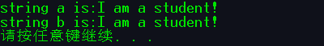

<font color='DarkOrchid'>**程序分析:**</font>	程序中 a 和 b 都定义为字符数组,通过地址访问数组元素.在 for 语句中,先检查 a[i] 是否为 '\0' 如果不等于 '\0',表示字符串尚未处理完,就将 a[i] 的值赋给 b[i],即复制一个字符.当等于 '\0' 时没有复制就跳出 for 循环,所以要再给 b 赋值'\0' 表示字符串结束.

第一个程序以指针形式完成具体见图 8.19.


#### 8.4.2 字符指针作函数参数

如果想把一个字符串从一个函数"传递"到另一个函数,可以用地址传递的办法,即用字符数组名作参数,也可以用字符指针变量作参数.在被调用的函数中可以该碧昂字符串的内容,在主调函数中可以引用改变后的字符串.

<font color='DarkOrchid'>**例 8.20**</font>	用函数调用实现字符串的复制.

<font color='DarkOrchid'>**解题思路:**</font>	定义一个函数 copy_str 用来实现字符串复制的功能,在主函数中调用次函数,函数的<font color='Crimson'>**形参和实参可以分别用字符数组名或字符指针变量.**</font>分别编程,以供分析比较.

<font color='DarkOrchid'>**编写程序:**</font>

<font color='Crimson'>( 1 )</font> 用字符数组名作为函数参数

```c
#include <stdio.h>#include "8-17.h"int main(){	char a[] = "I love China!", b[20];	printf("%s\n", a);	copy_str(a, b);	system("pause");	return 0;}void copy_str(char a[], char b[]){	int i;	for (i = 0; a[i] != '\0'; i++)	{		b[i] = a[i];	}	b[i] = '\0';	printf("%s\n", b);}
```

```c
#include <stdio.h>int main(){    void copy_string(char from[],char to[]);    char a[]="I am a teacher.";    char b[]="You are a student.";    printf("string a = %s\nstring b = %s\n",a,b);    printf("copy string a to string b:\n");    copy_string(a,b);	//用字符数组名作为函数实参    printf("\nstring a = %s\nstring b = %s\n",a,b);        return 0;}void copy_string(char form[],char to[])	//形参为字符数组{    int i=0;    while(from[i]!='\0')    {        to[i] = from[i];i++;    }    to[i] = '\0';}
```

<font color='DarkOrchid'>**程序分析:**</font>	a 和 b 是字符数组.初值如图 8.30(a)所示.copy_string 函数的作用是将 from[i] 赋给 to[i],直到 from[i] 的值等于 '\0' 为止.在调用 copy_string 函数时,将 a 和 b 第 1 个字符的地址分别传递给形参数组名 from 和 to.因此 from[i] 和 a[i] 是同一个单元,to[i] 和 b[i] 是同一个单元.程序执行完以后,b 数组的内容如图 8.30(b) 所示.可以看到,由于 b 数组原来的长度大于 a 数组,因此在将 a 数组复制到 b 数组后,为能全部覆盖 b 数组原有内容. b 数组最后 3 个元素仍保留原状.在输出 b 时由于按 %s 输出.如果不采取 %s 格式输出而用 %c 逐个字符输出是可以输出后面这些字符的.


<font color='Crimson'>( 2 )</font> 用字符型指针变量作实参

copy_string 不变,在 main 函数中定义字符指针变量 from 和 to,分别指向两个字符数组 a,b.程序改写如下:

```c
#include <stdio.h>int main(){    void copy_string(char from[],char to[]);	//函数声明    char a[] = "I am a teacher.";    char b[] = "You are a student.";	//定义a和b并初始化    char *from = a,*to = b;	//分别指向a和b的首元素    printf("string a = %s\nstring b = %s\n",a,b);    printf("\ncopy string a to string b:\n");    copy_string(from,to);	//实参为字符指针变量    printf("string a = %s\nstring b = %s\n",a,b);        return 0;}void copy_string(char from[],char to[]){    int i = 0;    while(from[i]!='\0')    {        to[i] = from[i];i++;    }    to[i]='\0';}
```

<font color='DarkOrchid'>**程序分析:**</font>	指针变量 from 的值是 a 数组首元素的地址,指针变量 to 的值是 b 数组首元素的地址.它们作为实参,把 a 数组首元素的地址和 b 数组首元素的地址传递给形参数组名 from 和 to(它们实质上也是指针变量).其他与程序(1)相同.

<font color='Crimson'>( 3 )</font> 用字符指针变量作形参和实参

```c
#include <stdio.h>int main(){    void copy_string(char *from,char *to);    char *a="I am a teacher.";	//a是char *型指针变量    char b[]="You are a student.";	//b是字符数组    char *p = b;	//使指针变量p指向b数组首元素    printf("string a = %s\nstring b = %s\n",a,b);	//输出a和b    copy_string(a,p);	//调用函数,实参为指针变量    printf("string a = %s\nstring b = %s\n",a,b);        return 0;}void copy_string(char *from,char *to)	//定义函数形参为字符指针变量{    for(;*from!='\0';from++,to++)    {        *to = *from;    }    *to = '\0';}
```

<font color='DarkOrchid'>**程序分析:**</font>	形参改用 char * 型变量(即字符指针变量).在程序(1)和(2)中 copy_string 函数的形参用字符数组名,其实编译系统吧字符数组名按指针变量处理的,只是表示形式不同.copy_string 函数中不是用下标法引用数组元素,而是通过移动指针变量的指向,找到并引用数组元素.

main 函数中的 a 是字符指针变量,指向字符串"I am a teacher."的首字符.b是字符数组,在其中存放了字符串"You are a student.".p 是字符指针变量,它的值是 b 数组第一个元素的地址,因此也指向字符串"You are a student."的首字符.copy_string 函数的形参 from 和 to 是字符指针变量.在调用 copy_string 时,将数组 a 首元素的地址传给 from,把指针变量 p 的值(即数组 b 首元素的地址)传给 to.因此 from 指向 a 的第一个字符,to 指向 b 的第一个字符.

<font color='DarkOrchid'>**程序改进:**</font>

对 copy_string 函数还可以改写的更精炼一些,可以作以下一些改动:

( 1 )	将 copy_string 函数改写为:

```c
void copy_string(char *from,char *to){    while((*to = *from)!='\0')    {to++;from++;}}
```

在本程序中将"*to = *from"的操作放在 while 语句括号内的表达式中,而且把赋值运算和判断是否为'\0'的运算放在一个表达式中,先赋值后判断.在循环体中使 to 和 from 增值,指向下一个元素.

( 2 )	函数体还可以改写为:

```c
{while((*to++ = *from++)!='\0');}
```

把上面程序的 to++ 和 from++ 运算与 *to = *from 合并,它的执行过程是,先将 *from 赋给 *to,然后使 to 和 from 增值.

( 3 )	还可以改写为:

```c
{while(*from != '\0')*to++ = *from++;*to = '\0';}
```

当 *from 不等于 '\0'时,将 *from 赋给 *to,然后使 to 和 from 增值.

( 4 )	由于字符可以用其 ASCII 码来代替因此,"while(*from != '\0')" 可以用 "while( *from!= 0)" 代替('\0'的 ASCII 码为 0).而关系表达式" *from != 0 " 又可以简化为 " *from ",这是因为若 *from 不等于 0,则表达式" *from "条件为真,同时" *from!= 0" 也为真.所以函数体可简化为:

```c
{    while(*from)    {        *to++ = *from++;    }    *to = '\0';}
```

( 5 )	上面的 while 语句还可以进一步简化:

```c
while(*to++ = *from++);
```

( 6 )	函数体中也可以改为只用一个 for 语句:

```c
for(;(*to++ = *from++)!=0;);或for(;*to++=*from++;);
```

( 7 )	也可以用字符数组名作函数形参,在函数中定义连个指针变量 p1 和 p2.函数可以改写为:

```c
void copy_string(char from[],char to[]){    char *p1,*p2;    p1 = from;p2 = to;    while((*p2++=*p1++)!='\0');}
```

归纳起来,用字符指针作为函数参数时,实参与形参的类型由以下几种对应关系,见表 8.3.


#### 8.4.3 使用字符指针变量和字符数组的比较

用字符数组和字符指针变量都能实现字符串的存储和运算,但它们二者之间是有区别的,不应混为一谈,主要有以下几点.

<font color='Crimson'>**( 1 ) 字符数组由若干个元素组成,每个元素中放一个字符,而字符指针变量中存放的是地址(字符串第 1 个字符的地址),绝不是将字符串放到字符指针变量中.**</font>

<font color='Crimson'>**( 2 ) 赋值方式.可以对字符指针变量赋值,但不能对数组名赋值.**</font>

可以采用下面方法对字符指针变量赋值:

```c
char *a;	//a为字符指针变量a="I love China!";	//将字符串首元素地址赋给指针变量,合法.但赋给a的不是					//字符串而是字符串第一个元素的地址
```

不能用以下办法对字符数组名赋值:

```c
char str[14];str[0]='I';	//对字符数组元素赋值,合法str="I love China!";	//数组名是地址,是常量,不能被赋值,非法
```

<font color='Crimson'>**( 3 ) 初始化的含义.对字符指针变量赋初值:**</font>

```c
char *a="I love China!";//定义字符指针变量a,并把字符串第一个元素的地址赋给a
```

等价于

```c
char *a;	//定义字符指针变量aa="I love China!";	//把字符串第一个元素的地址赋给a
```

而对数组的初始化:

```c
char str[14]="I love China!";	//定义字符数组str,并把字符串赋给数组中各元素
```

不等价于

```c
char str[14];	//定义字符数组strstr[]="I love China!";	//企图把字符串赋给数组中各元素,错误
```

数组可以在定义时对各元素赋初值,但不能用赋值语句对字符数组中全部元素整体赋值.

<font color='Crimson'>**( 4 ) 存储单元的内容.编译时为字符数组分配若干存储单元,以存放各元素的值,而对字符指针变量,值分配一个存储单元.**</font>

如果定义了字符数组,但未对它赋值,这时数组中的元素的值是不可预料的.可以引用(如输出)这些值,结果显然是无意义的,但不会造成严重的后果,容易发现和改正.

如果定义了字符指针变量,应当及时把一个字符变量(或字符数组元素)的地址赋给它,使它指向一个字符型数据,如果未对它赋予一个地址值,它并未具体指向一个确定的对象.此时如果想该指针变量所指向的对象输入数据,可能会出现严重的后果.常有人用下面的方法:

```c
char *a;	//定义字符指针变量ascanf("%s",a);	//企图从键盘输入一个字符串,使a指向该字符串,错误
```

在"Visual C++"中编译时发出"警告"信息,提醒未给指针变量指定初始值(未指定其指向),虽然也能勉强运行,但这种方法是危险的.因为编译时给指针变量 a 分配了存储单元,变量在执行 scanf 函数时,要求讲一个字符串输入到 a 所指向的一段存储单元(即以 a 的值(地址)开始的一段内存单元)中.而 a 的值是不可预料的,它可能指向内存中空白的(未用的)用户存储区中(这是好的情况),也有可能指向已存放指令或数据的有用内存段,这就会破坏了程序或有用数据,甚至破坏了系统,会造成严重的后果.应当绝对防治这种情况的出现.应当在定义指针变量后,及时指定其指向.ru:

```c
char *a,str[10];//定义了字符指针变量a和字符数组stra=str;	//使a指向str数组的首元素scanf("%s",a);	//从键盘输入一个字符串存放到a所指向的一段存储单元中,正确
```

先使 a 有确定值,使 a 指向一个数组元素,然后输入一个字符串,把它存放在以该地址开始的若干单元中.

<font color='Crimson'>**( 5 ) 指针变量的值是可以改变的,而数组名代表一个固定的值(数组首元素的地址),不能改变.**</font>

<font color='DarkOrchid'>**例 8.21**</font>	改变指针变量的值.

```c
#include <stdio.h>int main(){    char *a="I love China!";    a=a+7;	//改变指针变量的值,即改变指针变量的指向    printf("%s\n",a);        system("pause");    return 0;}
```

<font color='DarkOrchid'>**运行结果:**</font>


<font color='DarkOrchid'>**程序分析:**</font>	指针变量 a 的值是可以变化的.printf 函数输出字符串时,从指针变量 a 当时所指向的元素开始,逐个输出各个字符,直到遇'\0'为止.而数组名虽然代表地址,但它是常量,它的值是不能改变的.下面时错的:

```c
char str[]={"I love China!"};str=str+7;printf("%s\n",str);
```

<font color='Crimson'>( 6 )</font>	字符数组中各元素的值是可以改变的(可以对它们再赋值),但字符指针变量指向的字符串常量中的内容是不可以被取代的(不能对它们再赋值).如:

```c
char a[]="House";	//字符数组a初始化char *b="House";	//字符指针变量b指向字符串常量的第一个字符a[2]='r';	//合法,r取代a数组元素a[2]的原值ub[2]='r'	//非法,字符串常量不能改变
```

<font color='Crimson'>( 7 )</font>	引用数组元素.对字符数组可以用下标法(用数组名和下标)引用一个数组元素(如 a[5]),也可以用地址法(如 *(a+5)) 引用数组元素 a[5].如果定义了字符指针变量 p,并使它指向数组 a 的首元素,则可以用指针变量带下标的形式引用数组元素(如 p[5]),同样可以用地址法(如 *(p+5))引用数组元素 a[5].

但是,如果指针变量没有指向数组,则无法用 p[5] 或 *(p+5) 这样的形式引用数组中的元素.这时若输出 p[5] 或 *(p+5),系统将输出指针变量 p 所指的字符后面 5 个字节的内容.显然这时没有意义的,应当避免出现这种情况.

若字符指针变量 p 指向字符串常量,就可以用指针变量带下表的形式引用所指的字符串中的字符.如有:

```c
char *a="I love China!";	//定义指针变量a,指向字符串常量
```

则 a[5] 的值是 a 所指向的字符串"I love China!"中第 6 个字符(序号为5),即字母'e'.

虽然并未定义数组 a,但字符串在内存中是以字符数组形式存放的.a[5] 按 *(a+5) 处理,即从 a 当前所指向的元素下移 5 个元素位置,取出其单元中的值.

<font color='Crimson'>( 8 )</font> <font color='Coral'>用指针变量指向一个格式字符串,可以用它代替 printf 函数中的格式字符串.</font>

例如:

```c
char *format;format="a=%d,b=%f\n";	//使 format指向一个字符串printf(format,a,b);
```

它相当于

```c
printf("a=%d,b=%f\n",a,b);
```

因此只要改变指针变量 format 所指向的字符串,就可以改变输入输出的格式.这种 printf 函数称为<font color='Crimson'>**可变格式输出函数.**</font>

也可以用字符数组实现.例如:

```c
char format[]="a=%d,b=%f\n";printf("format,a,b");
```

但使用字符数组时,只能采用在定义数组时初始化或<font color='Crimson'>**逐个对元素赋值**</font>的方法,而不能用赋值语句对数组整体赋值,例如:

```c
char format[];format="a=%d,b=%f\n";	//非法
```

因此,用指针变量指向字符串的方式更为方便.

### 8.5 指向函数的指针

#### 8.5.1 什么是函数指针

如果在程序中定义了一个函数,在编译时,编译系统为函数代码分配一段存储空间,这段<font color='Crimson'>**存储空间的起始地址(又称入口地址)称为这个函数的指针.**</font>

可以定义一个指向函数的指针变量,用来存放某一函数的起始地址,这就意味着此指针变量指向该函数.例如:

```c
int (*p)(int,int);
```

定义 p 是一个指向函数的指针变量,它可以指向函数的类型为整型且有两个整型参数的函数.p 的类型用 int (*)(int,int)表示.

#### 8.5.2 用函数指针变量调用函数

如果想调用一个函数,除了可以通过函数名调用以外,还可以通过指向函数的指针变量来调用该函数.

先通过一个简单的例子来回顾一下函数的调用情况.

<font color='DarkOrchid'>**例 8.22**</font>	用函数求整数 a 和 b 中的大者.

<font color='DarkOrchid'>**解题思路:**</font>	定义一个函数 max,实现求两个整数中的大者.可以通过函数名调用 max 函数,还可以通过指向函数的指针变量来实现.分别编程并作比较.

<font color='DarkOrchid'>**( 1 ) 通过函数名调用函数**</font>

```c
#include <stdio.h>#include <stdlib.h>int main(){	void max_n(int a, int b);	int a, b;	printf("please enter two integer numbers:");	scanf("%d%d", &a, &b);	printf("a = %d b = %d\n", a, b);	max_n(a, b);	system("pause");	return 0;}void max_n(int a, int b){	if (a<b)	{		printf("max = %d\n", b);	}	else	{		printf("max = %d\n", a);	}}
```

<font color='DarkOrchid'>**运行结果:**</font>


<font color='DarkOrchid'>**( 2 ) 通过指针变量访问它所指向的函数**</font>

```c
#include <stdio.h>#include <stdlib.h>int main(){	int max_n(int a, int b);	int(*p)(int, int);	int a, b,c;	p = max_n;	printf("please enter two integer numbers:");	scanf("%d%d", &a, &b);	printf("a = %d b = %d\n", a, b);	//p(a,b); 上下两句均可实现功能    c=(*p)(a, b);	system("pause");	return 0;}int max_n(int a, int b){	if (a<b)	{		printf("max = %d\n", b);	}	else	{		printf("max = %d\n", a);	}}
```

<font color='DarkOrchid'>**程序分析:**</font>	可以看到,程序中"int (*p)(int,int);"用来定义 p 是一个指向函数的指针变量,最前面的 int 表示这个函数值(即函数返回的值)是整型的.最后面的括号中有两个 int,表示这个函数有两个 int 型参数.注意 *p 两侧的括号不可省略,表示 p 先与 * 结合,是指针变量,然后再与后面的 ( )结合,( )表示是函数,即该指针变量不是指向一般的变量,而是指向函数.如果写成"int *p(int,int);",由于()优先级高于 *,它相当于"int *(p(int,int))",就成了声明一个 p 函数了(这个函数的返回值是指向整型变量的指针).

赋值语句"p=max"的作用是将函数 max 的入口地址赋给指针变量 p.和数组名代表数组首元素地址类似,函数名代表该函数的入口地址.这样,p 就是指向函数 max 的指针变量,此时 p 和 max 都指向函数的开头,见图 8.31.调用 *p 就是调用 max 函数.请注意 p 是指向函数的指针变量,它只能指向函数的入口处而不可能指向函数中间的某一条指令处,因此不能用 *(p+1) 来表示函数的下一条指令.

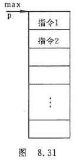

在 main 函数中有一个赋值语句:

```c
c=(*p)(a,b);
```

它和

```c
c=max(a,b);
```

等价.这就是用指针实现函数的调用.

#### 8.5.3 怎样定义和使用指向函数的指针变量

定义指向函数的指针变量的一般形式为:

<font color='Crimson'>**类型名(*指针变量名)(函数参数列表);**</font>

如"int(*p)(int,int);"这里的"类型名是指函数返回值的类型."

怎样判定指针变量是指向函数的指针变量呢?首先看变量名的前面有无" * "号,如 *p.如果有肯定是指针变量而不是普通变量.其次,看变量名的后面有无圆括号,内有形参的类型.如果有,就是指向函数的指针变量,这对圆括号是函数的特征.要注意的是:由于优先级的关系," *指针变量名"要用圆括号括起来.

<font color='Crimson'>**说明:**</font>

<font color='Crimson'>( 1 )</font>	定义指向函数的指针变量,并不意味着这个指针变量可以指向任何函数,它只能指向在定义时指定的类型的函数.如"int(*p)(int,int);"表示指针变量 p 只能指向函数返回值为整型且有两个整型参数的函数.在程序中把那一个函数(该函数的值是整型的且有两个整型参数)的地址赋给它,它就指向哪一个函数.<font color='DarkOrchid'>在一个程序中,一个指针变量可以先后指向同类型的不同函数.</font>

<font color='Crimson'>( 2 )</font>	如果要用指针调用函数,必须先使指针变量指向该函数.如:

```c
p=max;
```

这就把 max 函数的入口地址赋给了指针变量 p.

<font color='Crimson'>( 3 )</font>	在给函数指针变量赋值时,只须给出函数名而不必给出参数,例如:

```c
p = max;	//将函数入口地址赋给p
```

因为是将函数入口地址赋给 p,而不牵涉实参与形参的结合问题.如果写成

```c
p=max(a,b);
```

就错了.p=max(a,b)是将调用 max 函数所得到的函数值赋给 p,而不是将函数入口地址赋给 p.

<font color='Crimson'>( 4 )</font>	用函数指针变量调用函数时,只须将 (*p) 代替函数名即可(p 为指针变量名),在 ( *p )之后的括号中根据需要写上实参.例如:

```c
c=(*p)(a,b);
```

表示"调用由 p 指向的函数,实参为a,b.得到的函数值赋给 c".

请注意函数返回值的类型.从指针变量 p 的定义中可以知道,函数的返回值应是整型的,因此将其值赋给整型变量 c 是合法的.

<font color='Crimson'>( 5 )</font>	对指向函数的指针变量不能进行算术运算,如 p+n,p++,p-- 等运算是无意义的.

<font color='Crimson'>( 6 )</font>	用函数名调用函数,只能调用所指定的一个函数,而通过指针变量调用函数比较灵活,可以跟不同情况先后调用不同的函数.见例 8.23.

<font color='DarkOrchid'>**例 8.23**</font>	输入两个整数让用户选择 1 或 2,选择 1 时调用 max 函数,输出二者中的大数,选择 2 时调用 min 函数,输出二者中的小数.

<font color='DarkOrchid'>**解题思路:**</font>	简单的示例分别定义函数,在主函数中根据用户输入调用.

<font color='DarkOrchid'>**编写程序:**</font>

```c
#include <stdio.h>int main(){	void max_n(int a, int b);	void min_n(int a, int b);	void add_n(int a, int b);	void sub_n(int a, int b);	void div_n(int a, int b);	void mul_n(int a, int b);    void(*p)(int, int);    int a, b,act;	printf("Please enter two integer numbers:");	scanf("%d%d", &a, &b);	printf("Please select the action you want to perform:\n");	printf("1. max\n2. min\n3. add\n4. sub\n5. div\n6. mul\n");	scanf("%d", &act);    printf("a = %d b = %d",a,b);		switch (act)	{	case 1:p = max_n; p(a, b); break;	case 2:p = min_n; p(a, b); break;	case 3:p = add_n; p(a, b); break;	case 4:p = sub_n; p(a, b); break;	case 5:p = div_n; p(a, b); break;	case 6:p = mul_n; p(a, b); break;	default:printf("Input error!\n\a"); break;	}	system("pause");	return 0;}void max_n(int a, int b){	printf("max = %d\n", (a<b)?b : a);}void min_n(int a, int b){	printf("min = %d\n", (a<b)?a : b);}void add_n(int a, int b){	printf("add = %d\n", a + b);}void sub_n(int a, int b){	printf("sub = %d\n", a - b);}void div_n(int a, int b){	if (b != 0)	{		float x, y;		x = a; y = b;		printf("div = %5.2f\n", x / y);	}	else	{		printf("The divisor cannot be 0!\n\a");	}}void mul_n(int a, int b){	printf("mul = %d\n", a*b);}
```

<font color='DarkOrchid'>**运行结果:**</font>


<font color='DarkOrchid'>书中例程:</font>

```c
#include <stdio.h>int main(){    int max(int,int);	//函数声明    int min(int,int);	//函数声明    int (*p)(int,int);	//定义指向函数的指针变量    int a,b,c,n;    printf("please enter a and b:");    scanf("%d%d",&a,&b);    printf("please choose 1 or 2:");    scanf("%d",&n);	//输入1或2    if(n==1)p=max;	//输入1时p指向max函数    else if(n==2)p=min;	//输入2时p指向min函数    c=(*p)(a,b);	//调用p指向的函数    printf("a = %d,b = %d\n",a,b);    if(n==1)printf("max = %d\n",c);    else printf("min = %d\n",c);        system("pause");    return 0;}int max(int x,int y){    int z;    if(x>y) z=x;    else z=y;    return(z);}int min(int x,int y){    int z;    if(x<y) z=x;    else z=y;    return(z);}
```


<font color='DarkOrchid'>**程序分析:**</font>	

许多程序中常用菜单提示输入一个数字,然后根据输入的不同调用不同的函数,实现不同的功能,就可以用此方法.也可以不用指针变量,而用 if 语句或 switch 语句进行判断.指针变量使程序更简洁和专业.

#### 8.5.4 用指向函数的指针作函数参数

<font color='Crimson'>**指向函数的指针变量的一个重要用途是把函数的地址作为参数传递到其他函数.**</font>

指向函数的指针可以作为函数参数,把函数的入口地址传递给形参,这样就能够在被调用的函数中使用实参函数.它的原理可以简述如下:有一个函数(假设函数名为 fun),它有两个形参(x1 和 x2),定义 x1 和 x2 为指向函数的指针变量,在调用函数 fun 时,实参为两个函数名 f1 和 f2,给形参传递的是函数 f1 和 f2 的入口地址.这样在函数 fun 中就可以调用 f1 和 f2 函数了.例如:

```c
实参函数名	  f1		     f2    		    ↓			   ↓void fun(int (*x1)(int),int (*x2)(int,int))//定义fun函数,形参是指向函数										   //的指针变量{    int a,b,i=3,j=5;    a=(*x1)(i);		//调用f1函数,i是实参    b=(*x2)(i,j);	//调用f2函数,i,j是实参}
```

在 fun 函数中声明形参 x1 和 x2 为指向函数的指针变量,x1 指向的函数有一个整型形参,x2 指向的函数有两个整型形参.i 和 j 是调用 f1 和 f2 函数时所要求的实参.函数 fun 的形参 x1 和 x2(指针变量)在函数 fun 未被调用时并不占内存单元,也不指向任何函数.在主函数调用 fun 函数时,把实参函数 f1 和 f2 的入口地址传给形参指针变量 x1 和 x2,使 x1 和 x2 指向函数 f1 和 f2,见图 8.32.这时,在函数 fun 中,用 *x1 和 *x2 就可以调用函数 f1 和 f2.( *x1 )(i) 相当于 f1(i),( *x2 )(i,j) 相当于 f2(i,j).


如果只调用 f1 和 f2 两个函数,显得有些没有要,但是如果在每次调用 fun 函数时,要调用的函数不是固定的,这时,用指针变量就比较方便了.只要在每次调用 fun 函数时给出不同的函数名作为实参即可,fun 函数不必做任何修改.这种方法是符合<font color='Crimson'>结构化程序设计方法原则</font>的,是程序设计中常使用的.

<font color='DarkOrchid'>**例 8.24**</font>	有两个整数 a 和 b,由用户输入1,2或3.如输入1,程序给出最大值,输入2给出最小值,输入3求和.

<font color='DarkOrchid'>**解题思路**</font>	与例 8.23 相似,但现在用一个函数 fun 来实现以上功能.

<font color='DarkOrchid'>**编写程序:**</font>(改写个人程序)

```c
#include <stdio.h>int main(){	void fun(int a, int b, void(*p)(int, int));//fun函数声明	void max_n(int a, int b);	//max声明	void min_n(int a, int b);	//min声明	void add_n(int a, int b);	//add声明	void sub_n(int a, int b);	//sub声明	void div_n(int a, int b);	//div声明	void mul_n(int a, int b);	//mul声明	void(*p)(int, int);	int a, b, act;	printf("Please enter two integer numbers:");	scanf("%d%d", &a, &b);	printf("Please select the action you want to perform:\n");	printf("1. max\n2. min\n3. add\n4. sub\n5. div\n6. mul\n");	scanf("%d", &act);	printf("a = %d b = %d\n", a, b);	switch (act)	//检测选择的操作	{	case 1:p = max_n;break;	case 2:p = min_n;break;	case 3:p = add_n;break;	case 4:p = sub_n;break;	case 5:p = div_n;break;	case 6:p = mul_n;break;	default:printf("Input error!\n\a");break;	}	fun(a, b, p);	//调用fun函数	system("pause");	return 0;}void fun(int a, int b, void(*p)(int, int)){	p(a, b);}void max_n(int a, int b){	printf("max = %d\n", (a<b) ? b : a);}void min_n(int a, int b){	printf("min = %d\n", (a<b) ? a : b);}void add_n(int a, int b){	printf("add = %d\n", a + b);}void sub_n(int a, int b){	printf("sub = %d\n", a - b);}void div_n(int a, int b){	if (b != 0)	{		float x, y;		x = a; y = b;		printf("div = %5.2f\n", x / y);	}	else	{		printf("The divisor cannot be 0!\n\a");	}}void mul_n(int a, int b){	printf("mul = %d\n", a*b);}
```

<font color='DarkOrchid'>**书中例程:**</font>

```c
#include <stdio.h>int main(){    void fun(int x,int y,int (*p)(int,int));//声明fun函数    int max(int,int);    int min(int,int);    int add(int,int);    int a=34,b=-21,n;    printf("please choose 1,2 or 3:");    scanf("%d",&n);    if(n==1) fun(a,b,max);    else if(n==2) fun(a,b,min);    else if(n==3) fun(a,b,add);        return 0;}int fun(int x,int y,int (*p)(int,int)){    int result;    result=(*p)(x,y);    printf("%d\n",result);}int max(int x,int y){    int z;    if(x>y)z=x;    else z=y;    printf("max = ");    return(z);}int min(int x,int y){    int z;    if(x<y)z=x;    else z=y;    printf("min = ");    return(z);}int add(int x,int y){    int z;    z=x+y;    printf("sum = ");    return(z);}
```

<font color='DarkOrchid'>**程序解析:**</font>

本例中与 8.23 相似,只是 8.23 中定义了一个指向函数的指针变量 p,根据不同情况使 p 指向不同的函数,而本例中没有定义指针变量,而是根据情况,将不同的函数名作为调用 fun 函数的实参,把函数入口地址传送给函数 fun 中的形参(该形参是指向函数的指针变量),调用 fun 就执行不同的函数.

需要注意的是,对作为实参的函数,应在主调函数中用函数原型作函数声明.

有了以上基础,就可以编写出较为复杂的程序.例如,编写一个求定积分的通用函数,用它分别求以下5个函数的定积分:
$$
\int_a^b(1+x)dx\ , \int_a^b(2x+3)dx\ , \int_a^b(e^x+1)dx\ , \int_a^b(1+x)^2dx\ , \int_a^bx^3dx
$$
可以看出,每次需要求定积分的函数是不一样的.可以编写一个求定积分的通用函数 integral,它有 3 个形参:下限 a,上限 b 以及指向函数的指针变量 fun. integral 函数原型可写为

```c
float integral(float a,float b,float(*fun)(float));
```

分别定义 5 和函数 f1 至 f5,代表上面 5 个函数,然后先后调用 integral 函数 5 次,求出不同函数的定积分.(<font color='Chartreuse'>定积分-_-!</font>)

##### 方法一:指向函数的指针（数学公式）

```c
#include<stdio.h>#include<math.h>#define e 2.71828//定义自然常数e; int main(){ 	double f1(double,double);  	double f2(double,double);  	double f3(double,double);  	double f4(double,double);  	double f5(double,double);  	double integral(double m,double n,double (*fun)(double,double));  	double a,b;	printf("enter a and b(中间以空格隔开):");    	scanf("%lf%lf",&a,&b); 	printf("\n函数(1+x)在%4.1f到%4.1f的积分是:",a,b); 	integral(a,b,f1); 	printf("\n函数(2*x+3)在%4.1f到%4.1f的积分是:",a,b); 	integral(a,b,f2); 	printf("\n函数(e^x+1)在%4.1f到%4.1f的积分是:",a,b); 	integral(a,b,f3); 	printf("\n函数((1+x)^2)在%4.1f到%4.1f的积分是:",a,b); 	integral(a,b,f4); 	printf("\n函数(x^3)在%4.1f到%4.1f的积分是:",a,b); 	integral(a,b,f5); 	return 0;}double integral(double m,double n,double (*fun)(double,double)){	double result;	result=(*fun)(m,n);	printf("%6.3f\n",result);	return 1;}double f1(double a,double b){    return b-a+0.5*(b*b-a*a);}double f2(double a,double b){ 	return b*b-a*a+3*b-3*a;}double f3(double a,double b){	return pow(e,b)-pow(e,a)+b-a;}	double f4(double a,double b){	return (pow(b+1,3)-pow(a+1,3))/3;}double f5(double a,double b){	return (pow(b,4)-pow(a,4))/4;}
```

在VS2019下，需将源文件的scanf改为scanf_s：

```c
#include<stdio.h>#include<math.h>#define e 2.71828//定义自然常数e; int main(){    double f1(double, double);    double f2(double, double);    double f3(double, double);    double f4(double, double);    double f5(double, double);    double integral(double m, double n, double (*fun)(double, double));    double a, b;    printf("enter a and b(中间以空格隔开):");    scanf_s("%lf%lf", &a, &b);    printf("\n函数(1+x)在%4.1f到%4.1f的积分是:", a, b);    integral(a, b, f1);    printf("\n函数(2*x+3)在%4.1f到%4.1f的积分是:", a, b);    integral(a, b, f2);    printf("\n函数(e^x+1)在%4.1f到%4.1f的积分是:", a, b);    integral(a, b, f3);    printf("\n函数((1+x)^2)在%4.1f到%4.1f的积分是:", a, b);    integral(a, b, f4);    printf("\n函数(x^3)在%4.1f到%4.1f的积分是:", a, b);    integral(a, b, f5);    return 0;}double integral(double m, double n, double (*fun)(double, double)){    double result;    result = (*fun)(m, n);    printf("%6.3f\n", result);    return 1;}double f1(double a, double b){    return b - a + 0.5 * (b * b - a * a);}double f2(double a, double b){    return b * b - a * a + 3 * b - 3 * a;}double f3(double a, double b){    return pow(e, b) - pow(e, a) + b - a;}double f4(double a, double b){    return (pow(b + 1, 3) - pow(a + 1, 3)) / 3;}double f5(double a, double b){    return (pow(b, 4) - pow(a, 4)) / 4;}
```

##### 方法二:指向函数的指针（矩形法求定积分）

```c
#include<stdio.h>#include<math.h>int main(){ 	double f1(double);  	double f2(double);  	double f3(double);  	double f4(double);  	double f5(double);  	double integral(double,double,double (*fun)(double));  	double a,b;	printf("enter a and b(中间以空格隔开):");   	scanf("%lf%lf",&a,&b); 	printf("\n函数(1+x)在%4.1f到%4.1f的积分是:",a,b); 	integral(a,b,f1); 	printf("\n函数(2*x+3)在%4.1f到%4.1f的积分是:",a,b); 	integral(a,b,f2); 	printf("\n函数(e^x+1)在%4.1f到%4.1f的积分是:",a,b); 	integral(a,b,f3); 	printf("\n函数((1+x)^2)在%4.1f到%4.1f的积分是:",a,b); 	integral(a,b,f4); 	printf("\n函数(x^3)在%4.1f到%4.1f的积分是:",a,b); 	integral(a,b,f5); 	return 0;}double integral(double m,double n,double (*fun)(double)){	double sum=0.0;	double length=1e-6;	double z=m;	while(z<n)		//条件是积分函数的下标必须小于上标    	{   		sum+=((*fun)(z)+(*fun)(z+length))*length/2;        /*这里可以替换为sum+=((*fun)(z+length))*length; */    	z+=length;        /*当然也可以替换为sum+=((*fun)(z))*length; */   }	printf("%6.3f\n",sum);	return 1;}double f1(double x){    return 1+x;}double f2(double x){ 	return 2*x+3;}double f3(double x){	return exp(x)+1;}	double f4(double x){	return x*x+2*x+1;}double f5(double x){	return x*x*x;}
```

在VS2019下，需将源文件的scanf改为scanf_s：

```c
#include<stdio.h>#include<math.h>int main(){    double f1(double);    double f2(double);    double f3(double);    double f4(double);    double f5(double);    double integral(double, double, double (*fun)(double));    double a, b;    printf("enter a and b(中间以空格隔开):");    scanf_s("%lf%lf", &a, &b);    printf("\n函数(1+x)在%4.1f到%4.1f的积分是:", a, b);    integral(a, b, f1);    printf("\n函数(2*x+3)在%4.1f到%4.1f的积分是:", a, b);    integral(a, b, f2);    printf("\n函数(e^x+1)在%4.1f到%4.1f的积分是:", a, b);    integral(a, b, f3);    printf("\n函数((1+x)^2)在%4.1f到%4.1f的积分是:", a, b);    integral(a, b, f4);    printf("\n函数(x^3)在%4.1f到%4.1f的积分是:", a, b);    integral(a, b, f5);    return 0;}double integral(double m, double n, double (*fun)(double)){    double sum = 0.0;    double length = 1e-6;    double z = m;    while (z < n)	//条件是积分函数的下标必须小于上标     {        sum += ((*fun)(z) + (*fun)(z + length)) * length / 2;        /*这里可以替换为sum+=((*fun)(z+length))*length; */        z += length;        /*当然也可以替换为sum+=((*fun)(z))*length; */    }    printf("%6.3f\n", sum);    return 1;}double f1(double x){    return 1 + x;}double f2(double x){    return 2 * x + 3;}double f3(double x){    return exp(x) + 1;}double f4(double x){    return x * x + 2 * x + 1;}double f5(double x){    return x * x * x;}
```

##### 方法三：顺序结构（数学公式）

```c
#include<stdio.h>#include<math.h>#define e 2.71828//定义自然常数e; int main (){    double a,b,n1,n2,n3,n4,n5,t;    printf("enter a and b(中间以空格隔开):");      scanf("%lf%lf",&a,&b);    if(b<a)//保证上限比下限大；     {    	t=b;    	b=a;		a=t;	}    n1=b-a+0.5*(b*b-a*a);//a和b是未知数，积分运算后，原式=a和b混合运算的代数式；     n2=b*b-a*a+3*b-3*a;    n3=pow(e,b)-pow(e,a)+b-a;    n4=(pow(b+1,3)-pow(a+1,3))/3;    n5=(pow(b,4)-pow(a,4))/4;    printf("\n函数(1+x)在%4.1f到%4.1f的积分是:%.2f",a,b,n1);    printf("\n函数(2*x+3)在%4.1f到%4.1f的积分是:%.2f",a,b,n2);    printf("\n函数(e^x+1)在%4.1f到%4.1f的积分是:%.2f",a,b,n3);    printf("\n函数((1+x)^2)在%4.1f到%4.1f的积分是:%.2f",a,b,n4);    printf("\n函数(x^3)在%4.1f到%4.1f的积分是:%.2f",a,b,n5);    return 0;}
```

在VS2019下，需将源文件的scanf改为scanf_s：

```c
#include<stdio.h>#include<math.h>#define e 2.71828//定义自然常数e; int main(){    double a, b, n1, n2, n3, n4, n5, t;    printf("enter a and b(中间以空格隔开):");    scanf_s("%lf%lf", &a, &b);    if (b < a)//保证上限比下限大；     {        t = b;        b = a;        a = t;    }    n1 = b - a + 0.5 * (b * b - a * a);//a和b是未知数，积分运算后，原式=a和b混合运算的代数式；     n2 = b * b - a * a + 3 * b - 3 * a;    n3 = pow(e, b) - pow(e, a) + b - a;    n4 = (pow(b + 1, 3) - pow(a + 1, 3)) / 3;    n5 = (pow(b, 4) - pow(a, 4)) / 4;    printf("\n函数(1+x)在%4.1f到%4.1f的积分是:%.2f", a, b, n1);    printf("\n函数(2*x+3)在%4.1f到%4.1f的积分是:%.2f", a, b, n2);    printf("\n函数(e^x+1)在%4.1f到%4.1f的积分是:%.2f", a, b, n3);    printf("\n函数((1+x)^2)在%4.1f到%4.1f的积分是:%.2f", a, b, n4);    printf("\n函数(x^3)在%4.1f到%4.1f的积分是:%.2f", a, b, n5);    return 0;}
```

### 8.6 返回指针值的函数

一个函数可以返回一个整型值,字符值,实型值等,也可以返回指针型的数据,即地址.其概念与一点类似,只是返回的值的类型是指针类型而已.

例如"<font color='Chartreuse'>int *a(int x,int y);</font>",a 是函数名,调用它以后能得到一个 int * 型(指向整型数据)的指针,即整形数据的地址.x 和 y 是函数 a 的形参,为整型.

请注意在 *a 两侧没有括号,在 a 的两侧分别为 * 运算符和()运算符.而()优先级高于 *,因此 a 先与()结合,显然这时函数形式.这个函数前面有一个 *,表示此函数是指针型函数(函数值是指针).最前面的 int 表示返回的指针指向整型变量.

定义返回指针值的函数的一般形式为:

<font color='Crimson'>**类型名 *函数名(参数表列);**</font>

对于初学者来说这种定义形式不大习惯,容易弄错,用时要十分小心.通过下面的例子可以初步了解怎样使用返回指针的函数.

<font color='DarkOrchid'>**例 8.25**</font>	有 a 个学生,每个学生有 b 门课程的成绩.要求在用户输入学生序号以后,能输出该学生的全部成绩.用指针函数来实现.

<font color='DarkOrchid'>**解题思路:**</font>	定义一个二维数组 score,用来存放学生成绩.定义一个查询学生成绩的函数 search,它是一个返回指针的函数,形参是指向一维数组的指针变量和整型变量 n,从主函数将数组名 score 和要找的学生号 k 传递给形参.函数的返回值是 &score[k] [0].然后输出该生的全部成绩.

<font color='DarkOrchid'>**编写程序:**</font>

```c
#include <stdio.h>int main(){	float score[][4] = { { 60,70,80,90 },{ 56,89,67,88 },{ 34,78,90,66 } };//定义数组,存放成绩	float *p;	//定义指针变量	int i, k;	float *search(float(*p)[4], int n);//声明函数	printf("请输入要查询的学生学号:");	scanf_s("%d", &k);	//输入要查询的学生学号	p = search(score, k);//调用函数返回值	printf("第%d个学生的成绩为:", k);	for (i = 0; i<4; i++)	{		printf("%5.2f ", *(p + i));//输出各课成绩	}	putchar('\n');	system("pause");	return 0;}float *search(float(*pointer)[4], int n)//形参pointer是指向一维数组的指针变量{	float *pt;	pt = *(pointer + n-1);	//pt的值是 &score[n][0]	return(pt);}
```

<font color='DarkOrchid'>**运行结果:**</font>


<font color='DarkOrchid'>**程序分析:**</font>	函数 search 定义为指针型函数,它的形参 pointer 是指向包含 4 个元素的一维数组的指针变量.pointer+n-1 指向 score 数组序号为 n 的学生的成绩见图 8.34, *(pointer+n-1) 指向 n 行 0 列元素(对 pointer+n-1 加了" * "号后,指针从行控制转化为列控制了).search 函数中的 pt 是指针变量,它指向 float 型变量(而不是指向一维数组).main 函数调用 search 函数,将 score 数组首行地址传给形参 pointer(注意 score 也是指向行的指针,而不是指向列元素的指针).k 是要查找的学生序号.调用 search 函数后,main 函数得到一个地址 & score[k] [0] (指向第 k 个学生第 0 门课),赋给 p.然后将此学生的 4 门课程的成绩输出.注意 p 是指向 float 型数据的指针变量, *(p+i) 表示该学生的第 i 门课程的成绩.


请注意指针变量 p,pt 和 pointer 的区别.如果将 search 函数中的语句

```c
pt = *(pointer+n);
```

改为

```c
pt = (*pointer+n);
```

得到的不是第 1 个学生的成绩,而是二维数组中 score[0] [1] 开始的 4 个元素的值.请分析.

<font color='DarkOrchid'>**例 8.26**</font>	对例 8.25 中的学生,找出其中有不及格的课程的学生及其学生号.

<font color='DarkOrchid'>**解题思路:**</font>	在例 8.25 程序基础上修改.main 函数不是只调用一次 search 函数,而是先后调用 3 次 search 函数,在 search 函数中检查 3 个学生有无不及格的课程,如果有,就返回该学生的 0 号课程的地址 &score[i] [0],否则返回 NULL.在 main 函数中检查返回值,输出有不及格学生 4 门课程的成绩.

<font color='DarkOrchid'>**编写程序:**</font>

```c
#include <stdio.h>int main(){	float score[][4] = { { 60,70,80,90 },{ 56,89,67,88 },{ 34,78,90,66 } };//定义数组存放成绩	float *search(float(*pionter)[4]);	float *p;	int i, j;	for (i = 0; i<3; i++)	{		p = score + i;		search(p);		if (search(p) == NULL)		{			;		}		else		{			printf("第%d名学生的成绩为:", i + 1);			for (j = 0; j<4; j++)			{				printf("%5.2f ", *(p + j));			}			putchar('\n');		}	}	system("pause");	return 0;}float *search(float(*pointer)[4]){	float *pt;	int i,k;	pt = *pointer;	for (i = 0; i<4; i++)	{		k = 0;		if (*(*pointer + i)<60)		{			k++;			break;		}	}	if (k != 0)	{		return(pt);	}	else	{		return(NULL);	}}
```

<font color='DarkOrchid'>**运行结果:**</font>


<font color='DarkOrchid'>**书中例程:**</font>

```c
#include <stdio.h>int main(){	float score[][4]={{60,70,80,90},{56,89,67,88},{34,78,90,66}};//定义数组,存放成绩	float *search(float(*pointer)[4]);	//函数声明	float *p; 	int i,j; 	for(i=0;i<3;i++)	//循环3次    {        p=search(score+i);//调用search函数,如有不及格返回score[i][0]的地址,否则返回NULL        if(p==*(score+i))//如果返回的是score[i][0]的地址,表示p的值不是NULL        {            printf("No.%d score:",i);            for(j=0;j<4;j++)            {                printf("%5.2f ",*(p+j));//输出各课成绩            }            printf("\n");        }    } return 0;}float *search(float(*pointer)[4])	//定义函数,形参pointer是指向一维数组的指针变量{    int i=0;    float *pt;    pt = NULL;	//先使pt的值为NULL    for(;i<4;i++)    {        if(*(*pointer+i)<60)        {pt = *pointer;}        return(pt);    }}
```

<font color='DarkOrchid'>**程序分析:**</font>	函数 search 的作用是检查一个学生有无不及格的课程.在 search 函数中的 pointer 是指向一维数组(有 4 个元素)的指针变量.pt 为指向 float 型变量的指针变量.从实参传给形参 pointer 的是 score+i,它是 score 第 i 行的首地址,见图 8.35(a).

在 search 函数中,先使 pt=NULL (即 pt=0).用 pt 作为区分有无不及格课程的标志.若经检查 4 门课中有不及格的,就使 pt 指向本行 0 列元素,即 pt=&score[i] [0];若无不及格则保持 pt 的值为 NULL,见图 8.35(b).将 pt 返回 main 函数.在 main 函数中,把调用 search 得到的函数值(指针变量 pt 的值)赋给 p.用 if 语句判断 p 是否等于 *(score+i),若相等,表示所查的序号为 i 的学生有不及格课程(p 的值为 *(score+i),即 p 指向 i 行 0 列元素),就输出该学生(有不及格课程的学生)4 门课成绩.若无不及格,p 的值是 NULL,不输出.请仔细消化本例中指针变量的含义和用法.


### 8.7 指针数组和多重指针

#### 8.7.1 什么是指针数组

一个数组,若其元素均为指针类型数据,称为指针数组,也就是说,指针数组中每一个元素都存放一个地址,相当于一个指针变量.下面定义一个指针数组:

```c
int *p[4];
```

由于[]比 * 优先级高,因此 p 先与 [4] 结合,形成 p[4]形式,这是一个数组,表示 p 数组有 4 个元素.然后再与 " * "结合,表示此数组是指针类型的,每个数组元素(相当于一个指针变量)都可以指向一个整型变量.注意不要写成

```c
int (*p)[4];//这是指向一维数组的指针变量
```

定义一维指针数组的一般形式

<font color='Crimson'>**类型名 *数组名[数组长度];**</font>

类型名中应包括符号" * ",如"int * "表示是指向整型数据的指针类型.

什么情况下要用到指针数组呢?指针数组比较适合用来指向若干个字符串,使字符串处理更加方便灵活.例如,图书馆有若干本书,想把书名放在一个数组中(见图 8.36(a)),然后要对这些书目进行排序和查询.按一般方法,字符串本身就是一个字符数组.因此要设计一个二维的字符数组才能存放多个字符串.但在定义二维数组时,需要指定列数,也就是说二维数组中每一行中包含的元素个数(即列数)相等.而实际上各字符串(书名)长度一般是不相等的.如按最长的字符串来定义列数,则会浪费许多内存单元,见图 8.36(b).

可以分别定义一些字符串,然后用指针数组中的元素分别指向个字符串,如图 8.36(c)中所示:在 name[0] 中存放字符串"Follow me"的首字符的地址.name[1] 中存放字符串"BASIC"的首地址···如果相对字符串排序,不必改动字符串的位置,只须改动指针数组中个元素的指向(即改变个元素的值,这些值是各字符串的首地址).这样,各字符串的长度可以不同,而且移动指针变量的值(地址)要比移动字符串所花的时间少的多.


<font color='DarkOrchid'>**例 8.27**</font>	将若干字符串按字母顺序(由小到大)输出.

<font color='DarkOrchid'>**解题思路:**</font>	定义一个指针数组 name,用各字符串对它进行初始化,即把各字符串中第 1 个字符的地址赋给指针数组的各元素.然后用选择法排序,但不是移动字符串,而是改变指针数组的各元素的指向.

<font color='DarkOrchid'>**编写程序:**</font>

```c
#include <stdio.h>#include <string.h>int main(){	void sort(char * name[], int n);	//函数声明	void print(char * name[], int n);	//函数声明	char *name[5] = { "Follow me","BASIC","Great Wall","FORTAN","Computer design" };    //定义指针数组,它的元素分别指向5个字符串	int n = 5;	sort(name, n);	//调用sort函数,对字符串排序	print(name, n);	//调用print函数,输出字符串	system("pause");	return 0;}void sort(char * name[], int n)	//定义sort函数{	char * temp;	int i, j, k;	for (i = 0; i < n - 1; i++)	{		for (j = i + 1; j < n; j++)		{			k = strcmp(name[i], name[j]);			if (k > 0)			{				temp = name[i];				name[i] = name[j];				name[j] = temp;			}		}	}}void print(char * name[], int n)	//定义print函数{	int i;	for (i = 0; i<n; i++)	{		printf("%s\n", name[i]);	}//按指针数组元素的顺序输出它们所指向的字符串}
```

<font color='DarkOrchid'>**运行结果:**</font>


<font color='DarkOrchid'>**程序分析:**</font>	在 main 函数中定义指针数组 name,它有 5 个元素,其初值分别是"Follow me","BASIC","Great Wall","FORTRAN"和"Computer design"的首字符的地址,见图 8.36(c).这些字符串是不等长的.

sort 函数的作用是对字符串排序.sort 函数的形参 name 也是指针数组名,接受实参传过来的 name 数组 0 行的起始地址,因此形参 name 数组和实参 name 数组指的是同一数组.用选择法对字符串排序.strcmp 是系统提供的字符串比较函数,name[k] 和 name[j] 是第 k 个和第 j 个字符串首字符的地址.strcmp(name[k],name[j])的值为:如果 name[k] 所指的字符串大于 name[j] 所指的字符串,则此函数值为正值;若相等,则函数值为 0;若小于,则函数值为负值.if 语句的作用是将两个中"小"的那个字符串序号保留在变量k中.当执行完内循环 for 语句后,从第 i 串到第 n 串这些字符串中,第 k 串最"小".若 k!=i 就表示最小的串不是第 i 串,故将 name[i] 和 name[k] 对换,也就是将指向第 i 个字符串的数组元素的值对换,也就是把他们的指向互换.执行完 sort 函数后指针数组的情况如图 8.37 所示.


print 函数的作用是输出个字符串.

注意 sort 函数中的第一个 if 语句中的逻辑表达式的正确用法.不能写成以下形式:

```c
if(*name[k]>*name[j]) k=j;
```

这样只比较所指向的字符串中的第 1 个字符.字符串比较应当用 strcmp 函数.

<font color='DarkOrchid'>**程序改进:**</font>

print 函数也可以改写为以下形式:

```c
void print(char * name[],int n){    int i=0;    char *p;    p=name[0];    while(i<n)    {        p = *(name+i++);        printf("%s\n",p);    }}
```

<font color='DarkOrchid'>**其中"*(name+i++)"表示先求 *(name+i)的值,即 name[i] (它是一个地址),然后使 i 加 1.在输出时,按字符串形式输出从 p 地址开始的字符串.**</font>

#### 8.7.2 指向指针数据的指针

在了解了指针数组的基础上,需要了解<font color='Crimson'>**指向指针数据**</font>的指针变量,简称为<font color='Crimson'>**指向指针的指针.**</font>从图 8.38 可以看到,name 是一个指针数组,它的每一个元素是一个指针型的<font color='Crimson'>**变量**</font>,其值为地址.name 既然是一个数组,它的每一个元素都应有相应的地址.数组名 name 代表该指针数组首元素的地址.name+i 是 name[i] 的地址.name+i 就是指向指针型数据的指针.还可以设置一个指针变量 p,它指向指针数组的元素(见图 8.38).p 就是指向指针型数据的指针变量.


怎样定义一个指向指针数据的指针变量呢?下面定义一个指向指针数据的指针变量:

```c
char **p;
```

p 的前面有两个 * 号, * 号运算符的结合性是从右到左,因此 **p 相当于 * (*p),显然 *p 是指针变量的定义形式.如果没有最前面的 *,那就是定义了一个指向字符数据的指针变量.现在它前面又有一个 * 号,即 char * *p.可以把它分为两部分看,即: char * 和( *p ),后面的( *p )表示 p 是指针变量(这个字符指针变量指向一个字符型数据).如果引用 *p,就得到 p 所指向的字符指针变量的值,如果有:

```c
p=name+2;printf("%d\n",*p);printf("%s\n",*p);
```

第 1 个 printf 函数语句输出 name[2] 的值(它是一个地址),第 2 个printf 函数语句以字符串形式(%s)输出字符串"Great Wall".

<font color='DarkOrchid'>**例 8.28**</font>	使用指向指针数据的指针变量.

<font color='DarkOrchid'>**解题思路:**</font>	定义一个指针数组 name,并对它初始化,使 name 数组中每一个元素分别指向 5 个字符串.定义一个指向指针型数据的变量 p,使 p 先后指向 name 数组中各元素,输出这些元素所指向的字符串.

<font color='DarkOrchid'>**编写程序:**</font>

```c
#include <stdio.h>int main(){    char *name[]={"Follow me","BASIC","Great Wall","FORTAN","Computer design"};    char **p;    int i;    p=name;    for(i=0;i<5;i++)    {        printf("%s\n",**p+i);    }        system("pause");}
```

<font color='DarkOrchid'>**运行结果:**</font>


<font color='DarkOrchid'>**程序分析:**</font>	p 是指向 char * 型数据的指针变量,即指向指针的指针.在第 1 次执行 for 循环体时,赋值语句"p=name+i;"使 p 指向 name 数组的 0 号元素 name[0],*p 是 name[0]的值,即第 1 个字符串首字符的地址,用 printf 函数输出第 1 个字符串(格式符为 %s).执行 5 次循环体,一次输出 5 个字符串.

<font color='Coral'>**说明:**</font>	指针数组的元素也可以不指向字符串,而指向整型数据或实型数据等,例如:

```c
int a[5]={1,3,5,7,9};int *num[5],i;int **p;	//p是指向 int *型数据的指针变量for(i=0;i<5;i++){num[i]=&a[i];}
```

为了得到 a[2] 中的数据 5,可以先使 p=num+2,然后输出 **p.注意 *p 是 num[2] 的值,而 num[2] 的值是 a[2] 的地址,因此 * *p 是 a[2] 的值 5,见图 8.39.


<font color='DarkOrchid'>**例 8.29**</font>	有一个指针数组,其元素分别指向一个整型数组的元素,用指向指针数据的指针变量,输出整型数组个元素的值.这个简单例子为了说明它的用法.

```c
#include <stdio.h>int main(){    int a[5]={1,3,5,7,9};    int *num[5]={&a[0],&a[1],&a[2],&a[3],&a[4]};    int **p,i;    p=num;    for(i=0;i<5;i++)    {        printf("%d ",**p);        p++;    }    putchar('\n');        system("pause");}
```

<font color='DarkOrchid'>**程序分析:**</font>	程序中定义 p 是指向指针型数据的指针变量,开始时指向指针数组 num 的首元素 num[0],而 num[0] 是一个指针型的元素,它指向整型数组 a 的首元素 a[0].开始时 p 的值是 &num[0], *p 是 num[0] 的值,即 &a[0], *( *p ) 是 a[0] 的值.因此第 1 个输出的是 a[0] 的值,然后执行 p++,p就指向 num[1],再输出 **p ,就是 a[2] 的值 3 了.

<font color='Coral'>**注意:**</font>	第 5 行不要错写为

```c
int * num[5]={1,3,5,7,9};
```

<font color='Coral'>**指针数组的元素只能存放地址,不能存放整数.**</font>我们可在此例基础上实现对个数排序.

本章开头已经提到了"间接访问"变量的方式.利用指针变量访问另一个变量就是"间接访问".如果在一个指针变量中存放一个目标变量的地址,这就是"单级间址",见图 8.40(a).指向指针数据的指针用的是"二级间址"方法,见图 8.40(b).从理论上说,间址方法可以延伸到更多的级,即多重指针,见图 8.40(c).但实际上程序中很少有超过二级间址的.级数越多越难理解,容易产生混乱,出错机会也多.


#### 8.7.3 指针数组作 main 函数的形参

指针数组的一个重要应用是作为 main 函数的形参.在以往的程序中,main 函数的第 1 行一般写成以下形式:

```c
int main()	或 int main(void)
```

括号中是空的或有"void",表示 main 函数没有参数,调用 main 函数时不必给出实参.这时一般程序常采用的形式.实际上,在某些情况下,main 函数可以有参数,例如:

<font color='Crimson'>**int main(int argc,char * argv[])**</font>

其中,argc 和 argv 就是 main 函数的形参,它们是程序的"命令行参数".argc(argument count 的缩写,意思是参数个数),argv(argument vector 缩写,意思是参数向量),它是一个 * char 指针数组,数组中每一个元素(其值为指针)指向命令行中的一个字符串.

通常 main 函数和其他函数组成一个文件模块,有一个文件名.对这个文件进行编译和连接,得到可执行文件(后缀为 .exe).用户执行这个可执行文件,操作系统就调用 main 函数,然后由 main 函数调用其他函数,从而完成程序的功能.

什么情况下 main 函数需要参数? main 函数的形参是从哪里传递给它们的呢?显然形参的值不可能在程序中得到.main 函数时操作系统调用的,实参只能由操作系统给出.在操作命令状态下,实参是和执行文件的命令一起给出的.例如在 DOS,UNIX 或 Linux 等系统的操作命令状态下,在命令行中包括了命令名和需要传给 main 函数的参数.

命令行的一般形式为

<font color='Crimson'>**命令名 参数1 参数2 ··· 参数n**</font>

命令名和各参数之间用空格分隔.命令名是可执行文件名(此文件包含 main 函数),假设可执行文件名 file1.exe,现在将两个字符串"China","Beijing"作为传送给 main 函数的参数.命令航可以写成以下形式:

```c
file1 China Beijing
```

file1 为可执行文件名,China 和 Beijing 是调用 main 函数的实参,实际上,文件名应包括盘符,路径.

请注意以上参数与 main 函数中形参的关系. main 函数中形参 argc 是值命令行中参数的个数(注意,<font color='Crimson'>文件名也作为一个参数</font>.例如,本例中"file1"也算一个参数),现在,argc 的值等于 3(有 3 个命令行参数:file1,China,Beijing). main 函数的第 2 个形参 argv 是一个指向字符串的指针数组,也就是说,带参数的 main 函数原型是:

```c
int main(int argc,char * argv[]);
```

命令行参数应当都是字符串(例如,上面命令行中的"file1","China","Beijing"都是字符串),这些字符串的首地址构成一个指针数组,见图 8.41.


指针数组 argv 中的元素 argv[0] 指向字符串"file1"(或者说 argv[0] 的值是字符串"file1"的首地址),argv[1] 指向字符串"China",argv[2] 指向字符串"Beijing".

如果有一个名为 file1 的文件,它包含以下的 main 函数:

```c
int main(int argc,char * argv[]){    while(argc>1)    {        ++argv;        printf("%s\n",argv);        --argc;    }    return 0;}
```

编译连接后,选择`工程`→`设置`→`调试`→`程序变量`命令,输入"China Beijing",再运行程序,将会输出以下信息:

China

Beijing

上面的 main 函数可以改写为

```c
int main(int argc,char *argv[]){    while(argc-- > 1)    {printf("%s\n",* ++argv)};}
```

其中,"* ++argv"是先进行 ++argv 的运算,使 argv 指向下一个元素,然后进行 * 的运算,找到 argv当前指向的字符串,输出该字符串.在开始时,argv 指向字符串"file1",++argv 使之指向"China",所以第 1 次输出的是"China",第 2 次输出"Beijing".

许多操作系统提供了 echo 命令,它的作用是实现"参数回送",即将 echo 后面的各参数(各字符串)在同一行上输出.实现"参数回送"的 C 程序(文件名为 echo.c)如下:

```c
#include <stdio.h>int main(int argc,char * argv[]){    while(--argc>0)	//当命令行的参数多于1    {        printf("%s%c",*++argv,(argc>1)?' ':'\n');//从第 2 个参数开始输出各字符参数(字符串)        return 0;    }}
```

如果用 UNIX 系统的命令输入:

$ <u>./echo Computer and C Language</u>`enter`	//echo 是可执行的文件名

会在屏幕上输出

Computer and C Language

这个程序与前面的差别在于:① 将 while 语句中的(argc-- >1)改为(--argc>0),作用显然是一样的.② 当 argc>1 时,在输出的两个字符串间输出一个空格,当 argc=1 时输出一个换行.程序不输出命令名"echo".

为便于理解,echo 程序也可以写成以下形式:

```c
#include <stdio.h>int main(int argc,char * argv[]){    int i;    for(i=1;i<argc;i++)    {        printf("%s%c",argv[i],(i<argc-1)?' ':'\n');    }    return 0;}
```

其实,main 函数中的形参不一定命名为 argc 和 argv,可以是任意的名字,只是人们习惯用 argc 和 argv而已.

利用指针数组作 main 函数的形参,可以向程序传送命令行参数(这些参数时字符串),这些字符串的长度事先并不知道,而且各参数字符串的长度一般并不相同,命令行参数的数目也是可以任意的.用指针数组能够较好地满足上述要求.

关于指向指针的指针是 C 语言中比较深入的概念,在此只作简单的介绍.

### 8.8 动态内存分配与指向它的指针变量

#### 8.8.1 什么是内存的动态分配

第 7 章介绍过全局变量和局部变量,全局变量时分配在内存中的静态存储区的,非静态的局部变量(包括形参)是分配在内存中的动态存储区的,这个存储区是一个称为<font color='Crimson'>**栈(stack)**</font>的区域.除此之外,C 语言还允许建立内存动态分配区域,以存放一些临时用的数据,这些数据不必再程序的声明部分定义,也不必等到函数结束时才释放,而是需要时随时开辟,不需要是随时释放.这些数据是临时存放在一个特别的自由存储区,称为<font color='Crimson'>**堆(heap)**</font>区.可以根据需要,向系统申请所需大小的空间.由于未在声明部分定义它们为变量或数组,因此不能通过变量名或数组名区引用这些数据,只能通过指针来引用.

#### 8.8.2 怎样建立内存的动态分配

对内存的动态分配是通过系统提供的库函数来实现的,主要有 malloc,calloc,free,realloc 这 4 个函数.

##### 使用 malloc 函数

其函数原型为

<font color='Crimson'>**void * malloc(unsigned int size);**</font>

其作用是在内存的动态存储区中分配一个长度为 size 的连续空间.形参 size 的类型定为无符号整型(不允许为负数).此函数的值(即"返回值")是所分配区域的第一个字节的地址,或者说,此函数是一个指针型函数,返回的指针指向该分配区域的开头位置.如:

```c
malloc(100);	//开辟100字节的临时分配域,函数值为其第1个字节的地址
```

注意指针的基类型为 void,即不指向任何类型的数,只提供一个地址.如果此函数未能成功地执行(例如内存空间不足),则返回空指针(NULL).

##### 使用 calloc 函数

其函数原型为

<font color='Crimson'>**void * calloc(unsigned n,unsigned size);**</font>

其作用是在内存的动态存储区中分配 n 个长度为 size 的连续空间,这个空间一般比较大,足以<font color='Crimson'>**保存一个数组.**</font>

用 calloc 函数可以为一维数组开辟动态存储空间,n 为数组元素个数,每个元素长度为 size.这就是动态数组.函数返回指向所分配域的起始位置的指针;如果分配不成功,返回 NULL.如:

```c
p=calloc(50,4);	//开辟50×4个字节的临时分配域,把起始地址赋给指针变量p
```

##### 使用 free 函数

其函数原型为

<font color='Crimson'>**void free(void * p);**</font>

其作用是释放指针变量 p 所指向的动态空间,使这部分空间能重新被其他变量使用.p 应是最近一次调用 calloc 或 malloc 函数时得到的函数返回值.如:

```c
free(p);	//释放指针变量p所指向的已分配的动态空间
```

free 函数无返回值.

##### 使用 realloc 函数

其函数原型为

<font color='Crimson'>**void * realloc(void * p,unsigned int size);**</font>

如果已经通过 malloc 函数或 calloc 函数获得了动态空间,想改变其大小,可以用 realloc 函数<font color='Crimson'>**重新分配.**</font>

用 realloc 函数将 p 所指向的动态空间的大小改变为 size.p 的值不变.如果重分配不成功,返回 NULL.如:

```c
realloc(p,50);	//将p所指向的已分配的动态空间改为50字节
```

以上 4 个函数的声明在 stdlib.h 头文件中,在用到这些函数时应当把 stdlib.h 头文件包含到程序文件中.

<font color='Crimson'>**说明:**</font>	以前的 C 版本提供的 malloc 和 calloc 函数得到的是指向字符型数据的指针,其原型为

```c
char * malloc(unsigned int size);	//返回字符型数据的指针
```

但实际上,这些空间并不一定是用来存放字符的,如果把开辟的区域用来存放整数,则要进行类型转换,如:

```c
int *pt;pt = (int *) malloc(100);//将指向字符数据的指针转换成指向整型数据的指针
```

pt 是基类型为整型的指针变量,而 malloc(100) 返回的是基类型为字符型的指针,二者不一致,先把 malloc(100) 返回的地址强制转换成基类型为整型的地址,然后赋值给 pt.可以通过 pt 对该区域进行存取操作.要说明的是类型转换只是产生了一个临时的中间值赋给了 pt,但并没有改变 malloc 函数本身的类型.

C 99 标准把以上 malloc,calloc,realloc 函数的基类型定义为 void 类型,这种指针称为<font color='Crimson'>**无类型指针(typeless pointer)**</font>,即不指向哪一种具体的类型数据,只表示用来指向一个抽象的类型的数据,即仅提供一个纯地址,而不能指向任何具体的对象.

#### 8.8.3 void 指针类型

C 99 允许使用基类型为 void 的指针类型.可以定义一个基类型为 void 的指针变量(即 void * 型变量),它不指向任何类型的数据.请注意:不要把"指向 void 类型"理解为能指向"**<font color='Crimson'>任何的类型</font>**"的数据,而应理解为"指向<font color='Crimson'>**空类型**</font>"或"<font color='Crimson'>**不指向确定**</font>的类型"的数据.在将它的值赋给另一指针变量时由系统对它进行类型转换,使之适合于被赋值的变量的类型.例如:

```c
int a=3;	//定义a为整型变量int * p1=&a;	//p1指向int型变量char * p2;	//p2指向char型变量void *p3;	//p3为无类型指针变量(基类型为void型)p3=(void *)p1;	//将p1的值转换为 void * 类型,然后赋值给p3p2=(char *)p3;	//将p3的值转换为 char * 类型,然后赋值给p2printf("%d",*p1);	//合法,输出a的值p3=&a;printf("%d",*p3);	//错误,p3是无指向的,不能指向a
```

<font color='Crimson'>**说明:**</font>	当把 void 指针赋值给不同基类型的指针变量(或相反)时,编译系统会自动进行转换,不必用户自己进行强制转换.例如:

```c
p3=&a;
```

相当于"p3=(void *)&a;",赋值后 p3 得到 a 的纯地址,但并不指向 a,不能通过 * p3 输出 a 的值.

通过下面这个简单的程序可以初步了解怎样建立内存动态分配区和使用 void 指针.

<font color='DarkOrchid'>**例 8.30**</font>	建立动态数组,输入 5 个学生的成绩,另外用一个函数检查其中有无低于 60 分的,输出不合格的成绩.

<font color='DarkOrchid'>**解题思路:**</font>	用 malloc 函数开辟一个动态自由区域,用来存 5 个学生的成绩,会得到这个动态区域第 1 个字节的地址,它的基类型是 void 型.用一个基类型为 int 的指针变量 p 来指向动态数组的个元素,并输出它们的值.但必须先把 malloc 函数返回的 void 指针转换为整型指针,然后赋给 p1.

<font color='DarkOrchid'>**编写程序:**</font>

```c
#include <stdio.h>#include <stdlib.h>int main(){    void check(int *);	//函数声明    int * p1,i;	//p1是int型指针    p1 =(int *)malloc(5 * sizeof(int)); //开辟动态内存区,将地址转换成int * 型,然后放在 p1 中    for(i=0;i<5;i++)    {        scanf_s("%d",p1+i);	//输入5个学生的成绩    }    check(p1);        system("pause");}void check(int *p){    int i;    printf("不及格的成绩为:");    for(i=0;i<5;i++)    {        if(p[i]<60)            printf("%d ",p[i]);    }    printf("\n");}
```

<font color='DarkOrchid'>**运行结果:**</font>


<font color='DarkOrchid'>**程序分析:**</font>	在程序中没有定义数组,而是开辟一段动态自由分配区,作为动态数组使用.在调用 malloc 函数时没有给出具体的数值,而是用 5*sizeof(int),因为有 5 个学生的成绩,每个成绩是一个整数,但在不同的系统中存放一个整数的字节数是不同的,为了使程序具有通用性,雇佣 sizeof 运算符测定在本系统中整数的字节数.调用 malloc 函数的返回值是 void * 型的,要把它赋给 p1,应先进行类型转换,把该指针转换成 int * 型.用 for 循环输入 5 个学生的成绩,注意不是用数组名,而是按地址赋值给动态数组的 5 个元素.开始时 p1 指向第 1 个整型数据,p1+1 指向第 2 个整型数据···调用 check 函数时把 p1 的值传给形参 p,因此形参 p 也指向动态区的第 1 个数据,可以认为形参数组与实参数组共享同一段动态分配区.都在 check 函数中,用下标形式使用指针变量 p,逐个检查 5 个数据,输出不合格的成绩.最后用 free 函数释放动态分配区.

实际上,第 7 行可以写成:

```c
p1=malloc(5 * sizeof(int));	//p1为整型指针,自动转换
```

因为在进行编译时,系统可以自动进行隐式的转换,而不必人为地进行显式的强制类型转换.但是有的程序员仍然习惯于进行显式的强制转换(他们认为这样规范,清晰).因此,我们应当直到转换的方法,能看懂别人的程序.

内存的动态分配主要应用于建立程序中的动态数据结构(如链表)中,在第 10 章中将会看到对其的实际应用.

### 8.9 有关指针的小结

<font color='Crimson'>**( 1 ) 首先要准确地弄清楚指针的含义.指针就是地址**</font>,凡是出现"指针"的地方,都可以用"地址"代替,例如,变量的指针就是变量的地址,指针变量就是地址变量.

要<font color='Crimson'>**区别指针和指针变量.**</font>指针就是地址本身.而指针变量时用来存放地址的<font color='Crimson'>**变量**</font>.有人认为指针是类型名,指针的值是地址.这是不对的.类型是没有值的,只有变量才有值,正确的说法是<font color='Crimson'>**指针变量的值**</font>是一个地址.不要杜撰处"地址的值"这样莫须有的名词.地址就是地址,本身就是一个值.

<font color='Crimson'>**( 2 ) 什么叫"指向"**</font>?地址就意味着指向,因为通过地址能找到具有改地址的对象.对于指针变量来说,把谁的地址存放在同一个指针变量总的,只有与指针变量的基类型相同的数据的地址才能存放在相应的指针变量中.例如:

```c
int a,* p;	//p是int * 型的指针变量,基类型是 int 型float b;	p=&a;	//a是int型,合法p=&b;	//b是float型,类型不匹配
```

既然许多数据对象(如变量,数组,字符串和函数等)都在内存中被分配存储空间,就有了地址,也就有了指针.可以定义一些指针变量,存放这些数据对象的地址,即指向这些对象.

void * 指针是一种特殊的指针,不指向任何类型的数据,如果需要用此地址指向某类型的数据,应先对地址进行类型转换.可以在程序中进行显式的类型转换,也可以由编译系统自动进行隐式转换.无论那种转换,读者必须了解要进行类型转换.

<font color='Crimson'>**( 3 ) 要深入掌握在对数组的操作中正确地使用指针,**</font>搞清楚指针的指向.一位数组名代表数组首元素的地址,如:

```c
int * p,a[10];p=a;
```

p 是指向 int 型类型的指针变量,显然,p 只能指向数组中的元素(int 型变量),而不是指向整个数组.在进行赋值时一定要先确定赋值号两侧的类型是否相同,是否允许赋值.

对"p=a;"准确地说应该是:p 指向 a 数组的首元素,在不引起误解的情况下,有时也简称为:p 指向 a 数组,但对此要有准确的理解,同理,p 指向字符串,也应理解为 p 指向字符串中的首字符.

<font color='Crimson'>**( 4 ) 有关指针变量的归纳比较**</font>,见表 8.4.


为了便于比较,在表中包括了其他一些类型的定义.

<font color='Crimson'>**( 5 ) 指针运算**</font>

① 指针变量各个加(减)一个整数.

例如:p++,p--,p+i,p-i,p+=i,p-=i等均是指针变量加(减)一个整数.

将该指针变量的原值(是一个地址)和它指向的变量所占用的存储单元的字节数相加(减).

② 指针变量赋值

将一个变量地址赋给一个指针变量.例如:

```c
p=&a;	//将变量a的地址赋给pp=array;	//将数组array首元素地址赋给pp=&array[i];	//将数组array第i个元素的地址赋给pp=max;	//max为已定义的函数,将max的入口地址赋给pp1=p2;	//p1和p2是基类型相同指针变量,将p2的值赋给p1
```

<font color='Coral'>**注意:**</font>	不应把一个整数赋给指针变量.

③ 两个指针变量可以相减

如果两个指针变量都指向同一个数组中的元素,则两个指针变量值之差是两个指针之间的元素个数,见图 8.42.


④ 两个指针变量比较.

若两个指针指向同一个数组的元素,则可以进行比较.指向前面的元素的指针变量"小于"指向后面元素的指针变量.如果 p1 和 p2 不指向同一数组则比较无意义.

<font color='Crimson'>**( 6 ) 指针变量可以有空值,**</font>即该指针变量不指向任何变量,可以这样表示:

```c
p=NULL;
```

其中 NULL 是一个符号常量,代表整数 0.在 stdio.h 头文件中对 NULL 进行了定义:

```c
$define NULL 0
```

它使 p 指向地址为 0 的单元.系统保证使该单元不作它用(不存放有效数据).

应注意,p 的值为 NULL 与未对 p 赋值是两个不同的概念.前者是有值的(值为 0),不指向任何变量,后者虽未对 p 赋值但并不等于 p 无值,只是它的值是一个无法预料的值,也就是 p 可能指向一个事先未指定的单元.这种情况是很危险的.因此,在引用指针变量之前应对它赋值.

任何指针变量或地址都可以与 NULL 作相等或不相等的比较,例如:

```c
if(p==NULL)···
```

本章介绍了指针的基本概念和初步应用.指针是 C 语言中很重要的概念,是 C 的一个重要特色.使用指针的有点:① 提高程序效率;② 在调用函数时当指针指向的变量的值改变时,这些值能够为主调函数使用,即可以从函数调用得到多个可以改变的值;③ 可以实现动态存储分配.

同时应该看到,指针使用实在太灵活,对熟练的程序人员来说,可以利用它编写出颇有特色的,质量优良的程序,实现许多用其他高级语言难以实现的功能,但也十分容易出错,而且这种错误往往比较隐蔽.由于指针运用的错误可能会使整个程序遭受破坏,比如由于未对指针变量 p 赋值就向 *p 赋值,就可能破坏了有用的单元的内容.如果使用指针不当,会出现隐蔽的,难以发现和排除的故障.因此,使用指针要十分小心谨慎,要多上机调试程序,以弄清一些细节,并积累经验.


<div align="center"><font size='5' color='Crimson'>习 题 8</font></div>

<font color='Crimson'>**本章习题均要求用指针方法处理.**</font>

1 . 输入 3 个整数,按由小到大的顺序输出.

```c
#include <stdio.h>int main(){	int a[3], i, *p, j, t;	p = a;	printf("请输入 3 个整数:");	for (i = 0; i<3; i++)	{		scanf("%d", &a[i]);	}	for (i = 0; i<3 - 1; i++)	{		for (j = i + 1; j<3; j++)		{			if (*(p + i)>*(p + j))			{				t = *(p + i);				*(p + i) = *(p + j);				*(p + j) = t;			}		}	}	for (i = 0; i < 3; i++)	{		printf("%-2d", a[i]);	}	printf("\n");	system("pause");}
```

2 . 输入 3 个字符串,按由小到大的顺序输出.

```c
#include <stdio.h>#include <stdlib.h>#include <string.h>int main(){	char str[3][10], (*pointer)[10], *temp[10];	pointer = str;	int i, j;	printf("请输入 3 个字符串:");	for (i = 0; i<3; i++)	{		scanf("%s",str[i]);	}	for (i = 0; i<3 - 1; i++)	{		for (j = i + 1; j<3; j++)		{			if (strcmp(pointer+i, pointer+j)>0)			{				strcpy(temp , pointer+i);				strcpy(pointer+i , pointer+j);				strcpy(pointer+j , temp);			}		}	}	for (i = 0; i < 3; i++)	{		printf("%s \n", str[i]);	}	system("pause");}
```

3 . 输入 10 个整数,将其中最小的数与第一个数对换,把最大的数与最后一个数对换.写 3 个函数:①输入 10 个数;②进行处理;③ 输出 10 个数.

```c
#include <stdio.h>int main(){	void num_in(int a[10]);	void num_ch(int a[10]);	void num_out(int a[10]);	int a[10];	num_in(a);	num_ch(a);	num_out(a);	system("pause");}void num_in(int a[10]){	int * p, i;	p = a;	printf("请输入 10 个整数:");	for (i = 0; i<10; i++)	{		scanf("%d", p + i);	}}void num_ch(int a[10]){	int * p, max, min, i, t, m, n;	p = a;	max = *p;	min = *p;	m = 0; n = 0;	for (i = 0; i<10; i++)	{		if (max < *p) { max = *p; m = i; }		if (min > *p) { min = *p; n = i; }		p++;	}	p = a;	t = *(p+0); 	*(p+0) = *(p+n); 	*(p+n) = t;	t = *(p + 9);	*(p+9) = *(p+m);	*(p+m) = t;}void num_out(int a[10]){	int i;	for (i = 0; i<10; i++)	{		printf("%d ", a[i]);	}	printf("\n");}
```


4 . 有 n 个整数,使前面各数顺序向后移 m 个位置,最后 m 个数编程最前面 m 个数,见图 8.43.写一函数实现以上功能,在主函数中输入 n 个整数和输出调整后的 n 个数.


```c
#include <stdio.h>int main(){	void fun(int a[], int n, int m);	int a[10], i, n, m,*p,j;	p = a;	n = 10;	printf("请输入 10 个整数:");	for (i = 0; i<10; i++)	{		scanf("%d", &a[i]);	}	printf("\n");	printf("请输入要移动几位:");	scanf("%d", &m);	fun(a, n, m);	printf("移动后的数组为:");		for (i = 0; i<10; i++)		{			printf("%d ", a[i]);		}	printf("\n");	system("pause");	return 0;}void fun(int a[],int n,int m){	int b[10],*p1,*p2, i, t;	p1 = a;	p2 = b;	for (i = 0; i < m; i++)	{		*(p2 + i) = *(p1 + n - m + i);	}	for (; i < 10; i++)	{		*(p2 + i) = *(p1 + i - m);	}	for (i = 0; i < 10; i++)	{		*(p1 + i) = *(p2 + i);	}}
```

<font color='Crimson'>5 . 有 n 个人围成一圈,顺序排好.从第 1 个人开始报数(从 1 到 3 报数),凡报到 3 的人退出圈子,问最后留下的是原来的第几号的那位.</font>

```c
#include <stdio.h>int k = 0;int main(){	int fun1(int a[],int j);	int a[10] = { 1,2,3,4,5,6,7,8,9,10 };	int i, j;	j = 0;	while (k<9)	{		j = fun1(a,j);		for (i = 0; i < 10; i++)		{			if (a[i] != 0)			{				printf("%2d ", a[i]);			}			else			{				printf("   ");			}		}		printf("\n\n");	}	system("pause");}int fun1(int a[],int j){	int i,*p;	p = a;	for (i = 0; i<3; )	{		while (a[j] == 0)		{			j++;			if (j > 9)			{				j = 0;			}		}		p = &a[j];		i++;		j++;		if (j > 9)		{			j = 0;		}	}		*p = 0;	k++;		return(j);}
```

根据上面程序修改更具通用性

```c
#include <stdio.h>int k = 0;	//退圈人数标志int main(){	int fun1(int a[], int j,int n);	int i, j,n,t,*p;	printf("有 n 个人围成一圈,顺序排好.从第 1 个人开始报数(从 1 到 3 报数),凡报到 3 的人退出圈子,问最后留下的是原来的第几号的那位?\n");	printf("请输入参与人数:");	scanf("%d", &n);	p = (int *)malloc(n * sizeof(int));//建立动态数组	for (i = 0; i < n; i++)	{		*(p + i) = i + 1;	//数组初始化(从1开始便于统计)	}	j = 0;	while (k<n-1)	{		j = fun1(p, j,n);	}	for (i = 0; i < n; i++)	{		if (p[i] != 0)		{			t = p[i];		}	}	printf("最后剩下的为第 %d 位.\n",t);	system("pause");}int fun1(int a[], int j,int n){	int i, *p;	p = a;	for (i = 0; i<3; )	{		while (a[j] == 0)		{			j++;			if (j > n-1)			{				j = 0;			}		}		p = &a[j];		i++;		j++;		if (j > n-1)		{			j = 0;		}	}	*p = 0;	k++;	return(j);}
```

网上例程

```c
#include <stdio.h>//#define MAX 1000int main(){	//int a[MAX];	int *a;	int n, i, out = 0, num, j = 0;//(n是参与人数,i是循环变量,out是出圈人数.num是报数到第几人	printf("Enter the number of people:");	scanf("%d", &n);	a = (int *)malloc(n * sizeof(int));//建立动态数组	for (i = 0; i < n; i++)                                    	{		a[i] = i + 1;	//给每个人编号(从1开始)	}	for (i = 0, num = 1; (n - out) != 1; i = (i + 1) % (n - out), num++)//num是人的序号,out是出圈人数,核心内容在于i=(i+1)%(n-out);目的是让i自动归零,n-out为现有人数,	{		if (num % 3 == 0)		{			for (j = i; j < n - out; j++)                          //将后面的人往前补空				a[j] = a[j + 1];			out++;			num++;		}	}	printf("The last one is No.%d.\n", a[0]);                             //最后一个人	system("pause");	return 0;}
```


6 . 写一函数,求一个字符串的长度.在 main 函数中输入字符串,并输出其长度.

```c
#include <stdio.h>#include <string.h>int main(){	int fun1(char str[], int n);	char str[20];	int n = 0;	printf("请输入一个字符串,少于20个字符:");	gets(str);	n=fun1(str, n);	printf("输入的字符串共有%d个字符.\n", n);	system("pause");	return 0;}int fun1(char str[], int n){	int i, *p;	p = &n;	for (i = 0; i<20 ; i++)	{		if (str[i] != '\0')			*p = *p + 1;		else break;	}	return(n);}
```


7 . 有一字符串,包含 n 个字符.写一函数,将此字符串中从第 m 个字符开始的全部字符复制成为另一个字符串.

```c
#include <stdio.h>int main(){	void copy_str(char from[], char to[], int m);	char a[20], b[20];	int m;	printf("请输入字符串a:");	gets(a);	printf("请输入要从第几个字符开始复制:");	scanf("%d", &m);	copy_str(a, b, m);	printf("a = %s\n", a);	printf("b = %s\n", b);	system("pause");}#if(1)void copy_str(char from[], char to[], int m){	int i;	for (i = 0; from[i] != '\0'; i++)	{		to[i] = from[m - 1 + i];	}	to[i] = '\0';}#endif#if(0)void copy_str(char(*f)[], char(*t)[], int m){	int i;	for (i = 0; (*f)[i] != '\0'; i++)	{		(*t)[i] = (*f)[i + m - 1];	}}#endif
```


8 . 输入一行文字,找出其中大写字母,小写字母,空格,数字以及其他字符各有多少.

```c
#include <stdio.h>int main(){	char a[20], *p;	int i, k, B_c = 0, S_c = 0, Bl = 0, Nu = 0, Ot = 0;	printf("请输入一行文字:");	gets(a);	p = a;	for (i = 0; p[i] != '\0'; i++)	{		if (p[i] >= 'A' && p[i] <= 'Z')k = 1;		else if (p[i] >= 'a' && p[i] <= 'z')k = 2;		else if (p[i] == ' ')k = 3;		else if (p[i] >= '0' && p[i] <= '9')k = 4;		else k = 5;		switch (k)		{		case 1:B_c++; continue;		case 2:S_c++; continue;		case 3:Bl++; continue;		case 4:Nu++; continue;		case 5:Ot++; continue;		}	}	printf("大写%d个,小写%d个,空格%d个,数字%d个,其他%d个.\n", B_c, S_c, Bl, Nu, Ot);		system("pause");}
```


9 . 写一函数,将一个 3×3 的整型矩阵转置.(transposition /ˌtrænspəˈzɪʃ(ə)n/)

```c
#include <stdio.h>int main(){	void tran(int a[][3]);	int a[3][3] = { { 1,2,3 },{ 4,5,6 },{ 7,8,9 } };	int i, j;	for (i = 0; i<3; i++)	{		for (j = 0; j<3; j++)		{			printf("%2d", a[i][j]);		}		printf("\n");	}	tran(a);	printf("\n");	for (i = 0; i<3; i++)	{		for (j = 0; j<3; j++)		{			printf("%2d", a[i][j]);		}		printf("\n");	}	system("pause");}void tran(int a[][3]){	int(*p)[3], i, j, t;	i = 0;	p = a;	for (i = 0; i < 3; i++)	{		for (j = 0; j < i; j++) //**重点理解j<i;		{			if (i == j) { continue; }			t = *(*(p + i) + j);			*(*(p + i) + j) = *(*(p + j) + i);			*(*(p + j) + i) = t;		}	}}
```


10 . 将一个 5×5 的矩阵中最大的元素放在中心,4 个角分别放 4 个最小的元素(顺序为从左到右,从上到下依次从小到大存放),写一函数实现,用 main 函数调用.(找出4个最小元素1个最大元素)

```c
#include <stdio.h>int main(){	int a[5][5] = {		{ 1,2,3,4,5 },		{ 6,7,8,9,10 },		{ 11,12,13,14,15 },		{ 16,17,18,19,20 },		{ 21,22,23,24,25 }	};	int i, j;	void change_n(int(*p)[5]);	for (i = 0; i<5; i++)	{		for (j = 0; j<5; j++)		{			printf("%3d", a[i][j]);		}		putchar('\n');	}	putchar('\n');	change_n(a);	for (i = 0; i<5; i++)	{		for (j = 0; j<5; j++)		{			printf("%3d", a[i][j]);		}		putchar('\n');	}	putchar('\n');	system("pause");}void change_n(int(*p)[5]){	int i , j , k , max , min , temp ;	i = j = k = max = min = temp = 0;	for (i=0; i<5; i++)	{		for (j=0; j<5; j++)		{			if (*(*(p + i) + j)<*(*p))			{				temp = *(*p);				*(*p) = *(*(p + i) + j);				*(*(p + i) + j) = temp;			}			if (*(*(p + i) + j)>*(*(p + 2) + 2))			{				temp = *(*(p + 2) + 2);				*(*(p + 2) + 2) = *(*(p + i) + j);				*(*(p + i) + j) = temp;			}		}	}	for (i=0; i<5; i++)	{		for (j=0; j<5; j++)		{			if (i == 0 && j == 0)continue;			if (i == 2 && j == 2)continue;			else if (*(*(p + i) + j)<*(*p+4))			{				temp = *(*p+4);				*(*p+4) = *(*(p + i) + j);				*(*(p + i) + j) = temp;			}		}	}	for (i = 0; i<5; i++)	{		for (j = 0; j<5; j++)		{			if (i == 0 && j == 0)continue;			if (i == 0 && j == 4)continue;			if (i == 2 && j == 2)continue;			else if (*(*(p + i) + j)<*(*(p + 4)))			{				temp = *(*(p + 4));				*(*(p + 4)) = *(*(p + i) + j);				*(*(p + i) + j) = temp;			}		}	}	for (i = 0; i<5; i++)	{		for (j = 0; j<5; j++)		{			if (i == 0 && j == 0)continue;			if (i == 0 && j == 4)continue;			if (i == 2 && j == 2)continue;			if (i == 4 && j == 0)continue;			else if (*(*(p + i) + j)<*(*(p + 4) + 4))			{				temp = *(*(p + 4) + 4);				*(*(p + 4) + 4) = *(*(p + i) + j);				*(*(p + i) + j) = temp;			}		}	}}
```


11 . 在主函数中输入 10 个等长的字符串.用另一函数对它们排序.然后在主函数输出这 10 个已排好序的字符串.

```c
#include <stdio.h>#include <string.h>int main(){	char str[5][6];	int i;	printf("请输入5个5字符字符串:");	for (i = 0; i<5; i++)	{ 		gets(str[i]);	}	void fun1(char str1[][6]);	fun1(str);	for (i = 0; i<5; i++)	{		puts(str[i]);		printf("\n");	}	system("pause");}void fun1(char str1[][6]){	char(*p1)[6], temp[6];	p1 = str1;	int i,j;	for (i = 0; i<4; i++)	{		for (j = i + 1; j<5; j++)		{			if (strcmp(*(p1 + i), *(p1 + j))>0)			{				strcpy(temp, *(p1 + i));				strcpy(*(p1 + i), *(p1 + j)); 				strcpy(*(p1 + j), temp);			}		}	}}
```


12 . 用指针数组处理上一题目,字符串不等长.

13 . 写一个用矩形法求定积分的通用函数,分别求

14 . 将 n 个数按输入时顺序的逆序排列,用函数实现.

```c
#include <stdio.h>int main(){	void reverse_n(int a[], int n);	int a[10], i,*p;	//p = a;	printf("请输入 10 个整数:");	for (i = 0; i<10; i++)	{		scanf("%d", &a[i]);	}	reverse_n(a, 10);	for (i = 0; i < 10; i++)	{		printf("%2d", a[i]);	}	system("pause");}void reverse_n(int a[], int n){	int i, t,*p;	p = a;	for (i = 0; i<n / 2; i++)	{		t = *(p+i);		*(p + i) = *(p +n- i-1);		*(p + n - i-1) = t;	}}
```


15 . 有一个班 4 个学生,5 门课程.①求第 1 门课程的平均分;②找出有两门以上课程不及格的学生,输出他们的学号和全部课程成绩及平均成绩;③找出平均成绩在 90 分以上或全部课程成绩在 85 分以上的学生.分别编 3 个函数实现以上 3 个要求.

```c
#include <stdio.h>int main(){	float average(float a[][5]);	float T_fail(float a[][5]);	float reach_9(float a[][5]);	float score[4][5];	int i, j;	printf("请分别输入每个学生的成绩:\n");	for (i = 0; i<4; i++)	{		printf("No.%d:", i + 1);		for (j = 0; j<5; j++)		{			scanf("%f", &score[i][j]);		}	}	average(score);	T_fail(score);	reach_9(score);	system("pause");	return 0;}float average(float a[][5]){	float(*p)[5], total;	int i, k;	p = a;	printf("要求那门课的平均分:");	scanf("%d", &k);	total = 0;	for (i = 0; i<4; i++)	{		total += *(*(p + i) + k - 1);	}	printf("第 %d 门课的平均成绩为%5.2f.\n", k, total / 4);}float T_fail(float a[][5]){	float(*p)[5];	int i, j, k;	p = a;	for (i = 0; i<4; i++)	{		k = 0;		for (j = 0; j<5; j++)		{			if (*(*(p + i) + j)<60)			{				k++;			}		}		if (k >= 2)		{			printf("第 %d 名有两门课不合格,所有成绩为:", i + 1);			for (j = 0; j<5; j++)			{				printf("%5.2f ", *(*(p + i) + j));			}			printf("\n");		}	}}float reach_9(float a[][5]){	float(*p)[5], total, aver;	p = a;	int i, j, k;	for (i = 0; i<4; i++)	{		total = aver = 0;		k = 0;		for (j = 0; j<5; j++)		{			if (*(*(p + i) + j)<85)			{				k++;			}			total += *(*(p + i) + j);		}		aver = total / 5;		if (k == 0 || aver>90)		{			printf("成绩优秀的为第 %d 名,成绩为:\n", i + 1);			for (j = 0; j<5; j++)			{				printf("%5.2f ", *(*(p + i) + j));			}			printf("\n");		}	}}
```


16 . 输入一个字符串,内有数字和非数字字符,例如:

A123x456 17960? 302tab5876

将其中连续的数字作为一个整数,依次存放到一数组 a 中.例如,123 放在 a[0],456 放在 a[1]···统计共有多少个整数,并输出这些数.

```c
#include <stdio.h>#include <math.h>#include <string.h>int j;int main(){	int extract_n(char str[], int a[], int k);	char str[50];	int i, k,s, num, a[10] = { 0 }, b[10] = { 0 };	printf("请输入一个字符串:");	gets(str);	s = 0;	for (i = 0; str[i] != '\0';)	{		if (str[i] > 47 && str[i] < 58)		{			i = extract_n(str, a, i);			num = 0;			for (k = 0; j > 0; k++, j--)			{				num =num + a[k] * (pow(10, (j-1)));			}			b[s] = num;			s++;		}		else		{			i++;			continue;		}			}	for (i = 0; b[i] != 0; i++)	{		printf("%d ", b[i]);	}	system("pause");}int extract_n(char str[], int a[],int k){	int i, s, *p;	p = &j;	for (i = k,s = 0; str[i] != '\0'; i++)	{		if (str[i] > 47 && str[i] < 58)		{			a[s] = str[i] - 48;			s++;		}		else	//非数字跳出		{			i++;			break;		}	}	*p = s;	k = i;	return(k);}
```


17 . 写一函数,实现两个字符串的比较.即自己写一个 strcmp 函数,函数原型为 int strcmp(char * p1,char * p2);

设 p1 指向字符串 s1,p2 指向字符串 s2.要求当 s1=s2 时,返回值为0;若 s1!=s2,返回它们二者第 1 个不同字符的 ASCII 码差值.如果 s1>s2,则输出正值;如果 s1<s2,则输出负值.

```c
#include <stdio.h>#include <string.h>int main(){	int strcmp(char * p1, char * p2);	char s1[6], s2[6];	printf("请输入第一个字符串(5个字符以内)");	gets(s1);	printf("请输入第二个字符串(5个字符以内)");	gets(s2);	printf("%d\n",strcmp(s1, s2));	system("pause");}int strcmp(char * p1, char * p2){	int i, k;	for (i = 0, k = 0; *(p1+i) != '\0' && *(p2 + i) != '\0'; i++)	{		if (*(p1 + i) == *(p2 + i))		{			continue;		}		else		{			k = (*(p1 + i) - *(p2 + i));			break;		}	}	return(k);}
```


18 . 编一程序,输入月份号,输出该月的英文月名.例如,输入"3",则输出"March",要求用指针数组处理.

```c
#include <stdio.h>#include <string.h>int main(){	char month_e[12][10] = { {"January"},{"February"},{"March"},{"April"}, {"May"}, {"June"}, {"July"}, {"August"}, {"September"}, {"October"}, {"November"}, {"December"}}, (*pointer)[10];	int i;	pointer = month_e;		printf("请输入要查询的月份:");		scanf("%d",&i);			printf("%d 月的英文为: %s.\n", i, *(pointer + i - 1));	system("pause");	return 0;}
```


19 . ①编写一个函数 new,对 n 个字符开辟连续的存储空间,此函数应返回一个指针,指向字符串开始的空间.new(n) 表示分配 n 个字节的内存空间.

②写一函数 free,将前面用 new 函数占用的空间释放.free(p) 表示将 p(地址)指向的单元以后的内存段释放.

```c
#include <stdio.h>int main(){    char *new(int n);    void free(char *p);    char *p1;    int n;    p1=new(n);    free(p1);    }char *new(int n);{    char *p,    p =(char *)malloc(n * sizeof(char));    return(p);}void free(char *p){    free(p);}
```


20 . 用指向指针的指针的方法对 5 个字符串排序并输出.

```c
#include <stdio.h>#include <stdlib.h>#include <string.h>int main(){	char *name[] = { "Follow me" , "BASIC" , "Great Wall" , "ForTran" , "Computer design"  };//定义指向字符数组的指针	char **p, *pt;//定义指向指向字符数组的指针的指针p	p = name;	int i, j;	for (i = 0; i < 5; i++)	{		printf("%s\n", *(name + i));	}	printf("\n");	for (i = 0; i<5; i++)	{		for (j = i + 1; j<5; j++)		{			if (strcmp(*(p + i), *(p + j))>0)			{				pt = *(p + i);				*(p + i) = *(p + j);				*(p + j) =pt;			}		}	}	for (i = 0; i < 5; i++)	{		printf("%s\n", *(p + i));	}	system("pause");}
```


21 . 用指向指针的指针的方法对 n 个整数排序并输出.要求将排序单独写成一个函数.n 个整数在主函数中输入,最后在主函数中输出.

```c
#include <stdio.h>int main(){	int i,n,*a[] = { 23,34,66,774,456,32,234,53,63,75 };	n = 10;	void rank_n(int *p, int n);	for (i = 0; i<n - 1; i++)	{		printf("%d ", *(a + i));	}	printf("\n");	rank_n(a, 10);	system("pause");	return 0;}void rank_n(int *p, int n){	int **px, i, j, *pt;	px = p;	for (i = 0; i<n - 1; i++)	{		for (j = i + 1; j<n - 1; j++)		{			if (*(px + i)>*(px + j))			{				pt = *(px + i);				*(px + i) = *(px + j);				*(px + j) = pt;			}		}	}	for (i = 0; i<n - 1; i++)	{		printf("%d ", *(px + i));	}	printf("\n");}
```


01

```c
#include <stdio.h>int main(){	void print_n(int n);	long int n;	printf("请输入要打印 0 至多少的偶数:");	scanf("%d", &n);	print_n(n);	system("pause");	return 0;}void print_n(int n){	if (n % 2 == 0)	{		printf("%d ", n);	}	else	{		printf("%d ", n - 1);	}	n -= 2;	if (n>0)	{		print_n(n);	}}
```

## 第 9 章 用户自己建立数据类型

C 语言允许用户根据需要自己建立一些数据类型,用它来定义变量.

### 9.1 定义和使用结构体变量

#### 9.1.1 自己建立结构体类型

在实际生活和工作中,有些数据是有内在联系的,成组出现的.例如,一个学生的学号,姓名,性别,年龄,成绩,家庭住址等项,是属于同一个学生的,见图 9.1.可以看到性别(sex),年龄(age),成绩(score),地址(addr)是属于学号为 10010 和名为"Li Fang"的学生的.如果将 num,name,sex,age,score,addr 分别定义为互相独立的简单变量,难以反映它们之间的内在联系.人们希望把这些数据组成一个组合数据,例如定义一个名为 student_1 的变量,在这个变量中包括学生 1 的学号,姓名,性别,年两,成绩,家庭住址等项.这样,使用起来就方便多了.


有人可能想到数组,能否用一个数组来存放这些数据呢?显然不行,因为一个数组中只能存放同一类型的数据.例如整型数组可以存放学号或成绩,但不能存放姓名,性别,地址等字符型的数据.C语言允许用户自己建立由不同类型数据组成的组合型的数据结构,它称为<font color='Crimson'>**结构体(structre).**</font>在其他一些高级语言中称为"记录"(record).

如果程序中要用到图 9.1 所表示的数据结构,可以在程序中自己建立一个<font color='Crimson'>**结构体类型.**</font>例如:

```c
struct Student{    int num;		//学号为整型    char name[20];	//姓名为字符型    char sex;		//性别为字符型    int age;		//年龄为整型    float score;	//成绩为实型    char addr[30];	//地址为字符串};					//注意最后有一个分号
```

上面是自己指定了一个<font color='Crimson'>**结构体类型 struct Student(struct 是声明结构体类型时所必须使用的关键字,不能省略),**</font>经过上面的指定, struct Student 就是一个在本程序中可以使用的合法类型名,它告诉编译系统,这是一个"结构体类型",它包括 num,name,sex,age,score,addr 等不同类型的成员.它和系统提供的标准类型具有相似的作用,都可以用来定义变量,只不过 int 等类型都是系统已声明的,而结构体类型是由用户根据需要在程序中指定的.

声明一个结构体类型的一般形式为

<font color='Crimson'>**struct 结构体名**</font>

​	<font color='Crimson'>**{成员表列};**</font>

<font color='Coral'>**注意:**</font>结构体类型的名字是由一个关键字 struct 和结构体名组合而成的(例如 struct Student).结构体名是由用户指定的,又称"结构体标记"(struct tag),以区别于其他结构体类型.上面的结构体生命中 Student 就是结构体名(结构体标记).

花括号内是该结构体所包括的子项,称为结构体成员(member).上例中的 num,name,sex等都是成员.对各成员都应进行类型声明,即

<font color='Crimson'>**类型名 成员名;**</font>

"成员表列"(member list)也称为"域表"(file list),每个成员是结构体中的一个域.成员名命名规则与变量名相同.

<font color='Coral'>**说明:**</font>

<font color='Coral'>( 1 )</font> 结构体类型并非只有一种,而是根据自己需要自己指定的.

<font color='Coral'>( 2 )</font> 成员可以属于另一个结构体类型.例如:

```c
struct Date	//声明一个结构体类型{    int month;	//月    int day;	//日    int year;	//年};struct Student	//声明另一个结构体类型{    int num;    char name[20];    char sex;    int age;    struct Date birthday;	//成员birthday属于struct Date类型    char addr[30];};
```

先声明一个 struct Date 类型,它代表"日期",包括 3 个成员:month,day,year.然后在声明 struct Student 类型时,将成员 birthday 指定为 struct Date 类型.struct Student 的结构如图 9.2 所示.已声明的类型 struct Date 与其他类型(如 int,char)一样可以用来声明成员的类型.


#### 9.1.2 定义结构体类型变量

定义结构体类型变量可以采取以下 3 种方法.

<font color='Crimson'>**1. 先声明结构体类型,在定义该类型的变量**</font>

<u>struct Student</u>	<u>student1</u>,<u>student2</u>

​	  |			   |	   |

 结构体类型名		结构体变量名

这种类型的定义和其他类型的变量形式相似.student1 和 student2 都具有 struct Student 类型的结构,如图 9.3 所示.


在定义了结构体变量后,系统会为之分配内存单元.根据结构体类型中包含成员情况,计算出所占的长度分配.(<font color='Chartreuse'>计算机堆内存的管理是以"字"为单位的(许多计算机系统以4个字节为一个"字").如果在一个"字"中只存放了一个字符,虽然只占一个字节,但该"字"中的其他3个字节不会接着存放下一个数据,而会从下一个"字"开始存放其他数据.因此用 sizeof 运算符测量 student1 的长度时,得到的不是理论值 63,而是 64,必然是4 的倍数.</font>)

这种方式是声明类型和定义变量分离,在声明类型后可以随时定义变量,比较灵活.

<font color='Crimson'>**2. 在声明类型的同时定义变量**</font>

例如:

```c
struct Student{    int num;    char name[20];    char sex;    int age;    float score;    char addr[30];}student1,student2;
```

它的作用与第一种方法相同,但是在定义 struct Student 类型的同时定义两个 struct Student 类型的变量 student1,student2.这种定义方法的一般形式为

<font color='Crimson'>**struct 结构体名**</font>

​	<font color='Crimson'>**{**</font>

​		<font color='Crimson'>**成员表列**</font>

​	<font color='Crimson'>**}变量名表列;**</font>

声明类型和定义变量放在一起进行,能直接看到结构体的结构,比较直观,在写小程序时用此方式比较方便,但写大程序时,往往要求对类型的声明和对变量的定义分别放在不同的地方,以使程序结构清晰,便于维护,所以一般不多用这种方式.

<font color='Crimson'>**3. 不指定类型名而直接定义结构体类型变量**</font>

其一般形式为

<font color='Crimson'>**struct**</font>

​	<font color='Crimson'>**{**</font>

​		<font color='Crimson'>**成员表列**</font>

​	<font color='Crimson'>**}变量名表列;**</font>

指定了一个无名的结构体类型,它没有名字(不出现结构体名).显然不能再以此结构体类型去定义其他变量.这种方式用的不多.

<font color='Crimson'>**说明:**</font>

<font color='Crimson'>( 1 )</font> 结构体类型与结构体变量是不同的概念,不要混同.只能对变量赋值,存取或运算,而不能对一个类型赋值,存取或运算.在编译时,对类型是不分配空间的,只对变量分配空间.

<font color='Crimson'>( 2 )</font> 结构体类型中的成员名可以与程序中的变量名相同,但二者不代表同一对象.例如,程序中可以另定义一个变量 num,它与 struct Student 中的 num 是两回事,互不干扰.

<font color='Crimson'>( 3 )</font> 对结构体变量中的成员(即"域"),可以单独使用,它的作用与地位相当于普通变量.

#### 9.1.3 结构体变量的初始化和引用

在定义结构体变量时,可以对它初始化,即赋予初始值.然后可以引用这个变量,例如输出它的成员的值.

<font color='DarkOrchid'>**例 9.1**</font>	把一个学生的信息(包括学号,姓名,性别,住址)放在一个结构体变量中,然后输出这个学生的信息.

<font color='DarkOrchid'>**解题思路:**</font>	先建立结构体类型,定义结构体变量,再赋值,然后输出该结构体变量的各成员(即该学生的信息).

<font color='DarkOrchid'>**编写程序:**</font>

```c
#include <stdio.h>#include <string.h>struct Student{	long int num;	char name[20];	char sex[5];	char addr[30];};int main(){    struct Student s1 = { 0," "," "," " }, s2 = { 0," "," "," " },*p1,*p2;	p1 = &s1;	p2 = &s2;	//不借助指针的情况下形参改变了实参没变.	void input_s(struct Student *s);	printf("请输入第一个学生的信息:\n");	input_s(p1);	printf("请输入第二个学生的信息:\n");	input_s(p2);	printf("第一个学生的信息为:\n学号:%ld\n姓名:%s\n性别:%s\n地址:%s\n", s1.num, s1.name, s1.sex, s1.addr);	printf("第二个学生的信息为:\n学号:%ld\n姓名:%s\n性别:%s\n地址:%s\n", s2.num, s2.name, s2.sex, s2.addr);	system("pause");	return 0;}void input_s(struct Student *s){	char sn[20],ss[5],sad[30];	int n;	printf("请输入学号:");	scanf("%d", &n);	(*s).num = n;	printf("请输入姓名:");	scanf("%s",sn);	strcpy((*s).name, sn);	printf("请输入性别:");	scanf("%s",ss);	strcpy((*s).sex,ss);	printf("请输入地址:");	scanf("%s",sad);	strcpy((*s).addr, sad);}
```


<font color='DarkOrchid'>**程序分析:**</font>	程序中声明了一个结构体名为 Student 的结构体类型,有 4 个成员.在声明类型的同时定义了结构体变量 student1,这个变量具有 struct Student 类型所规定的结构.在定义变量同时,进行初始化.在变量名 student1 后面的花括号中提供了各成员的值.student1.num 表示变量 student1 中的 num 成员.

<font color='DarkOrchid'>( 1 )</font> 在定义结构体变量时可以对它的成员初始化.初始化列表是用花括号括起来的一些常量,这些常量依次赋给结构体变量中的成员.注意:是对结构体变量初始化,而不是对结构体类型初始化.

C 99 标准允许对某一成员初始化,如:

```c
struct Student b = {.name = "Zhang Fang"};	//在成员名前有成员运算符"."
```

".name"隐含代表结构体变量 b 中的成员 b.name.其他未被指定初始化的数值型成员被系统初始化为 0,字符型成员被系统初始化为 '\0',指针型成员被系统初始化为NULL.

<font color='DarkOrchid'>( 2 )</font> 可以引用结构体变量中成员的值,引用方式为

<font color='Crimson'>**结构体变量名.成员名**</font>

"<font color='Crimson'>**.**</font>" 是成员运算符,它在所有的运算符中优先级最高,因此可以把 student1.num 作为一个整体来看待,相当于一个变量.上面的赋值语句的作用是将整数 10010 赋给 student1 变量中的成员 num.

<font color='Crimson'>**注意:**</font> 不能企图输出结构体变量名来达到输出结构体变量所有成员的值.<font color='Chartreuse'>只能对结构体变量中的各个成员分别进行输入和输出.</font>

<font color='DarkOrchid'>( 3 )</font> 如果成员本身有属于一个结构体类型,则要用若干个成员运算符,一级一级地找到最低的一级的成员.只能对最低级的成员进行赋值或存取以及运算.如果在结构体 struct Student 类型的成员中包含另一个结构体 struct date 类型的成员 birthday(见 9.1.1 节最后介绍的结构体),则引用成员的方式为

```c
student1.num	(结构体变量 student1 中的成员 num)student1.birthday.month		(结构体变量 student1 中的成员 birthday 中的成员 month)
```

不能用 student1.birthday 来访问 student1 变量中的成员 birthday,因为 birthday 本身是一个结构体成员.

<font color='DarkOrchid'>( 4 )</font> 对结构体变量的成员可以像普通变量一样进行各种运算(根据其类型决定可以进行的运算).例如:

```c
student2.score = student1.score;	(赋值运算)sum = student1.score+student2.score;	(加法运算)student1.age++;			(自加运算)
```

由于"."运算符的优先级最高,因此 student1.age++ 是对(student.age)进行自加运算,而不是先对 age 进行自加运算.

<font color='DarkOrchid'>( 5 )</font> 同类的结构体变量可以互相赋值,如:

```c
student1=student2;	//假设 student1 和 student2已定义为同类型的结构体变量
```

<font color='DarkOrchid'>( 6 )</font> 可以引用结构体变量成员的地址,也可以引用结构体变量的地址.例如:

```c
scanf("%d",&student1.num);	(输入 &student1.num 的值)printf("%o",&student1);	(输出结构体变量 &student1 的首地址)
```

但不能用以下语句整体读入结构体变量,例如:

```c
scanf("%d,%s,%c,%d,%f,%s\n",&student1);
```

<font color='DarkOrchid'>**说明:**</font> 结构体变量的地址主要用作函数参数,传递结构体变量的地址.

<font color='DarkOrchid'>**例 9.2**</font>	输入两个学生的学号,姓名和成绩,输出成绩较高的学生的学号,姓名和成绩.

<font color='DarkOrchid'>**解题思路:**</font>

( 1 ) 定义两个结构相同的结构体变量 student1 和 student2;

( 2 ) 分别输入两个学生的学号姓名和成绩;

( 3 ) 比较两个学生的成绩,输出高的的全部信息,如果相同输出两人信息.

<font color='DarkOrchid'>**编写程序:**</font>

```c
#include <stdio.h>struct Student {	int num;	//学号	char name[20];	//姓名	float score;	//成绩};int main(){	struct Student student1, student2;	printf("请输入第一个学生的信息:\n");	scanf("%d%s%f", &student1.num, student1.name, &student1.score);	printf("请输入第二个学生的信息:\n");	scanf("%d%s%f", &student2.num, student2.name, &student2.score);	if (student1.score>student2.score)	{		printf("%d\n%s\n%5.2f\n", student1.num, student1.name, student1.score);	}	else if (student1.score == student2.score)	{		printf("%d\n%s\n%5.2f\n", student1.num, student1.name, student1.score);		printf("%d\n%s\n%5.2f\n", student2.num, student2.name, student2.score);	}	else	{		printf("%d\n%s\n%5.2f\n", student2.num, student2.name, student2.score);	}	system("pause");	return 0;}
```

<font color='DarkOrchid'>**程序分析:**</font>

( 1 ) student1 和 student2 是 struct Student 类型的变量.在 3 个成员中分别存放学号,姓名和成绩.

( 2 ) 用 scanf 函数输入结构体变量时,必须分别输入它们的成员的值,不能在 scanf 函数中使用结构体变量名一揽子输入全部成员的值.注意在 scanf 函数中在成员 student1.name 是数组名,本身就代表地址,故不能画蛇添足地再加一个 &.

( 3 ) 根据 student1.score 和 student.score 的比较结果,输出不同学生的信息.从这里可以看到利用结构体变量的好处:由于 student1 是一个"组合项",内放有关联的一组数据,student1.score 是属于 student1 变量的一部分,因此如果确定了 student1.score 是成绩较高的,则输出 student1 的全部信息是轻而易举的,因为它们本来是互相关联,捆绑在一起的,如果用普通变量则难以方便地实现这一目的.

### 9.2 使用结构体数组

一个结构体变量中可以存放一组有关联的数据.如果 10 个这样的变量在一起,显然就要用到数组,这就是<font color='Crimson'>**结构体数组.**</font>结构体数组与以前介绍过得数值型数组的不同之处在于每个数组元素都是一个结构体类型的数据,它们都分别包括各个成员项.

#### 9.2.1 定义结构体数组

下面举一个简单的例子来说明怎样定义和引用结构体数组.

<font color='DarkOrchid'>**例 9.3**</font>	有 3 个候选人,每个选民只能投票选一人,要求编一个统计选票的程序,先后输入被选人的名字,最后输出各人得票结果.

<font color='DarkOrchid'>**解题思路:**</font>	显然,需要设计一个结构体数组,数组中包含 3 个元素,每个元素中的信息应包括候选人的名字(字符型)和得票数(整型).输入被选人的姓名,然后与数组元素中的"姓名"成员比较,如果相同,就给这个元素中的"得票数"成员的值加 1.最后输出所有元素的信息.

<font color='DarkOrchid'>**编写程序:**</font>

```c
#include <stdio.h>#include <string.h>#define Maxperson 10struct Candidate_list {	char name[20];	int vote;}leader[3] = { "Liu",0,"Guan",0,"Zhang",0 };int main(){	char leader_name[20];	printf("候选人为:Liu Guan Zhang 请输入姓名投票!\n");	for (int i = 0; i < Maxperson; i++)	{		scanf("%s", leader_name);		for (int j = 0; j<3; j++)		{			if (strcmp(leader[j].name, leader_name) == 0)			{				leader[j].vote++;			}		}	}	for (int i = 0; i<3; i++)	{		printf("%5s:%d\n", leader[i].name, leader[i].vote);	}	system("pause");	return 0;}
```

<font color='DarkOrchid'>**程序分析:**</font>	定义一个全局的结构体数组 leader,它有 3 个元素,每一个元素包含两个成员 name 和 count.在定义数组时,使之初始化,见图 9.4.


在主函数中定义字符数组 leader_name,用它存放被选人的姓名.在每次循环中输入一个被选人姓名,然后把它与结构体数组中 3 个候选人姓名比较,看和那一个相同.然后使之成员 count++ 累计其票数.最后输出 3 个人的姓名和得票数.

<font color='DarkOrchid'>**说明:**</font>

( 1 ) 定义结构体数组一般形式是

① struct 结构体名

<font color='Crimson'>**{成员表列}数组名[数组长度];**</font>

② 先声明一个结构体类型(如 struct Person),然后再用此类型定义结构体数组:<font color='Crimson'>**结构体类型 数组名[数组长度];**</font>如:

```c
struct Person leader[3];	//leader 是结构体数组名
```

( 2 ) 对结构体数组初始化的形式是在定义数组的后面加上:

<font color='Crimson'>**={初值表列};**</font>如:

```c
struct Person leader[3]={"Li",0,"Zhang",0,"Sun",0};
```

#### 9.2.2 结构体数组的应用举例

<font color='DarkOrchid'>**例 9.4**</font>	有 n 个学生的信息(包括学号,姓名,成绩),要求按照成绩的高低顺序输出各学生的信息.

<font color='DarkOrchid'>**解题思路:**</font>	用结构体数组存放 n 个学生信息,采用选择法对各元素进行排序(进行比较的是各元素中的成绩).选择排序法已在第 7 章介绍.

<font color='DarkOrchid'>**编写程序:**</font>

```c
#include <stdio.h>struct Student {	int num;	char name[20];	float score;};int main(){	struct Student stu[5] = { { 10101,"Zhang",78 },{ 10103,"Wang",98.5 },{ 10106,"Li",86 },{ 10108,"Ling",73.5 },{ 10110,"Sun",100 } };	struct Student temp;	const int n = 5;	int i, j, k;	for (i = 0; i<n - 1; i++)	{		k = i;		for (j = i + 1; j<n; j++)		{			if (stu[j].score>stu[k].score)			{				k = j;				temp = stu[k];				stu[k] = stu[i];				stu[i] = temp;			}		}	}	for (i = 0; i<n; i++)	{		printf("%6d %8s %6.2f\n", stu[i].num, stu[i].name,stu[i].score);	}	printf("\n");	system("pause");	return 0;}
```

<font color='DarkOrchid'>**程序分析:**</font>

( 1 ) 程序中第 11 行定义了常变量 n ,在程序运行期间它的值不能改变.如果学生数改为 30 人,只须把第 11 行改为下行即可,其余各行不必修改.

```c
const int n = 30;
```

也可以不用常变量,而用符号常量,可以取消第 11 行,同时在第 2 行前加一行:

```c
#define N 5	//宏要改人数只须改动此处即可
```

( 2 ) 在定义结构体数组时进行初始化,为清晰起见,将每个学生的信息用一对花括号包起来,这样做,阅读和检查比较方便,尤其当数据量多时,这样是有好处的.

( 3 ) 在执行第 1 次外循环时 i 的值为 0,经过比较找出 5 个成绩中最高成绩所在的元素的序号为 k,然后将 stu[k] 与 stu[i] 对换(对换时借助临时变量 temp).执行第 2 次外循环时 i 的值为 1,参加比较的只有 4 个成绩了,然后将着 4 个成绩中最高的所在元素与 stu[1] 对换.其余类推.注意临时变量 temp 也应定义为 struct Student 类型,只有同类型的结构体变量才能互相赋值.程序 19 行是将 stu[k] 元素中所有成员和 stu[i] 元素中所有成员整体互换(而不必认为地指定一个一个成员地互换).从这点也可以看到使用结构体类型的好处.

### 9.3 结构体指针

所谓结构体指针就是指向结构体变量的指针,一个结构体变量的起始地址就是这个结构体变量的指针.如果把一个结构体变量的起始地址存放在一个指针变量中,那么,这个指针变量就指向该结构体变量.

#### 9.3.1 指向结构体变量的指针

指向结构体对象的指针变量即可指向结构体变量,也可指向结构体数组中的元素.指针变量的基类型必须与结构体变量的类型相同.例如:

```c
struct Student * pt //pt可以指向  struct Student 类型的变量或数组元素
```

先通过一个例子了解什么是指向结构体变量的指针变量以及怎样使用它.

<font color='DarkOrchid'>**例 9.5**</font>	通过指向结构体变量的指针变量输出结构体变量中成员的信息.

<font color='DarkOrchid'>**解题思路:**</font>	在已有的基础上,本题要解决两个问题:

( 1 ) 怎样对结构体变量成员赋值;

( 2 ) 怎样通过指向结构体变量的指针访问结构体变量中成员.

<font color='DarkOrchid'>**编写程序:**</font>

```c
#include <stdio.h>#include <string.h>struct Student{    long num;    char name[20];    char sex;    float score;}int main(){    struct Student stu_1;    struct Student * p;    p=&stu_1;    stu_1.num=10101;    strcpy(stu_1.name,"Li Lin");    stu_1.sex='M';    stu_1.score=89.5;    printf("No.:%ld\nname:%s\nsex:%c\nscore:%5.1f\n",stu_1.num,stu_1.name,stu_1.sex,stu_1.score);    printf("No.:%ld\nname:%s\nsex:%c\nscore:%5.1f\n",(*p).num,(*p).name,(*p).sex,(*p).score);        system("pause");    return 0;}
```

<font color='DarkOrchid'>**程序分析:**</font>

(*p) 表示 p 指向的结构体变量,( *p).num 是 p 指向的结构体变量中的成员 num.注意 *p 两侧的括号不可以省略,因为"."的运算优先级最高. 如果写成 *p.num 就等价于 *(p.num) 了.

<font color='Chartreuse'>**说明: 为了使用方便和直观,C 语言允许把 (*p).num 用 p->num 来代替."->"称为指向运算符.**</font>

如果 p 指向一个结构体变量 stu,以下 3 种用法等价:

① stu.成员名

② (*p).成员名

③ p->成员名

#### 9.3.2 指向结构体数组的指针

可以用指针变量指向结构体数组的元素.分析下面的例子.

<font color='DarkOrchid'>**例 9.6**</font>	有 3 个学生的信息,放在结构体数组中,要求输出全部学生的信息.

<font color='DarkOrchid'>**解题思路:**</font>	用指向结构体变量的指针来处理:

( 1 ) 声明结构体类型 struct Student,并定义结构体数组,同时使之初始化;

( 2 ) 定义一个指向 struct Student 类型数据的指针变量 p;

( 3 ) 使 p 指向结构体数组的首元素,输出它指向的元素中的有关信息;

( 4 ) 使 p 指向结构体数组的下一个元素,输出它指向的元素中的有关信息;

( 5 ) 同上一步;

<font color='DarkOrchid'>**编写程序:**</font>

```c
#include <stdio.h>struct Student {	int num;	char name[20];	float sex;    int age;};struct Student stu[3] = { { 10101,"Zhang",'M',18 },{ 10103,"Wang",'M',19 },{ 10106,"Li",'F',20 };int main(){    struct Student * p;    printf("No.		Name			sex	age\n");    for(p=stu;p<stu+3;p++)    {        printf("%5d %-20s %2c %4d\n",p->num,p->name,p->sex,p->age);    }        system("pause");    return 0;}
```

<font color='DarkOrchid'>**程序分析:**</font>

p++ 使指针 p 指向 stu 数组的下一元素并按结构输出有关信息.

<font color='Coral'>**注意:**</font>

( 1 ) 如果 p 的初值为 stu,即指向 stu 的第 1 个元素.p 加 1 后,p 就指向下一个元素.例如:

```c
(++p)->num 先使 p 自加 1 ,然后得到 p 指向的元素中的成员 num 的值(p++)->num 先求得 p->num 的值,然后使 p 指向下一元素 stu[1]
```

( 2 ) 程序定义了 p 是一个指向 struct Student 类型对象的指针变量,它用来指向一个 struct Student 类型的对象,不应用来指向 stu 数组元素中的某一成员.下面的用法是不对的:

```c
p=stu[1].name;	//sut[1].num 是数组 stu 的成员 p 是指向结构体的指针				//stu[1].num 是 stu[1] 元素中的成员 name 的首字符的地址
```

编译时将给出"警告"信息,表示地址的类型不匹配.不要认为反正 p 是存放地址的,可以将任何地址赋给它.如果要将某一成员的地址赋给 p ,可以用强制类型转换,先将成员的地址转换成 p 的类型.例如:

```c
p=(struct Student * )stu[0].name;
```

此时,p 的值是 stu[0] 元素的 name 成员的起始地址.可以用 "printf("%s",p);" 输出 stu[0] 中成员 name 的值.但是,p 仍保持原来的类型.如果执行"printf("%s",p+1);",则会输出 stu[1] 中 name 的值.执行 p++ 时,p 的值增加了结构体 struct Student 的长度.

#### 9.3.3 用结构体变量和结构体变量的指针作函数参数

将一个结构体变量的值传递给另一个函数,有 3 个方法:

<font color='Crimson'>( 1 )</font> 用结构体变量的成员作参数.例如,用 stu[1].num 或 stu[2].num 作函数实参,将实参值传给形参.用法和用普通变量作实参是一样的,属于"值传递"方式.应当注意实参与形参的类型保持一致.

<font color='Crimson'>( 2 )</font> 用结构体变量作实参.用结构体变量作实参时,采取的也是"值传递"的方式,将结构体变量所占的内存单元的内容全部按顺序传递给形参,形参也必须是同类型的结构体变量.在函数调用期间形参也占用内存单元.这种值传递方式在空间和时间上开销较大,如果结构体规模很大时,开销是很客观的.此外,由于采用值传递方式,如果在执行被调用函数期间改变了形参(也是结构体变量)的值,该值不能返回主调函数,这往往造成使用上的不便.因此一般较少用这种方法.

<font color='Crimson'>( 3 )</font> 用指向结构体变量(或数组元素)的指针作实参,将结构体变量(或数组元素)的地址传给形参.

<font color='DarkOrchid'>**例 9.7**</font>	有 n 个结构体变量,内含学生学号,姓名和 3 门成绩,要求输出平均成绩最高的学生的信息(包括学号,姓名,3 门课程的成绩和平均成绩).

<font color='DarkOrchid'>**解题思路:**</font>	将 n 个学生的数据表示为结构体数组(有 n 个元素).按照功能函数话的思想,分别用 3 个函数来实现不同的功能:

( 1 ) 用 input 函数来输入数据和求各学生的平均成绩.

( 2 ) 用 max 函数来找出平均成绩最高的学生.

( 3 ) 用 print 函数来输出成绩最高的学生的信息.

在主函数中先后调用这 3 个函数,用指向结构体变量的指针作实参.最后得到结果.为简化惭怍,本程序只设 n = 3.

<font color='DarkOrchid'>**编写程序:**</font>

```c
#include <stdio.h>#define N 3struct Student {	int num;	char name[20];	float score[3];	float aver;};int main(){	struct Student stu[N], (*p);	p = stu;	int i, j, k;	void input(struct Student stu[]);	int max(struct Student stu[]);	void print(struct Student stu[], int k);	input(p);	k = max(p);	print(p, k);	system("pause");	return 0;}void input(struct Student stu[]){	for (int i = 0; i<N; i++)	{		//printf("请输入 No.%d 的信息:\n",i+1);		//scanf("%d%s%f%f%f", &stu[i].num, stu[i].name, &stu[i].score[0], &stu[i].score[1], &stu[i].score[2]);		//float sum = (stu[i].score[0])+ (stu[i].score[1] ) + (stu[i].score[2]);		//stu[i].aver = sum / 3;		scanf("%d%s%f%f%f%f", &stu[i].num, stu[i].name, &stu[i].score[0], &stu[i].score[1], &stu[i].score[2], ((stu[i].score[0]) + (stu[i].score[1]) + (stu[i].score[2])) / 3);	}}int max(struct Student stu[]){	int k = 0;	float max = 0;	for (int i = 0; i < N; i++)	{		if (stu[i].aver > max)		{			max = stu[i].aver;		}	}	return k;}void print(struct Student stu[], int k){	printf("第 No.%d 的平均成绩最高:\n",k+1);	printf("学号:%d\n姓名:%s\n3门课成绩:%5.1f %5.1f %5.1f\n平均成绩:%5.2f\n", stu[k].num, stu[k].name, stu[k].score[0], stu[k].score[1], stu[k].score[2], stu[k].aver);}
```

### 9.4 用指针处理链表

#### 9.4.1 什么是链表

链表是一种常见的重要的数据结构.它是动态地进行存储分配的一种结构.由前面的介绍中已知:用数组存放数据时,必须事先定义固定的数组长度(即元素个数).如果有的班级有 100 人,而有的班级只有 30 人,若用同一个数组的话则造成不必要的浪费.链表就没有这种缺点,它根据需要开辟内存单元.图 9.8 是最简单的一种链表(单向链表)的结构.


链表有一个<font color='Crimson'>**"头指针"**</font>变量,图中以 head 表示,它存放一个地址,该地址指向一个元素.链表中每一个元素称为<font color='Crimson'>**"结点"**</font>,每个结点都应包括两个部分:(1)用户需要用的实际数据;(2)下一结点的地址.最后一个元素,该元素不再指向其他元素,它称为<font color='Crimson'>**"表尾"**</font>,它的地址部分放一个"NULL"(表示"空地址"),链表到此结束.

可以你到链表中各元素在内存中的地址可以是不连续的.要找某一元素,必须先找到上一个元素,根据它提供的下一元素地址才能找到下一个元素.如果不提供"头指针(head)",则整个链表都无法访问.

显然,链表这种数据结构,必须利用指针变量才能实现,即一个结点中应包含一个指针变量,用它存放下一结点的地址.

前面介绍了结构体变量,用它去建立链表是最合适的.一个结构体变量包含若干个成员.用指针类型成员来存放下一个结点的地址.例如,可以设计这样一个结构体类型:

```c
struct Student{    int num;    float score;    struct Student * next; //next指针指向结构体变量}
```


图 9.9 中每一个结点都属于 struct Student 类型,它的成员 next 用来存放下一结点的地址,程序设计人员可以不必知道各结点的具体地址,只要保证将下一个结点的地址放到前一结点的成员 next 中即可.

<font color='Coral'>**注意:**</font> 上面只是定义了一个 struct Student 类型,并未实际分配存储空间,只有定义了变量才分配存储单元.

#### 9.4.2 建立简单的静态链表

下面通过一个例子来说明怎样建立和输出一个简单链表.

<font color='DarkOrchid'>**例 9.8**</font>	建立一个如图 9.9 所示的简单链表,它由 3 个学生数据的结点组成,要求输出各结点中的数据.

<font color='DarkOrchid'>**解题思路:**</font>	声明一个结构体类型,其成员包括 num,score,next.将第一个结点的地址赋给头指针 head,将第二个结点起始地址赋给第一结点的 next 成员,将第三结点的起始地址赋给第二结点的 next 成员.第三结点的 next 成员赋予 NULL.这就形成了链表.

<font color='DarkOrchid'>**编写程序:**</font>

```c
#include <stdio.h>struct Student{    int num;    float score;    struct Student * next;};int main(){    struct Student a,b,c,* head, * p;    a.num = 10101;a.score = 89.5;    b.num = 10103;b.score = 90;    c.num = 10107;b.score = 85;    head = &a;    a.next = &b;    b.next = &c;    c.next = NULL;    p = head;    do    {        printf("%1d %5.1f\n",p->num,p->score);        p = p->next;    }while(p != NULL);        system("pause");    return 0;}
```

<font color='DarkOrchid'>**程序分析:**</font> 为了建立链表,使 head 指向 a 结点,a.next 指向 b 结点,b.next 指向 c 结点,这就构成了链表关系."c.next = NULL;"的作用是使 c.next 不在指向任何有用的存储单元.

输出时要借助 p,先使 p 指向 a 的结点,然后输出 a 结点的数据,"p = p->next"是为输出下一个结点做准备.p->next 的值是 b 结点的地址.

本例是比较简单的,所有结点都是在程序中定义的,不是临时开辟的,也不能用完后释放,这种链表称为"静态链表".

#### 9.4.3 建立动态链表

所谓建立动态链表是指在程序执行过程中从无到有地建立起一个链表,即一个一个地开辟结点和输入各结点数据,并建立起前后相链的关系.

<font color='DarkOrchid'>**例 9.9**</font>	写一函数建立一个有 3 名学生数据的单向动态链表.

<font color='DarkOrchid'>**解题思路:**</font>	先考虑实现此要求的算法(见图 9.10).在用程序处理时要用到第 8 章介绍的动态内存分配的知识和有关函数(malloc.calloc,realloc,free 函数).

定义 3 个指针变量 head,p1 和 p2,它们都是用来指向 struct Student 类型数据的.先用 malloc 函数开辟第 1 个结点,并使 p1 和 p2 指向它.然后从键盘读入一个学生的数据给 p1 所指的第 1 个结点.在此约定学号不会为零,如果输入学号为 0,则表示建立链表的过程完成,该结点不应连接到链表中.先使 head 的值为 NULL(即等于 0),这时链表为"空"时的情况(即 head 不指向任何结点,即链表中无结点),当建立第 1 个结点就使 head 指向该结点.如果输入的 p1->num 不等于 0,则输入的是第 1 个结点数据(n=1),令 head=p1,即把 p1 的值赋给 head,也就是使 head 也指向新开辟的结点(图 9.11).p1 所指向的新开辟的结点就成为链表中第 1 个结点.然后再开辟另一个结点并使 p1 指向它,接着输入该结点的数据(见图 9.12(a)).


如果输入的 p1->num!=0,则应链入第 2 个结点(n=2),由于 n!=1,则将 p1 的值赋给 p2->next,此时 p2 指向第 1 个结点,因此执行"p2->next=p1"就将新结点的地址赋给第 1 个结点的 next 成员,使第 1 个结点的 next 成员指向第 2 个结点(见图 9.12(b)).接着使 p2=p1,也就是使 p2 指向刚才建立的结点,见图 9.12(c).

接着在开辟 1 个结点并使 p1 指向它,并输入该结点的数据(见图 9.13(b)).在第 3 次循环中,由于 n=3(n!=1),又将 p1 的值赋给 p2->next,也就是将第 3 个结点连接到第 2 个结点之后,并使 p2=p1,使 p2指向最后一个结点(见图 9.13(b)).

再开辟一个新结点,并使 p1 指向它,输入该结点的数据(见图 9.14(a)).由于 p1->num 的值为 0,不在执行循环,此新结点不应被连接到链表中.此时将 NULL 赋给 p2->next,见图 9.14(b).建立链表过程至此结束,p1 最后所指的结点未链入链表中,第 3 个结点的 next 成员的值为 NULL,它不应指向任何结点.虽然 p1 指向新开辟的结点,但从链表中无法找到该结点. 


<font color='DarkOrchid'>**编写程序:**</font>

```c
#include <stdio.h>#include <stdlib.h>#define LEN sizeof(struct Student)struct Student{    long num;    float score;    struct Student * next;};int n;	//n为全局变量,本文件模块中各函数均可以使用struct Student * creat(void)	//定义函数.此函数返回一个指向链表头的指针{    struct Student * head;    struct Student * p1,* p2;    n=0;    p1=p2=(struct Student *)malloc(LEN); //开辟一个新单元    scanf("%ld%f",&p1->num,&p1->score);	//输入第一个学生数据    head = NULL;    while(p1->num != 0)    {        n=n+1;        if(n==1)        {            head = p1;        }        else        {            p2->next=p1;        }        p2=p1;        p1=(struct Student *)malloc(LEN); //开辟动态存储区,把起始地址赋给p1        scnaf("%ld%f",&p1->num,&p1->score);    }    p2->next=NULL;    return(head);}int main(){    struct Student * pt;    pt = creat();    printf("\nnum:%ld\nscore:%5.1f\n",pt->num,pt->score);        system("pause");    return 0;}
```

<font color='DarkOrchid'>**程序分析:**</font>

<font color='DarkOrchid'>**( 1 )**</font> 调用 create 函数后,先后输入所有学生的数据,若输入"0,0",表示结束.函数的返回值是所建立的链表的第 1 个结点的地址(请查看 return 语句),在主函数中把它赋给指针变量 pt.为了验证各节点中的数据,在 main 函数中输出了第 1 个结点中的信息.

<font color='DarkOrchid'>**( 2 )**</font> 第 3 行令 LEN 代表 struct Student 类型数据的长度,sizeof 是"求字节数运算符".

<font color='DarkOrchid'>**( 3 )**</font> 第 10 行定义一个 create 函数,它是指针类型,即此函数带回一个指针,它指向一个 struct Student 类型数据.实际上此 create 函数带回一个链表起始地址.

<font color='DarkOrchid'>**( 4 )**</font> 第 14 行 malloc(LEN) 的作用是开辟一个长度为 LEN 的内存区,LEN 已定义为 sizeof(struct Student),即结构体 struct Student 的长度.malloc 带回的是不指向任何类型数据的指针(void * 类型).而 p1,p2 是指向 struct Student 类型数据的指针变量,可以用强制类型转换的方法使指针的基类型改变为 struct Student 类型,在 malloc(LEN) 之前加了"(struct Student *)"它的作用是使 malloc 返回的指针转换为 struct Student 类型数据的指针.注意括号中的" * "不可省略,否则变成转换成 struct Student 类型了,而不是指针类型了.

由于编译系统能实现隐式的类型转换,因此 14 行也可以直接写成

p1 = malloc(LEN);

<font color='DarkOrchid'>**( 5 )**</font> create 函数最后一行 return 后面的参数是 head(head 已定义为指针变量,指向 struct Student 类型数据).因此函数返回的是 head 的值,也就是链表中第 1 个结点的起始地址.

<font color='DarkOrchid'>**( 6 )**</font> n 是结点个数.

<font color='DarkOrchid'>**( 7 )**</font> 这个算法的思路是让 p1 指向新开辟的结点,p2 指向链表中最后一个结点,把 p1 所指的结点连接在 p2 所指的结点的后面,用"p2->next=p1"来实现.

#### 9.4.4 输出链表

将链表中各结点的数据依次输出.

<font color='DarkOrchid'>**例 9.10**</font>	编写一个输出链表的函数 print.

<font color='DarkOrchid'>**解题思路:**</font>	从 例 9.8 已经初步了解输出链表的方法.首先要知道链表第 1 个结点的地址,也就是要知道 head 的值.然后设一个指针变量 p ,先指向第 1 个结点,输出 p 所指的结点,然后使 p 后移一个结点,再输出,直到链表的尾结点.根据上面思路,写出算法如图 9.15所示.


<font color='DarkOrchid'>**编写程序:**</font>

```c
#include <stdio.h>#include <stdlib.h>#define LEN sizeof(struct Student)struct Student{	//声明结构体类型    long num;    float score;    struct Student * next;};int n;	//全局变量 n (node 数)void print(struct Student * head)	//定义 print 函数{    struct Student * p;	//在函数中定义 struct Student 类型的变量 p    printf("\nNow,These %d records are:\n",n);    p = head;	//p 指向第1结点    if(head != NULL)	//若不是空表    {        do            printf("%ld %5.1f\n",p->num,p->score); //输出信息        p=p->next;	//p 指向下一结点    }while(p != NULL);	//当 p 不是空地址}
```

<font color='DarkOrchid'>**程序分析:**</font>	以上只是一个函数,可以单独编译,但不能单独运行.其中外部声明(类型声明)和定义(变量 n )是与其他函数共享的.如果把它和例 9.9 的程序组成一个文件模块,则例 9.10 中的第 1 ~ 9 行可以不要.


print 函数的操作过程可用图 9.16 表示.头指针 head 从实参接收了联保的第 1 个结点的起始地址,把它赋给 p,于是 p 指向第 1 个结点,输出 p 指向的结点(第 1 个结点)的数据,然后,执行"p=p->next;",p->next 是 p 指向的结点中的 next 成员,即第 1 个结点中的 next 成员,p->next 中存放了第 2 个结点的地址,执行"p=p->next;"后,p 就指向第 2 个结点,p 移到图中 p` 虚线位置(指向第 2 个结点)."p=p->next;"的作用是将 p 原来所指向的结点中 next 的值赋给 p ,使 p 指向下一个结点. print 函数从 head 所指的第 1 个结点出发顺序输出各个结点.

可以把例 9.7 和 例 9.9 合起来加上一个主函数,组成一个程序,即:

```c
#include <stdio.h>#include <malloc.h>#define LEN sizeof(struct Student)struct Student {	long num;	float score;	struct Student * next;};int n;struct Student * creat()	//建立链表的函数{	struct Student * head, *p1, *p2;	n = 0;	p1 = p2 = (struct Student *)malloc(LEN);	scanf("%ld%f", &p1->num, &p1->score);	head = NULL;	while (p1->num != 0)	{		n = n + 1;		if (n == 1) head = p1;		else p2->next = p1;		p2 = p1;		p1 = (struct Student *)malloc(LEN);		scanf("%ld%f", &p1->num, &p1->score);	}	p2->next = NULL;	return(head);}void print(struct Student *head)	//输出链表的函数{	struct Student * p;	printf("\nNow,These %d records are:\n", n);	p = head;	if (head != NULL)	{		do		{			printf("%ld %5.1f\n", p->num, p->score);			p = p->next;		} while (p != NULL);	}}void main(){	struct Student * head;	head = creat();	print(head);	system("pause");}
```

结构体和指针的应用领域很宽广,除了单向链表之外,还有环形链表和双向链表.此外还有队列,树,栈,图等数据结构.有关这些问题的算法可以学习"数据结构"课程.

### 9.5 共用体类型

#### 9.5.1 什么是共用体类型

用同一段内存单元存放不同类型的变量.使用覆盖技术,后一个数据覆盖了前面的数据.这种使几个不同的变量共享同一段内存的结构,称为"共用体"类型结构.


定义共用体类型变量的一般形式为

<font color='Crimson'>**union 共用体名**</font>

<font color='Crimson'>**{ 成员表列**</font>

<font color='Crimson'>**}变量表列;**</font>

"共同体"与"结构体"类似,但是含义不同.结构体长度是,所有成员的长度之和;共用体长度是,最长的成员的长度.有些 C 语言书籍将"共用体"直译为"联合".

#### 9.5.2 引用共用体变量的方式

只有先定义共用体变量才能引用它,但应注意,<font color='Coral'>不能引用共用体变量,而只能引用共用体变量中的成员.</font>

#### 9.5.3 共用体类型数据的特点

<font color='Crimson'>( 1 ) 每个瞬间只能存放一个成员的值,而不能同时存放几个.</font>

<font color='Crimson'>( 2 ) 可以对共用体变量初始化,但初始化表中只能有一个常量.</font>

<font color='Crimson'>( 3 ) 共用体变量中其作用的成员是最后一次被赋值的成员.</font>

<font color='Crimson'>( 4 ) 共用体变量的地址和它的各成员的地址都是同一地址.</font>

<font color='Crimson'>( 5 ) 不能对共用体变量名赋值,也不能企图引用变量名来得到一个值.</font>

<font color='Crimson'>( 6 ) C 99 允许用共用体变量作为函数参数.指向共用体变量的指针也可以作函数参数.</font>

<font color='Crimson'>( 7 ) 共用体类型可以出现在结构体类型定义中,也可以定义共用体数组.反之,结构体也可以出现在共用体类型定义中,数组也可以作为共用体的成员.</font>

<font color='Chartreuse'>什么情况下会用到共用体类型呢?往往在数据处理中,有时需要对同一段空间安排不同的用途,这时用共用体类型比较方便,能增加程序处理的灵活性.</font>

<font color='DarkOrchid'>**例 9.11**</font>	有若干个人员的数据,其中有学生和教师.学生的数据中包括:姓名,号码,性别,职业,班级.教师的数据中包括:姓名,号码,性别,职业,职务.要求用同一表格处理.

<font color='DarkOrchid'>**解题思路:**</font>	可以看出:学生和教师的数据的项目大多数是相同的,但有一项不同.现要求把它们放在同一表格中,见图 9.18.如果 job 项为 s(学生),则第 5 项为 class(班).即 Li 是 501 班的.如果 job 项是 t(教师),则第 5 项为 position(职务). Wang 是 prof(教授).显然对第 5 项可以用共用体来处理(将 class 和 position 放在同一段存储单元中).

先输入人员的数据,然后再输出.可以写出算法(见图 9.19).按此写出程序.为简化起见,只设两个人(一个学生,一个教师).


<font color='DarkOrchid'>**编写程序:**</font>

```c
#include <stdio.h>struct	//声明无名结构体类型{    int num;	//成员 num(编号)    char name[10];	//成员 name(姓名)    char sex;	//成员 sex(性别)    char job;	//成员 job(职业)    union		//声明无名共用体类型    {        int clas;	//成员 clas(班级)        char position[10];	//成员 position(职务)    }category;	//成员 category 是共用体变量}person[2];	//定义结构体数组 person,有两个元素int main(){    int i;    for(i=0;i<2;i++)    {        printf("please enter the data of person:\n");        scanf("%d %s %c %c",&person[i].num,&person[i].name,&person[i].sex,&person[i].job);//输入前 4 项        if(person[i].job == 's')            scanf("%d",&person[i].category.clas);//如是学生,输入班级        else if(person[i].job == 't')            scanf("%s",person[i].category.position); //如是教师,输入职务        else            printf("Input Error!");	//如不是't'不是's'显示出错.    }    printf("\n");    printf("No.	name	sex job	class/position\n");    for(i=0;i<2;i++)    {        if(person[i].job == 's')	//若是学生            printf("%-6d%-10d%-4c%-4c%-10d\n",person[i].num,person[i].name,person[i].sex,person[i].job,person[i].category.clas);        else            printf("%-6d%-10d%-4c%-4c%-10d\n",person[i].num,person[i].name,person[i].sex,person[i].job,person[i].category.position);    }        system("pause");    return 0;}
```

<font color='DarkOrchid'>**程序分析:**</font>	main 函数之前定义了外部的结构体数组 person,在结构体类型声明中包括了共用体类型 category(分类) 成员,在这个共用体成员中又包括两个成员:成员 clas(由于 class 是 C++ 的关键字,用 Visual C++ 时不应该用 class 作成员名,故用 clas 代表)和成员 position,前者为整型,后者为字符数组(存放"职位"的内容--字符串).

也可以不在结构体类型的声明中声明共用体类型,而把它放在结构体类型的声明之前,即:

```c
union Categ	//声明有名共用体类型 union Categ{    int banji;    char position[10];};struct	//声明无名结构体类型{    int num;    char name[10];    char sex;    char job;    union Categ category;	//成员 category 是共用体 union Categ类型的数}person[2];
```

在程序运行过程中需要输入数据,在输入前 4 项数据(编号,姓名,性别,职业)时,对于学生和教师来说,输入的数据类型是一样的,但在输入第 5 项数据(人员类别)时二者就有区别了,对于学生应输入班级号(整数),对于教师则应输入职位(字符串),程序应作分别处理.

在程序中是这样处理的:先输入前 4 项数据,然后用 if 语句检查刚才输入的职业(job 成员),如果是's',表示是学生,则第 5 项应输入一个班级号(整数).用输入格式符 %d 把一个整数送到共用体数组元素中的成员 category.clas 中.如果职业是't',表示是教师,则输入第 5 项时应该用输入格式符 %s 把一个字符串(职位)送到共用体数组元素中的成员 category.position 中.请注意:这样处理后,结构体数组元素 person[0] 中的共用体成员 category 的存储空间中,存放的是整数,而 person[1] 中的共用体成员 category 的存储空间中,存放的是字符串.

在输出数据时的处理方法是类似的,如果是学生,第 5 项以整数形式输出班号,如果是教师,则第 5 项以字符串形式输出职位.在 printf 语句中,格式符"%-6d"表示以十进制整数形式输出,占 6 列,数据向左对齐,其他格式字符含义与此类似.

在数据处理中,用同一个栏目来表示不同内容的情况使不少的.这个例子是比较简单的,但通过此例可以看到,如果善于利用共用体,会使程序的功能更加丰富灵活.

### 9.6 使用枚举类型

如果一个变量只有几种可能的值,则可以定义为枚举(enumeration)类型,所谓"枚举"就是指把可能的值一一列举出来,变量的值只限于列举出来的值的范围内.

声明枚举类型用 enum 开头,例如:

```c
enum Weekday(sun,mon,tue,wed,thu,fri,sat);
```

以上声明了一个枚举类型 enum Weekday.然后可以用此类型来定义变量.例如:

```c
enum Weekday workday,weekend;
```

workday 和 weekend 被定义为<font color='Crimson'>**枚举变量,**</font>或括号中的 sun,mon,···,sat 称为<font color='Crimson'>**枚举元素或枚举常量.**</font>它们是用户指定的名字.枚举变量和其他数值型量不同,它们的值只限于花括号中指定的值之一.例如枚举变量 workday 和 weekend 的值只能是 sun 到 sat 之一.

```c
workday = mon;	//正确,mon是指定的枚举常量之一weekend = sun;	//正确,sun是指定的枚举常量之一weekday = monday;	//不正确,Monday不是指定的枚举常量之一
```

枚举常量是由程序设计者命名的,用什么名字代表什么含义,完全有程序员根据自己的需要而定,并在程序中作相应处理.

也可以不声明有名字的枚举类型,而直接定义枚举变量,例如:

```c
enum{sun,mon,tue,wed,thu,fri,sat}workday,weekend;
```

声明枚举类型的一般形式为

<font color='Crimson'>**enum[枚举名]{枚举元素列表};**</font>

其中枚举名应遵循<font color='Crimson'>**标识符**</font>的命名规则,上面的 Weekday 就是合法的枚举名.

<font color='Crimson'>**说明:**</font>

<font color='Crimson'>( 1 )</font> C 编译对枚举类型的枚举元素按常量处理,故称枚举常量.不要因为它们是标识符(有名字)而把它们看作变量,不能对它们赋值.

<font color='Crimson'>( 2 )</font> 每一个枚举元素都代表一个整数,C 语言编译按定义时的顺序默认它们的值为0,1,2,3,4···.在上面的定义中,sun 的值为 0···如果有赋值语句:

```c
workday = mon;相当于workday = 1;枚举常量是可以引用和输出的,例如:printf("%d",workday);将输出整数1.也可以人为地指定枚举元素的数值,在定义枚举类型时显式地指定,例如:enum Weekday{sun=7,mon=1,tue,wed,thu,fri,sat}workday,week_end;
```

由于枚举型变量的值是整数,因此 C 99 把枚举类型也作整形数据中的一种,即用户自行定义的整数类型.

<font color='Crimson'>( 3 )</font> 枚举元素可以用来做判断比较.例如:

```c
if(workday == mon)···if(workday > sun)···
```

枚举元素的比较规则是按其在初始化时指定的整数来进行比较的.如果定义时未人为指定,则按上面的默认规则处理,即第 1 个枚举元素的值为 0.

<font color='DarkOrchid'>**例 9.12**</font>	口袋中有红,黄,蓝,白,黑 5 种颜色的求若干.每次从口袋中先后取出 3 个球,问得到 3 种不同颜色的球的可能取法,输出每种排列的情况.

<font color='DarkOrchid'>**解题思路:**</font>	球只能是 5 种颜色之一,而且要判断各球是否同色,可以用枚举类型变量处理.

设某次取出的 3 个球的颜色分别为 i,j,k.根据题意,i,j,k 分别是 5 种颜色之一,并要求 3 球颜色各不相同,可以用穷举法,即把每一种组合都试一下,看哪一组符合条件,就输出i,j,k.算法可用图 9.20 表示.

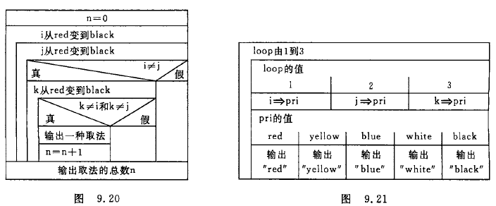

用 n 累计得到 3 中不同颜色球的次数.

主要问题是如何实现输出,为了输出 3 个球的颜色,显然经过 3 次循环,第 1 次输出 i 的颜色,第 2 次输出 j 的颜色,第 3 次输出 k 的颜色.在 3 次循环中先后将 i,j,k 的值赋予 pri.然后根据 pri 的值输出颜色信息.

<font color='DarkOrchid'>**编写程序:**</font>

```c
#include <stdio.h>int main(){	enum Color { red, yellow, blue, white, black };	enum Color i, j, k, pri;	int n, loop;	n = 0;	for (i = red; i <= black; i++)	{		for (j = red; j <= black; j++)		{			if (i != j)			{				for (k = red; k <= black; k++)				{					if ((k != i) && (k != j))					{						n = n + 1;						printf("%-4d", n);						for (loop = 1; loop <= 3; loop++)						{							switch (loop)							{							case 1:pri = i; break;							case 2:pri = j; break;							case 3:pri = k; break;							default:break;							}							switch (pri)							{							case red:printf("%-10s", "red"); break;							case yellow:printf("%-10s", "yellow"); break;							case blue:printf("%-10s", "blue"); break;							case white:printf("%-10s", "white"); break;							case black:printf("%-10s", "black"); break;							default:break;							}						}						printf("\n");					}				}			}		}	}	printf("\ntotal:%-5d\n", n);	system("pause");}
```

<font color='Chartreuse'>枚举常量的命名完全为了使人易于理解,它们并不自动地代表什么含义.用什么标识符代表什么含义,完全由程序设计者决定,以便于理解为原则.</font>

### 9.7 用 typedef 声明新类型名

除了可以直接使用 C 提供的标准类型名(如 int,char,float,double 和 long 等)和程序编写者自己声明的结构体,共用体,枚举类型外,还可以用 typedef 指定新的类型名来代替已有的类型名.有以下两种情况:

<font color='Crimson'>**1 . 简单地用一个新的类型名代替原有的类型名**</font>

例如:

```c
typedef int Integer;	//指定用 Integer 为类型名,作用与 int 相同typedef float Real;	//指定用 Real 为类型名,作用与 float 相同
```

这样可以使熟悉 FORTRAN 的人能用 Integer 和 Real 定义变量,以适应他们的习惯.

又如在一个程序中,用一个整型变量来计数,则可以命名 Count 为新的类型名,代表 int 类型:

```c
typedef in Count;	//指定 Count 代表 intCount i,j;	//用 Count 定义变量 i 和 j,相当于 int i,j;
```

定义为 Count 类型,可以使人更一目了然地知道它们是用于计数的.

<font color='Crimson'>**2 . 命名一个简单的类型名代替复杂的类型表示方法**</font>

<font color='Crimson'>C 允许程序设计者用一个简单的名字代替复杂的类型形式.</font>

<font color='Crimson'>( 1 )</font> 命名一个新的类型名代表结构体类型:

```c
typedef struct{    int month;    int day;    int year;}Date;
```

以上声明了一个新类型名 Date,代表上面的结构体类型.然后可以用新的类型名 Date 去定义变量,如:

```c
Date birthday;	//定义结构体类型变量 birthday,不要写成 struct Date birthday;Date * p;	//定义结构体指针变量 p,指向此结构体类型数据
```

<font color='Crimson'>( 2 )</font> 命名一个新的类型名代表数组类型

```c
typedef int Num[100];	//声明 Num 为整型数组类型名Num a;	//定义 a 为整型数组名,它有 100 个元素
```

<font color='Crimson'>( 3 )</font> 命名一个新的类型代表指针类型

```c
typedef char * String;	//声明 STRing 为字符指针类型String p,s[10];	//定义 p 为字符指针变量,s 为字符指针数组
```

<font color='Crimson'>( 4 )</font> 命名一个新的类型名代表指向函数的指针类型

```c
typedef int (* Pointer)();	//声明 Pointer 为指向函数的指针类型,该函数返回整型值Pointer p1,p2;	//p1,p2 为 Pointer 类型的指针变量
```

归纳起来,声明一个新的类型名的方法是:

① 先按定义变量的方法写出定义体(如: int i;)

② 将变量名换成新类型名(例如:将 i 换成 Count)

③ 在最前面加 typedef (例如: typedef int Count;)

④ 然后可以用新类型名去定义变量

简单地说,就是<font color='Crimson'>**按定义变量的方式,把变量名换上新类型名,并且在最前面加"typedef",就声明了新类型名代表原来的类型.**</font>

<font color='Chartreuse'>习惯上,常把用 typedef 声明的类型名的第 1 个字母用大写表示,以便与系统提供的标准类型标识符相区别.</font>

<font color='Chartreuse'>( 1 )</font> 以上的方法实际上是为特定的类型指定了一个同义字(synonyms).例如:

① typedef int Num[100];

Num a; (Num 是 int[100]的同义词,代表有 100 个元素的整型数组)

② typedef int (* Pointer0)();

Pointer p1; (Pointer 是 int(*)() 的同义词,代表指向函数的指针类型,函数值为整型)

用 typedef 声明的新类型称为原有类型的 typedef 名称.

<font color='Chartreuse'>( 2 )</font> 用 typedef 只是对已经存在的类型指定一个新的类型名,而没有创造新的类型.例如,前面声明的整型类型 Count,它无非是对 int 型另给一个新名字.

<font color='Chartreuse'>( 3 )</font> 用 typedef 声明数组类型,指针类型,结构体类型,共用体类型,枚举类型等,使得编程更加方便.例如定义数组,原来是用

```c
int a[10],b[10],c[10],d[10];
```

由于都是一维数组,大小也相同,可以先将此数组类型命名为一个新的名字 Arr,即:

```c
typedef int Arr[10];然后用 Arr 去定义数组变量;Arr a,b,c,d;
```

可以看到,用 typedef 可以将数组类型和数组变量分离开来,利用数组类型可以定义多个数组变量.同样可以定义字符串类型,指针类型等.

<font color='Chartreuse'>( 4 )</font> typedef 与 #define 表面上有相似之处,例如:

```c
#typedef int Count;和#define Count int;
```

表面上看他们的作用都是用 Count 代表 int.事实上,二者是不同的.

define 是在预编译时处理的,它只能作简单的字符串替换;

typedef 是在编译阶段处理的.实际上它并不是作简单的字符串替换,例如:

```c
typedef int Num[10];Num a;
```

并不是用"Num[10]"去代替"int",而是蚕蛹如同定义变量的方法那样先生成一个类型名,然后用它去定义变量.

<font color='Chartreuse'>( 5 )</font> 当不同源文件中用到同一类型数据(尤其是像数组,指针,结构体,共用体等类型数据)时,常用 typedef 声明一些数据类型.可以把所有的 typedef 名称声明单独放在一个头文件中,然后在需要用到它们的文件中用 #include 指令把它们包含到文件中.这样编程者就不需要在各文件中自己定义 typedef 名称了.

<font color='Chartreuse'>( 6 )</font> 使用 typedef 名称有利于程序的通用与移植.有的程序会依赖与硬件特性,用 typedef 类型就便于移植.例如:

```c
typedef int Integer; //声明 Integer 类型,程序中都用 Integer 定义需要改动时,只须改变 typedef 定义体即可typedef long Integer;
```

<div align="center"><font color='Crimson' size='8'>习 题<font></div>


1 . 定义结构体变量接收输入信息,年判断是否闰年,月,日计算是本年中的第几天(如果是闰年超过2月28日要多加1天).

```c
#include <stdio.h>#include <stdlib.h>struct Yearmd {	int year;	int month;	int day;};int main(){	struct Yearmd input_s;	int dnum;	printf("请输入年月日,用空格间隔\n");	scanf("%d%d%d", &input_s.year, &input_s.month, &input_s.day);	int days(struct Yearmd);	dnum = days(input_s);	printf("%d 年 %d 月 %d 日为 %d 的第 %d 天.\n", input_s.year, input_s.month, input_s.day, input_s.year, dnum);	system("pause");	return 0;}int days(struct Yearmd input){	int leap_flag, count;	if ((input.year % 4 == 0) && (input.year % 100 != 0))	{		leap_flag = 1;	}	else if ((input.year % 100 == 0) && (input.year % 400 == 0))	{		leap_flag = 1;	}	else	{		leap_flag = 0;	}	switch (input.month)	{	case 1: count = 0;		break;	case 2: count = 31;		break;	case 3: count = 59;		break;	case 4: count = 90;		break;	case 5: count = 120;		break;	case 6: count = 151;		break;	case 7: count = 181;		break;	case 8: count = 212;		break;	case 9: count = 243;		break;	case 10: count = 273;		break;	case 11: count = 304;		break;	case 12: count = 334;		break;	}	if (input.month > 2)	{		count = count + input.day + leap_flag;	}	else	{		count = count + input.day;	}	return count;}
```

3 . 5 个学生 num,name,score[3],主函数输入,print 函数输出.

```c
#include <stdio.h>#include <stdlib.h>#include <string.h>struct Student {	int num;	char name[20];	int score[3];};int main(){	struct Student stu[5];	void print(struct Student stu[]);    void input(struct Student * stu);    input(stu);	print(stu);	system("pause");	return 0;}void input(struct Student * stu){    for (int i = 0; i < 5; i++)	{		printf("请输入 No.%d 的信息:\n", i + 1);		printf("学号:");		scanf("%d", &stu[i].num);		printf("姓名:");		scanf("%s", stu[i].name);		printf("三门课成绩(用空格间隔开):");		scanf("%d%d%d", &stu[i].score[0], &stu[i].score[1], &stu[i].score[2]);	}}void print(struct Student stu[]){	int i, j;	for (i = 0; i<5; i++)	{		printf("No.%d 学号: %d 姓名: %s", i + 1, stu[i].num, stu[i].name);		for (j = 0; j<3; j++)		{			printf(" score_%d: %d", j + 1, stu[i].score[j]);		}		putchar('\n');	}}
```

5 . 10 个学生信息输入 num,name,score[3],输出 3 门 总average,输出最高分信息 num,name,score[3],average

```c
#include <stdio.h>#include <stdlib.h>#include <string.h>#define MAXSNUM 10struct Student {	int num;	char name[20];	int score[3];	int average;};int main(){	struct Student stu[MAXSNUM];	int nf[3];	int * p1;	p1 = nf;	void print(struct Student stu[], int n, int *nf);	void input(struct Student stu[], int n, int *nf);	input(stu, MAXSNUM, p1);	putchar('\n');	print(stu, MAXSNUM, p1);	system("pause");	return 0;}void input(struct Student stu[], int n, int *nf){	int aver0 = 0, aver1 = 0, aver2 = 0, mav0 = 0, mav1 = 0, mav2 = 0;	int mf0 = 0, mf1 = 0, mf2 = 0;	for (int i = 0; i < n; i++)	{		printf("请输入 No.%d 的信息:\n", i + 1);		printf("学号:");		scanf("%d", &stu[i].num);		printf("姓名:");		scanf("%s", stu[i].name);		printf("三门课成绩(用空格间隔开):");		scanf("%d%d%d", &stu[i].score[0], &stu[i].score[1], &stu[i].score[2]);		stu[i].average = (stu[i].score[0] + stu[i].score[1] + stu[i].score[2]) / 3;		aver0 = aver0 + stu[i].score[0];		aver1 = aver1 + stu[i].score[1];		aver2 = aver2 + stu[i].score[2];		if (mav0<stu[i].score[0])		{			mav0 = stu[i].score[0];			mf0 = i;		}		if (mav1<stu[i].score[1])		{			mav1 = stu[i].score[1];			mf1 = i;		}		if (mav2<stu[i].score[2])		{			mav2 = stu[i].score[2];			mf2 = i;		}	}	*nf = mf0; nf++;	*nf = mf1; nf++;	*nf = mf2;	putchar('\n');	printf("scoreA 平均分: %d\nscoreB 平均分: %d\nscoreC 平均分: %d\n", aver0 / n, aver1 / n, aver2 / n);}void print(struct Student stu[], int n, int *nf){	int i, j , k;	for (k = 0; k < 3; k++)	{		i = *nf;		printf("No.%d 学号: %-2d 姓名: %s", i + 1, stu[i].num, stu[i].name);		for (j = 0; j < 3; j++)		{			printf(" score_%d: %d", j + 1, stu[i].score[j]);		}		nf++;		putchar('\n');	}}
```

6 . 13 个人报数 1,2,3;报道 3 者出圈,找出最后留在圈中的人.用链表(环形链表?)单向,第 13 人->Blink 指向第 1 人.创建好链表开始赋值,赋到 3 的删除(删除前将前一位->Blink指向下一位),直到计数器为 1 为止!

```c
#include <stdio.h>#define MAXNUM 50;#define LEN sizeof(struct Number)struct Number {	int num;	int k;	struct Number * Flink;	struct Number * Blink;};int main(){	int n = MAXNUM;	struct Number * person = NULL;	struct Number * Creat_RingLinkedList(struct Number * per, int n);	int person_num(struct Number * Head,int n);	struct Number * Header;	int h;	Header = Creat_RingLinkedList(person, n);	//for (int i = 1; i <= 13; i++)	//{	//	printf("%2d Flink:%d Node:%d Blink:%d\n", Header->num, Header->Flink,Header,Header->Blink);	//	Header = Header->Flink;	//}	h = person_num(Header,n);	printf("\n最后剩下的为原来的第 %d 位\n", h);	system("pause");	return 0;}struct Number * Creat_RingLinkedList(struct Number * per, int n){	struct Number * Head = NULL;	struct Number * p1= NULL, *p2 = NULL;	for (int i = 1; i <= n; i++)	{		if (i == 1)		{			Head = p1 = p2 = (struct Number *)malloc(LEN);			p1->num = i;		}		else		{			p2 = (struct Number *)malloc(LEN);			p2->num = i;			p1->Flink = p2;			p2->Blink = p1;			p1 = p2;		}	}	p1->Flink = Head;	Head->Blink = p1;	return(Head);}int person_num(struct Number * Head,int n){	struct Number * p1= NULL, *pdel;	p1 =  Head;	int z;	int en = 0;	while (n != 1)	{				for (int i = 1; i<=3; i++)		{			p1->k = i;			//printf("%2d %2d %d\n", p1->num, p1->k, p1->Flink);			if (p1->k == 3)			{				pdel = p1;				p1->Blink->Flink = p1->Flink;				p1->Flink->Blink = p1->Blink;				//printf("%2d Flink:%d Node:%d Blink:%d\n", p1->Blink->num, p1->Blink->Flink, p1->Blink, p1->Blink->Blink);				//printf("%2d Flink:%d Node:%d Blink:%d\n", p1->num, p1->Flink, p1, p1->Blink);				//printf("%2d Flink:%d Node:%d Blink:%d\n", p1->Flink->num, p1->Flink->Flink, p1->Flink, p1->Flink->Blink);				printf("第%2d名出圈  ", p1->num);				en++;				if (en % 3 == 0)				{					putchar('\n');				}				p1 = p1->Flink;				free(pdel);				n--;			}			else			{				p1 = p1->Flink;							}			//printf("%20d\n", p1->Flink);					}			}	z = p1->num;	return(z);}
```

7 . 编程实现 Create Print Del Insert 动态链表(name,num,score,Flink),main 函数中 指定要删除和插入的结点的数据.

```c
//xiti9-7.c#include "xiti9-7.h"#define LEN sizeof(struct Student)int Count = 0;struct Student{	int List;	char Name[20];	long int Num;	float Score;	struct Student * Blink;	struct Student * Flink;};struct Student * Header = NULL;int main(){	int Case_stu,stu_n,temp_list,into_list,del_list;	long int temp_num;	char temp_name[20];	float temp_score;	while (1)	{		system("cls");		printf("1. 建立学生信息.\n");		printf("2. 输出学生信息.\n");		printf("3. 插入学生信息.\n");		printf("4. 删除学生信息.\n");		printf("5. 读取文件信息.\n");		printf("6. 信息写入文件.\n");		printf("9. 退出.\n");		printf("请选择要执行的操作.\n");		scanf("%d", &Case_stu);		switch (Case_stu)		{		case 1:			system("cls");			printf("需要建立几人的信息?\n");			scanf("%d", &stu_n);			Header = Creat_stu(stu_n);			break;		case 2:			system("cls");			stu_n = Count;			Print_stu(Header, stu_n);			system("pause");			break;		case 3:			system("cls");			stu_n = Count;			Print_stu(Header, stu_n);			printf("请输入要插入信息的序号:");			scanf("%d", &into_list);			printf("请输入姓名:");			memset(temp_name, 0, 20);			scanf("%s", temp_name);			printf("请输入学号:");			scanf("%ld", &temp_num);			printf("请输入成绩:");			scanf("%f", &temp_score);			Insert_stu(Header, into_list,temp_name,temp_num,temp_score);			system("pause");			break;		case 4:			system("cls");			stu_n = Count;			Print_stu(Header, stu_n);			printf("请输入要删除信息的序号:");			scanf("%d", &del_list);			Del_stu(Header, del_list);			system("pause");			break;		case 5:			system("cls");			//读取			myReadFlie("date.dat", Header);			system("pause");			break;		case 6:			system("cls");			//写入			myWriteFile("date.dat", Header);			system("pause");			break;		case 9:			system("pause");			exit(0);			break;		default:			system("cls");			printf("输入错误!\n");			system("pause");			break;		}	}}struct Student * Creat_stu(int n){	system("cls");	struct Student * Head = NULL;	struct Student * p1, *p2;	p1 = p2 = NULL;	char TempName[20];	for (int i = 0; i < n; i++)	{		printf("请输入第 %d 名的信息.\n", i + 1);		if (Count == 0)		{			memset(TempName, 0, 20);			p1 = p2 = malloc(LEN);			Head = p1;			p1->Flink = NULL;			p1->Blink = NULL;			p1->List = i + 1;			printf("请输入姓名:");			scanf("%s", TempName);			strcpy(p1->Name, TempName);			printf("请输入学号:");			scanf("%ld", &p1->Num);			printf("请输入成绩:");			scanf("%f", &p1->Score);			Count++;		}		else		{			memset(TempName, 0, 20);			p1 = malloc(LEN);			p1->Flink = NULL;			p1->Blink = p2;			p2->Flink = p1;			p1->List = i + 1;			printf("请输入姓名:");			scanf("%s", TempName);			strcpy(p1->Name, TempName);			printf("请输入学号:");			scanf("%ld", &p1->Num);			printf("请输入成绩:");			scanf("%f", &p1->Score);			p2 = p1;			Count++;		}	}	return(Head);}bool Print_stu(struct Student * Head, int n){	struct Student * pt = NULL;	int i;	pt = Head;	char TempName[20];	if (n>0)	{		for (i = 0; i < n; i++)		{			memset(TempName, 0, 20);			strcpy(TempName, pt->Name);			printf("%d %s %ld %5.2f\n", pt->List, TempName, pt->Num, pt->Score);			pt = pt->Flink;		}		printf("输出完成!\n");		return true;	}	else	{		printf("错误!没有任何信息!\n");		return false;	}	}bool Insert_stu(struct Student * Head, int into_list, char * into_name, long int into_num, float into_score){	struct Student * pt, *p1, *p2;	pt = p1 = p2 = NULL;	int i , j;	pt = Head;	for (i = 0; i < Count; i++)	{		if(pt->List == into_list)		{			p1 = malloc(LEN);			pt->Blink->Flink = p1;			p1->Blink = pt->Blink;			pt->Blink = p1;			p1->Flink = pt;						strcpy(p1->Name, into_name);			p1->List = into_list;			p1->Num = into_num;			p1->Score = into_score;			for (j = 0; j <= Count - into_list; j++)			{				pt->List++;				pt = pt->Flink;			}			Count++;			printf("插入信息成功!\n");			return true;		}		else		{			p2 = pt;			pt = pt->Flink;		}	}	p1 = malloc(LEN);	p2->Flink = p1;	p1->Blink = p2;	p1->Flink = NULL;	strcpy(p1->Name, into_name);	p1->List = (p2->List + 1);	p1->Num = into_num;	p1->Score = into_score;	Count++;	printf("输入序号错误!调整序号插入成功!\n");	return true;}bool Del_stu(struct Student * Head, int del_list){	struct Student * pt = NULL,* p1 = NULL;	pt = Head;	int i,j;	for (i = 0; i < Count; i++)	{		if (pt->List == del_list)		{			if (pt->Blink == NULL)			{				Head = pt->Flink;				pt->Flink->Blink = NULL;				free(pt);				Count--;			}			else if (pt->Flink != NULL && pt->Blink != NULL)			{				p1 = pt->Flink;				pt->Flink->Blink = pt->Blink;				pt->Blink->Flink = pt->Flink;				free(pt);				for (j = 0; j <= Count - p1->List; j++)				{					p1->List--;					p1 = p1->Flink;				}				Count--;			}			else			{				pt->Blink->Flink = NULL;				free(pt);				Count--;			}			printf("删除信息成功!\n");			return true;		}		else		{			pt = pt->Flink;		}	}	printf("没有相关信息!删除失败!\n");	return false;}bool myReadFlie(char * FilePath,struct Student * Head){	struct Student * p1= NULL, * p2 = NULL;	struct Stu	{		int List;		char Name[20];		long int Num;		float Score;	};	struct Stu * pstu;	FILE * pFile;	pFile = fopen(FilePath, "rb");	if (pFile == NULL)	{		printf("打开文件失败!\n");		system("pause");		fclose(pFile);		return false;	}	fseek(pFile, 0, SEEK_END);	int k = ftell(pFile);	int n = k / sizeof(struct Stu);	int i;	pstu = malloc(sizeof(struct Stu));	fseek(pFile, 0, SEEK_SET);	for (i = 0; i < n; i++)	{		if (fread(pstu, sizeof(struct Stu), 1, pFile) != 1)		{			printf("读取文件失败!\n");		}		if (i == 0)		{			p1 = p2 = malloc(LEN);			Header = p1;			//Header = Head;			p1->Blink = NULL;			p1->Flink = NULL;			strcpy(p1->Name, pstu->Name);			p1->List = i + 1;			p1->Num = pstu->Num;			p1->Score = pstu->Score;			Count++;		}		else		{			p1 = malloc(LEN);			p2->Flink = p1;			p1->Blink = p2;			p1->Flink = NULL;			strcpy(p1->Name, pstu->Name);			p1->List = i + 1;			p1->Num = pstu->Num;			p1->Score = pstu->Score;			p2 = p1;			Count++;		}	}	printf("读取文件完成!\n");	free(pstu);}bool myWriteFile(char * FilePath, struct Student * Head){	struct Student *pt = Head;	struct Stu	{		int List;		char Name[20];		long int Num;		float Score;	};	FILE * pFile;	struct Stu * ptstu = NULL;	int i,k;	pFile = fopen(FilePath, "wb");	if (pFile == NULL)	{		printf("建立文件失败!\n");		system("pause");		return false;	}	for(i = 0;i < Count;i++)	{		k = sizeof(struct Stu);		ptstu = malloc(sizeof(struct Stu));		ptstu->List = pt->List;		strcpy(ptstu->Name, pt->Name);		ptstu->Num = pt->Num;		ptstu->Score = pt->Score;		if (fwrite(ptstu, sizeof(struct Stu), 1, pFile) != 1)		{			printf("写入信息失败!\n");		}		pt = pt->Flink;	}	free(ptstu);	fclose(pFile);	printf("写入信息完成!\n");	return true;}//xiti9-7.h#pragma once#include <stdio.h>#include <stdlib.h>#include <stdbool.h>#include <string.h>struct Student * Creat_stu(int n);bool Print_stu(struct Student * Head, int n);bool Insert_stu(struct Student * Head, int into_list, char * into_name, long int into_num, float into_score);bool Del_stu(struct Student * Head, int del_list);
```

8 . 有 a,b 两个链表,每个链表中的结点包括姓名,学号,成绩.要求1.合并两个链表;2.从 a 中删除 b 中相同学号的结点.

a,b 相连,a header=NULL,找出最小学号让 a header指向它...

```c
#include <stdio.h>
#include <stdlib.h>
#include <stdbool.h>
#include <string.h>

struct Stu
{
	char Name[20];
	long int StuNum;
	char Sex[5];
	int Age;
	float Score;
	struct Stu_a * Blink;
	struct Stu_a * Flink;
};

void print(struct Stu * Head,int n)
{
	//char TName[20], TSex[2];
	
	struct Stu * p = NULL;
	p = Head;
	for(int i = 0;i<n;i++)
	{
		printf("%s %ld %s %d %5.2f\n", p->Name, p->StuNum, p->Sex, p->Age, p->Score);
		p = p->Flink;
	}
}

int main()
{
	struct Stu stua[] = { { "黎明",1003,"男",15,60 },{ "李明",1005,"男",15,60 } };	//链表A
	struct Stu stub[] = { { "王芳",1001,"女",15,60 },{ "花花",1004,"男",15,60 } };	//链表B
	struct Stu * Header_a = NULL,* pa = NULL, * Header_b = NULL, *pb = NULL, *pt = NULL;
	stua[0].Flink = &stua[1];
	stua[1].Blink = &stua[0];
	stub[0].Flink = &stub[1];
	stub[1].Blink = &stub[0];
	Header_b = stub[1].Blink;
	Header_a = stua[1].Blink;	//完成链表结构
	printf("输出 A 链表结点\n");
	print(Header_a, 2);
	printf("输出 B 链表结点\n");
	print(Header_b, 2);

	stub[1].Flink = stua[1].Blink;
	stua[0].Blink = stub[0].Flink;	//将A接至B后形成新链表headB
	printf("输出 B 链表结点\n");
	print(Header_b, 4);
	long int MinNum = 0;
	for (int i = 0; i < 4; i++)
	{
		pb = Header_b;
		MinNum = pb->StuNum;
		pt = pb;
		if (i == 0)	//找出排序链表 A 的首结点
		{
			pb = pb->Flink;
			for (int j = 0; j < 3 - i; j++)
			{
				if (MinNum > pb->StuNum)
				{
					MinNum = pb->StuNum;
					pt = pb;
				}
				else
				{
					pb = pb->Flink;
				}
			}
			if (pt->Blink == NULL)
			{
				Header_a = pt;
				Header_b = pt->Flink;
				Header_b->Blink = NULL;
				pt->Flink = NULL;
			}
			else if (pt->Flink == NULL)
			{
				Header_a = pt;
				pb = pt->Blink;
				pb->Flink = NULL;
				pt->Blink = NULL;
			}
			else
			{
				Header_a = pt;
				pb = pt->Blink;
				pb->Flink = pt->Flink;
				pb = pt->Flink;
				pb->Blink = pt->Blink;
				pt->Flink = NULL;
				pt->Blink = NULL;
			}
			pa = Header_a;
		}
		else if (i == 3)	//链表 A 的尾结点
		{
			pa->Flink = pt;
			pt->Blink = pa;
		}
		else
		{
			pb = pb->Flink;
			for (int j = 0; j < 3 - i; j++)
			{
				if (MinNum > pb->StuNum)
				{
					MinNum = pb->StuNum;
					pt = pb;
				}
				else
				{
					pb = pb->Flink;
				}
			}
			if (pt->Blink == NULL)
			{
				Header_b = pt->Flink;
				Header_b->Blink = NULL;
				pt->Flink = NULL;
			}
			else if (pt->Flink == NULL)
			{
				pb = pt->Blink;
				pb->Flink = NULL;
				pt->Blink = NULL;
			}
			else
			{
				pb = pt->Blink;
				pb->Flink = pt->Flink;
				pb = pt->Flink;
				pb->Blink = pt->Blink;
				pt->Flink = NULL;
				pt->Blink = NULL;
			}
			pa->Flink = pt;
			pt->Blink = pa;
			pa = pa->Flink;
		}
	}
	printf("输出 A 链表结点\n");
	print(Header_a, 4);

	system("pause");
}
```


9 . 建立链表,结点包含姓名,学号,性别,年龄,输入一个年龄,删除此年龄段的结点.
